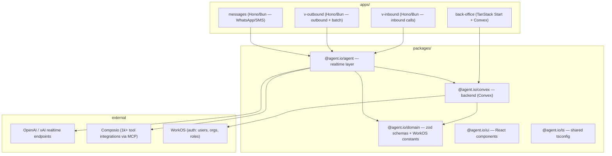

# agent.io

A multi-tenant platform for **AI voice agents** — build, version, and operate
realtime calling agents on top of raw model providers (OpenAI Realtime, xAI Grok
Voice), with the full agent layer (config, procedures, knowledge base, tools,
conversation records) owned by the platform itself.

ElevenLabs' Agents platform serves as the _feature reference_ for what this
system provides — it is **not** a runtime dependency. Everything EL does
server-side (agent config, versioning, procedures, RAG, tool governance,
post-call records) is built here, on our stack.

## Architecture



### The apps

| App                | Role                                                                                                                               |
| ------------------ | ---------------------------------------------------------------------------------------------------------------------------------- |
| `apps/back-office` | Admin frontend: agent editor, procedures, knowledge base, MCP connections, conversation views. TanStack Start + React 19 + Convex. |
| `apps/v-inbound`   | Inbound voice: provider call webhooks, accept-call flow, media.                                                                    |
| `apps/v-outbound`  | Outbound voice: dialing, batch campaigns (originates the telephony leg and bridges audio — providers don't dial out).              |
| `apps/messages`    | Text channels: WhatsApp / SMS.                                                                                                     |

The browser widget needs **no dedicated service** — embeds talk directly to the
provider via ephemeral client secrets minted by an authenticated endpoint.

### The packages

**`@agent.io/domain`** — the source of truth for data shapes. Every table is a
zod schema built with the `zodTable` / `tenantTable` helpers
(`src/schemas/helper.ts`); `tenantTable` injects the `tenant` field. Enums are
exported `as const` arrays (`PROVIDERS`, `PROCEDURE_TYPES`, …) reusable across
the app. Value objects (VAD config, MCP scopes, system-tool config) are
discriminated unions. Also home to the WorkOS role/permission constants.

**`@agent.io/convex`** — the backend. Three layers:

1. **Schema** (`src/schema.ts`): `defineSchema` over the domain tables; ALL
   indexes (regular, search, vector) are chained here, at the definition site.
2. **Builders** (`src/utils.ts`): `tenantQuery`/`tenantMutation` (user path —
   tenant from the WorkOS JWT org claim, RLS-wrapped db) and
   `machineMutation(ownerTable)` (machine path — tenant derived from an owning
   row, never passed by the caller). Triggers (cascades, denormalized counters,
   reference health) are wired into every mutation builder.
3. **Functions** (`src/api/`): a two-tier split —
   - `api/internals/<table>.ts`: generated internal CRUD
     (`crud(schema, table, internalQuery, triggeredInternalMutation)`) —
     plumbing, never public.
   - `api/*.ts`: the business tier — validations and asserts, then writes
     delegated to the internals via `ctx.runMutation` sub-transactions. Includes
     agent publish (immutable version snapshots), KB ingestion (chunk → embed
     via the `ai` SDK → idempotent write), hybrid KB search (vector +
     full-text), and the conversation substrate (gapless message sequences,
     cross-tenant asserts).

**`@agent.io/agent`** — the realtime layer, consumed by the voice/message
services:

- One **OpenAI-dialect driver** serves both providers: xAI is an
  OpenAI-Realtime-compatible endpoint, so providers differ only by base URL + a
  quirk table (no WebRTC / no semantic VAD on xAI, event aliases, …). Built on
  `@openai/agents-realtime`.
- **AgentResolver**: expands a published Agent Version into a session — renders
  dynamic variables, injects prompt-mode KB docs, compiles procedures, builds
  system tools, and resolves per-agent **Composio MCP scoping** (each agent sees
  only its configured subset of the tenant's toolkits; sessions are cached and
  resumed via `composio.use`; a Composio outage degrades per-connection and
  never blocks answering a call).
- **Procedure engine**: structured procedures run as a code-gated step machine —
  the engine never advances past an Ask step without a real user turn, tool
  steps are silent and halt on failure, expression conditions evaluate without
  the model.
- **TranscriptRecorder**: normalized session events → conversation substrate,
  through an injected `ConvexIngest` interface (`@agent.io/agent` never imports
  `@agent.io/convex`; the apps bind the interface).

## Multi-tenancy (ADR 0001)

- A **tenant is a WorkOS Organization** — the `tenant` field on every table
  holds the `org_…` id from the JWT.
- There are **no local auth tables** (no users/organizations/sessions): WorkOS
  is the system of record; roles and permissions are provisioned _into_ WorkOS.
- User paths read `tenant` from the JWT; machine paths (webhooks, services)
  **derive** it from the owning resource (phone number → tenant, agent version →
  tenant) — `tenant` never crosses an API boundary as input.
- Isolation is enforced in the db layer (row-level security wrappers) and inside
  the search/vector indexes (`tenant` as a filterField).

See `docs/adr/0001-no-auth-tables-tenant-field-from-workos.md` and `CONTEXT.md`
(the binding glossary: Tenant, Agent Draft/Version, System Tool, MCP Connection,
Knowledge Base, Tenant Settings).

## Key concepts

| Concept                   | In short                                                                                                                                                        |
| ------------------------- | --------------------------------------------------------------------------------------------------------------------------------------------------------------- |
| **Agent Draft / Version** | The `agents` row is the editable draft; publishing writes an immutable `agentVersions` snapshot (procedures embedded). Calls only ever run a published version. |
| **Procedures**            | Task-specific agent behaviors (free-form markdown or structured typed steps: ask/tell/say/tool/if) selected by trigger, snapshotted with the version.           |
| **System Tools**          | The seven platform built-ins (end_call, transfers, DTMF, voicemail detection, …) implemented in the session engine — config, not table rows.                    |
| **MCP Connections**       | External tools are always MCP: Composio (customer-managed toolkits) or bring-your-own server, with approval policies and tool-hash pinning.                     |
| **Knowledge Base**        | Native RAG: `kbDocuments` → `kbChunks` → `kbEmbeddings` (Convex vector search, `ai` SDK embeddings) + full-text hybrid recall.                                  |
| **Conversations**         | The call/chat record — our system of record (raw providers store nothing). Transcripts always; audio only when the tenant enables recording.                    |

## Tech stack

Bun workspaces + Turbo + **Vite+** (`vp`) · TypeScript 6 · zod 4 · Convex (+
convex-helpers: RLS, Triggers, crud, relationships) · WorkOS AuthKit ·
`@openai/agents-realtime` · `@composio/core` · `ai` SDK (Vercel AI Gateway) ·
React 19 + TanStack Start · Vitest 4.

## Development

```sh
bun install          # install workspace deps
bun run dev          # turbo dev across apps
bun run check        # format + lint (vp check --fix)
bun run typecheck    # tsc across packages
bun run test         # vitest across packages (turbo test)
```

Per-package: `vp test run` and `bunx tsc --noEmit` inside any package. Convex
codegen: `bunx convex codegen` in `packages/convex`.

## Documentation map

| Where                                | What                                                                                                |
| ------------------------------------ | --------------------------------------------------------------------------------------------------- |
| `CONTEXT.md`                         | Binding domain glossary                                                                             |
| `docs/adr/`                          | Architecture decision records                                                                       |
| `docs/reference/erd-calls-agents.md` | Full ERD: entities, procedures spec, MCP + KB schema specs, runtime flows                           |
| `docs/voice-provider-adapter.md`     | Realtime adapter design (providers, quirks, session model, Composio scoping)                        |
| `docs/plans/`                        | Implementation plans (the domain layer plan is fully executed)                                      |
| `docs/.references/`                  | Fetched vendor docs snapshots (ElevenLabs, OpenAI, xAI, Composio, Convex) — gitignored, regenerable |
