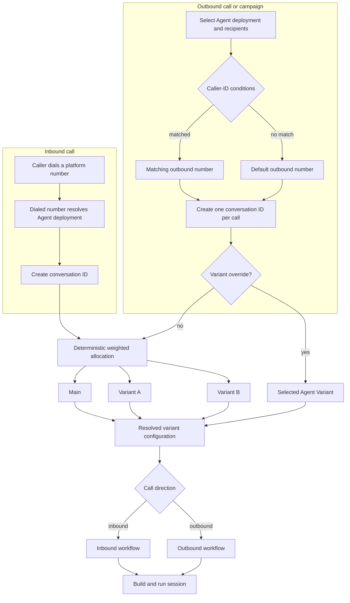

# 0003 — Separate agent variants, channel workflows, and phone routing

Date: 2026-07-15 Status: accepted

## Context

Inbound assignment, outbound caller-ID selection, inbound/outbound behavior, and
configuration experiments are different routing concerns. Treating all of them
as "branches" would make channel behavior depend on experiment allocation and
would overload one term for both deployment variants and conditional workflow
paths.

## Decision

An Agent Variant is a complete experimental configuration lane such as Main,
Variant A, or Variant B. A variant can change prompt, voice, model, tools,
Knowledge Base attachments, and channel workflows. Active variant traffic
weights must total exactly 10,000 basis points (100 percent; integer basis
points are the implemented unit). Normal allocation is deterministic from the
conversation id, so one conversation never changes variants while it is running.

Variants do not separate inbound from outbound traffic. After resolving a
variant, call direction selects that variant's inbound or outbound workflow.
Conditional paths inside either workflow are Workflow Condition Branches, not
Agent Variants.

Inbound routing starts from a tenant-owned `phoneNumbers` inventory row. Its
optional `assignedAgentId` is the default inbound Agent deployment; an
unassigned number is not inbound-routable. The conversation id then selects an
Agent Variant by traffic weight, and call direction selects the inbound
workflow. Numbers never point directly to an Agent Variant.

Outbound routing starts from an Agent deployment and recipient list. Caller-ID
conditions select the outbound source number, with an explicit default number
when no condition matches. Each outbound call receives its own conversation id
and normally participates in deterministic variant allocation. Test calls and
intentionally pinned campaigns may provide an optional Agent Variant override;
the override bypasses weighted allocation for those calls.

Each Agent Variant owns an independent mutable Agent Draft and a pointer to its
current published Agent Version. Creating a variant clones Main's selected
configuration into a new variant draft. Publishing snapshots only that variant
and advances only that variant's published-version pointer. Merging a winning
variant copies its configuration into Main's draft and publishes a new Main
version; neither the source nor destination Agent Version is mutated.

A published Agent Variant may have zero traffic weight. Zero-weight variants
receive no normal inbound or outbound allocation but remain available for
authorized test calls and explicitly pinned outbound campaigns. This supports
validating a published variant before beginning its production traffic ramp.

## Consequences

- Agent Variant percentages are deployment allocation, not channel-routing
  conditions.
- Every conversation records the selected variant and resolved Agent Version for
  attribution and reproducibility.
- `agents` is the stable deployment identity; mutable configuration and
  `publishedVersionId` move to the variant boundary, and every Agent Version
  records its source variant.
- Zero-percent published variants are valid and directly testable; only positive
  weight grants normal production traffic.
- Bulk outbound campaigns allocate independently per call unless the campaign
  explicitly pins a variant.
- Outbound caller-ID conditions choose the source phone number; they do not
  choose the Agent Variant or destination recipient.
- A phone number's optional Agent assignment controls its default inbound
  destination and does not make the number an exclusive outbound resource.
- Provider accounts and credentials are separate from phone-number inventory
  rows; see `docs/reference/phone-number-inventory.md`.
- Variant override authorization must be explicit because it bypasses production
  traffic weights.
- Backend tests must cover deterministic allocation, exact 100-percent
  validation, optional outbound overrides, default caller-ID fallback, and
  independent inbound/outbound workflow resolution.
