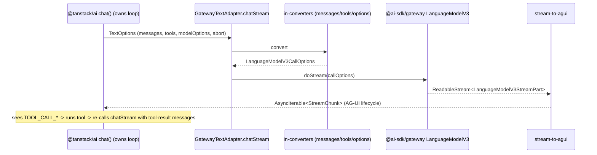

# feat: Vercel AI Gateway provider for TanStack AI

## Overview

Build a faithful, general **Vercel AI Gateway provider for `@tanstack/ai`** in
`src/server/ai/gateway/`. It wraps `@ai-sdk/gateway` (whose
`gateway(modelId)` returns an AI SDK `LanguageModelV3`) and bridges it to
TanStack AI's AG-UI streaming contract, so `chat()` and the
`generateImage()` / `generateVideo()` activities can drive any gateway model
while keeping Vercel's auth, OIDC, provider routing, and observability.

The deliverable is three adapters under one umbrella — `GatewayTextAdapter`
(full `TextAdapter` parity), `GatewayImageAdapter`, `GatewayVideoAdapter` — plus
a shared provider/auth foundation. This plan covers **only** the adapter suite.
Migrating the app's runtime (`useChat`, the `ToolLoopAgent` orchestrator) off
the AI SDK is a separate effort.

## Problem Frame

We are migrating off the Vercel AI SDK (`ai`, `@ai-sdk/react`) to
`@tanstack/ai`, but want to keep the Vercel AI Gateway as the model connector.
`@tanstack/ai`'s `chat()` requires a `TextAdapter` that yields AG-UI
`StreamChunk` events; the gateway connector emits AI SDK `LanguageModelV3`
stream parts. The two vocabularies differ, so the integration is a
**bidirectional bridge**, not a passthrough. `@ai-sdk/gateway` is a lean
dependency (`@ai-sdk/provider`, `@ai-sdk/provider-utils`, `@vercel/oidc` only —
not the big `ai` package), so wrapping it does not block removing `ai` /
`@ai-sdk/react`. Decisions and alternatives are recorded in the origin ADR
(see origin: `docs/adr/0001-wrap-ai-sdk-gateway-for-tanstack-ai.md`) and the
glossary in `src/server/ai/gateway/CONTEXT.md`.

## Requirements Trace

- R1. `chat({ adapter: gatewayText('<provider>/<model>') })` works for any
  gateway chat model via id passthrough.
- R2. Streaming maps faithfully to the AG-UI lifecycle: text, reasoning, tool
  calls, finish (usage + finish reason), and errors.
- R3. Tools are supported — function tools (`db-doctor`/`renderer`-style) and
  provider-executed tools — and `toolChoice` is honored.
- R4. Full `chat()` option pass-through: `systemPrompts`,
  `modelOptions` → V3 `providerOptions`, multimodal input (text + image/file),
  `abortController`, `metadata`. No option silently dropped.
- R5. Structured output works via `structuredOutput()` and
  `structuredOutputStream()` (response-format JSON schema).
- R6. Env-first auth identical to the AI SDK: `AI_GATEWAY_API_KEY` →
  Vercel OIDC fallback; config can override key / baseURL / headers / fetch;
  defaults to the `gateway` singleton.
- R7. `GatewayImageAdapter` (`generateImage`) and `GatewayVideoAdapter`
  (`generateVideo`, experimental) drive gateway image/video models.
- R8. The bridge keeps only `@ai-sdk/gateway` (+ `@ai-sdk/provider(-utils)`,
  `@vercel/oidc`); `ai` and `@ai-sdk/react` remain removable.

## Scope Boundaries

- **Not** building TTS or transcription adapters — the pinned
  `@ai-sdk/gateway@3.0.127` exposes no speech/transcription model
  (`KNOWN_MODEL_TYPES = embedding, image, language, reranking, video`).
- **Not** building embeddings or reranking adapters — `@tanstack/ai`'s
  chat-family has no matching activity, and no caller exists.
- **Not** running the agentic tool loop, middleware, MCP, or tool execution —
  those belong to `chat()`, not the adapter.
- **Not** changing model ids, provider options, or the gateway account/keys.

### Deferred to Separate Tasks

- App runtime migration (`useChat` → `@tanstack/ai-react`, `ToolLoopAgent`
  orchestrator rewrite, `ai-elements` rewiring): separate plan once this
  adapter suite lands.
- Summarize adapter (`gatewaySummarize`): trivial wrapper over the text
  adapter; add when a caller needs it.

## Context & Research

### Relevant Code and Patterns

- `src/server/ai/gateway/index.ts` — existing starter (`gateway` import +
  `AIAdapter` type); current exports to be replaced.
- `src/server/ai/gateway/CONTEXT.md` — glossary (Bridge, AG-UI StreamChunk,
  LanguageModelV3, tool-loop ownership, env-first auth, responsibility boundary).
- `src/server/ai/constants.ts` — `MODELS` (all `provider/model` ids) and
  `PROVIDER_OPTIONS` (per-provider thinking/reasoning config) — the shape that
  flows into `modelOptions` → V3 `providerOptions`.
- `src/server/ai/__tests__/orchestrator-message-filter.test.ts` — vitest test
  convention (`__tests__/*.test.ts`, `vitest run`).
- Adapter-authoring reference (read-only, in `node_modules`): `GrokTextAdapter`
  pattern in `@tanstack/ai-grok`; `OpenAIBaseChatCompletionsTextAdapter` in
  `@tanstack/openai-base` for the AG-UI lifecycle accumulation shape.

### Key Type Contracts (from installed packages)

- `@tanstack/ai`: `TextAdapter.chatStream(TextOptions) → AsyncIterable<StreamChunk>`,
  `structuredOutput(...)`, optional `structuredOutputStream(...)`;
  `BaseTextAdapter` ctor `(config, model)`. `TextOptions` carries `model`,
  `messages: ModelMessage[]`, `tools?: AnyTool[]`, `systemPrompts?`,
  `modelOptions?`, `outputSchema?`, `abortController?`, `metadata?`, `request?`.
  `StreamChunk = AGUIEvent` (`@ag-ui/core`): `RUN_STARTED`, `TEXT_MESSAGE_*`,
  `REASONING_*`, `TOOL_CALL_*`, `RUN_FINISHED`, `RUN_ERROR`.
- `ImageAdapter.generateImages(opts) → Promise<ImageGenerationResult>`;
  `BaseImageAdapter` ctor `(model, config?)`.
- `VideoAdapter.createVideoJob / getVideoStatus / getVideoUrl`;
  `BaseVideoAdapter` ctor `(config, model)` (experimental).
- `@ai-sdk/gateway@3.0.127`: `gateway(modelId): LanguageModelV3`,
  `.imageModel(id): ImageModelV3`, `.videoModel(id): Experimental_VideoModelV3`;
  `createGateway(settings)`; `getGatewayAuthToken` semantics
  (`AI_GATEWAY_API_KEY` → `getVercelOidcToken()`).
- `@ai-sdk/provider@3.0.10`: `LanguageModelV3.doStream(LanguageModelV3CallOptions)`
  → `ReadableStream<LanguageModelV3StreamPart>` (`text-start|delta|end`,
  `reasoning-start|delta|end`, `tool-input-start|delta|end`, `tool-call`,
  `tool-result`, `file`, `source`, `stream-start`, `response-metadata`,
  `finish`, `error`). `LanguageModelV3Prompt` = role + typed content parts
  (`text`, `file`, `reasoning`, `tool-call`, `tool-result`).

### Institutional Learnings

- No `docs/solutions/` entries exist yet for this area; this plan + the ADR are
  the first durable records.

### External References

- Vercel AI Gateway OpenAI-compat + native protocol docs (referenced in the ADR).
- `@ai-sdk/provider` `LanguageModelV3` spec (the bridge's source vocabulary).

## Key Technical Decisions

- **Wrap, don't reimplement** (see origin ADR): call
  `gateway(modelId).doStream()` / `.doGenerate()`; never re-implement
  transport/auth. _Rationale:_ reuse Vercel's connector wholesale.
- **Pure, separately-tested converters.** Message, tool, options, and
  stream converters are pure functions in their own files with their own
  tests. _Rationale:_ the converters are the risk surface; isolate and unit-test
  them without network.
- **Adapter owns the AG-UI lifecycle.** The stream converter emits
  `RUN_STARTED` … `RUN_FINISHED`/`RUN_ERROR` itself (no base class does it for
  us). _Rationale:_ we extend `BaseTextAdapter`, not `openai-base`.
- **`modelOptions` → V3 `providerOptions` passthrough**, keyed by provider
  (`{ anthropic, openai, google, gateway }`). _Rationale:_ matches existing
  `PROVIDER_OPTIONS` shape; lets the gateway forward provider knobs untouched.
- **Structured output via `responseFormat: json_schema`.** Declare
  `supportsCombinedToolsAndSchema()` per upstream capability; otherwise the
  engine calls `structuredOutput`/`structuredOutputStream` post-loop.
- **Env-first auth through a shared `createGatewayProvider(config?)`.** Default
  to the `gateway` singleton; pass config to `createGateway`.

## Open Questions

### Resolved During Planning

- Substrate? → Wrap `@ai-sdk/gateway` V3, bridge to AG-UI (ADR alt. 1/2/3 rejected).
- Type as `AIAdapter`? → No; `chat()` needs `AnyTextAdapter`. Each adapter
  implements its specific activity interface; `AIAdapter` is only the umbrella.
- Modality scope? → text + image + video now; tts/transcription deferred.
- Auth model? → env-first, config-overridable, singleton default.
- Tool scope? → both function and provider-executed tools (general adapter goal).

### Deferred to Implementation

- Exact AG-UI event field population (correlation ids, message/tool id threading)
  — settle against `@ag-ui/core` event constructors while wiring Unit 5.
- Whether `supportsCombinedToolsAndSchema()` returns a constant or is gated per
  upstream model — decide once real gateway responses are observed.
- Provider-executed tool fidelity per upstream provider — implement a generic
  V3 provider-tool passthrough first; refine if a specific provider misbehaves.
- Final `ImageGenerationResult` / `VideoJobResult` field mapping — confirm exact
  fields against `@tanstack/ai` types while wiring Units 8–9.

## Output Structure

    src/server/ai/gateway/
    ├── index.ts                 # public exports (replace starter)
    ├── CONTEXT.md               # glossary (exists)
    ├── provider.ts              # createGatewayProvider, config, env-first auth
    ├── text/
    │   ├── adapter.ts           # GatewayTextAdapter + gatewayText()
    │   ├── convert-messages.ts  # ModelMessage[] -> LanguageModelV3Prompt
    │   ├── convert-tools.ts     # AnyTool[] -> V3 tools + toolChoice
    │   ├── map-options.ts       # TextOptions -> LanguageModelV3CallOptions
    │   ├── stream-to-agui.ts    # LanguageModelV3StreamPart -> AG-UI StreamChunk
    │   ├── structured-output.ts # structuredOutput + structuredOutputStream
    │   └── provider-options.ts  # GatewayProviderOptions type
    ├── image/
    │   └── adapter.ts           # GatewayImageAdapter + gatewayImage()
    ├── video/
    │   └── adapter.ts           # GatewayVideoAdapter + gatewayVideo()
    └── __tests__/
        ├── convert-messages.test.ts
        ├── convert-tools.test.ts
        ├── map-options.test.ts
        ├── stream-to-agui.test.ts
        ├── text-adapter.test.ts
        ├── image-adapter.test.ts
        └── video-adapter.test.ts

## High-Level Technical Design

> _This illustrates the intended approach and is directional guidance for review, not implementation specification. The implementing agent should treat it as context, not code to reproduce._

Bridge mapping (out-converter, the risk surface):

| LanguageModelV3StreamPart                                                | AG-UI StreamChunk                                   |
| ------------------------------------------------------------------------ | --------------------------------------------------- |
| `stream-start` (first emission)                                          | `RUN_STARTED`                                       |
| `text-start` / `text-delta` / `text-end`                                 | `TEXT_MESSAGE_START` / `_CONTENT` / `_END`          |
| `reasoning-start` / `reasoning-delta` / `reasoning-end`                  | `REASONING_START` / `_CONTENT`/`MESSAGE_*` / `_END` |
| `tool-input-start` / `tool-input-delta` / `tool-input-end` + `tool-call` | `TOOL_CALL_START` / `_ARGS` / `_END`                |
| `tool-result` (provider-executed)                                        | `TOOL_CALL_RESULT`                                  |
| `file` / `source`                                                        | source/citation events (or carry on message)        |
| `finish` (usage, finishReason)                                           | `RUN_FINISHED` (+ usage)                            |
| `error` / thrown `GatewayError`                                          | `RUN_ERROR`                                         |

## Implementation Units

- [x] **Unit 1: Shared gateway provider + env-first auth**

**Goal:** One foundation all three adapters build on: resolve a configured
`GatewayProvider` with AI-SDK-identical auth.

**Requirements:** R6, R8

**Dependencies:** None

**Files:**

- Create: `src/server/ai/gateway/provider.ts`
- Test: `src/server/ai/gateway/__tests__/provider.test.ts`

**Approach:**

- `createGatewayProvider(config?)`: when config is absent, return the default
  `gateway` singleton (env auth); when present, return `createGateway(config)`.
- `GatewayProviderConfig` mirrors `GatewayProviderSettings` (apiKey, baseURL,
  headers, fetch) — env-first, override-capable.
- Keep auth resolution inside `@ai-sdk/gateway` (do not re-implement OIDC).

**Patterns to follow:** `createGateway` settings surface in `@ai-sdk/gateway`.

**Test scenarios:**

- Happy path: no config → returns a provider that calls models without throwing
  when `AI_GATEWAY_API_KEY` is set (mock env).
- Edge case: explicit `apiKey` in config overrides env.
- Edge case: custom `baseURL`/`headers` are forwarded to `createGateway`.
- Error path: neither env key nor OIDC available surfaces the gateway's auth
  error unchanged (no swallow).

**Verification:** `createGatewayProvider()` and `createGatewayProvider({apiKey})`
both return a usable provider; auth precedence (config > env) holds.

- [x] **Unit 2: Message in-converter (ModelMessage[] → LanguageModelV3Prompt)**

**Goal:** Translate TanStack messages to the V3 prompt format, including
multimodal and tool round-trips.

**Requirements:** R4

**Dependencies:** None

**Files:**

- Create: `src/server/ai/gateway/text/convert-messages.ts`
- Test: `src/server/ai/gateway/__tests__/convert-messages.test.ts`

**Approach:**

- Map roles system/user/assistant/tool; content parts text → V3 text,
  `ImagePart` (data/url source) → V3 `file` (mediaType `image/*`),
  `ToolCallPart` → V3 `tool-call`, `ToolResultPart` → V3 `tool-result`,
  `ThinkingPart` → V3 `reasoning`.
- Normalize string content to a single text part.
- Drop/relocate unsupported parts (audio/video/document input) with a documented
  rule rather than crashing.

**Execution note:** Implement test-first — pure function with a wide input matrix.

**Patterns to follow:** V3 `LanguageModelV3Message` content-part shapes.

**Test scenarios:**

- Happy path: system + user(text) + assistant(text) → correct V3 roles/parts.
- Happy path: user with text + image source → V3 user with text + file part.
- Integration: assistant tool-call followed by tool-role result round-trips to
  V3 `tool-call` + `tool-result` (proves loop re-entry messages convert).
- Edge case: string content → single text part; empty content → no crash.
- Edge case: `ThinkingPart` → V3 reasoning part.
- Error path: unsupported content part → documented fallback, not a throw.

**Verification:** Every role and supported part type produces a valid
`LanguageModelV3Message`; a tool-call/result transcript survives a round-trip.

- [x] **Unit 3: Tool in-converter (tools + toolChoice)**

**Goal:** Convert TanStack tools to V3 tool specs and translate tool choice.

**Requirements:** R3

**Dependencies:** None

**Files:**

- Create: `src/server/ai/gateway/text/convert-tools.ts`
- Test: `src/server/ai/gateway/__tests__/convert-tools.test.ts`

**Approach:**

- Function tools → V3 `function` tools `{ name, description, inputSchema }`
  (input schema via `@tanstack/ai`'s `convertSchemaToJsonSchema`).
- Provider-executed/provider tools → V3 provider-defined tool passthrough
  (generic; refine per provider later).
- Map TanStack tool-choice to V3 `toolChoice` (`auto`/`required`/`none`/named).

**Patterns to follow:** `convertToolsToChatCompletionsFormat` (shape reference)
in `@tanstack/openai-base`; V3 `LanguageModelV3FunctionTool` / provider tool.

**Test scenarios:**

- Happy path: one function tool → V3 function tool with JSON-schema input.
- Happy path: provider-executed tool → V3 provider tool passthrough.
- Edge case: no tools → undefined (not an empty array that clobbers options).
- Edge case: toolChoice `required` / named tool → correct V3 toolChoice.

**Verification:** Mixed function + provider tools convert; toolChoice variants
map correctly.

- [x] **Unit 4: Options mapper (TextOptions → LanguageModelV3CallOptions)**

**Goal:** Assemble the full V3 call options, wiring in the converters and all
pass-through fields.

**Requirements:** R4, R5

**Dependencies:** Units 2, 3

**Files:**

- Create: `src/server/ai/gateway/text/map-options.ts`
- Create: `src/server/ai/gateway/text/provider-options.ts`
- Test: `src/server/ai/gateway/__tests__/map-options.test.ts`

**Approach:**

- Build `{ prompt, tools, toolChoice, providerOptions, responseFormat?,
abortSignal, headers }` from `TextOptions`.
- `systemPrompts` → leading V3 system message(s).
- `modelOptions` → V3 `providerOptions` keyed by provider.
- `outputSchema` (when present) → `responseFormat: { type:'json', schema }`.
- Thread `abortController.signal` and `metadata`.

**Patterns to follow:** `OpenAIBaseChatCompletionsTextAdapter.mapOptionsToRequest`
(structure reference — spreads modelOptions, conditional tools).

**Test scenarios:**

- Happy path: messages+system+modelOptions → correct V3 call options with
  providerOptions populated.
- Edge case: no tools, no schema → fields omitted, not set to undefined-clobber.
- Happy path: `outputSchema` present → `responseFormat` json wired.
- Integration: `abortController.signal` is forwarded (abort propagates).

**Verification:** A representative `TextOptions` yields complete, correct V3 call
options; provider options and abort signal are present.

- [x] **Unit 5: Stream out-converter (LanguageModelV3StreamPart → AG-UI)**

**Goal:** The core bridge — translate the V3 stream into the AG-UI lifecycle the
adapter owns. Highest-risk unit.

**Requirements:** R2, R3

**Dependencies:** None (consumes a V3 stream; testable with synthetic parts)

**Files:**

- Create: `src/server/ai/gateway/text/stream-to-agui.ts`
- Test: `src/server/ai/gateway/__tests__/stream-to-agui.test.ts`

**Approach:**

- Async generator: read V3 parts, emit AG-UI events per the mapping table in
  High-Level Technical Design.
- Own the lifecycle: emit `RUN_STARTED` once before first content, `RUN_FINISHED`
  on `finish` (carry usage + finishReason), `RUN_ERROR` on `error`/throw.
- Thread stable ids: message id for text, tool-call id across
  `tool-input-*`/`tool-call`.
- Honor abort: stop reading and finalize cleanly on signal.

**Execution note:** Implement test-first against synthetic V3 stream-part
sequences; no network.

**Patterns to follow:** AG-UI lifecycle emission in
`OpenAIBaseChatCompletionsTextAdapter.processStreamChunks`; `@ag-ui/core` event
constructors.

**Test scenarios:**

- Happy path: text-start/delta/delta/end → RUN_STARTED + TEXT_MESSAGE_START/
  CONTENT×2/END + RUN_FINISHED, in order.
- Happy path: reasoning parts → REASONING\_\* events interleaved correctly.
- Integration: tool-input-start/delta/end + tool-call → TOOL_CALL_START/ARGS/END
  with a single stable toolCallId.
- Happy path: `finish` carries usage + finishReason onto RUN_FINISHED.
- Error path: V3 `error` part → RUN_ERROR (run does not also emit RUN_FINISHED).
- Error path: thrown `GatewayError` mid-stream → RUN_ERROR with message/code.
- Edge case: empty stream → RUN_STARTED + RUN_FINISHED with zero content.
- Edge case: abort signal mid-stream → terminates without dangling open message.

**Verification:** Each synthetic V3 sequence yields a well-formed, correctly
ordered AG-UI event stream with exactly one terminal event.

- [x] **Unit 6: GatewayTextAdapter (chatStream + structured output) + exports**

**Goal:** Assemble the text adapter and expose the public API.

**Requirements:** R1, R2, R3, R4, R5

**Dependencies:** Units 1, 4, 5

**Files:**

- Create: `src/server/ai/gateway/text/adapter.ts`
- Create: `src/server/ai/gateway/text/structured-output.ts`
- Modify: `src/server/ai/gateway/index.ts`
- Test: `src/server/ai/gateway/__tests__/text-adapter.test.ts`

**Approach:**

- `class GatewayTextAdapter extends BaseTextAdapter` with `kind='text'`,
  `name='gateway'`; ctor builds/accepts a provider via Unit 1.
- `chatStream`: map options (Unit 4) → `provider(model).doStream()` →
  out-convert (Unit 5).
- `structuredOutput`/`structuredOutputStream`: single request with
  `responseFormat` json schema; non-stream collects + parses, stream emits the
  AG-UI JSON-delta lifecycle + terminal `structured-output.complete`.
- `supportsCombinedToolsAndSchema()` returns a sensible default.
- Factory `gatewayText(model, config?)`; replace starter `index.ts` exports.

**Patterns to follow:** `GrokTextAdapter` (subclass + factory shape);
`TextAdapter` structured-output contract.

**Test scenarios:**

- Happy path: `chatStream` over a mocked provider stream yields AG-UI events
  end-to-end (wires Units 4+5).
- Integration: `chat({ adapter: gatewayText('anthropic/claude-haiku-4.5') })`
  with a mocked provider streams text (proves `chat()` accepts the adapter type).
- Happy path: `structuredOutput` returns parsed object matching schema from a
  mocked json response.
- Edge case: `structuredOutputStream` emits JSON deltas + terminal
  `structured-output.complete` with the validated object.
- Error path: provider throws → adapter surfaces RUN_ERROR (not an unhandled
  rejection).

**Verification:** `gatewayText(model)` is assignable to `chat()`'s adapter param
and streams; structured output returns a schema-valid object.

- [x] **Unit 7: Real end-to-end test against the live gateway**

**Goal:** Prove the text adapter actually works against the real Vercel AI
Gateway — a real streaming round-trip, not a mock. The project already has
`AI_GATEWAY_API_KEY` set in `.env.local`, so this test runs for real locally.

**Requirements:** R1, R2

**Dependencies:** Unit 6

**Files:**

- Create: `src/server/ai/gateway/__tests__/text-adapter.live.test.ts`
- Modify (if needed): `vitest.config.ts` / test setup to load `.env.local` into
  `process.env` (so `@ai-sdk/gateway` resolves `AI_GATEWAY_API_KEY`).

**Approach:**

- Run a real streaming `chat({ adapter: gatewayText('anthropic/claude-haiku-4.5') })`
  turn with a tiny deterministic prompt (e.g. "Reply with the single word OK").
- Assert the real response: ≥1 `TEXT_MESSAGE_CONTENT` delta, accumulated text is
  non-empty, and exactly one terminal `RUN_FINISHED` carrying usage tokens.
- Add a second real turn exercising a function tool (a trivial echo tool) to
  prove `TOOL_CALL_*` events arrive from a live model and the loop re-enters.
- Guard with `describe.skipIf(!process.env.AI_GATEWAY_API_KEY)` **only** so CI
  without the secret stays green — but with the key present (the normal local
  case) it executes a real call. Give it a generous timeout for network latency.

**Execution note:** This is the real-usage proof for the whole adapter. The key
already exists in `.env.local`; ensure vitest loads it (vite `loadEnv` / a setup
file / the project `dotenv` setup) so `process.env.AI_GATEWAY_API_KEY` is
populated at test time.

**Test scenarios:**

- Happy path (real network): real streamed response yields ≥1
  `TEXT_MESSAGE_CONTENT`, non-empty accumulated text, and a terminal
  `RUN_FINISHED` with non-zero usage.
- Integration (real network): a turn with one function tool produces
  `TOOL_CALL_START/ARGS/END` from the live model; after feeding the tool result
  back, a final assistant message streams and the run finishes.
- Edge case: invalid/typo model id → real `RUN_ERROR` surfaced (proves error
  mapping against the actual gateway, not a mock).

**Verification:** Running the suite locally (key present) performs real gateway
calls that stream text and tool events and finish cleanly; CI without the key
skips this file only.

- [x] **Unit 8: GatewayImageAdapter**

**Goal:** Bridge gateway image models to the `generateImage` activity.

**Requirements:** R7

**Dependencies:** Unit 1

**Files:**

- Create: `src/server/ai/gateway/image/adapter.ts`
- Modify: `src/server/ai/gateway/index.ts`
- Test: `src/server/ai/gateway/__tests__/image-adapter.test.ts`

**Approach:**

- `class GatewayImageAdapter extends BaseImageAdapter` (`kind='image'`).
- `generateImages`: map TanStack `ImageGenerationOptions` →
  `ImageModelV3.doGenerate`; map result (images, warnings, providerMetadata) →
  `ImageGenerationResult`.
- Factory `gatewayImage(model, config?)`.

**Patterns to follow:** `@tanstack/ai-openai` image adapter (result-mapping shape).

**Test scenarios:**

- Happy path: prompt → one image; result fields mapped from a mocked
  `doGenerate`.
- Edge case: size/n/providerOptions forwarded into the V3 call.
- Error path: provider error → surfaced, not swallowed.

**Verification:** `generateImage({ adapter: gatewayImage(model) })` returns
images from a mocked provider.

- [x] **Unit 9: GatewayVideoAdapter (experimental)**

**Goal:** Bridge gateway video models to the `generateVideo` activity's job-poll
shape.

**Requirements:** R7

**Dependencies:** Unit 1

**Files:**

- Create: `src/server/ai/gateway/video/adapter.ts`
- Modify: `src/server/ai/gateway/index.ts`
- Test: `src/server/ai/gateway/__tests__/video-adapter.test.ts`

**Approach:**

- `class GatewayVideoAdapter extends BaseVideoAdapter` (`kind='video'`).
- `createVideoJob` → `Experimental_VideoModelV3` create; `getVideoStatus` →
  status mapping (`pending|running|completed|failed`); `getVideoUrl` → url result.
- Document experimental status; tolerate provider-shape variance.
- Factory `gatewayVideo(model, config?)`.

**Test scenarios:**

- Happy path: `createVideoJob` returns a job id from a mocked provider.
- Integration: status transitions pending → completed map to
  `VideoStatusResult`; `getVideoUrl` returns a url post-completion.
- Edge case: `getVideoUrl` before completion → documented behavior (error/empty).
- Error path: failed job → `failed` status surfaced.

**Verification:** A mocked job lifecycle drives create → status → url correctly.

## System-Wide Impact

- **Interaction graph:** `chat()` consumes `GatewayTextAdapter.chatStream`;
  `generateImage()`/`generateVideo()` consume the image/video adapters. The app
  orchestrator (`src/server/ai/index.ts`) is **not** rewired here — that's the
  deferred migration.
- **Error propagation:** Provider/`GatewayError`s and V3 `error` parts must
  surface as AG-UI `RUN_ERROR` with message + code; never swallowed to a silent
  empty stream.
- **State lifecycle risks:** The out-converter must emit exactly one terminal
  event and never leave a `TEXT_MESSAGE`/`TOOL_CALL` open on abort or error.
- **API surface parity:** All three adapters share `createGatewayProvider` so
  auth/config behaves identically across modalities.
- **Unchanged invariants:** The existing AI-SDK code path (`ToolLoopAgent`,
  `useChat`, `ai-elements`) is untouched and keeps running; this suite adds a
  parallel path. `MODELS`/`PROVIDER_OPTIONS` ids and the gateway account are
  unchanged.

## Risks & Dependencies

| Risk                                                                      | Mitigation                                                                                                                                                                                                                                                              |
| ------------------------------------------------------------------------- | ----------------------------------------------------------------------------------------------------------------------------------------------------------------------------------------------------------------------------------------------------------------------- |
| V3→AG-UI tool-streaming correspondence is subtle (id threading, ordering) | Isolate in Unit 5 as a pure function with an exhaustive synthetic-sequence test matrix; never test it only through the live adapter                                                                                                                                     |
| Provider-executed tool fidelity varies per upstream provider              | Generic V3 provider-tool passthrough first; refine per provider once observed; out-of-band from function tools                                                                                                                                                          |
| `@ai-sdk/provider` `LanguageModelV3` spec churn (future V4)               | Keep the bridge localized to `stream-to-agui.ts` + `map-options.ts`; spec bump becomes a contained edit                                                                                                                                                                 |
| Video API is experimental and may shift                                   | Mark experimental; tolerate shape variance; lowest sequencing priority                                                                                                                                                                                                  |
| Live network test is non-deterministic / flaky                            | Keep Unit 7 the _only_ network test, with a tiny deterministic prompt, generous timeout, and assertions on event shape (not exact wording); all other units mock the provider. It runs for real locally (key in `.env.local`) and skips in CI when the secret is absent |
| `.env.local` not visible to vitest by default                             | Ensure the test runner loads `.env.local` into `process.env` (vite `loadEnv` / setup file / project `dotenv` config) so `@ai-sdk/gateway` resolves the key; verify in Unit 7                                                                                            |
| Structured-output capability differs by upstream model                    | Default `supportsCombinedToolsAndSchema()`; let the engine fall back to post-loop `structuredOutput`                                                                                                                                                                    |

## Phased Delivery

### Phase 1 — Text adapter (Units 1–7)

The core value: `chat()` on any gateway chat model with full fidelity. Ships and
is verifiable on its own.

### Phase 2 — Image + Video (Units 8–9)

Additive, independent of Phase 1 beyond the shared provider (Unit 1). Video last
(experimental, no caller yet).

## Documentation / Operational Notes

- Update `src/server/ai/gateway/CONTEXT.md` if any glossary term shifts during
  implementation.
- After landing, add a `docs/solutions/` note capturing the V3→AG-UI mapping
  gotchas (the highest-value institutional learning here).
- No rollout/migration concerns — additive, server-only, behind explicit
  `gatewayText`/`gatewayImage`/`gatewayVideo` factories.

## Sources & References

- **Origin document:** [docs/adr/0001-wrap-ai-sdk-gateway-for-tanstack-ai.md](docs/adr/0001-wrap-ai-sdk-gateway-for-tanstack-ai.md)
- Glossary: `src/server/ai/gateway/CONTEXT.md`
- Related code: `src/server/ai/constants.ts`, `src/server/ai/index.ts`,
  `src/server/ai/__tests__/orchestrator-message-filter.test.ts`
- Reference adapters (read-only): `@tanstack/ai-grok`, `@tanstack/openai-base`
- Specs: `@ai-sdk/provider` `LanguageModelV3`; `@ai-sdk/gateway` `createGateway`
