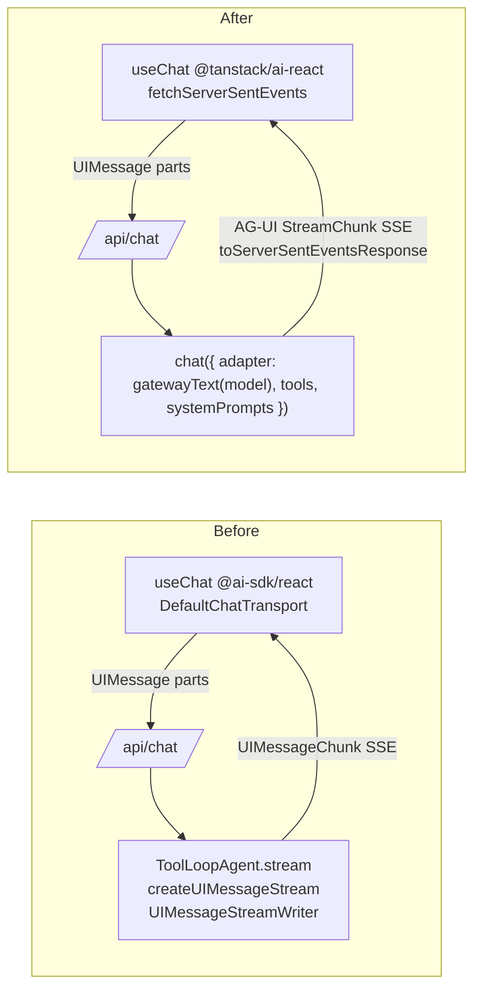

# refactor: Migrate app off Vercel AI SDK to TanStack AI

## Overview

Migrate the entire chat stack from the Vercel AI SDK (`ai`, `@ai-sdk/react`) to
`@tanstack/ai` — server, client, and tools — driving it through the already
shipped gateway adapter (`src/server/ai/gateway`, `gatewayText`). The Vercel AI
Gateway connector (`@ai-sdk/gateway`) **stays**; only the app-facing SDK
(`streamText`/`ToolLoopAgent`/`useChat`/`DefaultChatTransport` and the
`UIMessage`/`UIMessageChunk` wire format) is replaced.

Two phases (per the orchestration scope decision):

- **Phase 1 — working chat end-to-end.** Server handler → `chat()` +
  `toServerSentEventsResponse`; sub-agents become plain server tools that
  return their text; client hooks → `@tanstack/ai-react`; ai-elements rewired
  to TanStack message parts; `ai` + `@ai-sdk/react` removed.
- **Phase 2 — restore live sub-agent streaming.** Re-add the live
  sub-agent stream + agent-boundary UI + db-doctor cache + renderer
  `pipeJsonRender` on AG-UI events.

## Problem Frame

The app's chat runs on Vercel AI SDK primitives: a `ToolLoopAgent` orchestrator
streamed through `createUIMessageStream`/`UIMessageStreamWriter`
(`src/server/ai/index.ts`), sub-agent routing tools that drain sub-agent
streams into the parent writer with `data-agent-boundary` markers
(`src/server/ai/agents/lib/routing.ts`), a `useChat`/`DefaultChatTransport`
client (`src/components/ui/ai/use-ai.ts`, `use-agent.ts`), and ~12 `ai-elements`
components typed against `UIMessage`. We are standardizing on `@tanstack/ai`
(see origin: `docs/plans/2026-06-13-001-feat-gateway-tanstack-ai-adapter-plan.md`,
which built `gatewayText` as the connector). The migration is mechanical at the
edges but architectural at the core: `chat()` owns the agent loop and emits
AG-UI `StreamChunk` events, with no `UIMessageStreamWriter` to drain sub-agents
into — so the orchestration is redesigned, not swapped.

## Requirements Trace

- R1. The chat endpoint (`/api/chat`, `/api/agents`) streams via `chat()` +
  `toServerSentEventsResponse`; no `streamText`/`ToolLoopAgent`/
  `createUIMessageStream` remain on the request path.
- R2. The model is selected per request (the existing model selector) and
  driven through `gatewayText(model)`.
- R3. The client uses `@tanstack/ai-react` `useChat` with
  `fetchServerSentEvents`; `isLoading` replaces `status`; per-request `model`/
  `webSearch` travel via `sendMessage(content, body)`.
- R4. Messages render from TanStack `UIMessage.parts` (`text.content`,
  `thinking`, `tool-call`, `tool-result`) across `ui/ai` + `ai-elements`.
- R5. Tools are `toolDefinition().server()` (and `.client()` where a tool runs
  in the browser); approvals use `addToolApprovalResponse`.
- R6. Provider knobs (`PROVIDER_OPTIONS`) map to `modelOptions` on the adapter.
- R7. `ai` and `@ai-sdk/react` are removed from `package.json`;
  `@ai-sdk/gateway` (+ `@ai-sdk/provider*`) remain as the connector.
- R8. Existing behavior preserved: streaming text, reasoning display, tool
  calls, attachments/multimodal input, error display, regenerate.
- R9. (Phase 2) Live sub-agent streaming + agent-boundary grouping + db-doctor
  cache + renderer spec lifting restored.
- R10. The chat test suite is migrated and green; a real gateway round-trip
  passes (reuse the gateway live-test harness).

## Scope Boundaries

- **Not** replacing `@ai-sdk/gateway` — it is the connector the gateway adapter
  wraps.
- **Not** changing the Convex backend, auth, or routing framework (Hono).
- **Not** redesigning the chat UI visually — parts rewiring only, same
  components.
- **Not** building image/audio/video generation UIs (the gateway image/video
  adapters exist but have no caller; out of scope here).

### Deferred to Separate Tasks

- Live sub-agent streaming + agent boundaries + db-doctor cache + renderer
  `pipeJsonRender`: **Phase 2 of this plan** (Units 8–9).
- `src/lib/editor/markdown-joiner-transform.ts` (`TextStreamPart`/`ToolSet`
  from `ai`, editor-only, not on the chat path): isolated type swap in Unit 7;
  deeper editor-streaming rework deferred if it proves non-trivial.
- Persisted-message backfill (if historical chats are stored in Convex in the
  Vercel wire shape): separate data task — see Risks.

## Context & Research

### Relevant Code and Patterns

- `src/server/ai/index.ts` — `agentRequestHandler`: `ToolLoopAgent` +
  `createUIMessageStream`/`createUIMessageStreamResponse` +
  `convertToModelMessages`. The orchestrator currently registers `tools: {}`.
- `src/server/ai/agents/lib/routing.ts` — `dbDoctorRoutingTool` /
  `rendererRoutingTool` (`tool({execute})` draining sub-agent
  `UIMessageStreamWriter` with `data-agent-boundary`/`data-agent-step`,
  `DbDoctorCache`, `drainIntoWriter`).
- `src/server/ai/agents/lib/{prefix-text-part-ids,rewrite-renderer-parts,strip-renderer-tool-parts}.ts`
  — `UIMessageChunk`/`UIMessage` stream transforms.
- `src/server/ai/constants.ts` — `MODELS`, `PROVIDER_OPTIONS` → `modelOptions`.
- `src/server/index.ts` — Hono route `POST ['/api/agents','/api/chat'] →
agentRequestHandler`.
- `src/components/ui/ai/use-ai.ts` — `useChat` (`@ai-sdk/react`),
  `lastAssistantMessageIsCompleteWithApprovalResponses`, jotai atoms,
  `sendMessage({text,files},{body:{model,webSearch}})`.
- `src/components/ui/ai/use-agent.ts`, `src/components/ai/index.tsx` —
  `DefaultChatTransport`.
- `src/components/ui/ai/conversation.tsx` — `UIMessage`/`ChatStatus`/
  `ChatRequestOptions`; renders `part.type === 'text'|'reasoning'` via
  `part.text`.
- `ai-elements`: `message.tsx`, `tool.tsx`, `prompt-input.tsx`,
  `conversation.tsx`, `attachments.tsx`, `confirmation.tsx`, `context.tsx`,
  `image.tsx`, `audio-player.tsx`, `transcription.tsx`, `agent.tsx`,
  `sandbox.tsx` — typed against `ai` `UIMessage`/parts.
- `src/server/ai/gateway/**` + `__tests__/text-adapter.live.test.ts` — the
  connector and the real-gateway test harness to reuse.

### Key Type Contracts (installed)

- `@tanstack/ai`: `chat({ adapter, messages, systemPrompts, tools,
modelOptions, agentLoopStrategy, middleware, outputSchema, stream })`;
  `toServerSentEventsResponse(stream, { abortController })`; `toolDefinition({
name, description, inputSchema, outputSchema, needsApproval }).server(fn)
/.client(fn)`; `maxIterations`/`untilFinishReason`/`combineStrategies`.
  `chat()` accepts `UIMessage | ModelMessage` directly (no
  `convertToModelMessages`).
- `@tanstack/ai-react`: `useChat({ connection, body, tools })` → `{ messages,
sendMessage(content, body?), isLoading, addToolApprovalResponse, reload,
connectionStatus }`; `fetchServerSentEvents(url, optsOrFn)` (per-request
  `body`/`headers`); `UIMessage` parts: `{type:'text',content}`,
  `{type:'thinking',content}`, `{type:'tool-call',...}`, `{type:'tool-result',...}`.
- `@tanstack/ai-client`: `clientTools(...)` for browser-executed tools.

### External References

- Migration guide (fetched): `docs/migration/migration-from-vercel-ai.md`
  (tanstack/ai). Quick-reference mapping reproduced below.

### Institutional Learnings

- Origin plan + `src/server/ai/gateway/CONTEXT.md` establish the AG-UI vs
  `LanguageModelV3` vocabulary and that `chat()` owns the tool loop.
- Session learning: verify TypeScript with `node_modules/.bin/tsc` (never
  `npx tsc`, which resolves a stub in this repo), and keep `docs/ref/**`
  excluded from the tsconfig glob.

## Key Technical Decisions

- **End-to-end first; live sub-streaming in Phase 2** (user decision). Sub-agent
  routing tools return their prose as the tool result so the loop keeps working;
  the live `data-agent-boundary` UX is reintroduced in Phase 2.
  _Rationale:_ ships a working migration fastest, isolates the one hard
  redesign.
- **Drop `convertToModelMessages`.** `chat()` consumes UI messages directly;
  the wire format becomes TanStack `UIMessage` (parts with `content`).
- **Per-request model/webSearch via `sendMessage(content, body)`** +
  `fetchServerSentEvents`, replacing `DefaultChatTransport({api})` +
  `sendMessage({text},{body})`.
- **`reasoning` part → `thinking` part.** TanStack names the reasoning part
  `thinking` with a `content` field (Vercel used `reasoning`/`text`).
- **`PROVIDER_OPTIONS` → `modelOptions`** keyed by provider, passed to `chat()`.
- **Keep the gateway adapter as the single connector;** no per-provider
  TanStack adapters (`@tanstack/ai-openai`, etc.) are added — everything routes
  through `gatewayText`.

## Open Questions

### Resolved During Planning

- Orchestration approach? → End-to-end first, live sub-streaming Phase 2.
- Keep `@ai-sdk/gateway`? → Yes (connector). Remove `ai` + `@ai-sdk/react`.
- Message conversion? → Removed; TanStack UI messages on the wire.
- Per-request body (model/webSearch)? → `sendMessage(content, body)`.

### Deferred to Implementation

- Exact Phase-2 mechanism for forwarding a sub-agent `chat()` stream into the
  parent AG-UI stream (CUSTOM events vs `onChunk` middleware injection) — Unit 8
  spike resolves it against real `@tanstack/ai` middleware/event APIs.
- Whether `pipeJsonRender` (`@json-render/core`) can transform AG-UI
  `StreamChunk`s or needs a small AG-UI shim — Unit 9.
- Whether any historical chats are persisted in the Vercel wire shape and need
  a backfill — confirm against Convex schema during Unit 2.
- `markdown-joiner-transform.ts` editor coupling depth — Unit 7.

## High-Level Technical Design

> _This illustrates the intended approach and is directional guidance for review, not implementation specification. The implementing agent should treat it as context, not code to reproduce._

Request path, before → after:



Core mapping (from the migration guide):

| Vercel AI SDK                    | TanStack AI                           | Where it lands             |
| -------------------------------- | ------------------------------------- | -------------------------- |
| `streamText`/`ToolLoopAgent`     | `chat({ adapter })`                   | `src/server/ai/index.ts`   |
| `convertToModelMessages`         | _(removed)_                           | server handler             |
| `createUIMessageStreamResponse`  | `toServerSentEventsResponse(stream)`  | server handler             |
| `system:`                        | `systemPrompts: []`                   | server handler             |
| `providerOptions`                | `modelOptions`                        | `constants.ts` + handler   |
| `tool({inputSchema,execute})`    | `toolDefinition().server(fn)`         | `routing.ts`               |
| `stopWhen: stepCountIs(N)`       | `agentLoopStrategy: maxIterations(N)` | server handler             |
| `useChat`/`DefaultChatTransport` | `useChat`/`fetchServerSentEvents`     | `use-ai.ts`/`use-agent.ts` |
| `status`                         | `isLoading`                           | hooks + `conversation.tsx` |
| `sendMessage({text},{body})`     | `sendMessage(text, body)`             | `use-ai.ts`                |
| `part.text` (text/reasoning)     | `part.content` (text/thinking)        | `ai-elements`              |

Directional before/after (server handler):

```text
// before — src/server/ai/index.ts
const stream = createUIMessageStream({ execute: async ({ writer }) => {
  const orchestrator = new ToolLoopAgent({ instructions, model, tools: {} })
  const result = await orchestrator.stream({
    messages: await convertToModelMessages(messages), abortSignal })
  writer.merge(result.toUIMessageStream({ sendStart:false, sendFinish:false }))
}})
return createUIMessageStreamResponse({ stream, headers })

// after (directional)
const stream = chat({
  adapter: gatewayText(model),
  systemPrompts: ['You are a helpful assistant.'],
  messages,
  tools: [dbDoctorTool, rendererTool],
  agentLoopStrategy: maxIterations(10),
  abortController,
})
return toServerSentEventsResponse(stream, { abortController })
```

## Implementation Units

### Phase 1 — Working chat end-to-end

- [ ] **Unit 1: Server chat() handler**

**Goal:** Replace the `ToolLoopAgent`/`createUIMessageStream` request path with
`chat()` + `toServerSentEventsResponse`, driven by `gatewayText(model)`.

**Requirements:** R1, R2, R6

**Dependencies:** None (gateway adapter already shipped)

**Files:**

- Modify: `src/server/ai/index.ts`
- Modify: `src/server/ai/constants.ts` (`PROVIDER_OPTIONS` → `modelOptions` shape)
- Modify: `src/server/index.ts` (only if the handler signature/headers change)
- Test: `src/server/ai/__tests__/chat-handler.test.ts`

**Approach:**

- `agentRequestHandler` parses `{ messages, model, webSearch }`, builds
  `chat({ adapter: gatewayText(model), systemPrompts, messages, tools,
modelOptions, agentLoopStrategy: maxIterations(N), abortController })`, returns
  `toServerSentEventsResponse(stream, { abortController })`.
- Pass `req.signal` via an `AbortController` bridge.
- Keep custom headers (`x-sunday-agent`, `x-model`) on the Response.
- Tools start as the Unit 3 server tools (or `[]` if landing incrementally).

**Patterns to follow:** gateway adapter usage in
`src/server/ai/gateway/__tests__/text-adapter.live.test.ts`.

**Test scenarios:**

- Happy path: POST with messages + model returns a streaming SSE Response whose
  events include text content and a terminal finish (mock the adapter stream).
- Edge case: missing `model` falls back to the configured default.
- Error path: adapter/doStream failure surfaces an AG-UI error event, not a 500
  with an empty body.
- Integration: `abortController.abort()` stops the stream.

**Verification:** `/api/chat` streams AG-UI SSE end-to-end through
`gatewayText`; no `ai`-package symbols remain in `index.ts`.

- [ ] **Unit 2: Message wire-format bridge**

**Goal:** Move the wire format to TanStack `UIMessage`; remove
`convertToModelMessages`; confirm/handle any persisted-message shape.

**Requirements:** R1, R8

**Dependencies:** Unit 1

**Files:**

- Modify: `src/server/ai/index.ts` (consume messages directly)
- Modify: `src/server/ai/agents/lib/strip-renderer-tool-parts.ts` (retype to
  TanStack `UIMessage`)
- Modify: `src/server/ai/__tests__/orchestrator-message-filter.test.ts`
- Test: `src/server/ai/__tests__/message-bridge.test.ts`

**Approach:**

- Accept `UIMessage[]` from the client and hand to `chat()` directly.
- Audit Convex for persisted chat messages in the old shape; if present, add a
  small read-time normalizer (old `part.text` → `part.content`,
  `reasoning`→`thinking`); otherwise document none exist.
- Re-type the message-filter helpers to the TanStack `UIMessage`.

**Test scenarios:**

- Happy path: a TanStack `UIMessage[]` passes through unmodified.
- Integration: an assistant message with tool-call + a tool-result message
  round-trips into `chat()` and the loop resumes (no `convertToModelMessages`).
- Edge case: empty/`system`-only message arrays don't crash.
- Error path (if backfill needed): an old-shape persisted message normalizes to
  the new parts shape.

**Verification:** Server consumes client messages with no conversion shim; the
filter test passes against TanStack types.

- [ ] **Unit 3: Sub-agent routing tools as server tools (text result)**

**Goal:** Re-express `dbDoctorRoutingTool`/`rendererRoutingTool` as
`toolDefinition().server()` tools that run their sub-agent via `chat()` and
return the sub-agent's text — dropping `UIMessageStreamWriter` drain for Phase 1.

**Requirements:** R1, R5

**Dependencies:** Unit 1

**Files:**

- Modify: `src/server/ai/agents/lib/routing.ts`
- Modify (likely delete in Phase 1): `src/server/ai/agents/lib/{prefix-text-part-ids,rewrite-renderer-parts}.ts`
  (UIMessageChunk transforms not used when not draining)
- Test: `src/server/ai/__tests__/routing-tools.test.ts`

**Approach:**

- `dbDoctor`/`renderer` become `toolDefinition({ name, description,
inputSchema, outputSchema }).server(async ({ prompt }) => { collect the
sub-agent chat() text; return { ok:true, text } })`.
- Sub-agent runs `chat({ adapter: gatewayText(subModel), systemPrompts:[...],
messages:[{role:'user',content:prompt}], stream:false })` (or iterate the
  stream and accumulate text).
- Preserve the db-doctor request-scoped cache keyed by normalized prompt
  (cache the returned text, not chunks).
- Leave `data-agent-boundary` emission OUT (Phase 2). Note the UX regression.

**Execution note:** Characterize current routing-tool outputs before changing —
capture the `{ ok, text }` contract the orchestrator depends on.

**Test scenarios:**

- Happy path: a routing tool returns `{ ok:true, text }` from a mocked
  sub-agent stream.
- Edge case: db-doctor cache hit returns the cached text without re-running.
- Error path: sub-agent failure returns a structured error the loop can read.
- Integration: orchestrator `chat()` calls the tool, reads `text`, and composes
  a follow-up turn (db-doctor digest → renderer prompt).

**Verification:** Orchestrator runs multi-tool turns through `chat()`; sub-agent
prose reaches the loop; no `UIMessageStreamWriter` remains.

- [ ] **Unit 4: Client hooks → @tanstack/ai-react**

**Goal:** Swap `useChat`/`DefaultChatTransport` for `@tanstack/ai-react`
`useChat`/`fetchServerSentEvents`; keep the jotai state and model selector.

**Requirements:** R2, R3, R8

**Dependencies:** Unit 1 (server speaks AG-UI SSE)

**Files:**

- Modify: `src/components/ui/ai/use-ai.ts`
- Modify: `src/components/ui/ai/use-agent.ts`
- Modify: `src/components/ai/index.tsx`
- Test: `src/components/ui/ai/__tests__/use-ai.test.tsx`

**Approach:**

- `useChat({ connection: fetchServerSentEvents('/api/chat'), tools })`.
- `handleSubmit` → `sendMessage(text, { model, webSearch })` (per-request body);
  multimodal attachments via the multimodal `sendMessage` content form.
- Replace `status` reads with `isLoading`; `regenerate` → `reload`.
- Drop `sendAutomaticallyWhen: lastAssistantMessageIsCompleteWithApprovalResponses`
  — TanStack auto-resumes after `addToolApprovalResponse` (verify in Unit 6).
- Keep all jotai atoms (`modelAtom`, `webSearchAtom`, …) and hydration logic.

**Technical design:** _(directional)_

```text
// before — use-agent.ts
new DefaultChatTransport({ api: '/api/agent', ...resolvedTransport })
// after
fetchServerSentEvents('/api/agent', () => ({ body: resolvedBody }))
```

**Test scenarios:**

- Happy path: `sendMessage` posts text + `{model}` body; assistant text streams
  into `messages` (mock SSE).
- Edge case: empty input shows the existing toast, no send.
- Edge case: `isLoading` disables input during streaming.
- Integration: switching the model atom changes the body of the next send.

**Verification:** Chat sends/receives through TanStack with model + webSearch in
the body; no `@ai-sdk/react`/`DefaultChatTransport` imports remain in hooks.

- [ ] **Unit 5: Message rendering — ui/ai + ai-elements parts rewiring**

**Goal:** Render from TanStack `UIMessage.parts` (`text.content`, `thinking`,
`tool-call`, `tool-result`) across the conversation view and ai-elements.

**Requirements:** R4, R8

**Dependencies:** Unit 4

**Files:**

- Modify: `src/components/ui/ai/conversation.tsx`
- Modify: `src/components/ui/ai-elements/{message,tool,prompt-input,conversation,attachments,context,image,audio-player,transcription,agent,sandbox}.tsx`
- Test: `src/components/ui/ai/__tests__/conversation.test.tsx`

**Approach:**

- Replace `ai` type imports with `@tanstack/ai-react` (`UIMessage`) /
  `@tanstack/ai` types; drop `ChatStatus`/`ChatRequestOptions`.
- `part.type === 'text'` → `part.content`; `part.type === 'reasoning'` →
  `part.type === 'thinking'` with `part.content`.
- Streaming flag: `status === 'streaming'` → `isLoading`.
- Tool rows read `tool-call`/`tool-result` part shape (`name`, `input`,
  `output`, `state`).
- This is the broad mechanical unit; do it as one sweep to keep parts handling
  consistent.

**Test scenarios:**

- Happy path: a message with text parts renders content; assistant copy/retry
  actions still wire up.
- Edge case: a `thinking` part renders in the reasoning UI while streaming.
- Edge case: a `tool-call` part renders the tool row with parsed input.
- Integration: an error part/`error` state renders the error message + retry.

**Verification:** Conversation + ai-elements compile against TanStack parts and
render text/thinking/tool rows; no `ai` `UIMessage` imports remain in these
files.

- [ ] **Unit 6: Tool approvals + client tools**

**Goal:** Move tool approval and any browser-side tools onto the TanStack flow.

**Requirements:** R5, R8

**Dependencies:** Units 3, 4, 5

**Files:**

- Modify: `src/components/ui/ai-elements/confirmation.tsx`
- Modify: `src/components/ui/ai/use-ai.ts` (expose `addToolApprovalResponse`)
- Modify: `src/server/ai/agents/lib/routing.ts` (tools needing approval set
  `needsApproval: true`)
- Test: `src/components/ui/ai-elements/__tests__/confirmation.test.tsx`

**Approach:**

- Approval UI reads `part.type==='tool-call' && part.state==='approval-requested'`
  and calls `addToolApprovalResponse({ id: part.approval.id, approved })`.
- Any tool that must run in the browser becomes `toolDefinition().client(fn)`
  passed via `useChat({ tools: clientTools(...) })` (audit whether the app has
  client tools today; if none, document and skip).

**Test scenarios:**

- Happy path: Approve calls `addToolApprovalResponse({approved:true})` and the
  loop resumes.
- Happy path: Deny sends `{approved:false}`.
- Edge case: a non-approval tool-call part renders no approval UI.

**Verification:** Approve/Deny resumes/cancels the tool through TanStack; no
`lastAssistantMessageIsCompleteWithApprovalResponses` usage remains.

- [ ] **Unit 7: Remove Vercel AI SDK + retype stragglers**

**Goal:** Delete `ai` + `@ai-sdk/react`; retype the remaining helpers and tests
off `ai`.

**Requirements:** R7, R10

**Dependencies:** Units 1–6

**Files:**

- Modify: `package.json`, `bun.lock`
- Modify: `src/lib/editor/markdown-joiner-transform.ts` (replace
  `TextStreamPart`/`ToolSet` from `ai` with local/editor types)
- Modify: any residual `ai` importers surfaced by grep
- Test: full chat suite green; reuse `gateway/__tests__/text-adapter.live.test.ts`
  pattern for one real end-to-end chat round-trip

**Approach:**

- `grep -rl "from 'ai'\|@ai-sdk/react"` must return only gateway/`@ai-sdk/*`
  connector files; remove the two deps.
- `markdown-joiner-transform.ts` is editor-only (`import type` of
  `TextStreamPart`/`ToolSet`); define minimal local types or drop if unused on
  the editor path.
- Verify with `node_modules/.bin/tsc` (not `npx tsc`).

**Test scenarios:**

- Happy path: `bun pm ls` shows `ai`/`@ai-sdk/react` gone; `@ai-sdk/gateway`
  present.
- Integration (gated, real network): one `/api/chat` round-trip via `chat()` +
  `gatewayText` streams text + finishes (reuse the live-test env gate).
- Edge case: editor markdown transform still compiles/works without `ai`.

**Verification:** No `ai`/`@ai-sdk/react` in `package.json`; `node_modules/.bin/tsc`
clean for migrated files; chat works against the real gateway.

### Phase 2 — Restore live sub-agent streaming

- [ ] **Unit 8: Spike + implement sub-agent stream forwarding**

**Goal:** Forward a sub-agent `chat()` stream into the parent AG-UI stream so
sub-agent text/tool steps appear live, and re-introduce agent-boundary grouping.

**Requirements:** R9

**Dependencies:** Phase 1 complete

**Files:**

- Create: `src/server/ai/agents/lib/forward-subagent.ts`
- Modify: `src/server/ai/agents/lib/routing.ts`
- Test: `src/server/ai/__tests__/forward-subagent.test.ts`

**Approach:**

- Spike first: determine whether to inject sub-agent chunks via a `chat()`
  `middleware.onChunk` on the parent, or emit AG-UI `CUSTOM` events carrying
  sub-agent deltas, or run the parent stream through a merge that interleaves a
  sub-agent `AsyncIterable<StreamChunk>`. Pick the one the installed
  `@tanstack/ai` APIs support cleanly.
- Re-create `data-agent-boundary` start/end as AG-UI `CUSTOM` events
  (`agent.boundary`) and sub-tool steps as `CUSTOM` (`agent.step`).
- Preserve ordering (the original drain awaited EOS before follow-up frames).

**Execution note:** Start with the spike test that proves a sub-agent stream's
deltas reach the parent SSE in order; build the real forwarder against it.

**Test scenarios:**

- Happy path: sub-agent text deltas appear in the parent stream between boundary
  start/end CUSTOM events, in order.
- Edge case: two sub-agent calls in one turn don't interleave/clobber ids.
- Error path: sub-agent error closes its boundary and surfaces upstream.
- Integration: orchestrator turn shows db-doctor then renderer sub-streams live.

**Verification:** Sub-agent output streams live into the chat with correct
boundary grouping and ordering.

- [ ] **Unit 9: Restore db-doctor cache replay + renderer spec lifting + UI**

**Goal:** Reattach the request-scoped cache (chunk replay), renderer
`pipeJsonRender` spec lifting, and the chat UI that renders agent-step events.

**Requirements:** R9

**Dependencies:** Unit 8

**Files:**

- Modify: `src/server/ai/agents/lib/routing.ts`
- Modify: `src/components/ui/ai-elements/agent.tsx` (render `agent.boundary`/
  `agent.step` CUSTOM events)
- Modify: `src/components/ui/ai/conversation.tsx` (segment parts by boundary)
- Test: `src/server/ai/__tests__/routing-streaming.test.ts`

**Approach:**

- Cache replays forwarded sub-agent chunks (mirror the old chunk-record/replay)
  keyed by normalized prompt.
- Confirm whether `pipeJsonRender` (`@json-render/core`) can transform AG-UI
  `StreamChunk`s; if not, add a thin AG-UI↔chunk shim around it for the
  renderer's ```spec lifting to `data-spec`.
- Chat UI groups events under a collapsible agent header (mirror the prior
  `segmentParts` behavior) reading the new CUSTOM events.

**Test scenarios:**

- Happy path: renderer ```spec fence lifts to a spec event the UI renders.
- Edge case: db-doctor cache hit replays a prior sub-stream with a
  "from cache" badge.
- Integration: a full orchestrator turn renders grouped db-doctor + renderer
  steps with spec output, matching pre-migration UX.

**Verification:** Live sub-agent streaming UX matches the pre-migration behavior
(boundaries, cache badge, rendered spec).

## System-Wide Impact

- **Interaction graph:** Every chat entry point (`/api/chat`, `/api/agents`,
  `src/components/ai`, `ui/ai`) shifts to AG-UI SSE. The model selector,
  attachments, reasoning view, tool rows, and approval UI all read the new parts
  shape. The editor (`markdown-joiner-transform`) is adjacent and only type-coupled.
- **Error propagation:** Server errors must arrive as AG-UI `RUN_ERROR` events
  the conversation renders (Unit 1 + Unit 5), not as dropped streams.
- **State lifecycle risks:** Wire-format change breaks any persisted chats in
  the old shape (Unit 2 audit + optional backfill). In-flight sessions during
  deploy will see a format mismatch — coordinate deploy of server + client.
- **API surface parity:** `/api/chat` and `/api/agents` share `agentRequestHandler`
  — migrate once, both follow.
- **Integration coverage:** A real-gateway round-trip (Unit 7) and the
  orchestrator multi-tool turn (Unit 3 / Unit 8) are the cross-layer proofs
  mocks won't give.
- **Unchanged invariants:** `@ai-sdk/gateway` connector, Convex backend, Hono
  routing, jotai chat state, and the visual design of the chat components are
  unchanged.

## Risks & Dependencies

| Risk                                                                 | Mitigation                                                                                   |
| -------------------------------------------------------------------- | -------------------------------------------------------------------------------------------- |
| Sub-agent live streaming has no direct `chat()` equivalent           | User-approved Phase 2 split; Unit 8 spikes the forwarding mechanism before committing        |
| Wire-format change breaks persisted/in-flight chats                  | Unit 2 audits Convex; coordinate server+client deploy; optional read-time normalizer         |
| `pipeJsonRender` may not consume AG-UI streams                       | Unit 9 confirms; add a thin shim if needed; renderer spec lifting isolated to one unit       |
| Broad ai-elements sweep (12 files) risks inconsistent parts handling | Unit 5 does it as one coordinated pass with a shared parts-rendering helper                  |
| Approval auto-resume differs from Vercel's `sendAutomaticallyWhen`   | Unit 6 verifies TanStack auto-resume against the real flow before removing the Vercel helper |
| `npx tsc` is a stub in this repo → false green                       | Verify exclusively with `node_modules/.bin/tsc`; keep `docs/ref/**` excluded                 |

## Phased Delivery

### Phase 1 (Units 1–7)

Working chat end-to-end on TanStack AI; `ai`/`@ai-sdk/react` removed. Sub-agents
return text (no live sub-stream UI). Shippable.

### Phase 2 (Units 8–9)

Restore live sub-agent streaming, agent boundaries, db-doctor cache replay, and
renderer spec lifting. Closes the Phase-1 UX regression.

## Documentation / Operational Notes

- Update `src/server/ai/gateway/CONTEXT.md` cross-links if orchestration terms
  shift; add a `docs/solutions/` note on the AG-UI sub-agent forwarding pattern
  (Unit 8 is novel and reusable).
- Deploy coordination: ship server + client together (wire-format change).
- After Phase 1, run the gateway live test + a manual smoke of model switching,
  attachments, reasoning, and a tool turn.

## Sources & References

- **Origin document:** [docs/plans/2026-06-13-001-feat-gateway-tanstack-ai-adapter-plan.md](docs/plans/2026-06-13-001-feat-gateway-tanstack-ai-adapter-plan.md)
- Migration guide: tanstack/ai `docs/migration/migration-from-vercel-ai.md`
- Related code: `src/server/ai/index.ts`, `src/server/ai/agents/lib/routing.ts`,
  `src/components/ui/ai/use-ai.ts`, `src/server/ai/gateway/**`
- Connector: `@ai-sdk/gateway`; client: `@tanstack/ai-react`, `@tanstack/ai-client`
