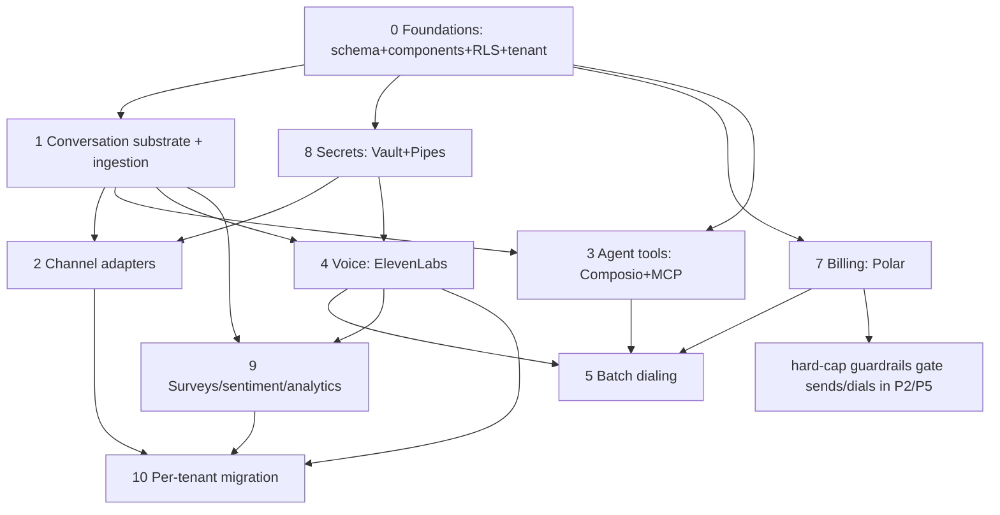

# Agentio rebuild — implementation plan index

> **Design intent (authoritative for WHAT):** the sibling repo `agentio` —
> `agentio/docs/rebuild-architecture.md` + `agentio/docs/threads-model.md`.
> Those docs assume Next.js + Vercel AI SDK; **these plans adapt every decision to
> the ACTUAL `agent.io` stack** (below). Where a design-doc claim was corrected by
> prior research, the correction is carried into the relevant phase plan.

This is the implementation map for building out the **Agentio domain** in
`agent.io`. The work is split into 10 phase plans (phases 0–9, files `001`–`010`
in `docs/plans/`), every plan a set of dependency-ordered units with directional
code sketches, test scenarios, and verification.

## Actual stack (what these plans target)

- **Frontend/runtime:** TanStack Start (`@tanstack/react-start@1.168.x`) + Vite (`@voidzero-dev/vite-plus-core`, the `vp` toolchain) + TanStack Router (`@tanstack/react-router@1.170.x`); Jotai (UI state); TanStack Query (`@tanstack/react-query@5.101.0`) wired via `@convex-dev/react-query`. React `19.2.x`.
- **Backend:** Convex `1.41.0`. Domain function factory in `convex/utils.ts` (`authQuery`/`authMutation` via convex-helpers `zod4` `zCustomQuery`/`zCustomMutation`, injecting `{ user, org }` from the WorkOS JWT). Components registered in `convex/convex.config.ts`.
- **API:** contract-first **oRPC** (`@orpc/*@1.14.6`) — `src/server/rpc/{contracts,routes,init}.ts`; `org`/`admin` middleware; `organizationId` always from session, never client input.
- **AI:** Vercel **AI SDK v7-beta** — pinned `ai@7.0.0-beta.178`, `@ai-sdk/react@4.0.0-beta.182`, `@ai-sdk/gateway@4.0.0-beta.109`, `@ai-sdk/provider@4.0.0-beta.19`. Orchestration already built (sunday pattern): `src/server/ai/index.ts` (`agentRequestHandler` → `createAgentUIStreamResponse({ agent: new ToolLoopAgent(...), uiMessages, sendStart/sendFinish/sendReasoning, headers, abortSignal })`) + `src/server/ai/agents/routing.ts` (`routing()`/`customRouting()` wrap sub-agent `ToolLoopAgent`s as routing tools whose async-generator `execute` yields sub-agent `UIMessage`s into the parent stream via the **top-level** `toUIMessageStream({ stream: result.stream })` + `readUIMessageStream({ stream })`).
- **Auth:** WorkOS AuthKit via `@convex-dev/workos-authkit@^0.2.7` + the TanStack Start adapter `@workos/authkit-tanstack-react-start@^0.8.6`; **two `customJwt` providers** in `convex/auth.config.ts` (issuer `https://api.workos.com/` with `applicationID`, and `https://api.workos.com/user_management/${clientId}`); `@workos-inc/node` Management API via `convex/workos.ts`. Already built.
- **Email:** `@convex-dev/resend@^0.2.4` (component; the bare `resend@^6.x` SDK is also present). **Tooling:** Bun, Biome (tabs, single quotes, no semicolons).

## Conventions (apply in every plan's Verification)

- Typecheck: `node_modules/.bin/tsc --noEmit` (**not** `npx tsc`; `node_modules/.bin/tsc` is the real symlink → `typescript@6.0.3`). The repo also exposes `vp check --fix` (script `typecheck`) which wraps the same toolchain — prefer the explicit `node_modules/.bin/tsc --noEmit` for a deterministic, no-write check. Bar: **zero net-new errors** in touched files (~49 pre-existing baseline — VERIFY current baseline before each phase, it drifts).
- Tests: `node_modules/.bin/vp test run <path>` (**not** `bunx vitest`; `node_modules/.bin/vp` → `vite-plus`, the `test`/`run` subcommand. The `vitest` symlink exists but points at `@voidzero-dev/vite-plus-test` — invoke through `vp test run`).
- Format/lint: `biome check . --write` (script `lint`; Biome ships via the vite-plus toolchain — there is **no** `node_modules/.bin/biome` symlink, so call it through the `lint` script or `bunx @biomejs/biome check --write <files>` if a direct path is needed). Deps: `bun add` (pin betas exactly; see Documentation & References).
- **Tenant isolation:** every domain query/mutation goes through `authQuery`/`authMutation` so `tenantId` (= WorkOS `organizationId`, an opaque `org_…` string) is injected and enforced by construction. No nullable tenant key, ever. It is an **external reference** (`v.string()`), never a local FK.
- **Don't-mirror spine:** WorkOS owns identity/secrets; ElevenLabs owns voice runtime; Polar owns pricing/meters; Composio owns tool creds. Convex stores only genuine domain + one `tenant` config row.

## What's already built (not re-planned)

WorkOS auth + org/members/invitations/roles (oRPC: `src/server/rpc/contracts/work-os.contract.ts` + `routes/work-os.router.ts`); the AI text-orchestration runtime (v7, sunday pattern: `src/server/ai/index.ts` + `agents/routing.ts`). `convex/convex.config.ts` registers **only** `@convex-dev/workos-authkit` + `@convex-dev/resend` (verified). **`convex/schema.ts` is effectively empty** (3 lines — `defineSchema({})`) — the domain is the scope below.

> **Already-installed components (do not re-`bun add`; just `app.use()` + configure).** `@convex-dev/workflow@0.4.4`, `@convex-dev/workpool@0.4.6`, and `@convex-dev/rate-limiter@0.3.2` are **already in `node_modules`/`package.json`** but **not yet registered** in `convex/convex.config.ts`. Phases 0/5 register and configure them; they do **not** need an install step. Everything else listed under Documentation & References is genuinely not-yet-installed and carries a `bun add` step in its phase.

## Phase plans

| #   | File                                                           | Scope                                                                                                                                                                              |
| --- | -------------------------------------------------------------- | ---------------------------------------------------------------------------------------------------------------------------------------------------------------------------------- |
| 0   | `2026-06-17-001-feat-convex-foundations-rls-plan.md`           | Schema base, register already-installed Convex components (`workflow`/`workpool`/`rate-limiter`) + add new ones, RLS (`authQuery`/`authMutation`), Triggers, `tenant` config table |
| 1   | `2026-06-17-002-feat-conversation-substrate-ingestion-plan.md` | `threads`/`calls`/`messages` polymorphic substrate + `contacts` + ingestion + idempotency + wire to v7 orchestrator                                                                |
| 2   | `2026-06-17-003-feat-channel-adapters-plan.md`                 | WhatsApp (Meta Graph) / SMS+voice telephony (Twilio) / email (`@convex-dev/resend`) / widget — inbound parse + outbound send                                                       |
| 3   | `2026-06-17-004-feat-agent-tools-composio-mcp-plan.md`         | Composio (per-tenant, `user_id = tenantId`) + BYO MCP into specialist sub-agents; `agents` table                                                                                   |
| 4   | `2026-06-17-005-feat-voice-runtime-elevenlabs-plan.md`         | ElevenLabs SDK + agent sync + post-call webhook → `calls`/`messages` + Agent Workflows                                                                                             |
| 5   | `2026-06-17-006-feat-batch-dialing-workflow-plan.md`           | `batches` + durable `@convex-dev/workflow` + `@convex-dev/workpool` + `@convex-dev/rate-limiter`                                                                                   |
| 6   | `2026-06-17-007-feat-billing-polar-metering-plan.md`           | `@convex-dev/polar` + LLM-strategy metering + Polar Event ingestion + hard-cap guardrails                                                                                          |
| 7   | `2026-06-17-008-feat-secrets-workos-vault-pipes-plan.md`       | WorkOS Vault + Pipes (no `connections` table)                                                                                                                                      |
| 8   | `2026-06-17-009-feat-surveys-sentiment-analytics-plan.md`      | `surveys`/`surveyResponses` + sentiment + `@convex-dev/aggregate` (+ `@convex-dev/action-cache` for analytics cache)                                                               |
| 9   | `2026-06-17-010-feat-tenant-data-migration-plan.md`            | Per-tenant migration from the legacy `agentio` Convex app (`@convex-dev/migrations`)                                                                                               |

> All 11 filenames above (this index `000` + phases `001`–`010`) are confirmed present in `docs/plans/`.

## Dependency graph

> **Node-numbering note:** mermaid node `P8` = phase-plan **8 (Secrets, file `008`)** but is sequenced _early_ (see build sequence); `P7` = phase **7 (Billing, file `007`)**; `P9` = phase **9 (Surveys, file `009`)**; `P10` = phase **10 (Migration, file `010`)**. The graph is topologically consistent: every edge points from a prerequisite to a dependent, and Secrets (8) feeds Channels (2) and Voice (4), which is why it builds early despite its file number.

## Recommended build sequence

1. **Phase 0** (foundations) — unblocks everything. Registers the three already-installed components and adds `polar`/`aggregate`/`action-cache`/`migrations`.
2. **Phase 8** (secrets) early — channels/voice can't actually send without Vault/Pipes accessors.
3. **Phase 1** (conversation substrate) — the spine the runtime writes to.
4. **Phase 3** (agent tools) — gives the existing orchestrator real capability; **Phase 2** (channels) — inbound/outbound text.
5. **Phase 7** (billing) — wire metering as the runtime lands.
6. **Phase 4** (voice) → **Phase 5** (batch dialing).
7. **Phase 9** (surveys/sentiment/analytics).
8. **Phase 10** (per-tenant migration) — last; migrates into the finished schema.

## Cross-cutting risks (tracked per plan)

- **Convex V8 runtime vs `ai@7-beta` + MCP stdio.** AI SDK streaming (`createAgentUIStreamResponse`, the top-level `toUIMessageStream`, `readUIMessageStream`) and MCP `stdio` transport may not run in Convex's V8 HTTP runtime; Node-only code must live in a `"use node"` Convex action or on the TanStack Start server. Phases 3/4 carry a spike + a Node/TanStack-server fallback for the tool-using agent loop. (`createMCPClient` transport `redirect` defaults to `'error'` — set it explicitly per server.)
- **v7 is beta + pinned** (the floating `ai@beta` tag, `.179`, is broken on the registry; pin `ai@7.0.0-beta.178` exactly). Treat SDK-shape claims as verify-before-build. Known v7-beta.178 shape facts the plans rely on: `ToolLoopAgent` exists (`.stream()`/`.generate()`); the **result method `result.toUIMessageStream()` is REMOVED** — use the top-level `toUIMessageStream({ stream: result.stream })`; step control is `isStepCount(n)` (not `stepCountIs`/`maxSteps`); `convertToModelMessages()` is **async** (await it); tools via `tool({ description, inputSchema, execute })`; `gateway(modelId)` from `@ai-sdk/gateway`. A plain `ReadableStream` is not async-iterable under all TS libs — drain via `getReader()` if a plan iterates one directly (note: `readUIMessageStream({ stream })` already handles draining the UI-message stream).
- **`twilio@6.x` is a new major** — code examples found online frequently target v4/v5. Verify constructor + helper-library call signatures against the v6 docs before lifting any snippet (Phase 2).
- **Component version churn** — Convex components are pre-1.0; pin the exact tags in Documentation & References and re-verify on install.

## Documentation & References

> Install commands use exact versions confirmed against the npm registry on **2026-06-17**. Convex components are registered in `convex/convex.config.ts` via `app.use(<component>)` after install. Pin betas exactly.

### Already installed — register/configure only (no install)

- **AI SDK v7-beta** — `ai@7.0.0-beta.178`, `@ai-sdk/react@4.0.0-beta.182`, `@ai-sdk/gateway@4.0.0-beta.109`, `@ai-sdk/provider@4.0.0-beta.19` (all present in `node_modules`). Docs: https://ai-sdk.dev/docs — `createMCPClient` reference: https://ai-sdk.dev/docs/reference/ai-sdk-core/create-mcp-client.md. Built code: `src/server/ai/index.ts`, `src/server/ai/agents/routing.ts`. Reference pattern: `sunday/sunday-ontology/apps/sunday/src/server/ai`; heavy specials: `ontology/src/server/ai/agents/{renderer,routing,run-subagent}`.
- **Convex** — `convex@1.41.0`, `convex-helpers@0.1.119` (zod4 custom functions). Docs: https://docs.convex.dev · components: https://www.convex.dev/components · convex-helpers: https://github.com/get-convex/convex-helpers. Built code: `convex/{convex.config.ts,auth.config.ts,auth.ts,utils.ts,workos.ts}`.
- **WorkOS** — `@convex-dev/workos-authkit@^0.2.7`, `@workos/authkit-tanstack-react-start@^0.8.6`, `@workos-inc/node`. Docs: https://workos.com/docs · Pipes: https://workos.com/docs/pipes.md · Vault: https://workos.com/docs/vault · Feature Flags: https://workos.com/docs/feature-flags.md. Design: `rebuild-architecture.md` §1 (Identity), §2 (Secrets — Pipes+Vault).
- **Resend (Convex component)** — `@convex-dev/resend@^0.2.4`. Docs: https://www.convex.dev/components/resend.
- **oRPC** — `@orpc/*@1.14.6`. Docs: https://orpc.unnoq.com. Built code: `src/server/rpc/**`.
- **`@convex-dev/workflow@0.4.4`** (Phase 5) — _already installed_; just `app.use(workflow)`. Docs: https://www.convex.dev/components/workflow.
- **`@convex-dev/workpool@0.4.6`** (Phase 5) — _already installed_. Docs: https://www.convex.dev/components/workpool.
- **`@convex-dev/rate-limiter@0.3.2`** (Phases 0/2/5) — _already installed_. Docs: https://www.convex.dev/components/rate-limiter.

### Not yet installed — install per phase (verified versions, 2026-06-17)

- **`@convex-dev/polar`** (Phase 7) — `bun add @convex-dev/polar@0.9.1`. Docs: https://www.convex.dev/components/polar/polar.md. Note: meter **balance** reads go through the **raw `@polar-sh/sdk`** (`customers.getStateExternal`) in a Convex action, not the component. Polar Event Ingestion: https://polar.sh/docs/features/usage-based-billing/event-ingestion.md. Design: `rebuild-architecture.md` §Payments.
- **`@polar-sh/sdk`** (Phase 7) — `bun add @polar-sh/sdk@0.48.1`. Docs: https://github.com/polarsource/polar-js · https://polar.sh/docs.
- **`@elevenlabs/elevenlabs-js`** (Phase 4) — `bun add @elevenlabs/elevenlabs-js@2.53.0`. Docs: https://elevenlabs.io/docs · Agent Workflows (programmable, top-level `conversation_config.workflow` field, **underscore** node types): https://elevenlabs.io/docs/eleven-agents/customization/agent-workflows.md · SIP trunking: https://elevenlabs.io/docs/eleven-agents/phone-numbers/sip-trunking. Design: `rebuild-architecture.md` §Voice.
- **`@composio/core`** (Phase 3) — `bun add @composio/core@0.10.0`. Docs: https://docs.composio.dev/docs/how-composio-works.md. Per-tenant isolation via `user_id = tenantId`; **toolkits are filtered at SESSION creation** (`composio.create(tenantId)` then `session.tools({ toolkits: [...] })`).
- **`@composio/vercel`** (Phase 3) — `bun add @composio/vercel@0.9.2`. Docs: https://docs.composio.dev/docs/providers/vercel.md. Returns Composio tools as AI SDK tools.
- **`twilio`** (Phase 2) — `bun add twilio@6.0.2` (**new major v6** — verify call signatures). Docs: https://www.twilio.com/docs/libraries/node.
- **WhatsApp Cloud API (Meta Graph)** (Phase 2) — no SDK; raw Graph API calls. Docs: https://developers.facebook.com/docs/whatsapp/cloud-api. Per-WABA callback override → `/webhooks/whatsapp/{tenantId}` (design `rebuild-architecture.md` §Channels, line ~594).
- **`@convex-dev/aggregate`** (Phase 9) — `bun add @convex-dev/aggregate@0.2.1`. Docs: https://www.convex.dev/components/aggregate. Design: `rebuild-architecture.md` §Analytics counters.
- **`@convex-dev/action-cache`** (Phase 9) — `bun add @convex-dev/action-cache@0.3.0`. Docs: https://www.convex.dev/components/action-cache. Replaces legacy `analyticsCache` (design line ~617).
- **`@convex-dev/migrations`** (Phase 10) — `bun add @convex-dev/migrations@0.3.5`. Docs: https://www.convex.dev/components/migrations.

### Design intent & reference repos

- Design intent (authoritative for WHAT): `agentio/docs/rebuild-architecture.md`, `agentio/docs/threads-model.md`, `agentio/docs/domain-erd.md` (legacy, migration-reference only). The architecture doc's §TL;DR managed-services table is the source for the per-phase component choices above.
- Reference patterns (read-only): `sunday/sunday-ontology/apps/sunday/src/server/ai` (clean agent routing — the pattern agent.io follows); `ontology/src/server/ai/agents` (heavy renderer/db-doctor specials — cite only for JSON-render/cache cases).
- Built substrate: `convex/{convex.config.ts,auth.config.ts,auth.ts,utils.ts,workos.ts}`, `src/server/rpc/**`, `src/server/ai/{index.ts,agents/routing.ts}`.

## Open Questions → Deferred to Implementation

- **VERIFY:** the ~49-error typecheck baseline is a moving target — re-run `node_modules/.bin/tsc --noEmit` at the start of each phase to capture the current baseline before claiming "zero net-new errors".
- **VERIFY:** `twilio@6.0.2` constructor + REST helper signatures (major-version break vs v4/v5 examples) before lifting any Phase 2 snippet.
- **VERIFY:** exact `app.use()` config shape for each new component (`polar`/`aggregate`/`action-cache`/`migrations`) and for the already-installed `workflow`/`workpool`/`rate-limiter` against their pinned-version docs at install time — component config APIs change across pre-1.0 minors.
- **VERIFY:** whether AI SDK streaming + MCP stdio actually run inside Convex's V8 HTTP runtime, or must be relocated to a `"use node"` action / the TanStack Start server (Phases 3/4 spike).
- **VERIFY:** `@convex-dev/polar` (0.9.1) surface vs the raw `@polar-sh/sdk` (0.48.1) split — confirm `customers.getStateExternal` is the current method name for meter-balance reads on 0.48.1.
