---
title:
  'feat: Billing — @convex-dev/polar + usage metering + hard-cap guardrails'
type: feat
status: active
date: 2026-06-17
origin: docs/rebuild-architecture.md §3
---

# feat: Billing — @convex-dev/polar + usage metering + hard-cap guardrails

## Overview

Wire the `@convex-dev/polar` Convex component as the platform's billing
backbone, replacing the four legacy Polar tables and their bespoke webhook
handler. Layer two usage-metering strategies on top — LLM token events
auto-fired via the AI Gateway model wrapper for every orchestrator/specialist
call, and discrete event ingestion for voice minutes and per-message channel
fees. Add a hard-cap guardrail action that reads meter balance via the raw
`@polar-sh/sdk` and gates outbound sends/dials before they execute.

No pricing tables are stored in Convex. Plans, multipliers, meters, and invoices
are owned entirely by Polar. The platform only pushes events and enforces caps.

> **Identifier note (load-bearing — corrected):** the `@convex-dev/polar`
> component keys every Polar customer by the `userId` value returned from its
> `getUserInfo(ctx)` callback. There is **no `externalCustomerId` field** on the
> component's `getUserInfo` return — that field belongs to the _raw_
> `@polar-sh/sdk` event-ingestion / customer-state APIs. To make billing per-org
> while staying inside the component's contract, we return the **org `tenantId`
> as the component's `userId`** (it is just an opaque string to the component)
> and use that same `tenantId` as `externalCustomerId` / `externalId` in every
> raw-SDK call. One identifier (`tenantId`) flows through both surfaces; the
> _field name_ differs by API. See Key Technical Decisions.

## Problem Frame

The legacy platform (see `docs/domain-erd.md`) reinvents billing with
`polarCustomers`, `polarSubscriptions`, `polarWebhookEvents`, `pricingConfigs`,
`modulePricing`, and `billingCycles` — roughly 6 tables of logic that Polar
already provides natively. The new platform deletes all of it. The replacement
has three concerns:

1. **Subscription lifecycle sync** — handled by the `@convex-dev/polar`
   component (`/polar/events` webhook registered via
   `polar.registerRoutes(http, …)` + component-managed internal tables).
2. **Usage attribution** — LLM tokens auto-ingested via the Polar
   `@polar-sh/ingestion` LLM strategy wrapper; voice/channel fees ingested as
   discrete events from post-call and per-message hooks (plans 005 + 003).
3. **Hard caps** — a Convex `action` reads the live customer state via the raw
   `@polar-sh/sdk` `customers.getStateExternal({ externalId })` (the component
   does not expose meter balance) and blocks sends/dials when a tenant's meter
   `balance` is exhausted.

## Requirements Trace

- **R1** — Register `@convex-dev/polar` in `convex/convex.config.ts`; expose the
  `/polar/events` HTTP webhook via
  `polar.registerRoutes(http, { path: '/polar/events', events: {…} })` (the
  component owns the route — do NOT hand-roll `app.post` in the Hono router).
- **R2** — Implement `getUserInfo(ctx)` mapping: resolve the active org from
  auth context and return `{ userId: tenantId, email: billingEmail }` (the
  component's only customer-mapping point; `userId === tenantId`).
- **R3** — Wrap the AI Gateway model with the Polar `@polar-sh/ingestion`
  `LLMStrategy` so every `generateText` / `streamText` / `ToolLoopAgent` call
  auto-fires token + cost events attributed to the tenant.
- **R4** — After each ElevenLabs post-call webhook lands (plan 005), ingest one
  `voice_minutes` Polar event (raw SDK `events.ingest`) carrying duration,
  credits, and `agentId`.
- **R5** — After each outbound message send (plans 003/006), ingest one
  `channel_message` Polar event carrying channel kind and provider cost.
- **R6** — Expose a `checkHardCap(tenantId)` Convex `action` that reads customer
  state via `customers.getStateExternal({ externalId: tenantId })` from
  `@polar-sh/sdk` and returns `{ allowed: boolean, reason?: string }`.
- **R7** — Gate `runAgentTurn` (plan 002), batch dial fan-out (plan 006), and
  outbound channel sends (plan 003) behind `checkHardCap` before any LLM or
  provider call.
- **R8** — Expose oRPC procedures (under `org` middleware) for the billing
  dashboard: current subscription, checkout link, portal URL, hard-cap status.

## Scope Boundaries

In scope:

- `@convex-dev/polar` component registration + `registerRoutes` webhook
- `getUserInfo(ctx)` org→customer mapping (`userId = tenantId`)
- LLM strategy model wrapper (wraps `gateway(model)` via `@polar-sh/ingestion`)
- `voice_minutes` event ingestion hook (called from plan 005 post-call handler)
- `channel_message` event ingestion (called from plan 003 send helpers)
- `checkHardCap` Convex action (raw `@polar-sh/sdk`)
- Hard-cap guard wired into plan 002 agent turn, plan 006 batch dial, plan 003
  send
- oRPC billing procedures for the dashboard

### Deferred to Separate Tasks

- Pricing table UI (products, plans, multipliers — configured in the Polar
  dashboard, not our UI).
- Invoice PDF download / billing history UI.
- Overage email notifications (can use `@convex-dev/resend` in a follow-on;
  flagged in Open Questions).
- WorkOS Feature Flags gating per-module access (that is the access layer;
  pricing lives in Polar — architecturally separate per design §1).
- Subscription seat metering (users per org) — no seat concept in new platform;
  roles in WorkOS.

## Context & Research

### Relevant Code and Patterns (repo-relative)

| Path                                | Role                                                                                                                                                                                                                                                    |
| ----------------------------------- | ------------------------------------------------------------------------------------------------------------------------------------------------------------------------------------------------------------------------------------------------------- |
| `convex/convex.config.ts`           | Component registration — currently `workOSAuthKit` + `resend`; `polar` is added here via `app.use(polar)`.                                                                                                                                              |
| `convex/http.ts`                    | Hono HTTP router (`HttpRouterWithHono`); the Polar webhook is registered on the **Convex `http` router** through `polar.registerRoutes(http, …)`, alongside the existing `app.post('/resend/events', …)` and `authKit.registerRoutes(http)`.            |
| `convex/utils.ts`                   | `zCustomQuery`/`zCustomMutation` (convex-helpers `server/zod4`) wrappers; the `authQuery`/`authMutation` factories that inject `{ user, org }`. `tenantId` = `organizationId` from the WorkOS JWT.                                                      |
| `convex/auth.config.ts`             | Two `customJwt` providers; org claims on identity.                                                                                                                                                                                                      |
| `convex/resend.ts`                  | Reference: `new Resend(components.resend, { … })` from `./_generated/api` — the exact component-init shape Polar follows.                                                                                                                               |
| `src/server/rpc/init.ts`            | oRPC: `os = implement(contract).$context<RpcContextType>()`, plus `auth`/`admin`/`org`/`adminOrg` middlewares (`org` adds `context.organizationId` from the session).                                                                                   |
| `src/server/rpc/contracts/index.ts` | Contract aggregator (`contract = { health, workOs }`) — new `billing` contract added here.                                                                                                                                                              |
| `src/server/rpc/contracts/base.ts`  | `base = oc.errors(baseErrors)` — every contract procedure starts from `base` (NOT bare `oc`).                                                                                                                                                           |
| `src/server/rpc/routes/index.ts`    | Router aggregator (`os.router({ health, workOs })`) — new `billing` router added here.                                                                                                                                                                  |
| `src/server/ai/index.ts`            | `agentRequestHandler` — `gateway(model)` passed to `new ToolLoopAgent({ id, model, reasoning, instructions })`; shows exactly where the metered model plugs in.                                                                                         |
| `src/server/ai/agents/routing.ts`   | `routing()` / `customRouting()` helpers — sub-agent fan-out via `tool({ … execute: async function*() })`, `readUIMessageStream({ stream: toUIMessageStream({ stream: result.stream }) })`. Context for how the metered model propagates to specialists. |
| `src/server/ai/constants.ts`        | `Models` type + `MODELS` list — the model id argument to `buildMeteredModel`.                                                                                                                                                                           |

### Design-doc References

- `docs/rebuild-architecture.md §3` — Polar component setup, `getUserInfo`
  mapping, `listAllProducts`, `generateCheckoutLink`, event ingestion strategies
  (LLM + discrete), hard-cap caveat.
- `docs/rebuild-architecture.md §4b` — `result.usage` (orchestrator +
  specialists) flows into billing; `tenantId` attribution.
- `docs/rebuild-architecture.md §6` — Component table; `@convex-dev/polar`
  replaces 3 Polar tables + webhook handler.
- `docs/rebuild-architecture.md §7` — §7.4 usage metering is event-sourced; §7.1
  RLS enforcement (tenantId required).

### Reference Patterns

- Component registration + init: `convex/resend.ts`
  (`new Resend(components.resend, …)`) + `convex/convex.config.ts`
  (`app.use(resend)`).
- Webhook registration: `convex/http.ts` — `authKit.registerRoutes(http)` is the
  _closest_ precedent for `polar.registerRoutes(http, …)` (a component owning
  its own route on the Convex `http` router), NOT the hand-rolled
  `app.post('/resend/events', …)`.
- oRPC router/contract: `src/server/rpc/routes/work-os.router.ts` +
  `src/server/rpc/contracts/work-os.contract.ts` — exact
  `os.<ns>.router({ … <mw>.<ns>.<path>.handler() })` and `base.router({ … })`
  shapes.
- Verified correction: `@convex-dev/polar` does NOT expose meter balance — use
  raw `@polar-sh/sdk` `customers.getStateExternal({ externalId })` inside a
  Convex `action` (external HTTP call; not a query/mutation).

## Key Technical Decisions

**`getUserInfo` returns `userId: tenantId` (WorkOS org id), not a Convex user
`_id`.** Rationale: the org is the billing unit in a multi-tenant platform; the
WorkOS org id is already the universal discriminator on every table. The
`@convex-dev/polar` component treats the returned `userId` as an opaque key and
uses it as the Polar customer's external identifier, so passing `tenantId` makes
the component bill per-org with zero local mirror table. The component's
`getUserInfo(ctx)` callback is the single mapping point. (Verified shape:
`getUserInfo: async (ctx) => ({ userId, email })` — there is **no
`externalCustomerId` key** on this return; that field is raw-SDK-only.) Doc:
https://github.com/get-convex/polar (README),
https://www.convex.dev/components/polar.

**The LLM ingestion wrapper is constructed per-request with the tenant
identifier; the base model stays `gateway(model)`.** Rationale: the `tenantId`
is only known at request time (Convex auth context or inbound webhook route). A
module-level singleton cannot carry per-tenant attribution. The wrapper is cheap
to construct and stateless. The wrapper is
`Ingestion({ accessToken }).strategy(new LLMStrategy(gateway(model)))`, and
`.client({ customerId: tenantId })` returns the AI-SDK-compatible model.
(Verified: `@polar-sh/ingestion`, `.client({ customerId })` — NOT
`.ingest('text-tokens')` then `.client({ externalCustomerId })`.) Docs:
https://polar.sh/docs/features/usage-based-billing/ingestion-strategies/llm-strategy.
**VERIFY (Spike S2):** the `.client({ customerId })` argument in current
`@polar-sh/ingestion` is documented as `customerId` (Polar's internal customer
id), but our identifier is the org `tenantId`, which the component registers as
the customer's _external_ id. Confirm on install whether `@polar-sh/ingestion`
accepts an `externalCustomerId` option (it forwards to `events.ingest`, which
supports `external_customer_id`). If only `customerId` is accepted, either (a)
resolve the Polar internal customer id once per tenant via
`customers.getStateExternal({ externalId: tenantId })` → `state.id` and cache
it, or (b) skip the LLM strategy wrapper and ingest token usage manually with
`events.ingest({ events: [{ name: 'llm_tokens', externalCustomerId: tenantId, metadata: { inputTokens, outputTokens } }] })`
from `result.usage` (AI SDK v7 exposes `result.usage` / per-step usage). Manual
ingestion from `result.usage` is the safer fallback and keeps attribution by
`tenantId` end-to-end.

**Hard-cap check via raw `@polar-sh/sdk` inside a Convex `action`, not a
`query`.** Rationale: `customers.getStateExternal` is a live HTTP call to
Polar's API — it cannot run in a Convex query (V8 runtime). It must be a Convex
`action`. Cache the result for 60 s with `@convex-dev/action-cache` (plan 001
substrate) to avoid hammering Polar on every message in a high-traffic thread.
The SDK client class is `Polar` (NOT `PolarAPI`); it uses the standard Web
`fetch`, which Convex V8 actions support — so a plain (non-`"use node"`) action
should work, but keep the Node-action fallback (Risks §S1).

**Cap logic reads `activeMeters[].balance`, not `currentPeriodUsage`/`limit`.**
Rationale (verified correction): `customers.getStateExternal` returns
`state.activeMeters` where each meter has `balance` (credited − consumed),
`consumedUnits`, `creditedUnits`, `meterId`. There is **no `currentPeriodUsage`
or `limit` field**. A tenant is over the cap when `meter.balance <= 0` (units
exhausted). Subscription state is checked via `state.activeSubscriptions`. Doc:
https://polar.sh/docs/api-reference/customers/state-external,
https://www.mintlify.com/polarsource/polar/integrate/customer-state.

**Voice and channel-fee events are ingested from the post-call / per-message
hooks, not from a cron.** Rationale: real-time attribution is more auditable
than batch reconciliation. The post-call webhook (plan 005) and per-message send
helpers (plan 003) fire the Polar event inline; if Polar is temporarily
unavailable, the `action` retries via Convex's built-in action retry. No counter
state lives in Convex. Each event carries `externalId` (`callId` / `messageId`)
so retries deduplicate (Polar `external_id` is the documented dedup key).

## Open Questions

### Resolved

- **Which `@polar-sh/sdk` API reads meter balance?** →
  `polar.customers.getStateExternal({ externalId })` returns
  `state.activeMeters` (each with `balance`, `consumedUnits`, `creditedUnits`,
  `meterId`) plus `state.activeSubscriptions`. Cap is hit when `balance <= 0`.
  Verified: the `@convex-dev/polar` component does not proxy this endpoint.
  (Corrected: arg is `externalId`, not `externalCustomerId`; there is no
  `currentPeriodUsage`/`limit`.)
- **What does the component's `getUserInfo` return?** → `{ userId, email }`. We
  return `userId: tenantId`. (Corrected: no `externalCustomerId` on this
  return.)
- **What is the LLM strategy package?** → `@polar-sh/ingestion`:
  `import { Ingestion } from '@polar-sh/ingestion'` and
  `import { LLMStrategy } from '@polar-sh/ingestion/strategies/LLM'`.
  (Corrected: NOT `@polar-sh/sdk/ingestion`; NOT a `LLMStrategy` export from the
  main SDK.)
- **SDK client class name?** → `Polar` from `@polar-sh/sdk`
  (`new Polar({ accessToken, server })`). (Corrected: NOT `PolarAPI`.)
- **Webhook wiring?** →
  `polar.registerRoutes(http, { path: '/polar/events', events: { 'subscription.updated': async (ctx, event) => {…} } })`.
  (Corrected: NOT a hand-rolled
  `app.post('/polar/events', () => polar.handleWebhookRequest(…))`.)

### Deferred to Implementation

- **VERIFY:** `@polar-sh/ingestion` `.client({ customerId })` vs
  `externalCustomerId` (Spike S2 above) — confirm on install which option
  attributes to our org `tenantId`; if neither, use the `result.usage`
  manual-ingest fallback.
- **VERIFY:** exact `events.ingest` argument casing in the JS SDK
  (`externalCustomerId` camelCase wrapping the wire `external_customer_id`;
  `externalId` wrapping `external_id`). README confirms the wire schema
  (`external_customer_id`, `external_id`); confirm the generated TS method uses
  camelCase on install.
- **VERIFY:** `customers.getStateExternal` returns subscriptions under
  `state.activeSubscriptions` with a `status` field — confirm the exact statuses
  to treat as "allowed" (`active`, `trialing`) on install.
- **VERIFY:** `@convex-dev/polar` `registerRoutes` second-arg shape
  (`{ path, events }`) and whether webhook signature verification is automatic
  when `webhookSecret` is set in the constructor (README implies yes via
  `webhookSecret`).
- **VERIFY:** the latest published version of `@convex-dev/polar`,
  `@polar-sh/sdk`, and `@polar-sh/ingestion` at install time (pin exact versions
  in `package.json`).
- `POLAR_ORGANIZATION_TOKEN` vs `POLAR_ACCESS_TOKEN`: the component constructor
  takes `organizationToken`; the raw SDK + ingestion take `accessToken`. They
  may be the same Organization Access Token — **VERIFY:** confirm one OAT works
  for both component sync and raw ingestion/state reads on install. Use a single
  env var aliased if so.
- Overage email: fire a Resend email (via `@convex-dev/resend`, already
  installed and initialized in `convex/resend.ts`) when `checkHardCap` first
  returns `allowed: false` for a tenant. Needs a `tenantBillingStatus` log or
  dedup key to avoid spam — defer to a follow-on.

## Output Structure

```
convex/
  convex.config.ts           (modify — add app.use(polar))
  http.ts                    (modify — add polar.registerRoutes(http, …))
  billing.ts                 (create — Polar component init + getUserInfo + polar.api() exports;
                              voice/channel event ingest actions; checkHardCap action)
src/
  server/
    ai/
      metered-model.ts       (create — buildMeteredModel(tenantId, model) factory)
    rpc/
      contracts/
        billing.contract.ts  (create — oRPC billing contract, from `base`)
        index.ts             (modify — add billing to contract aggregator)
      routes/
        billing.router.ts    (create — billing route handlers)
        index.ts             (modify — add billing to os.router)
```

## High-Level Technical Design

```mermaid
flowchart TD
    subgraph Registration["Unit 1 — Component Registration"]
        CFG["convex/convex.config.ts\napp.use(polar)"]
        INIT["convex/billing.ts\nnew Polar(components.polar, { getUserInfo, … })\npolar.api() exports"]
        HTTP["convex/http.ts\npolar.registerRoutes(http, { path:'/polar/events', events })"]
        CFG --> INIT --> HTTP
    end

    subgraph LLM["Unit 2 — LLM Metered Model"]
        MM["src/server/ai/metered-model.ts\nbuildMeteredModel(tenantId, model)\nIngestion + LLMStrategy + gateway()"]
        TURN["convex/agentRuntime.ts (plan 002)\npasses metered model to ToolLoopAgent"]
        MM --> TURN
    end

    subgraph Voice["Unit 3 — Voice Event Ingestion"]
        PCW["post-call webhook handler (plan 005)\ncalls billing.ingestVoiceEvent"]
        BI["convex/billing.ts\ningestVoiceEvent action\nraw Polar events.ingest(voice_minutes)"]
        PCW --> BI
    end

    subgraph Chan["Unit 4 — Channel Message Event Ingestion"]
        SEND["channel send helpers (plan 003)\ncalls billing.ingestChannelEvent"]
        BIC["convex/billing.ts\ningestChannelEvent action\nraw Polar events.ingest(channel_message)"]
        SEND --> BIC
    end

    subgraph Cap["Unit 5 — Hard-Cap Guardrail"]
        CHC["convex/billing.ts\ncheckHardCap action\ncustomers.getStateExternal({externalId}) via @polar-sh/sdk\ncached 60s via action-cache"]
        GATE["callers: runAgentTurn (002)\nbatch dial (006)\nchannel send (003)"]
        GATE -->|"await checkHardCap(tenantId)"| CHC
        CHC -->|"{ allowed, reason }"| GATE
    end

    subgraph RPC["Unit 6 — oRPC Billing Procedures"]
        BC["billing.contract.ts (from base)"]
        BR["billing.router.ts\ncurrentSubscription\ncheckoutLink\nportalUrl\nhardCapStatus"]
        BC --> BR
    end
```



## Implementation Units

---

### Unit 1 — Polar Component Registration + Webhook Route

**Goal:** Register `@convex-dev/polar` as a Convex component, initialize the
`Polar` client in `convex/billing.ts`, expose its `/polar/events` webhook
through `polar.registerRoutes(http, …)`, and wire `getUserInfo(ctx)` to map the
active org (`tenantId`) to a Polar customer via `userId = tenantId` + billing
email.

**Requirements:** R1, R2

**Dependencies:** Plan 001 (Convex foundations — `authQuery`/`authMutation`,
`tenant`/org resolution); no other plan dependency.

**Files:**

- `convex/convex.config.ts` — Modify: add
  `import polar from '@convex-dev/polar/convex.config'` + `app.use(polar)`.
- `convex/http.ts` — Modify: add
  `polar.registerRoutes(http, { path: '/polar/events', events: {…} })`.
- `convex/billing.ts` — Create:
  `new Polar(components.polar, { getUserInfo, … })` + `polar.api()` re-exports.

**Approach:**

Install the component and the raw SDK (versions to be pinned at install — VERIFY
latest):

```
bun add @convex-dev/polar @polar-sh/sdk
```

Set env vars in the Convex dashboard / `.env.local`:

- `POLAR_ORGANIZATION_TOKEN` — Organization Access Token, passed to the
  component constructor as `organizationToken` and to the raw SDK as
  `accessToken` (VERIFY they can be the same token).
- `POLAR_WEBHOOK_SECRET` — webhook signature secret, passed as `webhookSecret`.
- `POLAR_SERVER` — `'sandbox'` or `'production'`, passed as `server`.

**Technical design (directional, not implementation spec):**

```ts
// convex/billing.ts
import { Polar } from '@convex-dev/polar'
import { components } from './_generated/api'
import type { DataModel } from './_generated/dataModel'
import type { GenericQueryCtx } from 'convex/server'

// getUserInfo maps our tenant (org) to a Polar customer.
// The component treats `userId` as the customer's opaque external key, so we
// return the org `tenantId` as `userId` — billing is per-org, no mirror table.
// (Verified: the return shape is { userId, email }; there is NO externalCustomerId here.)
export const polar = new Polar<DataModel>(components.polar, {
	getUserInfo: async (ctx: GenericQueryCtx<DataModel>) => {
		// Resolve the active org (tenantId) + billing email from the WorkOS JWT
		// identity / a tenant lookup. Throw if no active org (fail loud).
		const { tenantId, billingEmail } = await resolveBillingIdentity(ctx)
		return { userId: tenantId, email: billingEmail }
	},
	organizationToken: process.env.POLAR_ORGANIZATION_TOKEN,
	webhookSecret: process.env.POLAR_WEBHOOK_SECRET,
	server: (process.env.POLAR_SERVER ?? 'sandbox') as 'sandbox' | 'production',
	// products?: { … } — optional product-key → Polar product-id map; we
	// configure products in the Polar dashboard, so this can stay empty/omitted.
})

// Re-export the component's generated API surface (matches README).
export const {
	changeCurrentSubscription,
	cancelCurrentSubscription,
	getConfiguredProducts,
	listAllProducts,
	listAllSubscriptions,
	generateCheckoutLink,
	generateCustomerPortalUrl,
} = polar.api()
```

```ts
// convex/convex.config.ts — add alongside existing components
import polar from '@convex-dev/polar/convex.config'
import resend from '@convex-dev/resend/convex.config'
import workOSAuthKit from '@convex-dev/workos-authkit/convex.config'
import { defineApp } from 'convex/server'

const app = defineApp()
app.use(workOSAuthKit)
app.use(resend)
app.use(polar)
export default app
```

```ts
// convex/http.ts — register the Polar webhook on the Convex `http` router
// (same surface as the existing `authKit.registerRoutes(http)` call).
import { polar } from './billing'
// … existing HttpRouterWithHono setup …
const http = new HttpRouterWithHono(app)
authKit.registerRoutes(http)
polar.registerRoutes(http, {
	path: '/polar/events',
	events: {
		'subscription.updated': async (ctx, event) => {
			// event.data is the typed Subscription; component already persisted state.
			// Optional: react to status changes (e.g. clear hard-cap cache).
		},
	},
})
export default http
```

> Corrected from prior draft: the webhook is NOT
> `app.post('/polar/events', (c) => polar.handleWebhookRequest(c.env, c.req.raw))`.
> The component exposes `registerRoutes(http, { path, events })` and verifies
> the `webhookSecret` internally.

**Patterns to follow:**

- `convex/resend.ts` — `new Resend(components.resend, { … })` from
  `./_generated/api` is the exact init shape.
- `convex/http.ts` — `authKit.registerRoutes(http)` is the precedent for a
  component registering its own route.
- `convex/convex.config.ts` existing `app.use(...)` ordering.

**Test scenarios:**

- `polar component registers without error → convex dev starts cleanly`
- `POST /polar/events with valid subscription.updated payload → component persists state + event handler runs, no unhandled error`
- `POST /polar/events with invalid signature → component rejects (4xx)`
- `getUserInfo with active org → returns { userId: tenantId, email }`
- `getUserInfo with missing org → throws (fail loud)`

**Verification:**

```
node_modules/.bin/tsc --noEmit   # zero net-new errors in convex/billing.ts, convex/convex.config.ts, convex/http.ts
node_modules/.bin/biome check --write convex/billing.ts convex/convex.config.ts convex/http.ts
# Manual: bunx convex dev — confirm /polar/events appears in the Convex HTTP routes list
```

---

### Unit 2 — LLM Metered Model Factory

**Goal:** Create a `buildMeteredModel(tenantId, model)` factory that wraps the
AI Gateway model with Polar's `@polar-sh/ingestion` LLM strategy, so every
`generateText` / `streamText` / `ToolLoopAgent` call in the orchestrator and
specialist sub-agents auto-fires token + cost events attributed to the tenant.

**Requirements:** R3

**Dependencies:** Unit 1 (Polar env vars in place); `src/server/ai/index.ts`
(existing AI layer pattern).

**Files:**

- `src/server/ai/metered-model.ts` — Create: `buildMeteredModel` factory.
- `src/server/ai/index.ts` — Modify (future plan 002): pass the metered model
  instead of `gateway(model)` directly to `new ToolLoopAgent({ model })`; noted
  here as the integration seam.

**Approach:**

Install the ingestion package (VERIFY latest version on install):

```
bun add @polar-sh/ingestion
```

The factory is a pure function constructed per-request (since `tenantId` is
runtime-only). It wraps the gateway model with the Polar ingestion client so
every token event is attributed to the correct org.

**Technical design (directional):**

```ts
// src/server/ai/metered-model.ts
import { gateway } from '@ai-sdk/gateway'
import { Ingestion } from '@polar-sh/ingestion'
import { LLMStrategy } from '@polar-sh/ingestion/strategies/LLM'
import type { Models } from './constants'

/**
 * Returns an AI SDK-compatible model that auto-fires token + cost events to
 * Polar on every generateText / streamText / ToolLoopAgent call, attributed to
 * the tenant. Construct per-request — tenantId is only known at call time.
 * Drop-in replacement for `gateway(model)`.
 *
 * Docs: https://polar.sh/docs/features/usage-based-billing/ingestion-strategies/llm-strategy
 */
export function buildMeteredModel(tenantId: string, model: Models) {
	const accessToken =
		process.env.POLAR_ACCESS_TOKEN ?? process.env.POLAR_ORGANIZATION_TOKEN
	if (!accessToken) {
		throw new Error(
			'[billing] POLAR access token missing — refusing to build metered model',
		)
	}
	const llmIngestion = Ingestion({ accessToken }).strategy(
		new LLMStrategy(gateway(model)),
	)
	// VERIFY (Spike S2): `.client({ customerId })` arg vs an externalCustomerId
	// option. tenantId is the org's EXTERNAL id in Polar; if the ingestion client
	// only accepts the internal `customerId`, fall back to manual events.ingest
	// from result.usage (see Key Technical Decisions).
	return llmIngestion.client({ customerId: tenantId })
}
```

> Corrected from prior draft:
>
> - Package is `@polar-sh/ingestion` (NOT `@polar-sh/sdk/ingestion`);
>   `LLMStrategy` imports from `@polar-sh/ingestion/strategies/LLM`.
> - `Ingestion({ accessToken }).strategy(new LLMStrategy(gateway(model)))` then
>   `.client({ customerId })` — there is NO `.ingest('text-tokens')` step.
> - `Ingestion` is invoked as a function (no `new`); `LLMStrategy` is
>   `new`-constructed.

Integration seam in plan 002's `runAgentTurn`:

```ts
// directional — in convex/agentRuntime.ts (plan 002)
const meteredModel = buildMeteredModel(tenantId, cfg.model)
const orchestrator = new ToolLoopAgent({
	id: 'agent.io-orchestrator',
	model: meteredModel, // drop-in for gateway(model)
	reasoning: 'medium',
	instructions: cfg.orchestratorPrompt,
	tools: routingTools,
})
```

(`ToolLoopAgent` and the `routing()` helper are confirmed in
`src/server/ai/index.ts` / `src/server/ai/agents/routing.ts`. Specialists built
via `routing({ agent })` inherit whichever model their sub-agent was constructed
with — pass the metered model there too for full attribution.)

**Convex V8 risk (Spike S1):** the LLM strategy fires HTTP events to Polar
during generation. If the orchestrator runs inside a Convex action (V8 runtime),
confirm `@polar-sh/ingestion` uses Web `fetch` (allowed in V8) and not Node-only
APIs. The agent runtime in this stack runs in the Hono/TanStack server (Node)
for streaming (`agentRequestHandler` in `src/server/ai/index.ts` is a Request
handler, not a Convex action), so this is lower risk than a pure-Convex-action
path — but if plan 002 moves agent turns into a Convex action, spike it there.
Fallback: manual `events.ingest` from `result.usage` (which AI SDK v7-beta
exposes).

**Patterns to follow:**

- `src/server/ai/index.ts` — existing `gateway(model)` →
  `new ToolLoopAgent({ model })`; the metered model slots into the same `model`
  field.
- `src/server/ai/agents/routing.ts` — sub-agent construction; metered model
  passes through the same position.

**Test scenarios:**

- `buildMeteredModel('org_abc', 'anthropic/claude-haiku-4.5') → returns an AI SDK model object usable by ToolLoopAgent/generateText`
- `generateText with metered model → ingestion strategy fires (mock the ingestion client)`
- `missing POLAR access token → throws at construction (fail loud)`
- `two tenants build simultaneously → each event carries its own tenant id (no cross-attribution)`

**Verification:**

```
node_modules/.bin/tsc --noEmit
node_modules/.bin/vp test run src/server/ai/metered-model.test.ts
node_modules/.bin/biome check --write src/server/ai/metered-model.ts
```

---

### Unit 3 — Voice Event Ingestion (post-call hook)

**Goal:** After the ElevenLabs post-call webhook lands and the `calls` row is
written (plan 005), ingest one `voice_minutes` Polar event carrying duration in
minutes, ElevenLabs credit cost, and `agentId`.

**Requirements:** R4

**Dependencies:** Unit 1 (Polar component + env vars); plan 005 (ElevenLabs
post-call webhook handler that calls into this unit).

**Files:**

- `convex/billing.ts` — Modify: add `ingestVoiceEvent` internal action.
- Plan 005's post-call webhook handler — calls
  `ctx.runAction(internal.billing.ingestVoiceEvent, …)` (cross-plan seam, not
  modified here).

**Approach:**

The post-call webhook in plan 005 writes the `calls` row with `durationMs` and a
provider cost. After that write, it dispatches `ingestVoiceEvent` as a
fire-and-forget internal action. The action calls the **raw** Polar
`events.ingest` (the `@convex-dev/polar` component handles subscriptions, not
custom usage events).

**Technical design (directional):**

```ts
// convex/billing.ts — internal action
import { Polar as PolarSdk } from '@polar-sh/sdk' // raw SDK; class is `Polar`
import { v } from 'convex/values'
import { internalAction } from './_generated/server'

export const ingestVoiceEvent = internalAction({
	args: {
		tenantId: v.string(),
		durationMs: v.number(),
		providerCostCredits: v.optional(v.number()),
		agentId: v.optional(v.string()),
		callId: v.string(),
	},
	handler: async (
		_ctx,
		{ tenantId, durationMs, providerCostCredits, agentId, callId },
	) => {
		const polar = new PolarSdk({
			accessToken:
				process.env.POLAR_ACCESS_TOKEN ??
				process.env.POLAR_ORGANIZATION_TOKEN ??
				'',
			server: (process.env.POLAR_SERVER ?? 'sandbox') as
				| 'sandbox'
				| 'production',
		})
		const minutes = durationMs / 60_000

		// Wire schema: external_customer_id / external_id / metadata.
		// VERIFY camelCase on install (events.ingest generated TS).
		await polar.events.ingest({
			events: [
				{
					name: 'voice_minutes',
					externalCustomerId: tenantId,
					externalId: callId, // dedup on retry (Polar external_id)
					metadata: {
						minutes,
						elevenLabsCostCredits: providerCostCredits ?? 0,
						agentId: agentId ?? 'unknown',
						callId,
					},
				},
			],
		})
	},
})
```

> Corrected from prior draft: SDK class is `Polar` (imported as `PolarSdk` to
> avoid colliding with the component's `polar`), NOT `PolarAPI`. `externalId` is
> a first-class per-event field (not buried in metadata) and is the documented
> dedup key.

**Patterns to follow:**

- `convex/resend.ts` — Convex code calling an external SDK (init-in-handler
  shape).
- Verified: `events.ingest` is on the raw `@polar-sh/sdk` `Polar` client, NOT
  the `@convex-dev/polar` component.

**Test scenarios:**

- `ingestVoiceEvent valid args → events.ingest called with externalCustomerId=tenantId, name='voice_minutes', externalId=callId`
- `durationMs=0 → minutes=0 (zero-length call still counted)`
- `Polar API unavailable → action throws; Convex retries (let it bubble)`
- `called twice with same callId → Polar deduplicates via external_id (integration test, mock Polar)`

**Verification:**

```
node_modules/.bin/tsc --noEmit
node_modules/.bin/vp test run convex/billing.test.ts
node_modules/.bin/biome check --write convex/billing.ts
```

---

### Unit 4 — Channel Message Event Ingestion

**Goal:** After each outbound message is sent (WhatsApp, SMS, email, widget —
plan 003), ingest one `channel_message` Polar event carrying channel kind and
provider cost.

**Requirements:** R5

**Dependencies:** Unit 1 (Polar component + env vars); plan 003 (channel send
helpers that call into this unit).

**Files:**

- `convex/billing.ts` — Modify: add `ingestChannelEvent` internal action.
- Plan 003 channel send helpers — call
  `ctx.runAction(internal.billing.ingestChannelEvent, …)` after each successful
  send (cross-plan seam).

**Approach:**

Each channel adapter in plan 003 (Twilio SMS, WhatsApp Cloud API, Resend email,
widget) calls `ingestChannelEvent` as a fire-and-forget action after the
outbound send succeeds. Inbound messages are not metered (only outbound costs us
money). The event name is `channel_message`; Polar meters can price differently
per channel via a meter filter on `metadata.channel`.

**Technical design (directional):**

```ts
// convex/billing.ts — internal action
export const ingestChannelEvent = internalAction({
	args: {
		tenantId: v.string(),
		channel: v.union(
			v.literal('sms'),
			v.literal('whatsapp'),
			v.literal('email'),
			v.literal('widget'),
		),
		messageId: v.string(), // Polar external_id for dedup
		providerCostUsd: v.optional(v.number()),
	},
	handler: async (_ctx, { tenantId, channel, messageId, providerCostUsd }) => {
		const polar = new PolarSdk({
			accessToken:
				process.env.POLAR_ACCESS_TOKEN ??
				process.env.POLAR_ORGANIZATION_TOKEN ??
				'',
			server: (process.env.POLAR_SERVER ?? 'sandbox') as
				| 'sandbox'
				| 'production',
		})

		await polar.events.ingest({
			events: [
				{
					name: 'channel_message',
					externalCustomerId: tenantId,
					externalId: messageId, // dedup
					metadata: {
						channel,
						providerCostUsd: providerCostUsd ?? 0,
					},
				},
			],
		})
	},
})
```

Widget messages have no provider cost; `providerCostUsd` is optional.
SMS/WhatsApp costs come from the provider response or a fixed rate constant
passed by the send helper (not stored in Convex).

**Patterns to follow:**

- Same shape as `ingestVoiceEvent` (Unit 3) — identical action pattern,
  different event name; share the `PolarSdk` client construction.
- `messageId` as `externalId` mirrors `callId` dedup in Unit 3.

**Test scenarios:**

- `channel='sms' → name='channel_message', metadata.channel='sms'`
- `channel='widget', providerCostUsd=undefined → providerCostUsd=0`
- `duplicate messageId → Polar deduplicates`
- `only callable from send helpers (contract enforces — inbound never metered)`

**Verification:**

```
node_modules/.bin/tsc --noEmit
node_modules/.bin/vp test run convex/billing.test.ts
node_modules/.bin/biome check --write convex/billing.ts
```

---

### Unit 5 — Hard-Cap Guardrail Action

**Goal:** Implement `checkHardCap(tenantId)` as a Convex action that reads the
live customer state from Polar via `customers.getStateExternal({ externalId })`
in the raw `@polar-sh/sdk`. Cache the result for 60 s. Gate `runAgentTurn` (plan
002), batch dial (plan 006), and channel send (plan 003) behind it.

**Requirements:** R6, R7

**Dependencies:** Unit 1 (Polar env vars + `@polar-sh/sdk` installed); plan 001
substrate (`@convex-dev/action-cache` for the 60 s TTL).

**Files:**

- `convex/billing.ts` — Modify: add `checkHardCap` internal action.
- Plan 002 `convex/agentRuntime.ts` — call `checkHardCap` at top of
  `runAgentTurn` (cross-plan seam).
- Plan 006 batch dial fan-out — call `checkHardCap` before each dial (cross-plan
  seam).
- Plan 003 channel send helpers — call `checkHardCap` before `send` (cross-plan
  seam).

**Approach:**

`customers.getStateExternal` is a live HTTP call — Convex `action`, not query.
Cache via `@convex-dev/action-cache` (plan 001 substrate) with a 60 s TTL. If
Polar is unreachable, **fail open** (allow the send) and log — a billing-API
outage must not block legitimate messages.

Cap logic (corrected): iterate `state.activeMeters`; if any meter's
`balance <= 0`, return `{ allowed: false, reason: 'usage_limit_exceeded' }`.
Also check `state.activeSubscriptions` for an active/trialing subscription. No
stored state — the answer comes from Polar in real time.

**Technical design (directional):**

```ts
// convex/billing.ts
import { ActionCache } from '@convex-dev/action-cache'
import { Polar as PolarSdk } from '@polar-sh/sdk'
import { v } from 'convex/values'
import { components } from './_generated/api'
import { internalAction } from './_generated/server'

const capCache = new ActionCache(components.actionCache, {
	name: 'billing:hardCap',
	ttl: 60_000, // 60 s — VERIFY action-cache option name (`ttl` vs `ttlMs`) on install
})

export const checkHardCap = internalAction({
	args: { tenantId: v.string() },
	handler: async (
		ctx,
		{ tenantId },
	): Promise<{ allowed: boolean; reason?: string }> => {
		try {
			return await capCache.fetch(ctx, { key: tenantId }, async () => {
				const polar = new PolarSdk({
					accessToken:
						process.env.POLAR_ACCESS_TOKEN ??
						process.env.POLAR_ORGANIZATION_TOKEN ??
						'',
					server: (process.env.POLAR_SERVER ?? 'sandbox') as
						| 'sandbox'
						| 'production',
				})
				// Corrected: arg is `externalId` (we registered tenantId as the customer's external id).
				const state = await polar.customers.getStateExternal({
					externalId: tenantId,
				})

				// Corrected: meters expose `balance` (credited − consumed), not currentPeriodUsage/limit.
				for (const meter of state.activeMeters ?? []) {
					if (meter.balance <= 0) {
						return { allowed: false, reason: 'usage_limit_exceeded' }
					}
				}

				// Subscriptions live under state.activeSubscriptions.
				const activeSub = (state.activeSubscriptions ?? []).find(
					(s) => s.status === 'active' || s.status === 'trialing',
				)
				if (!activeSub) {
					return { allowed: false, reason: 'no_active_subscription' }
				}

				return { allowed: true }
			})
		} catch (err) {
			// Polar unavailable — fail open, log, continue.
			console.error('[billing] checkHardCap failed, failing open:', err)
			return { allowed: true }
		}
	},
})
```

> Corrected from prior draft: SDK class `Polar` (not `PolarAPI`); arg
> `{ externalId }` (not `{ externalCustomerId }`); meters checked via
> `balance <= 0` over `state.activeMeters` (not `currentPeriodUsage >= limit`
> over `state.meters`); subscriptions via `state.activeSubscriptions` (not
> `state.subscriptions`).

Call-site pattern (plan 002 `runAgentTurn` directional seam):

```ts
const cap = await ctx.runAction(internal.billing.checkHardCap, { tenantId })
if (!cap.allowed) {
	await ctx.runMutation(internal.messages.appendSystem, {
		threadId,
		tenantId,
		text: 'Service temporarily unavailable — usage limit reached.',
	})
	return
}
```

**V8 runtime risk (Spike S1):** `@polar-sh/sdk` uses Web `fetch`, which Convex
V8 actions support — a plain action should work. If `getStateExternal` pulls in
Node-only deps, add the `"use node"` directive to the action's module. Keep the
spike + fallback.

**Patterns to follow:**

- `@convex-dev/action-cache` from plan 001 substrate (ActionCache with TTL) —
  **VERIFY** exact constructor option key (`ttl` vs `ttlMs`) and `fetch`
  signature on install.
- Fail-open error handling: billing outage must not cause service outage.

**Test scenarios:**

- `meter balance <= 0 → { allowed: false, reason: 'usage_limit_exceeded' }`
- `meter balance > 0 + active sub → { allowed: true }`
- `no active subscription → { allowed: false, reason: 'no_active_subscription' }`
- `getStateExternal throws → { allowed: true } (fail open) + logs`
- `second call within 60 s for same tenant → served from action-cache, no Polar call`
- `two tenants → separate cache entries, no cross-tenant bleed`

**Verification:**

```
node_modules/.bin/tsc --noEmit
node_modules/.bin/vp test run convex/billing.test.ts
node_modules/.bin/biome check --write convex/billing.ts
# Manual: call checkHardCap with a sandbox test tenant; confirm state.activeMeters parsing.
```

---

### Unit 6 — oRPC Billing Procedures (Dashboard)

**Goal:** Expose billing dashboard procedures under the `org` middleware:
current subscription, checkout link, customer portal URL, and live hard-cap
status. Billing mutations call the Polar component's `polar.api()` surface; the
cap status calls `checkHardCap` via the server-side Convex client.

**Requirements:** R8

**Dependencies:** Unit 1 (Polar component + `polar.api()` exports); Unit 5
(`checkHardCap` action); plan 001 (oRPC contract/route pattern established).

**Files:**

- `src/server/rpc/contracts/billing.contract.ts` — Create: contract built from
  `base`.
- `src/server/rpc/contracts/index.ts` — Modify: add `billing` to the `contract`
  aggregator.
- `src/server/rpc/routes/billing.router.ts` — Create: route handlers via
  `os.billing.router({…})`.
- `src/server/rpc/routes/index.ts` — Modify: add `billing` to `os.router({…})`.

**Approach:**

All billing procedures are guarded by the `org` oRPC middleware
(`context.organizationId` = tenantId, always from session, never client input).
The checkout/portal procedures call the component's `generateCheckoutLink` /
`generateCustomerPortalUrl` (from `polar.api()`), passing
`userId: context.organizationId` (the component keys on `userId = tenantId`).
The hard-cap status procedure calls the `checkHardCap` Convex action via the
server-side Convex client.

**Technical design (directional) — matching the actual repo oRPC shape:**

```ts
// src/server/rpc/contracts/billing.contract.ts
import { z } from 'zod'
import { base } from './base' // NOT bare `oc` — base carries the shared error map

/**
 * Billing contract. The active org is NEVER an input — it is derived
 * server-side from the session (`org` middleware adds context.organizationId).
 */
export const billingContract = base.router({
	currentSubscription: base
		.route({ method: 'GET', path: '/billing/subscription' })
		.output(
			z.object({
				status: z.string().nullable(),
				productName: z.string().nullable(),
				currentPeriodEnd: z.number().nullable(),
			}),
		),
	checkoutLink: base
		.route({ method: 'POST', path: '/billing/checkout' })
		.input(z.object({ productId: z.string(), successUrl: z.string().url() }))
		.output(z.object({ url: z.string().url() })),
	portalUrl: base
		.route({ method: 'POST', path: '/billing/portal' })
		.input(z.object({ returnUrl: z.string().url() }))
		.output(z.object({ url: z.string().url() })),
	hardCapStatus: base
		.route({ method: 'GET', path: '/billing/cap-status' })
		.output(z.object({ allowed: z.boolean(), reason: z.string().optional() })),
})
```

```ts
// src/server/rpc/contracts/index.ts — add billing to the aggregator
import { billingContract } from './billing.contract'
import { healthContract } from './health.contract'
import { workOsContract } from './work-os.contract'

export const contract = {
	health: healthContract,
	workOs: workOsContract,
	billing: billingContract,
}
export type AppContract = typeof contract
```

```ts
// src/server/rpc/routes/billing.router.ts
import { org, os } from '@server/rpc/init'
import { convex } from '@/lib/convex' // server-side Convex client (VERIFY exact path/export)
import { api } from '@/convex/_generated/api'

export const billingRouter = os.billing.router({
	currentSubscription: org.billing.currentSubscription.handler(
		async ({ context }) => {
			const sub = await convex.query(api.billing.getCurrentSubscriptionFor, {
				userId: context.organizationId,
			})
			return {
				status: sub?.status ?? null,
				productName: sub?.product?.name ?? null,
				currentPeriodEnd: sub?.currentPeriodEnd ?? null,
			}
		},
	),
	checkoutLink: org.billing.checkoutLink.handler(async ({ context, input }) => {
		const url = await convex.action(api.billing.checkout, {
			userId: context.organizationId,
			productId: input.productId,
			successUrl: input.successUrl,
		})
		return { url }
	}),
	portalUrl: org.billing.portalUrl.handler(async ({ context, input }) => {
		const url = await convex.action(api.billing.portal, {
			userId: context.organizationId,
			returnUrl: input.returnUrl,
		})
		return { url }
	}),
	hardCapStatus: org.billing.hardCapStatus.handler(async ({ context }) => {
		return await convex.action(api.billing.checkHardCap, {
			tenantId: context.organizationId,
		})
	}),
})
```

> Corrected from prior draft:
>
> - Contracts build from `base.router({…})` (which carries `baseErrors`), NOT
>   `oc.router({…})`.
> - Routers use `os.<ns>.router({…})` and `org.<ns>.<path>.handler(...)` — there
>   is no `org.billingContract.x.handler` form. (Pattern verified against
>   `src/server/rpc/routes/work-os.router.ts`.)
> - The component's `generateCheckoutLink` / `getCurrentSubscription` are
>   **Convex functions** (from `polar.api()`), not plain async functions
>   importable into a TanStack server context. Call them through the server-side
>   Convex client (`convex.query` / `convex.action` against `api.billing.*`),
>   exposing thin Convex query/action wrappers in `convex/billing.ts` that
>   delegate to the `polar.api()` exports.
>   (`generateCheckoutLink`/`generateCustomerPortalUrl` run inside Convex
>   actions; `getCurrentSubscription` inside a query.) **VERIFY** the exact
>   `polar.api()` member names and whether each is a query or action on install.

```ts
// src/server/rpc/routes/index.ts — add billing to the router aggregator
import { billingRouter } from './routes/billing.router'
// …
const router = os.router({
	health: healthRouter,
	workOs: workOsRouter,
	billing: billingRouter,
})
```

**Patterns to follow:**

- `src/server/rpc/routes/work-os.router.ts` —
  `os.<ns>.router({ … <mw>.<ns>.<path>.handler() })`.
- `src/server/rpc/contracts/work-os.contract.ts` + `contracts/base.ts` —
  `base.router(...)` contract shape with the shared error map.
- `src/server/rpc/init.ts` — `org` middleware adds `context.organizationId`.

**Test scenarios:**

- `GET /billing/subscription with org session → subscription fields`
- `GET /billing/cap-status with org session → { allowed: true } under limit`
- `POST /billing/checkout missing productId → Zod validation rejects (BAD_REQUEST)`
- `any billing proc without active org → org middleware throws NO_ACTIVE_ORGANIZATION`
- `GET /billing/cap-status at limit → { allowed: false, reason: 'usage_limit_exceeded' }`

**Verification:**

```
node_modules/.bin/tsc --noEmit
node_modules/.bin/vp test run src/server/rpc/routes/billing.router.test.ts
node_modules/.bin/biome check --write src/server/rpc/contracts/billing.contract.ts src/server/rpc/routes/billing.router.ts
```

---

## System-Wide Impact

| Area                                                                  | Impact                                                                                                                                                                                                      |
| --------------------------------------------------------------------- | ----------------------------------------------------------------------------------------------------------------------------------------------------------------------------------------------------------- |
| `convex/convex.config.ts`                                             | New `polar` component via `app.use(polar)` alongside `workOSAuthKit` + `resend`; component brings its own internal tables (Polar-managed, not our schema).                                                  |
| `convex/schema.ts`                                                    | No new tables — billing state lives in the Polar component's managed tables.                                                                                                                                |
| `convex/http.ts`                                                      | New `/polar/events` route via `polar.registerRoutes(http, …)`; existing routes (`/resend/events`, `authKit.registerRoutes`) unaffected.                                                                     |
| `convex/billing.ts`                                                   | New file — Polar component init + `getUserInfo` + `polar.api()` exports + thin checkout/portal/subscription wrappers + voice/channel ingest actions + `checkHardCap`. Imported by plans 002, 003, 005, 006. |
| `src/server/ai/metered-model.ts`                                      | New file — `buildMeteredModel` wraps `gateway(model)` for plan 002's `runAgentTurn`.                                                                                                                        |
| `src/server/rpc/contracts/index.ts`, `src/server/rpc/routes/index.ts` | Modified to register the `billing` contract + router.                                                                                                                                                       |
| Plans 002, 003, 005, 006                                              | Each gains one `checkHardCap` call at its outbound boundary; plans 003/005 each gain one `ingestChannelEvent` / `ingestVoiceEvent` fire-and-forget call.                                                    |
| Env vars added                                                        | `POLAR_ORGANIZATION_TOKEN`, `POLAR_WEBHOOK_SECRET`, `POLAR_SERVER`, and `POLAR_ACCESS_TOKEN` (may equal `POLAR_ORGANIZATION_TOKEN` — VERIFY).                                                               |

## Risks & Dependencies

| ID  | Risk                                                                                                         | Likelihood | Impact | Mitigation                                                                                                                                                                                                         |
| --- | ------------------------------------------------------------------------------------------------------------ | ---------- | ------ | ------------------------------------------------------------------------------------------------------------------------------------------------------------------------------------------------------------------ |
| S1  | `@polar-sh/sdk` / `@polar-sh/ingestion` use Node-only APIs not available in Convex V8                        | Low–Med    | High   | Spike: import + call `customers.getStateExternal` / `Ingestion()` in a trivial Convex action; if V8 rejects, add `"use node"` to that module (ingestion can also live in the Node TanStack server). Keep fallback. |
| S2  | `@polar-sh/ingestion` `.client()` only accepts `customerId` (internal), not our `tenantId` (external)        | Med        | Med    | Resolve internal customer id once via `getStateExternal({ externalId }) → state.id` and cache; OR ingest token usage manually via `events.ingest` from `result.usage` (keeps `externalCustomerId = tenantId`).     |
| R1  | `@convex-dev/polar` `getUserInfo` / `registerRoutes` shape differs from README on the pinned version         | Med        | High   | Pin exact version; read the installed package's `.d.ts` for `Polar` constructor, `api()`, and `registerRoutes(http, opts)` before wiring.                                                                          |
| R2  | `getStateExternal` response field names differ across SDK versions (the SDK changed generators after v0.6.0) | Med        | Med    | Pin `@polar-sh/sdk`; add a Zod parse on `state.activeMeters` / `state.activeSubscriptions` inside `checkHardCap` so a shape mismatch fails loud.                                                                   |
| R3  | `POLAR_ACCESS_TOKEN` vs `POLAR_ORGANIZATION_TOKEN` may be the same token or need separate dashboard setup    | Low        | Low    | Confirm in Polar dashboard; the code already falls back to one when the other is unset.                                                                                                                            |
| R4  | Event `external_id` dedup not honored across action retries                                                  | Low        | Low    | Always set `externalId` = `callId`/`messageId`; Polar deduplicates on `external_id`.                                                                                                                               |
| R5  | `@convex-dev/action-cache` not yet in plan 001 substrate, or option key differs (`ttl` vs `ttlMs`)           | Low        | Med    | action-cache install is plan 001; read its `.d.ts` for the constructor option + `fetch` signature. If unavailable, `checkHardCap` runs uncached (comment the cache out temporarily).                               |
| R6  | Plans 002/003/005/006 call `checkHardCap`/ingest before this plan ships                                      | Low        | Low    | These are `internalAction`s; stub `checkHardCap` with `return { allowed: true }` and the ingest actions as no-ops until this plan lands, then replace.                                                             |

**Cross-plan dependencies (by filename):**

- `2026-06-17-001-feat-convex-foundations-plan.md` — must ship first:
  `@convex-dev/action-cache`, `authQuery`/`authMutation`, org/tenant resolution.
- `2026-06-17-002-feat-conversation-substrate-plan.md` — `runAgentTurn` wires
  `buildMeteredModel` + `checkHardCap`.
- `2026-06-17-003-feat-channel-adapters-plan.md` — send helpers wire
  `ingestChannelEvent` + `checkHardCap`.
- `2026-06-17-005-feat-voice-runtime-plan.md` — post-call webhook wires
  `ingestVoiceEvent`.
- `2026-06-17-006-feat-batch-dialing-plan.md` — dial fan-out wires
  `checkHardCap`.

## Documentation & References

### External dependencies — install + canonical docs

| Package                                       | Install (VERIFY exact version on install) | Canonical docs                                                                                                                                                                                                                                                                                                                                                              |
| --------------------------------------------- | ----------------------------------------- | --------------------------------------------------------------------------------------------------------------------------------------------------------------------------------------------------------------------------------------------------------------------------------------------------------------------------------------------------------------------------- |
| `@convex-dev/polar` (Convex component)        | `bun add @convex-dev/polar`               | https://www.convex.dev/components/polar · README/source: https://github.com/get-convex/polar (registration, `new Polar(components.polar, { getUserInfo, organizationToken, webhookSecret, server })`, `polar.api()`, `polar.registerRoutes(http, { path, events })`, `getCurrentSubscription(ctx, { userId })`)                                                             |
| `@polar-sh/sdk` (raw SDK)                     | `bun add @polar-sh/sdk`                   | https://github.com/polarsource/polar-js (class `Polar`, `new Polar({ accessToken, server })`) · `customers.getStateExternal({ externalId })`: https://polar.sh/docs/api-reference/customers/state-external · Customer State guide: https://www.mintlify.com/polarsource/polar/integrate/customer-state · `events.ingest`: https://polar.sh/docs/api-reference/events/ingest |
| `@polar-sh/ingestion` (LLM strategy)          | `bun add @polar-sh/ingestion`             | https://polar.sh/docs/features/usage-based-billing/ingestion-strategies/llm-strategy (`import { Ingestion } from '@polar-sh/ingestion'`; `import { LLMStrategy } from '@polar-sh/ingestion/strategies/LLM'`; `Ingestion({ accessToken }).strategy(new LLMStrategy(model)).client({ customerId })`)                                                                          |
| Event ingestion (concept)                     | n/a                                       | https://polar.sh/docs/features/usage-based-billing/event-ingestion (event `name`, `external_customer_id`, `external_id` dedup, `metadata`)                                                                                                                                                                                                                                  |
| `@convex-dev/action-cache` (from plan 001)    | (installed in plan 001)                   | https://www.convex.dev/components/action-cache (ActionCache constructor + `fetch(ctx, { key }, fn)`)                                                                                                                                                                                                                                                                        |
| `ai` (7.0.0-beta.178, installed)              | (installed)                               | `ToolLoopAgent`, `createAgentUIStreamResponse`, `result.usage` — used at the metered-model seam.                                                                                                                                                                                                                                                                            |
| `@ai-sdk/gateway` (4.0.0-beta.109, installed) | (installed)                               | `gateway(modelId)` — base model wrapped by the LLM strategy.                                                                                                                                                                                                                                                                                                                |
| `@orpc/contract`, `@orpc/server` (installed)  | (installed)                               | https://orpc.unnoq.com — `base.router`, `os.<ns>.router`, `<mw>.<ns>.<path>.handler`.                                                                                                                                                                                                                                                                                       |

### Design-doc sections this plan builds on

- `docs/rebuild-architecture.md §3` — Payments: Polar component, `getUserInfo`,
  metering strategies, hard-cap caveat.
- `docs/rebuild-architecture.md §4b` — `result.usage` token attribution flow.
- `docs/rebuild-architecture.md §6` — Component adoption table
  (`@convex-dev/polar` replaces 3 Polar tables + webhook handler).
- `docs/rebuild-architecture.md §7.4` (event-sourced metering) + §7.1 (tenantId
  RLS).

### Reference-repo paths

- `convex/resend.ts` — `new Resend(components.resend, …)` component-init shape
  (Unit 1).
- `convex/http.ts` — `authKit.registerRoutes(http)` precedent for
  `polar.registerRoutes` (Unit 1).
- `convex/convex.config.ts` — `app.use(...)` component registration (Unit 1).
- `src/server/ai/index.ts` — `gateway(model)` → `new ToolLoopAgent({ model })`
  seam (Unit 2).
- `src/server/ai/agents/routing.ts` — sub-agent fan-out; metered model
  propagation (Unit 2).
- `src/server/rpc/init.ts` — `os = implement(contract)`, `org` middleware (Unit
  6).
- `src/server/rpc/contracts/base.ts` + `work-os.contract.ts` —
  `base.router(...)` contract shape (Unit 6).
- `src/server/rpc/routes/work-os.router.ts` + `routes/index.ts` —
  `os.<ns>.router({...})` / aggregator (Unit 6).
