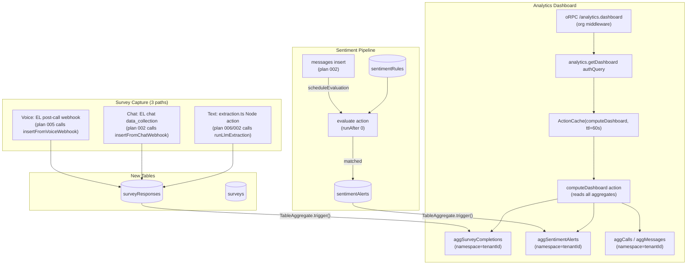

# feat: Surveys, Sentiment, Analytics (Aggregate)

## Overview

This plan covers the capture, storage, and aggregation layer for three related concerns that sit on top of the conversation substrate: **surveys** (structured question capture anchored to threads and calls), **sentiment rules + alerts** (rule-based flagging of conversations), and **platform analytics** (O(log n) counters/sums via `@convex-dev/aggregate`, with TTL-memoized dashboards via `@convex-dev/action-cache`). These collectively replace the legacy `surveyResponses`, `dailyAnalytics`, `companyStats`, `contactGroups`, and `analyticsCache` tables.

> **Verification status (2026-06-17):** This plan was reviewed against agent.io ground truth (`convex/{convex.config.ts,utils.ts}`, `src/server/rpc/{init.ts,contracts,routes}`, `src/server/ai/agents/routing.ts`, `src/server/convex/service`) and the official docs for the two not-yet-installed components. Corrected code sketches reflect the **real** `authQuery`/`authMutation` arg convention (plain zod-shape, not `{ z: ... }`), the real oRPC contract/router pattern (`base.route(...)` + `os.<path>.<proc>.handler()`), the real `@convex-dev/aggregate` `TableAggregate` API, the real `@convex-dev/action-cache` `ActionCache` API, and the Convex `"use node"` file-level constraint (Node actions must live in a separate file from queries/mutations). See `## Documentation & References`.

## Problem Frame

The legacy platform has three intertwined flaws this plan resolves:

1. **Survey capture is voice-only and synchronous.** `surveyResponses.callId` is the only anchor; text agents have no survey path. ElevenLabs `data_collection_results` arrives on the post-call webhook and is processed synchronously in-band, with no retry story.
2. **Analytics counters drift.** `dailyAnalytics` / `companyStats` / `contactGroups` are hand-maintained dual-writes — any missed mutation leaves totals stale. There is no O(log n) exact path; dashboards recount from full-table reads.
3. **Sentiment is ad hoc.** There is no structured `sentimentRules` / `sentimentAlerts` model; flagging logic is scattered across post-call processing and never surfaces on text conversations.

## Requirements Trace

- **R1** — `surveys` table: per-tenant definition (questions, type, triggers). CRUD via oRPC `org`/`adminOrg` middleware.
- **R2** — `surveyResponses` table: conversation-anchored (`threadId | callId`), `fromSequence`/`toSequence` slice, union `source` (`voice_data_collection | chat_data_collection | llm_extraction | manual`). Idempotent insert (logical key on `(surveyId, parentId, source, fromSequence)` enforced by a query-before-insert; Convex has no unique constraints, so idempotency is application-level — see Unit 1/2).
- **R3** — Voice capture path: ElevenLabs post-call webhook `data_collection_results` → `surveyResponse` (source=`voice_data_collection`). Triggered by plan 005 (EL post-call webhook).
- **R4** — Text LLM-extraction path: Convex **Node action** runs an `extractionAgent` over a slice of `messages` → `surveyResponse` (source=`llm_extraction`). Safe to call per batch completion or inbound trigger from plan 002/006.
- **R5** — `sentimentRules` + `sentimentAlerts` tables. Rules are per-tenant regex/keyword or LLM-scored thresholds. Alerts are append-only, linked to `callId` or `threadId`.
- **R6** — Sentiment evaluation action: evaluate rules against a thread or call after each message batch; insert `sentimentAlert` if matched.
- **R7** — `@convex-dev/aggregate` registered in `convex/convex.config.ts`; per-tenant **namespaced** `TableAggregate` instances for: call counts/durations, message counts, survey-completion counts, sentiment-alert counts. Maintained by `TableAggregate.trigger()` registered on a convex-helpers `Triggers` instance — no hand-rolled counters.
- **R8** — `@convex-dev/action-cache` for dashboard summary queries; TTL-memoized so repeated dashboard loads hit the cache, not a full aggregate scan.
- **R9** — oRPC routes (`org`/`adminOrg` middleware): surveys CRUD, surveyResponses list, sentimentRules CRUD, sentimentAlerts list, analytics dashboard.
- **R10** — `tenantId` required on every new table; RLS enforced via `authQuery`/`authMutation` from `convex/utils.ts` (WorkOS org claim injected as `ctx.org.organizationId`).

## Scope Boundaries

**In scope:**

- `surveys`, `surveyResponses`, `sentimentRules`, `sentimentAlerts` table definitions in `convex/schema.ts`
- `@convex-dev/aggregate` + `@convex-dev/action-cache` component registration
- Three survey capture paths (voice webhook, LLM extraction, manual)
- Sentiment evaluation action
- Aggregate maintenance via `TableAggregate.trigger()` on a shared `Triggers` instance
- oRPC contracts + route handlers for all new tables
- `@convex-dev/action-cache` dashboard memo

### Deferred to Separate Tasks

- ElevenLabs post-call webhook ingress handler body (plan 005 owns it; this plan provides the `convex/surveys.ts:insertFromVoiceWebhook` internal mutation that 005 calls).
- Batch completion hook that triggers LLM extraction (plan 006 owns when extraction fires post-batch).
- Polar usage event for survey completions (plan 007 owns metering).
- UI components (charts, survey builder, alert inbox) — frontend plan TBD.
- Per-tenant ElevenLabs `data_collection` configuration sync (plan 005).

## Context & Research

### Relevant Code and Patterns (repo-relative paths, verified)

| Path                                                                 | Role                                                                                                                                                                                                                                               |
| -------------------------------------------------------------------- | -------------------------------------------------------------------------------------------------------------------------------------------------------------------------------------------------------------------------------------------------- |
| `convex/schema.ts`                                                   | Currently `defineSchema({})` (base) — this plan adds 4 tables                                                                                                                                                                                      |
| `convex/convex.config.ts`                                            | Registers components via `app.use(...)` (currently `workOSAuthKit`, `resend`); add `aggregate` + `actionCache`                                                                                                                                     |
| `convex/utils.ts`                                                    | `authQuery` / `authMutation` (`zCustomQuery`/`zCustomMutation` from `convex-helpers/server/zod4`, WorkOS JWT) injecting `{ user, org }` into `ctx`; `org.organizationId` is the verified tenant id. All new domain fns use these.                  |
| `src/server/rpc/init.ts`                                             | `os` (contract-first `implement(contract).$context<RpcContextType>()`); middleware variants `auth` / `admin` / `org` / `adminOrg`. `org` adds `context.organizationId`; `adminOrg` requires admin role + active org.                               |
| `src/server/rpc/contracts/base.ts`                                   | `base = oc.errors(baseErrors)` — every contract starts from `base`, NOT raw `oc.router`                                                                                                                                                            |
| `src/server/rpc/contracts/index.ts`                                  | Assembles `contract = { health, workOs, ... }`; add `surveys`, `sentiment`, `analytics` here                                                                                                                                                       |
| `src/server/rpc/contracts/health.contract.ts`, `work-os.contract.ts` | Naming convention is `*.contract.ts`; a procedure is `base.route({...}).input(...).output(...)`                                                                                                                                                    |
| `src/server/rpc/routes/*.router.ts`                                  | Naming convention is `*.router.ts`; a router is `os.<contractPath>.router({ proc: <mw>.<path>.<proc>.handler(...) })` where `<mw>` ∈ `os/auth/org/admin/adminOrg`                                                                                  |
| `src/server/rpc/index.ts`                                            | `router = os.router({ health, workOs, ... })`; mount new routers here                                                                                                                                                                              |
| `src/server/convex/service/server.ts`                                | `convex = new ConvexHttpClient(convexUrl)`; `api` from `_generated/api` — the server-side Convex client                                                                                                                                            |
| `src/server/convex/service/service.ts`                               | `ConvexService` proxy (`.query`/`.mutation`/`invalidateCache`) with per-call cache — preferred call surface from routers                                                                                                                           |
| `src/server/ai/index.ts`                                             | Default model id is `'anthropic/claude-haiku-4.5'`; `gateway(model)` from `@ai-sdk/gateway`                                                                                                                                                        |
| `src/server/ai/agents/routing.ts`                                    | `routing({description, agent})` / `customRouting(...)` helpers wrapping a `ToolLoopAgent`; uses top-level `toUIMessageStream({ stream: result.stream })` + `readUIMessageStream` (the result-method `.toUIMessageStream()` is removed in beta.178) |

### Design-doc sections

- `rebuild-architecture.md §ERD` (`surveys`, `surveyResponses`, `sentimentRules`, `sentimentAlerts` — lines ~515-552)
- `rebuild-architecture.md` Table taxonomy: surveys = Setup/Config (actually a Document/Template definition); `surveyResponses`/`sentimentAlerts` = Ledger/Entry; `sentimentRules` = Setup/Config; analytics = Aggregate/Buffer → replaced by component
- `rebuild-architecture.md` Component table: `@convex-dev/aggregate` replaces `dailyAnalytics`/`companyStats`/`contactGroups`; `@convex-dev/action-cache` replaces `analyticsCache`
- `threads-model.md §7` (Survey capture: three paths; `fromSequence`/`toSequence` for model-B thread slicing; four-value source union; indexes `by_thread` / `by_call` / `by_survey_completed`)

### Reference patterns

- sunday pattern for LLM extraction agent: `/Users/angel/dev/sunday/sunday-ontology/apps/sunday/src/server/ai/agents/routing.ts` (clean `routing({description, agent})` — mirror it; no heavy ontology machinery). agent.io already adapted it at `src/server/ai/agents/routing.ts`.
- ontology heavy specials: `/Users/angel/dev/ontology/src/server/ai/agents` (do NOT copy the renderer/db-doctor machinery for extraction).
- `@convex-dev/aggregate`: https://www.convex.dev/components/aggregate · README https://github.com/get-convex/aggregate
- `@convex-dev/action-cache`: https://www.convex.dev/components/action-cache · README https://github.com/get-convex/action-cache
- `convex-helpers` Triggers: https://github.com/get-convex/convex-helpers/blob/main/packages/convex-helpers/README.md#triggers
- Convex runtimes (`"use node"` constraint): https://docs.convex.dev/functions/runtimes

## Key Technical Decisions

| Decision                                                                        | Rationale                                                                                                                                                                                                                                                                                                                                                                                                                                                                                                                      |
| ------------------------------------------------------------------------------- | ------------------------------------------------------------------------------------------------------------------------------------------------------------------------------------------------------------------------------------------------------------------------------------------------------------------------------------------------------------------------------------------------------------------------------------------------------------------------------------------------------------------------------ |
| **One `TableAggregate` instance per metric, each namespaced by `tenantId`**     | The real `@convex-dev/aggregate` API has no "named aggregator on one instance" concept. Each metric is a `new TableAggregate<{ Namespace: string; Key: ...; DataModel; TableName }>(components.aggregate, { namespace: (doc) => doc.tenantId, sortKey, sumValue? })`. To register **multiple** aggregate components, use named `app.use(aggregate, { name })` and pass `components.<name>`. `namespace` keeps each org's counters isolated and reads O(log n). Avoids the legacy counter-drift problem structurally.           |
| **LLM extraction is a Convex Node action in its OWN file, NOT in `surveys.ts`** | Convex `"use node"` is **file-level** and a `"use node"` file may NOT contain queries or mutations, and non-node files may not import a node file (https://docs.convex.dev/functions/runtimes). So the extraction action lives in `convex/extraction.ts` (`"use node"`), while `convex/surveys.ts` keeps all V8 queries/mutations. `streamText`/MCP-stdio in V8 is the known spike risk; `agent.generate()` (no tools, no stream) is lower-risk but still uses the Node runtime here for safety. Same pattern as plan 004/005. |
| **Survey capture paths are decoupled from ingress**                             | Voice (`insertFromVoiceWebhook`), chat (`insertFromChatWebhook`), and text (`runLlmExtraction`) are internal Convex fns called by their owning plans (005 voice, 002 chat/per-message, 006 batch). This plan owns the capture logic, not the trigger.                                                                                                                                                                                                                                                                          |
| **`sentimentRules` evaluation is async post-fact**                              | Rules are evaluated in a Convex action scheduled via `ctx.scheduler.runAfter(0, ...)` after a thread/call completes a message batch — NOT inline in the webhook path. Keeps ingress latency low and lets evaluation retry independently.                                                                                                                                                                                                                                                                                       |
| **`@convex-dev/action-cache` wraps the dashboard internal action**              | `new ActionCache(components.actionCache, { action: internal.analytics.computeDashboard, name, ttl })`; `cache.fetch(ctx, { tenantId })`. Dashboard reads sum across several aggregate instances; a 60s TTL makes repeated loads cache hits. Explicit invalidation via `cache.remove`/`removeAll` is optional given the short TTL.                                                                                                                                                                                              |
| **`fromSequence`/`toSequence` for model-B thread slices**                       | A long-running thread (model B) can produce multiple survey responses over its lifetime (`threads-model.md §7`: `1 thread : many responses`). The sequence range anchors each response to the exact `messages` slice that generated it.                                                                                                                                                                                                                                                                                        |

## Open Questions

### Resolved

- **Survey source union** — four values (`voice_data_collection`, `chat_data_collection`, `llm_extraction`, `manual`) cover all capture paths per `threads-model.md §7`. ✓
- **ElevenLabs `data_collection` field location** — top-level `data_collection_results` on the post-call webhook payload (not nested); per verified corrections. ✓ (Exact field parsing owned by plan 005.)
- **Convex V8 vs Node for AI extraction** — Node action required, in its own `convex/extraction.ts` file (file-level `"use node"`); flagged as spike in Unit 6. ✓
- **`authQuery` arg shape** — args are a **plain object of zod validators** (`args: { isActive: z.boolean().optional() }`), NOT `args: { z: z.object({...}) }`. Confirmed against `convex-helpers/server/zod4` and `convex/utils.ts`. ✓
- **Tenant id source** — `ctx.org.organizationId` inside `authQuery`/`authMutation`; `context.organizationId` inside oRPC `org`/`adminOrg` handlers. ✓

### Deferred to Implementation

- **Sentiment rule engine granularity** — regex + keyword rules are deterministic and cheap; LLM-scored rules add latency + cost. Initial build: regex/keyword only; LLM scoring later behind a feature flag.
- **Aggregate bucket granularity for time series** — daily vs hourly. `TableAggregate` `sortKey` can be a composite `[bucketDay, ...]`; start with totals + a day key.
- **Whether `contactGroups` is truly eliminated** — design doc says yes (→ aggregate); confirm no UI feature depends on a materialized group list before removing it from migration scope (plan 010).
- **VERIFY:** Exact `Key` type per aggregate (`number` total vs `[string, number]` for day-bucketed series) — finalize in Unit 4 after reading the installed `@convex-dev/aggregate` `.d.ts`.
- **VERIFY:** Whether to register `aggregate` once and reuse `components.aggregate` for every `TableAggregate`, or use named `app.use(aggregate, { name })` per metric. The README supports both; named instances avoid key-space collisions across tables. Decide in Unit 1 after reading the component's `convex.config` typing.

## Output Structure

```
convex/
  schema.ts                          # MODIFY — add surveys, surveyResponses, sentimentRules, sentimentAlerts
  convex.config.ts                   # MODIFY — register aggregate, actionCache (app.use)
  triggers.ts                        # CREATE — single Triggers<DataModel> instance + wrapped mutation builder (shared)
  surveys.ts                         # CREATE — V8 queries + mutations (surveys + surveyResponses); NO "use node"
  extraction.ts                      # CREATE — "use node" Node action: runLlmExtraction (AI SDK v7 ToolLoopAgent)
  sentiment.ts                       # CREATE — queries + mutations + scheduler mutation + evaluate action
  analytics.ts                       # CREATE — TableAggregate defs + maintenance + dashboard (action-cache wrapped)
src/server/rpc/
  contracts/
    surveys.contract.ts              # CREATE — oRPC contract: surveys CRUD + responses list
    sentiment.contract.ts            # CREATE — oRPC contract: rules CRUD + alerts list
    analytics.contract.ts            # CREATE — oRPC contract: dashboard query
    index.ts                         # MODIFY — add surveys/sentiment/analytics to `contract`
  routes/
    surveys.router.ts                # CREATE — route handlers
    sentiment.router.ts              # CREATE — route handlers
    analytics.router.ts              # CREATE — route handler
  index.ts                           # MODIFY — mount new routers in os.router({...})
```

## High-Level Technical Design



## Implementation Units

---

### Unit 1 — Schema + component registration + shared Triggers

**Goal:** Add the four new tables to `convex/schema.ts`, register `@convex-dev/aggregate` + `@convex-dev/action-cache`, and stand up the single `Triggers<DataModel>` instance that aggregate maintenance hooks onto.

**Requirements:** R1, R2, R5, R7, R10

**Dependencies:** Plan 001 (schema base, RLS, and — critically — the shared `Triggers` + trigger-wrapped mutation builder if 001 already owns it; otherwise this unit creates `convex/triggers.ts`). Confirm with plan 001 owner who owns `convex/triggers.ts` to avoid a double-definition.

**Files:**

- `convex/schema.ts` — Modify: add 4 table definitions
- `convex/convex.config.ts` — Modify: register `aggregate` + `actionCache`
- `convex/triggers.ts` — Create (or extend 001's): one `Triggers<DataModel>` + a `mutation`/`internalMutation` builder wrapped with `triggers.wrapDB`

**Approach:**

1. Add `surveys` (per-tenant definition): questions array, trigger config, status.
2. Add `surveyResponses` (Ledger/Entry): conversation-anchored with `threadId | callId`, sequence slice, four-value source union, responses array. **No DB-level unique index** (Convex has none) — idempotency is a query-before-insert on a logical key (`by_call` + `surveyId` filter, or `by_thread` + `surveyId`+`fromSequence`).
3. Add `sentimentRules` (Setup/Config): per-tenant keyword/regex rules with severity and match target.
4. Add `sentimentAlerts` (Ledger/Entry): append-only, linked to `callId` or `threadId`, matched rule, severity.
5. Register both components in `convex.config.ts` with `app.use(...)` (matching the existing `workOSAuthKit`/`resend` pattern).
6. Create `convex/triggers.ts` with one shared `Triggers<DataModel>` instance and a trigger-wrapped internal mutation builder; Unit 4 registers `TableAggregate.trigger()` callbacks on it.

**Technical design** (directional, not spec):

```ts
// convex/schema.ts — additions (tabs, single quotes per Biome)
surveys: defineTable({
	tenantId: v.string(),
	name: v.string(),
	description: v.optional(v.string()),
	questions: v.array(
		v.object({
			id: v.string(),
			text: v.string(),
			type: v.union(
				v.literal('text'),
				v.literal('scale'),
				v.literal('boolean'),
				v.literal('choice'),
			),
			options: v.optional(v.array(v.string())),
			required: v.optional(v.boolean()),
		}),
	),
	triggerOn: v.optional(
		v.union(
			v.literal('call_end'),
			v.literal('thread_end'),
			v.literal('manual'),
		),
	),
	isActive: v.boolean(),
	createdAt: v.number(),
	updatedAt: v.number(),
})
	.index('by_tenant', ['tenantId'])
	.index('by_tenant_active', ['tenantId', 'isActive']),

surveyResponses: defineTable({
	tenantId: v.string(),
	surveyId: v.id('surveys'),
	threadId: v.optional(v.id('threads')), // set for text conversations
	callId: v.optional(v.id('calls')), // set for voice conversations
	batchId: v.optional(v.id('batches')), // the campaign that drove it (if any)
	fromSequence: v.optional(v.number()), // message slice start (model-B threads)
	toSequence: v.optional(v.number()), // message slice end
	source: v.union(
		v.literal('voice_data_collection'),
		v.literal('chat_data_collection'),
		v.literal('llm_extraction'),
		v.literal('manual'),
	),
	responses: v.array(
		v.object({ questionId: v.string(), answer: v.any() }),
	),
	completedAt: v.number(),
})
	.index('by_thread', ['threadId'])
	.index('by_call', ['callId'])
	.index('by_survey_completed', ['surveyId', 'completedAt'])
	.index('by_tenant_completed', ['tenantId', 'completedAt'])
	.index('by_batch', ['batchId']),

sentimentRules: defineTable({
	tenantId: v.string(),
	name: v.string(),
	type: v.union(v.literal('keyword'), v.literal('regex')),
	pattern: v.string(), // keyword list (comma-sep) or regex string
	severity: v.union(
		v.literal('low'),
		v.literal('medium'),
		v.literal('high'),
	),
	matchOn: v.union(v.literal('user_messages'), v.literal('all_messages')),
	channels: v.optional(v.array(v.string())), // undefined = all channels
	isActive: v.boolean(),
	createdAt: v.number(),
})
	.index('by_tenant', ['tenantId'])
	.index('by_tenant_active', ['tenantId', 'isActive']),

sentimentAlerts: defineTable({
	tenantId: v.string(),
	ruleId: v.id('sentimentRules'),
	threadId: v.optional(v.id('threads')),
	callId: v.optional(v.id('calls')),
	matchedText: v.string(), // the excerpt that triggered it
	severity: v.string(),
	resolvedAt: v.optional(v.number()),
	createdAt: v.number(),
})
	.index('by_tenant_created', ['tenantId', 'createdAt'])
	.index('by_thread', ['threadId'])
	.index('by_call', ['callId'])
	.index('by_rule', ['ruleId']),
```

```ts
// convex/convex.config.ts — additions (matches existing app.use pattern)
import resend from '@convex-dev/resend/convex.config'
import workOSAuthKit from '@convex-dev/workos-authkit/convex.config'
import aggregate from '@convex-dev/aggregate/convex.config'
import actionCache from '@convex-dev/action-cache/convex.config'
import { defineApp } from 'convex/server'

const app = defineApp()
app.use(workOSAuthKit)
app.use(resend)
app.use(aggregate) // → components.aggregate
app.use(actionCache) // → components.actionCache
export default app
// VERIFY (Unit 4): if multiple aggregate instances collide in one key-space,
// switch to named registration: app.use(aggregate, { name: 'aggCalls' }) etc.
```

```ts
// convex/triggers.ts — shared Triggers instance (Unit 4 registers callbacks)
import { Triggers } from 'convex-helpers/server/triggers'
import {
	customCtx,
	customMutation,
} from 'convex-helpers/server/customFunctions'
import {
	internalMutation as rawInternalMutation,
	mutation as rawMutation,
} from './_generated/server'
import type { DataModel } from './_generated/dataModel'

export const triggers = new Triggers<DataModel>()

// Mutations built from these run all registered triggers atomically.
export const mutation = customMutation(rawMutation, customCtx(triggers.wrapDB))
export const internalMutation = customMutation(
	rawInternalMutation,
	customCtx(triggers.wrapDB),
)
// NOTE: authQuery/authMutation in convex/utils.ts wrap the RAW builders. For the
// aggregate-maintaining mutations in Unit 4 use THESE wrapped builders so
// TableAggregate.trigger() fires. Coordinate with plan 001 on a single canonical
// Triggers instance (do not create two).
```

**Patterns to follow:** existing `convex/schema.ts`, `convex/convex.config.ts` (`app.use`), `convex/utils.ts` (zod4 custom builders), convex-helpers Triggers README.

**Test scenarios:**

- `schema compiles → node_modules/.bin/tsc --noEmit emits zero new errors`
- `aggregate + actionCache registered → bunx convex dev does not throw component-not-found`
- `surveyResponse.threadId and callId both optional → validator accepts a voice-only row`
- `idempotent re-insert by (surveyId, callId, source) → query-before-insert returns existing _id (Unit 2 owns the logic; schema must support the index)`

**Verification:**

```
node_modules/.bin/tsc --noEmit
node_modules/.bin/biome check --write convex/schema.ts convex/convex.config.ts convex/triggers.ts
```

---

### Unit 2 — Convex domain functions: surveys + surveyResponses (V8 only)

**Goal:** Internal + public Convex queries and mutations for survey definitions and survey-response capture for the voice and chat paths + manual. (LLM extraction action is Unit 6's `convex/extraction.ts`, NOT here, because of the `"use node"` file constraint.)

**Requirements:** R1, R2, R3

**Dependencies:** Unit 1 (schema); Plan 001 (`authQuery`/`authMutation` from `convex/utils.ts`).

**Files:**

- `convex/surveys.ts` — Create: queries + mutations (V8 runtime; **no `"use node"`**)
- `convex/surveys.test.ts` — Create: vitest unit tests

**Approach:**

1. `authQuery` for listing surveys by tenant; `authMutation` for create/update/archive. Args are a plain zod-shape object.
2. `internal.surveys.insertFromVoiceWebhook` — `internalMutation` called by plan 005's post-call webhook; idempotent by query-before-insert on `by_call` filtered to `surveyId`.
3. `internal.surveys.insertFromChatWebhook` — `internalMutation` called by plan 002 for EL chat `data_collection`; idempotent by `by_thread` filtered to `(surveyId, source, fromSequence)`.
4. `internal.surveys.insertExtracted` — `internalMutation` called by `convex/extraction.ts` (Unit 6) to persist the extracted responses. (The Node action cannot write directly with all V8 conveniences, and keeping the insert here keeps writes in V8.)
5. `internal.surveys.getById` + `internal.messages.getSlice` (002 owns the latter) are read by the extraction action via `ctx.runQuery`.
6. Tenant scoping: public mutations validate `ctx.org.organizationId === survey.tenantId`; internal mutations take `tenantId` as an explicit arg (no session in internal context).

**Technical design** (directional — note the REAL `authQuery` arg shape and `ctx.db`/`ctx.org`):

```ts
// convex/surveys.ts  (V8 — NO 'use node')
import { v } from 'convex/values'
import { z } from 'zod'
import { internalMutation } from './_generated/server'
import { authQuery, authMutation } from './utils'

// public — list surveys for the requesting tenant
export const listSurveys = authQuery({
	args: { isActive: z.boolean().optional() }, // plain zod-shape, NOT { z: ... }
	handler: async (ctx, { isActive }) => {
		const tenantId = ctx.org.organizationId
		if (isActive !== undefined) {
			return ctx.db
				.query('surveys')
				.withIndex('by_tenant_active', (q) =>
					q.eq('tenantId', tenantId).eq('isActive', isActive),
				)
				.collect()
		}
		return ctx.db
			.query('surveys')
			.withIndex('by_tenant', (q) => q.eq('tenantId', tenantId))
			.collect()
	},
})

export const createSurvey = authMutation({
	args: {
		name: z.string(),
		description: z.string().optional(),
		questions: z.array(z.any()),
		triggerOn: z.enum(['call_end', 'thread_end', 'manual']).optional(),
	},
	handler: async (ctx, args) => {
		const now = Date.now()
		return ctx.db.insert('surveys', {
			tenantId: ctx.org.organizationId,
			isActive: true,
			createdAt: now,
			updatedAt: now,
			...args,
		})
	},
})

// internal — called by plan 005 EL post-call webhook
export const insertFromVoiceWebhook = internalMutation({
	args: {
		tenantId: v.string(),
		surveyId: v.id('surveys'),
		callId: v.id('calls'),
		dataCollectionResults: v.any(), // ElevenLabs raw payload (plan 005 parses shape)
	},
	handler: async (
		ctx,
		{ tenantId, surveyId, callId, dataCollectionResults },
	) => {
		// idempotency: skip if already inserted for this (surveyId, callId)
		const existing = await ctx.db
			.query('surveyResponses')
			.withIndex('by_call', (q) => q.eq('callId', callId))
			.filter((q) => q.eq(q.field('surveyId'), surveyId))
			.first()
		if (existing) return existing._id

		const responses = mapDataCollectionToResponses(dataCollectionResults)
		return ctx.db.insert('surveyResponses', {
			tenantId,
			surveyId,
			callId,
			source: 'voice_data_collection',
			responses,
			completedAt: Date.now(),
		})
	},
})

// internal — persists what the Unit 6 Node action extracted
export const insertExtracted = internalMutation({
	args: {
		tenantId: v.string(),
		surveyId: v.id('surveys'),
		threadId: v.id('threads'),
		fromSequence: v.number(),
		toSequence: v.number(),
		responses: v.array(v.object({ questionId: v.string(), answer: v.any() })),
	},
	handler: async (ctx, args) => {
		const existing = await ctx.db
			.query('surveyResponses')
			.withIndex('by_thread', (q) => q.eq('threadId', args.threadId))
			.filter((q) =>
				q.and(
					q.eq(q.field('surveyId'), args.surveyId),
					q.eq(q.field('fromSequence'), args.fromSequence),
				),
			)
			.first()
		if (existing) return existing._id
		return ctx.db.insert('surveyResponses', {
			...args,
			source: 'llm_extraction',
			completedAt: Date.now(),
		})
	},
})
```

**Patterns to follow:**

- `convex/utils.ts` `authQuery`/`authMutation` with zod4; args are a **plain zod-shape object**; tenant id is `ctx.org.organizationId`.
- Idempotency: query-before-insert on a logical key (Convex has no unique constraints).
- Keep this file V8-safe — the AI extraction lives in `convex/extraction.ts` (Unit 6).

**Test scenarios:**

- `insertFromVoiceWebhook → inserts response with source=voice_data_collection`
- `insertFromVoiceWebhook called twice with same (surveyId, callId) → returns existing _id, no duplicate`
- `listSurveys with isActive=true → returns only active surveys for the requesting tenant`
- `insertExtracted twice with same (surveyId, threadId, fromSequence) → no duplicate`
- `createSurvey → row carries tenantId = ctx.org.organizationId`

**Verification:**

```
node_modules/.bin/tsc --noEmit
node_modules/.bin/vp test run convex/surveys.test.ts
node_modules/.bin/biome check --write convex/surveys.ts
```

---

### Unit 3 — Convex domain functions: sentimentRules + sentimentAlerts

**Goal:** Internal + public Convex functions for sentiment rule management and asynchronous evaluation after message batches.

**Requirements:** R5, R6

**Dependencies:** Unit 1 (schema); Plan 001 (`authQuery`/`authMutation`); Plan 002 (messages table + a `messages.getForParent` read).

**Files:**

- `convex/sentiment.ts` — Create: queries + mutations + scheduler mutation + evaluation action
- `convex/sentiment.test.ts` — Create: vitest tests (pure `matchRule` + handler tests)

**Approach:**

1. `authQuery` for listing rules and alerts per tenant/thread/call.
2. `authMutation` for create/update/deactivate sentiment rules.
3. `internal.sentiment.scheduleEvaluation` — `internalMutation` that `ctx.scheduler.runAfter(0, internal.sentiment.evaluate, args)`, decoupling the message-insert hot path from evaluation.
4. `internal.sentiment.evaluate` — `internalAction` (V8 is fine; pure regex/keyword, no AI SDK) that loads active rules + messages via `ctx.runQuery`, runs `matchRule`, and inserts alerts via `ctx.runMutation(internal.sentiment.insertAlert, ...)`.
5. Pure `matchRule` helper (no Convex deps) for keyword (case-insensitive substring) + regex.

**Technical design** (directional):

```ts
// convex/sentiment.ts
import { v } from 'convex/values'
import { z } from 'zod'
import { internal } from './_generated/api'
import { internalAction, internalMutation } from './_generated/server'
import { authQuery } from './utils'

// public — list alerts for a thread or call (tenant-scoped)
export const listAlertsForParent = authQuery({
	args: {
		parentType: z.enum(['thread', 'call']),
		parentId: z.string(),
	},
	handler: async (ctx, { parentType, parentId }) => {
		const tenantId = ctx.org.organizationId
		const rows =
			parentType === 'thread'
				? await ctx.db
						.query('sentimentAlerts')
						.withIndex('by_thread', (q) =>
							q.eq('threadId', parentId as Id<'threads'>),
						)
						.collect()
				: await ctx.db
						.query('sentimentAlerts')
						.withIndex('by_call', (q) =>
							q.eq('callId', parentId as Id<'calls'>),
						)
						.collect()
		return rows.filter((r) => r.tenantId === tenantId)
	},
})

// internal — called by plan 002 after a message batch, or by 005 post-call
export const scheduleEvaluation = internalMutation({
	args: {
		tenantId: v.string(),
		parentType: v.union(v.literal('thread'), v.literal('call')),
		parentId: v.string(),
	},
	handler: async (ctx, args) => {
		await ctx.scheduler.runAfter(0, internal.sentiment.evaluate, args)
	},
})

export const evaluate = internalAction({
	args: {
		tenantId: v.string(),
		parentType: v.union(v.literal('thread'), v.literal('call')),
		parentId: v.string(),
	},
	handler: async (ctx, { tenantId, parentType, parentId }) => {
		const [rules, messages] = await Promise.all([
			ctx.runQuery(internal.sentiment.getActiveRules, { tenantId }),
			ctx.runQuery(internal.messages.getForParent, { parentType, parentId }), // plan 002 owns
		])
		for (const rule of rules) {
			const targets = messages.filter((m: { role: string }) =>
				rule.matchOn === 'all_messages' ? true : m.role === 'user',
			)
			const matched = matchRule(rule, targets)
			if (matched) {
				await ctx.runMutation(internal.sentiment.insertAlert, {
					tenantId,
					ruleId: rule._id,
					...(parentType === 'thread'
						? { threadId: parentId as Id<'threads'> }
						: { callId: parentId as Id<'calls'> }),
					matchedText: matched.excerpt,
					severity: rule.severity,
				})
			}
		}
	},
})

// pure helper — no Convex deps; unit-testable
export function matchRule(
	rule: { type: 'keyword' | 'regex'; pattern: string },
	messages: { text?: string }[],
) {
	for (const msg of messages) {
		if (!msg.text) continue
		const hit =
			rule.type === 'keyword'
				? rule.pattern
						.split(',')
						.some((kw) =>
							msg.text!.toLowerCase().includes(kw.trim().toLowerCase()),
						)
				: new RegExp(rule.pattern, 'i').test(msg.text)
		if (hit) return { excerpt: msg.text.slice(0, 200) }
	}
	return null
}
```

**Patterns to follow:**

- `ctx.scheduler.runAfter(0, internal.fn, args)` for fire-and-forget async (keeps ingress fast).
- Pure `matchRule` testable without Convex context.
- `authQuery` arg shape is a plain zod-shape; tenant id is `ctx.org.organizationId`.

**Test scenarios:**

- `matchRule keyword → matches substring case-insensitively`
- `matchRule regex → matches regex pattern`
- `evaluate with 2 active rules, 1 matching → inserts exactly 1 alert`
- `evaluate with no matching rules → inserts 0 alerts`
- `listAlertsForParent → returns only alerts for the requested thread, scoped to tenant`

**Verification:**

```
node_modules/.bin/tsc --noEmit
node_modules/.bin/vp test run convex/sentiment.test.ts
node_modules/.bin/biome check --write convex/sentiment.ts
```

---

### Unit 4 — Aggregate maintenance + dashboard action (action-cache)

**Goal:** Define per-tenant-namespaced `TableAggregate` instances for key metrics, maintain them via `TableAggregate.trigger()` on the shared `Triggers` instance, and expose a TTL-memoized dashboard summary via `@convex-dev/action-cache`.

**Requirements:** R7, R8

**Dependencies:** Unit 1 (schema + component registration + `convex/triggers.ts`); Plans 002/005/006 (the mutations that insert `messages`/`calls`/`surveyResponses`/`sentimentAlerts` must be built from the trigger-wrapped mutation builder in `convex/triggers.ts`, or the triggers won't fire).

**Files:**

- `convex/analytics.ts` — Create: `TableAggregate` defs + dashboard internal action + `ActionCache` + public `getDashboard` authQuery
- `convex/triggers.ts` — Modify: register `aggregate.trigger()` for each table
- `convex/analytics.test.ts` — Create: vitest tests

**Approach:**

1. Define one `TableAggregate` per metric, each namespaced by `tenantId`:
   - `aggCalls` on `calls` — `sortKey: (d) => d.createdAt`, count = number of calls.
   - `aggCallDuration` on `calls` — `sumValue: (d) => d.durationMs ?? 0`.
   - `aggMessages` on `messages` — count of turns.
   - `aggSurveyCompletions` on `surveyResponses` — count of responses.
   - `aggSentimentAlerts` on `sentimentAlerts` — count of alerts (optionally `sortKey: [severity, createdAt]` for per-severity prefix counts).
     (`aggCalls` and `aggCallDuration` can be a SINGLE instance on `calls` with both `sortKey` + `sumValue`; split only if key spaces differ.)
2. Register each instance's `.trigger()` on the shared `Triggers` in `convex/triggers.ts`. The trigger keeps the aggregate in sync on insert/replace/delete automatically.
3. `internal.analytics.computeDashboard` reads totals via `count`/`sum` with `{ namespace: tenantId }` and returns a typed summary.
4. Wrap `computeDashboard` in `ActionCache` (ttl=60s). Public `getDashboard` authQuery calls `cache.fetch(ctx, { tenantId: ctx.org.organizationId })`.
5. **V8 note:** `@convex-dev/aggregate` and `@convex-dev/action-cache` are pure Convex components (no AI SDK) — V8-safe. No `"use node"`.

**Technical design** (directional — REAL `TableAggregate` + `ActionCache` API):

```ts
// convex/analytics.ts
import { TableAggregate } from '@convex-dev/aggregate'
import { ActionCache } from '@convex-dev/action-cache'
import { components, internal } from './_generated/api'
import { internalAction } from './_generated/server'
import { authQuery } from './utils'
import type { DataModel } from './_generated/dataModel'

// calls: count + total duration (namespace per tenant)
export const aggCalls = new TableAggregate<{
	Namespace: string
	Key: number
	DataModel: DataModel
	TableName: 'calls'
}>(components.aggregate, {
	namespace: (doc) => doc.tenantId,
	sortKey: (doc) => doc.createdAt,
	sumValue: (doc) => doc.durationMs ?? 0,
})

export const aggMessages = new TableAggregate<{
	Namespace: string
	Key: number
	DataModel: DataModel
	TableName: 'messages'
}>(components.aggregate, {
	namespace: (doc) => doc.tenantId,
	sortKey: (doc) => doc.createdAt,
})

export const aggSurveyCompletions = new TableAggregate<{
	Namespace: string
	Key: number
	DataModel: DataModel
	TableName: 'surveyResponses'
}>(components.aggregate, {
	namespace: (doc) => doc.tenantId,
	sortKey: (doc) => doc.completedAt,
})

export const aggSentimentAlerts = new TableAggregate<{
	Namespace: string
	Key: [string, number] // [severity, createdAt] → enables per-severity prefix count
	DataModel: DataModel
	TableName: 'sentimentAlerts'
}>(components.aggregate, {
	namespace: (doc) => doc.tenantId,
	sortKey: (doc) => [doc.severity, doc.createdAt],
})

// internal action that reads aggregates → typed summary
export const computeDashboard = internalAction({
	args: { tenantId: v.string() },
	handler: async (ctx, { tenantId }) => {
		const [calls, durationMs, messages, surveys, alerts] = await Promise.all([
			aggCalls.count(ctx, { namespace: tenantId }),
			aggCalls.sum(ctx, { namespace: tenantId }),
			aggMessages.count(ctx, { namespace: tenantId }),
			aggSurveyCompletions.count(ctx, { namespace: tenantId }),
			aggSentimentAlerts.count(ctx, { namespace: tenantId }),
		])
		return { calls, durationMs, messages, surveys, alerts }
	},
})

// TTL-memoized dashboard (60s)
const dashboardCache = new ActionCache(components.actionCache, {
	action: internal.analytics.computeDashboard,
	name: 'dashboardSummaryV1',
	ttl: 60_000,
})

export const getDashboard = authQuery({
	args: {},
	handler: async (ctx) => {
		// NOTE: ActionCache.fetch needs an action ctx. If authQuery's ctx is a
		// query ctx, expose getDashboard as an authAction (utils may need an
		// authAction builder) OR call cache.fetch from an action invoked by the
		// oRPC route. VERIFY which ctx ActionCache.fetch requires against the
		// installed .d.ts; query ctx cannot run actions.
		return dashboardCache.fetch(ctx as never, {
			tenantId: ctx.org.organizationId,
		})
	},
})
```

```ts
// convex/triggers.ts — register aggregate triggers (extends Unit 1's instance)
import {
	aggCalls,
	aggMessages,
	aggSurveyCompletions,
	aggSentimentAlerts,
} from './analytics'
import { triggers } from './triggers' // same module; shown for clarity

triggers.register('calls', aggCalls.trigger())
triggers.register('messages', aggMessages.trigger())
triggers.register('surveyResponses', aggSurveyCompletions.trigger())
triggers.register('sentimentAlerts', aggSentimentAlerts.trigger())
// Any mutation that inserts/updates/deletes these tables MUST be built from the
// trigger-wrapped `mutation`/`internalMutation` in convex/triggers.ts, or the
// aggregate will not update. Coordinate with plans 002/005/006.
```

**Patterns to follow:**

- `@convex-dev/aggregate` `TableAggregate` namespace-per-tenant + `.trigger()` registration (README).
- convex-helpers `Triggers` + `wrapDB` (single shared instance).
- `@convex-dev/action-cache` `new ActionCache(component, { action, name, ttl })` + `cache.fetch(ctx, args)`.

**Test scenarios:**

- `inserting a call via wrapped mutation → aggCalls.count for that tenant increments`
- `call with durationMs → aggCalls.sum increments by durationMs`
- `computeDashboard for tenant A → excludes tenant B's counts (namespace isolation)`
- `getDashboard → second call within 60s returns cached value (computeDashboard not re-invoked)`
- `deleting a surveyResponse via wrapped mutation → aggSurveyCompletions.count decrements`

**Verification:**

```
node_modules/.bin/tsc --noEmit
node_modules/.bin/vp test run convex/analytics.test.ts
node_modules/.bin/biome check --write convex/analytics.ts convex/triggers.ts
```

---

### Unit 5 — oRPC contracts + route handlers

**Goal:** Expose surveys, sentiment rules/alerts, and analytics dashboard via oRPC using the `org`/`adminOrg` middleware (organizationId always `context.organizationId`, never client input).

**Requirements:** R1, R5, R9

**Dependencies:** Unit 2 (`convex/surveys.ts`), Unit 3 (`convex/sentiment.ts`), Unit 4 (`convex/analytics.ts`); `src/server/rpc/init.ts` (`os`/`org`/`adminOrg`); `src/server/convex/service` (server Convex client).

**Files:**

- `src/server/rpc/contracts/surveys.contract.ts` — Create
- `src/server/rpc/contracts/sentiment.contract.ts` — Create
- `src/server/rpc/contracts/analytics.contract.ts` — Create
- `src/server/rpc/contracts/index.ts` — Modify: add to `contract`
- `src/server/rpc/routes/surveys.router.ts` — Create
- `src/server/rpc/routes/sentiment.router.ts` — Create
- `src/server/rpc/routes/analytics.router.ts` — Create
- `src/server/rpc/index.ts` — Modify: mount in `os.router({...})`

**Approach:**

1. Contracts start from `base` (`base.route({ method, path, tags, summary }).input(z...).output(z...)`), grouped into an object, and registered in `contracts/index.ts`. **No raw `oc.router`** — the existing pattern groups procedures in plain object literals and uses `os.<path>.router(...)` on the implementer side.
2. Route handlers use `org` for reads (any active member) and `adminOrg` for create/update/delete of rules and survey definitions. The active org is `context.organizationId` (never input).
3. Handlers call Convex through the server client — prefer the `ConvexService` proxy (`src/server/convex/service`) or `convex.query/mutation(api.<module>.<fn>, args)` from `src/server/convex/service/server.ts`. Because `listSurveys`/`listAlertsForParent` are `authQuery`s that read `ctx.org.organizationId` from the WorkOS JWT, the server client must forward the caller's auth token (VERIFY the token-forwarding path: `ConvexHttpClient.setAuth(token)` with the session access token before calling the authQuery; otherwise expose `internal` variants that take an explicit `tenantId` and call those from the router with `context.organizationId`).
4. Survey response ingestion (voice/chat/llm) is **internal** — no public oRPC endpoint; triggered by plans 002/005/006 via Convex internal fns.

**Technical design** (directional — REAL contract + router shape):

```ts
// src/server/rpc/contracts/surveys.contract.ts
import { z } from 'zod'
import { base } from './base'

export const surveySchema = z.object({
	_id: z.string(),
	name: z.string(),
	isActive: z.boolean(),
	questions: z.array(
		z.object({
			id: z.string(),
			text: z.string(),
			type: z.enum(['text', 'scale', 'boolean', 'choice']),
		}),
	),
})

export const createSurveyInput = z.object({
	name: z.string(),
	questions: z.array(z.any()),
})

export const surveysContract = {
	list: base
		.route({ method: 'GET', path: '/surveys', tags: ['Surveys'] })
		.output(z.array(surveySchema)),
	create: base
		.route({ method: 'POST', path: '/surveys', tags: ['Surveys'] })
		.input(createSurveyInput)
		.output(surveySchema),
	responses: base
		.route({
			method: 'GET',
			path: '/surveys/{id}/responses',
			tags: ['Surveys'],
		})
		.input(z.object({ id: z.string(), limit: z.number().optional() }))
		.output(z.array(z.any())),
}
```

```ts
// src/server/rpc/contracts/index.ts (MODIFY)
import { analyticsContract } from './analytics.contract'
import { healthContract } from './health.contract'
import { sentimentContract } from './sentiment.contract'
import { surveysContract } from './surveys.contract'
import { workOsContract } from './work-os.contract'

export const contract = {
	health: healthContract,
	workOs: workOsContract,
	surveys: surveysContract,
	sentiment: sentimentContract,
	analytics: analyticsContract,
}
export type AppContract = typeof contract
```

```ts
// src/server/rpc/routes/surveys.router.ts
import { adminOrg, org, os } from '@server/rpc/init'
import { convex, api } from '@server/convex/service/server'

export const surveysRouter = os.surveys.router({
	list: org.surveys.list.handler(async ({ context }) => {
		// VERIFY token forwarding for authQuery; else use an internal variant
		// that takes tenantId = context.organizationId.
		return convex.query(api.surveys.listSurveys, {})
	}),
	create: adminOrg.surveys.create.handler(async ({ context, input }) => {
		return convex.mutation(api.surveys.createSurvey, input)
	}),
	responses: org.surveys.responses.handler(async ({ context, input }) => {
		return convex.query(api.surveys.listResponses, {
			surveyId: input.id,
			limit: input.limit,
		})
	}),
})
```

```ts
// src/server/rpc/index.ts (MODIFY)
const router = os.router({
	health: healthRouter,
	workOs: workOsRouter,
	surveys: surveysRouter,
	sentiment: sentimentRouter,
	analytics: analyticsRouter,
})
```

**Patterns to follow:**

- `src/server/rpc/contracts/{base,health.contract,work-os.contract}.ts` for contract shape (`base.route(...)`, named exported input schemas).
- `src/server/rpc/routes/work-os.router.ts` for `os.<path>.router({ proc: <mw>.<path>.<proc>.handler(...) })`, middleware imported from `init`, `context.organizationId` for tenant.
- `src/server/convex/service/{server,service}.ts` for the server Convex client.

**Test scenarios:**

- `surveys.list with valid org session → returns only that tenant's surveys`
- `surveys.create without admin role → throws NO_ADMIN_ROLE (adminOrg gate)`
- `sentiment alerts for a thread owned by a different tenant → empty (RLS)`
- `analytics.dashboard → returns typed summary with all expected keys`
- `surveys.responses → filters by surveyId + tenant, respects limit`

**Verification:**

```
node_modules/.bin/tsc --noEmit
node_modules/.bin/vp test run src/server/rpc/routes/surveys.router.test.ts
node_modules/.bin/vp test run src/server/rpc/routes/analytics.router.test.ts
node_modules/.bin/biome check --write src/server/rpc/contracts/surveys.contract.ts src/server/rpc/routes/surveys.router.ts
```

---

### Unit 6 — LLM extraction Node action + V8 runtime spike

**Goal:** Implement the text survey-extraction path as a Convex **Node action** in its OWN file (`convex/extraction.ts`, file-level `"use node"`), using AI SDK v7-beta `ToolLoopAgent.generate()`, and validate it end-to-end on a deployed instance, documenting the fallback if the Node runtime fails.

**Requirements:** R4; cross-cutting V8 risk flagged in brief

**Dependencies:** Unit 2 (`internal.surveys.insertExtracted`, `internal.surveys.getById`); Plan 002 (`internal.messages.getSlice`); deployed Convex instance.

**Files:**

- `convex/extraction.ts` — Create: `"use node"` file containing `runLlmExtraction` internal action ONLY (no queries/mutations — file-constraint)
- `convex/extraction.test.ts` — Create: unit test for the pure mapping helpers + a smoke harness
- `docs/plans/spikes/2026-06-17-spike-convex-node-action-ai-sdk-v7.md` — Create: spike notes (if fallback needed)

**Approach:**

1. `convex/extraction.ts` begins with `'use node'` and exports only `runLlmExtraction` (`internalAction`). It reads survey + message slice via `ctx.runQuery`, runs a tool-less `ToolLoopAgent`, maps output, and writes via `ctx.runMutation(internal.surveys.insertExtracted, ...)`.
2. Model: `gateway('anthropic/claude-haiku-4.5')` — note the dot (`4.5`), matching `src/server/ai/index.ts` / `constants.ts`. `gateway` from `@ai-sdk/gateway`.
3. `ToolLoopAgent` from `ai` (v7-beta): `new ToolLoopAgent({ id, model, instructions })`, then `await agent.generate({ prompt })` → `result.text`. No tools, no stream, so `toUIMessageStream`/streaming risk does not apply.
4. **Spike:** deploy to staging, invoke via `bunx convex run extraction:runLlmExtraction '{...}'`. If it works, close. If the Node runtime fails (cold-start/import/env), fall back to a TanStack Start server fn calling `convex.mutation(api.surveys.insertExtracted, ...)`.
5. Pure helpers `buildExtractionPrompt(survey)` and `parseExtractionResult(text, questions)` are unit-testable without Convex/AI.

**Technical design** (directional):

```ts
// convex/extraction.ts
'use node' // FILE-LEVEL — this file may contain ONLY actions (no query/mutation)

import { ToolLoopAgent } from 'ai'
import { gateway } from '@ai-sdk/gateway'
import { v } from 'convex/values'
import { internal } from './_generated/api'
import { internalAction } from './_generated/server'

export const runLlmExtraction = internalAction({
	args: {
		tenantId: v.string(),
		surveyId: v.id('surveys'),
		threadId: v.id('threads'),
		fromSequence: v.number(),
		toSequence: v.number(),
	},
	handler: async (ctx, args) => {
		const [survey, messages] = await Promise.all([
			ctx.runQuery(internal.surveys.getById, { surveyId: args.surveyId }),
			ctx.runQuery(internal.messages.getSlice, {
				// plan 002 owns getSlice
				threadId: args.threadId,
				fromSequence: args.fromSequence,
				toSequence: args.toSequence,
			}),
		])
		if (!survey) return
		const agent = new ToolLoopAgent({
			id: 'survey-extractor',
			model: gateway('anthropic/claude-haiku-4.5'), // dot, not dash
			instructions: buildExtractionPrompt(survey),
		})
		const result = await agent.generate({
			prompt: messages
				.map(
					(m: { role: string; text?: string }) => `${m.role}: ${m.text ?? ''}`,
				)
				.join('\n'),
		})
		const responses = parseExtractionResult(result.text, survey.questions)
		await ctx.runMutation(internal.surveys.insertExtracted, {
			tenantId: args.tenantId,
			surveyId: args.surveyId,
			threadId: args.threadId,
			fromSequence: args.fromSequence,
			toSequence: args.toSequence,
			responses,
		})
	},
})
```

```ts
// FALLBACK (only if Node action fails): src/server/ai/extract-survey.ts
import { ToolLoopAgent } from 'ai'
import { gateway } from '@ai-sdk/gateway'
import { convex, api } from '@server/convex/service/server'

export async function extractSurveyFromMessages(opts: {
	survey: { _id: string; questions: unknown[] }
	messages: { role: string; text?: string }[]
	tenantId: string
	threadId: string
	fromSequence: number
	toSequence: number
}) {
	const agent = new ToolLoopAgent({
		id: 'survey-extractor',
		model: gateway('anthropic/claude-haiku-4.5'),
		instructions: buildExtractionPrompt(opts.survey),
	})
	const result = await agent.generate({
		prompt: opts.messages.map((m) => `${m.role}: ${m.text ?? ''}`).join('\n'),
	})
	const responses = parseExtractionResult(result.text, opts.survey.questions)
	await convex.mutation(api.surveys.insertExtracted, {
		tenantId: opts.tenantId,
		surveyId: opts.survey._id,
		threadId: opts.threadId,
		fromSequence: opts.fromSequence,
		toSequence: opts.toSequence,
		responses,
	})
	// Tradeoff: loses Convex scheduler retry; gains a full Node environment.
}
```

**Test scenarios:**

- `runLlmExtraction Node action → completes without runtime error on a deployed instance`
- `parseExtractionResult → produces ≥1 mapped response per question for a populated transcript`
- `runLlmExtraction V8/Node failure → fallback server fn produces identical insert`
- `convex/extraction.ts contains no query/mutation → convex dev does not reject the "use node" file`

**Verification:**

```
node_modules/.bin/tsc --noEmit
node_modules/.bin/vp test run convex/extraction.test.ts
# manual smoke (staging):
bunx convex run extraction:runLlmExtraction '{"tenantId":"org_test","surveyId":"...","threadId":"...","fromSequence":0,"toSequence":5}'
```

---

## System-Wide Impact

| Area                                              | Impact                                                                                                                                                                                                                                 |
| ------------------------------------------------- | -------------------------------------------------------------------------------------------------------------------------------------------------------------------------------------------------------------------------------------- |
| `convex/schema.ts`                                | +4 tables; no breaking change to base schema                                                                                                                                                                                           |
| `convex/convex.config.ts`                         | +2 `app.use` registrations; affects deployment manifest                                                                                                                                                                                |
| `convex/triggers.ts`                              | New shared `Triggers` instance + wrapped mutation builders; **all mutations touching `calls`/`messages`/`surveyResponses`/`sentimentAlerts` must use these builders** for aggregates to update — coordinate with plans 001/002/005/006 |
| Plan 001 (foundations)                            | Owns or co-owns `convex/triggers.ts`; Unit 4's `.trigger()` registrations depend on it being a single canonical instance                                                                                                               |
| Plan 002 (message ingress)                        | Calls `internal.sentiment.scheduleEvaluation` after a message batch; provides `internal.messages.getSlice` / `getForParent`; inserts via the wrapped mutation builder                                                                  |
| Plan 005 (EL post-call webhook)                   | Calls `internal.surveys.insertFromVoiceWebhook`; inserts `calls`/`messages` via the wrapped builder                                                                                                                                    |
| Plan 006 (batch dialing)                          | Calls `internal.extraction.runLlmExtraction` on batch completion for text campaigns                                                                                                                                                    |
| Plan 007 (billing)                                | `aggSurveyCompletions` can feed a Polar meter event if surveyed conversations become billable (Polar metering via raw `@polar-sh/sdk` in an action — plan 007)                                                                         |
| oRPC `src/server/rpc/{contracts,routes,index}.ts` | +3 contracts in `contract`, +3 routers in `os.router({...})`; no conflict with health/workOs                                                                                                                                           |

## Risks & Dependencies

| Risk                                                                           | Severity             | Mitigation                                                                                                                                                                                                                                                             |
| ------------------------------------------------------------------------------ | -------------------- | ---------------------------------------------------------------------------------------------------------------------------------------------------------------------------------------------------------------------------------------------------------------------- |
| `TableAggregate` constructor/`namespace`/`Key` shape differs from sketch       | Medium               | Read installed `@convex-dev/aggregate` `.d.ts` before Unit 4; the README API (`new TableAggregate<{Namespace,Key,DataModel,TableName}>(components.aggregate, {namespace,sortKey,sumValue})`, `count/sum(ctx,{namespace,bounds})`, `.trigger()`) is the source of truth |
| `ActionCache.fetch` requires an action ctx, but `getDashboard` is an authQuery | Medium               | A query ctx cannot run actions. Either add an `authAction` builder to `convex/utils.ts` and expose `getDashboard` as an action, or call `cache.fetch` from an action the oRPC route invokes. VERIFY against installed `.d.ts` in Unit 4                                |
| Triggers not wired (mutations bypass wrapped builder)                          | High                 | Aggregates silently drift if a mutation uses the raw builder. Enforce via a single `convex/triggers.ts` export and code-review; coordinate with plan 001                                                                                                               |
| `"use node"` file constraint violated (action + query/mutation in one file)    | High (now mitigated) | Extraction action lives in `convex/extraction.ts` (Unit 6), separate from `convex/surveys.ts`; non-node files must not import the node file (https://docs.convex.dev/functions/runtimes)                                                                               |
| V8/Node runtime incompatibility with AI SDK v7-beta in a Convex action         | Medium               | Unit 6 is an explicit spike; tool-less `agent.generate()` is low-risk; fallback server fn documented                                                                                                                                                                   |
| authQuery token forwarding from oRPC server client                             | Medium               | `listSurveys`/`listAlertsForParent` read `ctx.org.organizationId` from the WorkOS JWT; the server `ConvexHttpClient` must `setAuth(accessToken)` OR the router calls `internal` variants passing `context.organizationId`. VERIFY in Unit 5                            |
| ElevenLabs `data_collection_results` shape changes                             | Low                  | Parse via a typed Zod schema at the boundary (plan 005); malformed payloads logged + skipped (no throw)                                                                                                                                                                |
| LLM extraction cost per text conversation                                      | Medium               | `anthropic/claude-haiku-4.5` (cheapest); async + optional per survey config; tenant feature flag                                                                                                                                                                       |
| `sentimentRules` regex DoS (catastrophic backtracking)                         | Medium               | Validate regex at create-time; reject patterns failing a guarded validator                                                                                                                                                                                             |

## Documentation & References

### External dependencies introduced by this plan

| Dependency                 | Install command (verified)                                                                              | Canonical docs                                                                                     |
| -------------------------- | ------------------------------------------------------------------------------------------------------- | -------------------------------------------------------------------------------------------------- |
| `@convex-dev/aggregate`    | `bun add @convex-dev/aggregate` (registry name verified via README `npm install @convex-dev/aggregate`) | https://www.convex.dev/components/aggregate · README https://github.com/get-convex/aggregate       |
| `@convex-dev/action-cache` | `bun add @convex-dev/action-cache`                                                                      | https://www.convex.dev/components/action-cache · README https://github.com/get-convex/action-cache |

Both are **not yet installed** in `agent.io/node_modules` (verified 2026-06-17). After install, register in `convex/convex.config.ts` via `app.use(...)` and re-run `bunx convex dev` to codegen `components.aggregate` / `components.actionCache`.

### Verified API surfaces (inline-cited above)

- **`@convex-dev/aggregate`** (README): `import aggregate from '@convex-dev/aggregate/convex.config'`; `app.use(aggregate)` (or named `{ name }`); `new TableAggregate<{Namespace?,Key,DataModel,TableName}>(components.aggregate, { namespace, sortKey, sumValue? })`; write ops `aggregate.insert(ctx, doc)` / `replace(ctx, oldDoc, newDoc)` / `delete(ctx, oldDoc)`; read ops `count(ctx, { namespace?, bounds?, prefix? })` / `sum(ctx, { namespace?, bounds? })` / `at` / `indexOf` / `max`; Triggers integration `triggers.register('table', aggregate.trigger())` + `customMutation(rawMutation, customCtx(triggers.wrapDB))`; idempotent variants `insertIfDoesNotExist` / `replaceOrInsert` / `deleteIfExists` for migrations. — Used in Unit 4.
- **`@convex-dev/action-cache`** (README): `import cache from '@convex-dev/action-cache/convex.config'`; `app.use(cache)`; `new ActionCache(components.actionCache, { action, name?, ttl? })`; `cache.fetch(ctx, args)`; invalidation `cache.remove(ctx, args)` / `removeAllForName(ctx)` / `removeAll(ctx)`; only successful results cached; daily cron cleans expired entries. — Used in Unit 4.
- **convex-helpers Triggers** (installed `convex-helpers/server/triggers`): `new Triggers<DataModel>()`; `triggers.register(table, async (ctx, change) => {...})` where `change` is `{ operation: 'insert'|'update'|'delete', id, newDoc, oldDoc }`; `triggers.wrapDB` for `customCtx`. — Unit 1/4. Docs: https://github.com/get-convex/convex-helpers
- **Convex runtimes / `"use node"`**: file-level directive; a `"use node"` file may contain only actions (no queries/mutations); non-node files may not import node files. — Unit 6. Docs: https://docs.convex.dev/functions/runtimes
- **AI SDK v7-beta `ai`** (installed 7.0.0-beta.178): `new ToolLoopAgent({ id, model, instructions, tools?, reasoning? })`, `await agent.generate({ prompt })` → `result.text`; `tool({ description, inputSchema, execute })`; streaming helpers `toUIMessageStream({ stream: result.stream })` (top-level), `readUIMessageStream`, `createAgentUIStreamResponse`; `isStepCount(n)`; `convertToModelMessages()` is async. The result-method `.toUIMessageStream()` is REMOVED in beta.178. — Unit 6.
- **`@ai-sdk/gateway`** (installed 4.0.0-beta.109): `gateway(modelId)`; model id `'anthropic/claude-haiku-4.5'` (dot) per `src/server/ai/index.ts` + `constants.ts`. — Unit 6.

### Design-doc sections & reference repos the units build on

- `docs/threads-model.md §7` — survey capture paths, `fromSequence`/`toSequence`, four-value source union, indexes (`by_thread` / `by_call` / `by_survey_completed`). → Units 1, 2, 6.
- `docs/rebuild-architecture.md` — ERD (`surveys`/`surveyResponses`/`sentimentRules`/`sentimentAlerts`, lines ~515-552), table taxonomy (Ledger/Entry, Setup/Config, Aggregate/Buffer), component table (`@convex-dev/aggregate` ↔ `dailyAnalytics`/`companyStats`/`contactGroups`; `@convex-dev/action-cache` ↔ `analyticsCache`). → Units 1, 4.
- agent.io code: `convex/utils.ts` (authQuery/authMutation), `convex/convex.config.ts` (app.use), `src/server/rpc/{init,contracts/base,contracts/index,contracts/work-os.contract,routes/work-os.router,index}.ts` (oRPC contract+router pattern), `src/server/convex/service/{server,service}.ts` (server Convex client), `src/server/ai/{index.ts,constants.ts,agents/routing.ts}` (gateway + model id + ToolLoopAgent). → Units 2, 3, 4, 5, 6.
- Reference repos: `/Users/angel/dev/sunday/sunday-ontology/apps/sunday/src/server/ai/agents/routing.ts` (clean routing helper to mirror for extraction); `/Users/angel/dev/ontology/src/server/ai/agents` (heavy specials — do NOT copy for extraction). → Unit 6.

### Sibling plans

- `2026-06-17-001-feat-convex-foundations-plan.md` — Triggers, RLS, `convex/triggers.ts` ownership
- `2026-06-17-002-feat-conversation-substrate-plan.md` — `messages`/`threads`/`calls`, `getSlice`/`getForParent`, sentiment trigger call
- `2026-06-17-005-feat-voice-runtime-plan.md` — EL post-call webhook calls `insertFromVoiceWebhook`
- `2026-06-17-006-feat-batch-dialing-plan.md` — batch completion calls `runLlmExtraction`
- `2026-06-17-007-feat-billing-plan.md` — survey completions as Polar meter events

### Open VERIFY items carried to implementation

- **VERIFY (Unit 1/4):** single shared `aggregate` registration + `components.aggregate` for all `TableAggregate`s vs named `app.use(aggregate, { name })` per metric (read the installed `convex.config` typing).
- **VERIFY (Unit 4):** exact `Key` type per aggregate (`number` vs `[string, number]`), and whether `ActionCache.fetch` requires an action ctx (a query ctx cannot run actions — may need an `authAction` builder in `convex/utils.ts`).
- **VERIFY (Unit 5):** server `ConvexHttpClient` auth-token forwarding for authQuery reads, vs calling `internal` variants with `context.organizationId`.
- **VERIFY (Unit 1):** plan 001 vs this plan ownership of `convex/triggers.ts` (must be exactly one instance).
