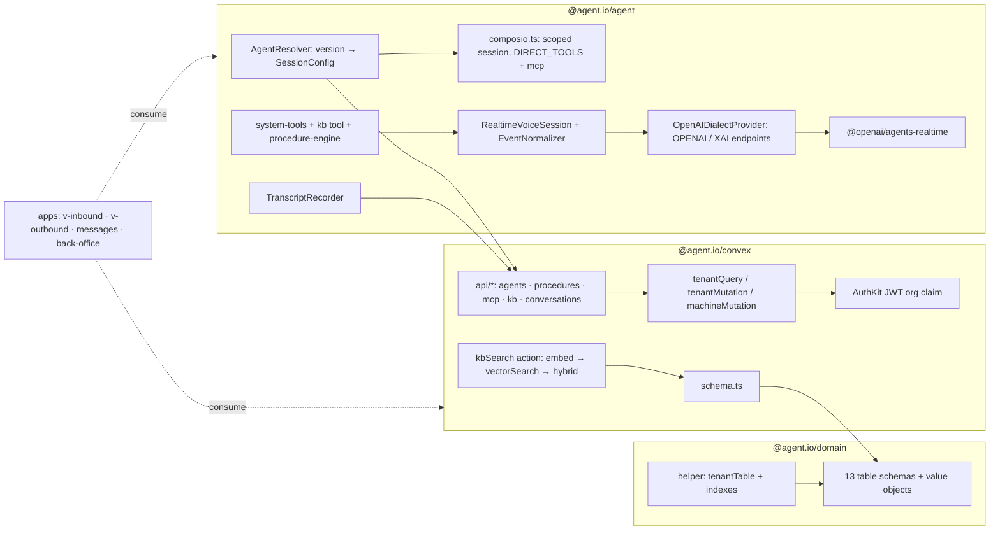
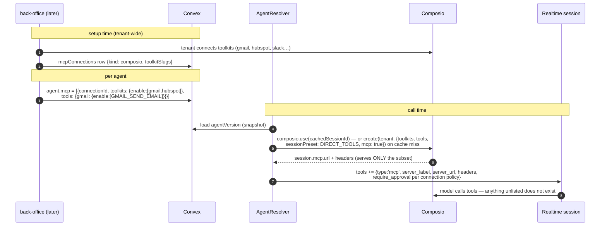
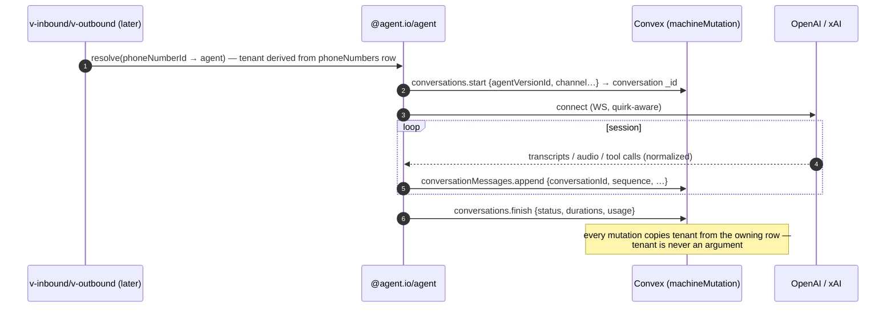

# feat: Domain layer integration — schemas, Convex wiring, and the agent package

## Overview

Build the complete multi-tenant domain layer for the agent.io voice-agent
platform in three landable phases:

1. **`packages/domain`** — all Zod/Convex table schemas (agents, versions,
   procedures, conversations, messages, phone numbers, MCP connections,
   knowledge base, batch calling, tenant settings) on the `tenantTable`
   helper, hardened with index support.
2. **`packages/convex`** — schema wiring, tenant-scoped function builders on
   WorkOS AuthKit, domain API modules, and the KB embed/search actions.
3. **`packages/agent`** — the realtime layer: agent resolution → session
   config expansion (procedures, system tools, Composio-scoped MCP) →
   provider connection (`@openai/agents-realtime`) → normalized events →
   transcript recording back into Convex.

The apps (`v-inbound`, `v-outbound`, `messages`, `back-office`) are consumers
of this layer and are explicitly out of scope (follow-up plans).

## Problem Frame

The platform runs on raw realtime model providers (OpenAI Realtime, xAI Grok
Voice) with ElevenLabs' Agents platform as the *feature reference*, not a
runtime dependency (see `docs/voice-provider-adapter.md`). That means every
platform capability EL provides server-side — agent config, versioning,
procedures, knowledge base, tool governance, conversation records, post-call
analysis — is ours to build. Today `packages/convex/src/schema.ts` is
`defineSchema({})`, `packages/domain/src/schemas/index.ts` is empty, and
`packages/agent/src/index.ts` is a hello-world. Nothing consumes the decided
architecture yet.

All *what-to-build* decisions are already settled and documented:
`CONTEXT.md` (binding glossary), `docs/adr/0001` (no auth tables; `tenant`
from WorkOS org), `docs/reference/erd-calls-agents.md` §0/§1b/§1c (ownership
matrix, procedures spec, MCP + KB specs), and `docs/voice-provider-adapter.md`
(runtime design verified against installed SDK types). This plan is the HOW.

## Requirements Trace

- R1. Every tenant-scoped table uses `tenantTable` with `tenant: z.string()`
  (WorkOS `org_…`) and a `by_tenant` index; **no** users/organizations/
  sessions tables (ADR 0001).
- R2. Tables per ERD §0 matrix: `agents`, `agentVersions`, `procedures`,
  `conversations`, `conversationMessages`, `phoneNumbers`, `mcpConnections`,
  `kbDocuments`, `kbChunks`, `kbEmbeddings`, `batchCallJobs`,
  `batchCallRecipients`, `tenantSettings`.
- R3. Draft + immutable versions: `agents` is the mutable draft; publishing
  writes a self-contained `agentVersions` snapshot with procedures embedded;
  calls only ever run a published version (CONTEXT.md).
- R4. Procedures per ERD §1b: `free_form | structured`, typed steps
  (`ask|tell|say|tool|if`), structural rules enforced as schema refinements,
  references enum `system_tool | mcp_tool | knowledge_base | procedure`.
- R5. Tool model: system tools in agent config (no table); external tools via
  `mcpConnections` (`composio | byo`) with approval policy, tool-hash
  pinning, allowed-tools filters, per-tool input overrides (ERD §1c).
- R6. **Per-agent conditional tool exposure**: an agent sees only its
  configured subset of a connection's toolkits/tools (e.g. CS agent →
  gmail+hubspot only), enforced at Composio session creation via
  `toolkits/tools enable` + `DIRECT_TOOLS` preset + `mcp: true`
  (docs/.references/composio/configuring-sessions.md, sessions-via-mcp.md).
- R7. Native KB/RAG: three-table split with vector index carrying `tenant` as
  filterField; retrieval via action-based `search_knowledge_base` tool;
  hybrid recall with full-text search; `usageMode: prompt` docs injected at
  expand (ERD §1c, convex/vector-search.md, convex/text-search.md).
- R8. Conversations substrate: transcripts always stored live from session
  events; audio only when tenant recording setting is on; machine writers
  derive `tenant` from the owning resource, never from input (ADR 0001).
- R9. `@agent.io/agent` exposes the `VoiceProvider`/`VoiceSession` seam from
  `docs/voice-provider-adapter.md`, one openai-dialect driver parameterized
  by endpoint + quirk table (OpenAI, xAI), SDK executes local tools.
- R10. Structured-procedure execution: step **ordering**, tool-step silence,
  and `expression` conditions are code-enforced; step **completion**
  semantics for Ask and natural-language conditions are model-judged within
  code-gated turn boundaries (the engine never advances past an Ask without
  at least one intervening user turn, regardless of model output).

## Scope Boundaries

- No app wiring: no Hono routes in `v-inbound`/`v-outbound`/`messages`, no
  back-office UI/CRUD surfaces, no media bridge implementation.
- No telephony leg origination (SIP/Twilio) — `batchCallJobs` schema lands,
  the dialer does not.
- No post-call analysis pipeline (summary/evaluation jobs) — schema fields
  reserved, jobs deferred.
- No WebRTC/browser widget path — `mintClientSecret` interface defined,
  browser client deferred.
- No billing/usage metering beyond the cost fields on conversations.

### Deferred to Separate Tasks

- v-inbound webhook + accept-call flow: follow-up plan after this lands.
- v-outbound dial + batch executor: follow-up plan.
- back-office agent editor (procedures editor, KB library, MCP connect UI —
  including the Composio connected-account linking flow via
  `composio.connectedAccounts.link(tenant, authConfigId)` → redirect URL,
  see `docs/.references/composio/fetching-tools.md`): follow-up plan.
- Post-call analysis jobs (evaluation criteria, data collection): follow-up.
- **Retention enforcement job** (scheduled deletion of messages + audio past
  `tenantSettings` retention; a stored-but-unenforced retention setting is a
  compliance liability — this follow-up is required before GA). Audio
  `storageId`s are only resolvable through tenantQuery endpoints.
- **`tenantSecrets` store** for BYO MCP header secrets (BYO custom headers
  feature-gated off until this lands).

## Context & Research

### Relevant Code and Patterns

- `packages/domain/src/schemas/helper.ts` — `zodTable` / `tenantTable`
  (zod4 + convex-helpers `zodToConvex`). **Gap:** `table()` returns a bare
  `defineTable` with no index hook; ADR 0001 mandates `by_tenant` — Unit 1
  closes this.
- `packages/convex/src/utils.ts` — `authQuery/authMutation/authAction`
  builders injecting `{user, org}` from AuthKit + JWT claims
  (`identity.organization.organizationId ?? identity.org_id`). Tenant-scoped
  builders extend these (the second ADR choke point).
- `packages/convex/src/http.ts` — `HttpRouterWithHono` pattern for webhook
  ingress; `authKit.registerRoutes(http)` already mounted.
- `packages/convex/src/api/` — empty; the intended home for domain modules.
- `packages/agent` — `@openai/agents-realtime@0.12.0`, `@composio/core@0.13`,
  `@composio/openai@0.10` installed. **Gaps:** `package.json` `module` points
  at `index.ts` (file is `src/index.ts`), no `exports`, no typecheck script.
- Reusable mechanics from the removed 2026-06-17 plans (`git show 6e2b7aa:…`,
  prior art only — their EL/oRPC-era schemas are superseded): message
  `sequence` via read-max-then-increment in one mutation (OCC-safe);
  messages as rows, never arrays on the parent doc (1 MiB limit + OCC
  contention); webhook ingress dispatching `scheduler.runAfter(0, internal…)`;
  convex-helpers `Triggers` for denormalized counters.
- `packages/convex` lacks `convex-test` — added in Unit 7 for function tests.
- Verified during review against installed packages: `zodToConvex`
  (convex-helpers 0.1.120 + zod 4.4.3) handles discriminated unions;
  refinements survive as no-ops — which is why structural rules also run in
  exported mutation-side validators. `@composio/core@0.13.1` exports
  `SessionPreset.DIRECT_TOOLS` and the `create(userId, {toolkits, tools,
  sessionPreset, mcp})` overload returning `session.mcp`.
  `@openai/agents-realtime@0.12.0`'s `OpenAIRealtimeWebSocket` accepts
  `url` + `useInsecureApiKey`. convex-test's vector/text-search emulation is
  approximate — ranking assertions are smoke tests, not fidelity tests.
- Tests run via `vp test` (Vitest 4); no package has tests yet — this plan
  establishes the first `packages/*/src/**/__tests__` suites.

### Institutional Learnings

- ADR 0001 is binding: tenant from JWT for user paths, derived from owning
  resource for machine paths; review concentrates on `tenantTable` + the
  scoped builders.
- `CONTEXT.md` glossary terms are binding names for tables and fields.

### External References

- `docs/reference/erd-calls-agents.md` §0, §1b, §1c — table specs.
- `docs/voice-provider-adapter.md` — runtime design, SDK-verified.
- `docs/.references/composio/{openai,sessions-via-mcp,configuring-sessions}.md`
  — session scoping, DIRECT_TOOLS preset, MCP endpoint, provider guardrails
  (use `composio.create(userId)` + `session.mcp`; don't hand-roll
  `tools.get/execute`).
- `docs/.references/convex/{vector-search,text-search}.md` — index limits,
  action-only vector search, reactive text search.
- `docs/.references/openai-realtime.md`, `xai-voice.md` — wire protocol;
  `eleven-agents/**` — feature reference (procedures, system tools, MCP
  governance).

## Key Technical Decisions

- **Composio scoping happens per session, not per connection**: the
  `mcpConnections` row stores the tenant-level connection (Composio
  `userId` = `tenant`, so connected accounts are org-wide); the *agent*
  stores its subset (`toolkits`/`tools` enable lists per connection). At
  expand time the resolver **resumes-or-creates** a session (see the cache
  decision below) — `composio.create(tenant, { toolkits, tools,
  sessionPreset: DIRECT_TOOLS, mcp: true })` on cache miss — and passes
  `session.mcp.url/headers` to the realtime session as a hosted MCP tool. Rationale: conditional per-agent tool exposure (R6)
  with zero tool-sync state on our side; Composio enforces the filter at its
  server, so even a jailbroken model can't reach unlisted tools.
  Trade-off (documented in sessions-via-mcp.md): over MCP, Composio SDK
  `beforeExecute/afterExecute` modifiers don't run — our `inputOverrides`
  are therefore applied via allowed-tools narrowing and instruction-level
  constraints, not SDK hooks.
- **`tenant` never crosses an API boundary as input** (ADR 0001): two builder
  families — `tenantQuery/tenantMutation` (user path: tenant := JWT org) and
  `machineMutation` (internal path: caller passes an owning resource id, the
  builder loads it and copies its `tenant`).
- **Service→Convex authentication is a separate boundary from tenant
  derivation.** Machine-path functions are Convex `internalMutation`s,
  reachable from the Hono services ONLY through authenticated Convex HTTP
  actions (service token in `convex.config.ts` typed env, validated in
  `http.ts` before dispatch). Tenant-derivation labels the write with the
  owning row's tenant — it is an **integrity convention, not an
  authorization mechanism**; the HTTP-layer service auth is what stops
  forged writes. Machine mutations receiving multiple resource ids (e.g.
  `start` with phoneNumberId + agentVersionId) load all of them and reject
  on tenant mismatch — the cheap invariant that catches a buggy dispatcher.
- **Composio sessions are cached and resumed, not created per call.**
  Session ids persist in a dedicated **`composioSessions` internal table**
  (tenant, connectionId, configHash, sessionId, createdAt; indexes
  `by_tenant` + `by_connection_hash`) — operational state, deliberately
  outside the 13 domain tables of the ERD ownership matrix. The
  `configHash` covers the agent-side subset AND the connection's
  `toolkitSlugs`/`allowedTools`, so governance changes roll the cache and
  take effect on the next call. Call setup resumes via
  `composio.use(sessionId, { mcp: true })`, falling back to `create` on
  miss/stale hash. Open check before implementation: whether Composio
  session ids are bearer-equivalent (possession grants tool access) — if
  yes, the cache moves behind the tenantSecrets follow-up instead of a
  plain table. Composio failure at expand time degrades per-connection:
  the call still connects without that connection's tools, with a typed
  config-degraded warning recorded on the conversation — a tool vendor
  outage must never prevent answering a call.
- **MCP session credentials are ephemeral**: `session.mcp.url/headers` are
  bearer-equivalent — never written to Convex, redacted from logs and error
  events; the transcript recorder and event normalizer strip tool-definition
  headers before persistence.
- **BYO MCP secrets are feature-gated at launch**: no secret store exists in
  this plan, so `byo` connections with `secretRef` headers are disabled
  until a `tenantSecrets` store lands (named follow-up). `secretRef`
  resolution, when it arrives, happens only inside the resolver action;
  resolved values are never persisted or logged.
- **Tool-hash mismatch semantics**: at health-check time (and session
  expand), a `toolApprovals` hash mismatch downgrades that tool to
  `requires_approval` and flags the connection `status: error` — pinning is
  a live control, not decoration.
- **Versions are self-contained documents**: `agentVersions.config` embeds
  the full expanded config incl. procedures array — one read at call setup,
  immutability in one document. Guard: publish validates the snapshot stays
  under a size budget (~800 KB) and fails with a clear error before Convex's
  1 MiB limit does.
- **Vectors in their own table** (`kbEmbeddings`) per Convex guidance —
  metadata reads never load embeddings; `tenant` + `documentId` are
  filterFields *inside* the vector index.
- **One embedding model per deployment** (dimensions fixed in the index);
  model change = reindex migration, deliberately not multi-model.
- **The SDK executes tools**: system tools and the KB search tool are
  `tool({execute})` executables; MCP is hosted (server-side execution at
  Composio/BYO). No bespoke function-call plumbing.
- **ISO-string timestamps** (`createdAt`/`updatedAt`) follow the existing
  `zodTable` convention; monotonic ordering inside a conversation uses an
  integer `sequence`, not timestamps.
- **Lean on convex-helpers (already installed) instead of hand-rolling**
  (`docs/.references/convex/convex-helpers-readme.md`):
  - **RLS (`wrapDatabaseReader/Writer`)** is the implementation vehicle for
    the Unit 7 "strong option" scoped db — tenant rules checked per-document
    on read/insert/modify, composed into the tenant builders via
    `customCtx`. The grep CI rule stays as defense in depth.
  - **`crud(schema, table, …)` — one centralized internal layer** under
    `api/crud/<table>.ts` (one file per table — the helper's five generated
    functions must be top-level exports, so a single file for 13 tables
    would collide; per-table files give readable refs
    `internal.api.crud.agents.create`). These are internal functions (never
    public, per the helper's own guidance) forming the plumbing tier; the
    per-domain api modules are the business-logic tier that composes them
    and exposes the real tenant-scoped public surface. Two-tier rule:
    business functions may call crud internals; nothing outside
    `packages/convex` may. Two verified constraints (convex-helpers
    0.1.120): (a) crud's builder args default to RAW
    `internalMutationGeneric` — every crud call MUST pass the
    **Triggers-wrapped internal mutation builder** as the 4th argument or
    cascades/denormalization silently don't fire on crud writes; (b) crud
    internals deliberately run on trusted, **non-RLS** builders — tenant
    enforcement is the business-tier caller's responsibility, and
    crud.create's validator requiring `tenant` as an arg is acceptable
    ONLY because the tier is internal (never "fix" it into a public arg).
    The CI grep rule for raw `ctx.db.query(` explicitly exempts
    `api/crud/**` (the helper's internals, not hand-written queries).
  - **`Triggers`** (same-transaction, atomic) own denormalization and
    cascades: `kbDocuments.chunkCount`, batch job counters, cascade-delete
    (agent → procedures/versions, kbDocument → chunks/embeddings), and
    procedure reference-health flips when a referenced row is deleted.
    Wired once into the custom mutation builders
    (`customMutation(raw, customCtx(triggers.wrapDB))`).
  - **Relationship helpers** (`getManyFrom`, `getOneFromOrThrow`,
    `getManyViaOrThrow`, `asyncMap`) replace join boilerplate in api modules
    (agent → procedures at publish, conversation → messages, document →
    chunks).
  - **QueryStreams** (`stream`/`mergedStream`) back the back-office read
    surfaces that need SQL-ish shapes: merged multi-agent conversation
    lists, filtered+paginated transcript views — instead of over-fetching
    and filtering in JS.

## Open Questions

### Resolved During Planning

- Where do per-agent tool subsets live? → On the agent config
  (`mcp: [{connectionId, toolkits, tools}]`), not on `mcpConnections`;
  connections are tenant-wide, exposure is per-agent (R6).
- Composio `userId`? → the `tenant` (org id). Composio auto-creates the user
  on first `composio.create(userId)` call, so no provisioning step exists —
  the first session for a tenant creates its Composio user implicitly.
  Connected accounts are org-level; per-end-user connections are a future
  concern (would become `userId = tenant:workosUserId`, additive).
- Do we need `convex-test`? → Yes, added as devDependency of
  `packages/convex` for function-level tests.

### Deferred to Implementation

- Exact chunking strategy for KB (token-based vs paragraph): start with
  paragraph + max-token cap; tune after real documents exist.
- Embedding model + dimensions constant (e.g. `text-embedding-3-small`/1536):
  set in one `EMBEDDING` config constant during implementation; index
  dimensions follow it.
- Whether `agentVersions` needs a secondary `by_tenant_agent` index beyond
  `by_tenant`: decide when the version-list query is written.
- File/URL text-extraction approach for KB ingestion (libraries, parsing
  scope, error handling for unsupported types): decide during Unit 9.
- Where `AgentResolver` executes (Convex action vs app-server process) —
  determines which credentials/clients it holds; leaning app-server (it owns
  the realtime WS), with Convex access through the authenticated HTTP
  surface. Settle at Unit 12.

## Output Structure

    packages/domain/src/schemas/
    ├── index.ts                    # barrel: all tables + value objects
    ├── helper.ts                   # (exists) + index/searchIndex/vectorIndex support
    ├── shared.ts                   # value objects: audio, vad, voiceRef, dynamicVars
    ├── agents.ts                   # Agents (draft) + systemToolsConfig + mcp scoping
    ├── agent-versions.ts           # AgentVersions (immutable snapshot)
    ├── procedures.ts               # Procedures + steps + references (+ refinements)
    ├── conversations.ts            # Conversations + ConversationMessages
    ├── phone-numbers.ts            # PhoneNumbers
    ├── mcp-connections.ts          # McpConnections (composio | byo)
    ├── knowledge-base.ts           # KbDocuments + KbChunks + KbEmbeddings
    ├── batch-calls.ts              # BatchCallJobs + BatchCallRecipients
    └── tenant-settings.ts          # TenantSettings

    packages/convex/src/
    ├── schema.ts                   # defineSchema from domain tables
    ├── utils.ts                    # + tenantQuery/tenantMutation/machineMutation
    ├── __tests__/
    │   └── agent-contract.test.ts  # Unit 14 cross-package contract suite
    └── api/
        ├── crud/                   # one file per table — internal-only plumbing tier
        │   └── <table>.ts          # crud(schema, table, internalQuery, triggeredInternalMutation)
        ├── agents.ts               # business logic: publish (snapshot), draft rules
        ├── procedures.ts           # business logic: validation, reference health
        ├── mcpConnections.ts       # business logic: governance, health
        ├── knowledgeBase.ts        # business logic: ingestion pipeline entry
        ├── kbSearch.ts             # embed + vectorSearch + hybrid action
        ├── conversations.ts        # machine-path mutations (sequence, cross-checks) + queries
        └── tenantSettings.ts       # get/patch

    packages/agent/src/
    ├── index.ts                    # public API barrel
    ├── types.ts                    # SessionConfig, NormalizedEvent, capabilities
    ├── providers/
    │   ├── endpoints.ts            # OPENAI / XAI DialectEndpoint + QuirkTable
    │   └── openai-dialect.ts       # OpenAIDialectProvider
    ├── session/
    │   ├── realtime-voice-session.ts
    │   └── event-normalizer.ts
    ├── agents/
    │   ├── resolver.ts             # version load + expand (procedures, KB, MCP)
    │   ├── system-tools.ts         # built-in tool() executables
    │   ├── composio.ts             # scoped session factory (per agent ∩ connection)
    │   └── procedure-engine.ts     # trigger compile + structured step machine
    └── substrate/
        └── transcript-recorder.ts  # NormalizedEvent → conversations ingestion

## High-Level Technical Design

> *This illustrates the intended approach and is directional guidance for
> review, not implementation specification. The implementing agent should
> treat it as context, not code to reproduce.*

### Component map



### Conditional tool exposure (the R6 flow)



### Call-time data flow (machine write path)



## Implementation Units

### Phase 1 — Domain schemas (`packages/domain`)

- [ ] **Unit 1: Harden schema helpers and package surface**

**Goal:** `tenantTable` guarantees the `by_tenant` index; `zodTable` gains
index/searchIndex/vectorIndex declaration support; domain exports `./schemas`.

**Requirements:** R1

**Dependencies:** None

**Files:**
- Modify: `packages/domain/src/schemas/helper.ts`
- Modify: `packages/domain/src/schemas/index.ts`, `packages/domain/src/index.ts`, `packages/domain/package.json`
- Test: `packages/domain/src/schemas/__tests__/helper.test.ts`

**Approach:**
- Extend the `zodTable` helper (third argument) with declarative index specs:
  regular indexes, search indexes, vector indexes — chained onto
  `defineTable(...)`.
- **Index rule (committed):** caller-declared indexes are taken **verbatim**
  — no tenant prefixing. `tenantTable` additionally always injects
  `tenant: z.string()` and auto-adds `by_tenant: ['tenant']`. Usage
  contract consumed by Unit 7: tenant-wide scans use `by_tenant`;
  parent-scoped lookups (`by_agent`, `by_conversation`) are only used after
  the parent row itself has been tenant-checked (the parent carries
  `tenant`); search/vector indexes carry `tenant` in `filterFields`.
- `tenantTable` throws at definition time if the caller shape already
  contains a `tenant` key (today it silently overwrites — fix that).
- Add `./schemas` to `package.json` `exports`; barrel re-exports. Add `test`
  scripts to `packages/domain` AND `packages/convex` package.json (or a root
  vitest projects entry covering `packages/**`) — today only back-office has
  test wiring, so without this the plan's `vp test` verification gates
  discover nothing.
- Sanctioned immutability pattern (used by Unit 2 for agentVersions):
  modules re-export a narrowed object (destructure, drop
  `update`/`updateSchema`/`tools.update`) — `zodTable`'s own return contract
  stays unchanged.

**Technical design:** *(directional)*

```ts
tenantTable('procedures', shape, {
  indexes: { by_agent: ['agentId'] },   // verbatim + auto by_tenant: ['tenant']
  searchIndexes: { search_name: { searchField: 'name', filterFields: ['tenant'] } },
})
```

**Patterns to follow:** existing `zodTable` API shape (return object with
`table()`, `insert()`, `update()`, `tools`).

**Test scenarios:**
- Happy path: `tenantTable('x', …).table()` export includes a `by_tenant` index and the `tenant` field validates as required string.
- Happy path: declared search/vector indexes appear on the `defineTable` output (assert via exported definition structure).
- Edge case: `zodTable` (non-tenant) declares no `by_tenant` and rejects a `tenant` key collision if the caller defines one on `tenantTable` (duplicate-field guard).
- Happy path: `insertSchema` omits `createdAt/updatedAt`; `updateSchema` is fully partial (existing behavior preserved — regression guard).

**Verification:** domain typechecks; a consumer can
`import { Procedures } from '@agent.io/domain/schemas'`.

- [ ] **Unit 2: Shared value objects + agents & agentVersions schemas**

**Goal:** The draft/version pair with all embedded config value objects.

**Requirements:** R2, R3, R5, R6

**Dependencies:** Unit 1

**Files:**
- Create: `packages/domain/src/schemas/shared.ts`, `packages/domain/src/schemas/agents.ts`, `packages/domain/src/schemas/agent-versions.ts`
- Test: `packages/domain/src/schemas/__tests__/agents.test.ts`

**Approach:**
- `shared.ts`: zod value objects reused across tables — `audioConfig`
  (format, sample rate), `vadConfig` (`server_vad | semantic_vad | manual`
  discriminated union), `voiceRef`, `dynamicVariables`
  (`Record<string,string>`), `modelRef` (provider + model id).
- `agents.ts` (tenantTable): name, status (`draft`-implicit), instructions,
  `model: modelRef`, `voice`, `vad`, `systemTools` (per-slot config for the
  7 built-ins: enabled + params, e.g. transfer targets, voicemail message),
  `mcp: [{connectionId, toolkits: enable/disable, tools: {toolkit:
  enable/disable}, requireApproval override}]` (the R6 subset),
  `knowledgeBase: [{documentId, usageMode}]`, `publishedVersionId?`,
  `dynamicVariableDefaults`.
- `agent-versions.ts` (tenantTable): `agentId`, `version: int`, `config`
  (the FULL expanded agent config value object — same shape as the draft
  fields, plus `procedures`), `publishedBy` (WorkOS user id string),
  immutable via the narrowed re-export pattern from Unit 1 (module exports
  no update surface).
- `config.procedures` is a **union**: inline snapshot array (the normal
  case) OR `{ procedureVersionId }` references (reserved overflow variant,
  unused initially) — so crossing the publish size budget later becomes an
  overflow behavior in `agents.publish`, not a data-model migration.
- Index: agents `by_tenant`; agentVersions `by_agent: ['agentId']`.

**Test scenarios:**
- Happy path: a full agent draft parses; unknown system-tool slug rejects.
- Happy path: agentVersions schema accepts a config with embedded procedures array; exported module has no `update()` surface.
- Edge case: `mcp[].toolkits` accepts both `{enable: [...]}` and `{disable: [...]}` but rejects both keys at once (mirrors Composio semantics).
- Error path: `vad` union rejects `semantic_vad` config carrying `server_vad`-only fields.

**Verification:** both tables compile through `zodToConvex`; type of
`AgentVersions.schema` includes the procedures snapshot array.

- [ ] **Unit 3: Procedures schema**

**Goal:** ERD §1b as code: table, step union, references, structural
refinements, cross-field validator.

**Requirements:** R2, R4

**Dependencies:** Unit 1

**Files:**
- Create: `packages/domain/src/schemas/procedures.ts`
- Test: `packages/domain/src/schemas/__tests__/procedures.test.ts`

**Approach:** Follow ERD §1b spec exactly: `type: free_form | structured`
(not convertible), trigger, `content ≤ 50_000` chars, `steps` discriminated
union (`ask|tell|say|tool|if`; `if.steps` accepts only basic steps — nesting
impossible structurally), `references` with target enum
`system_tool | mcp_tool | knowledge_base | procedure` + health, `source`,
`status`. Refinements: no leading If, no adjacent Ifs. Cross-field validator
(exported function, used by the Convex mutation): body matches type;
structured procedures reference only tool kinds; free-form may reference
structured procedures, never the reverse.

**Test scenarios:**
- Happy path: valid free-form and structured procedures parse.
- Edge case: steps starting with `if` → refinement error; two adjacent `if`s → error; `if` nested in `if` → type-level impossible (compile-time assertion).
- Error path: structured procedure with a `knowledge_base` reference → validator error; free-form without `content` → error.
- Edge case: content at exactly 50_000 chars passes; 50_001 fails.

**Verification:** all ERD §1b validation rules 1–6 have a corresponding
passing test.

- [ ] **Unit 4: mcpConnections + tenantSettings schemas**

**Goal:** ERD §1c mcpConnections (composio | byo) and the tenant settings
table.

**Requirements:** R2, R5

**Dependencies:** Unit 1

**Files:**
- Create: `packages/domain/src/schemas/mcp-connections.ts`, `packages/domain/src/schemas/tenant-settings.ts`
- Test: `packages/domain/src/schemas/__tests__/mcp-connections.test.ts`

**Approach:** Discriminated on `kind`. `composio`: `composioAccountId`,
`toolkitSlugs[]`. `byo`: `url`, `transport (sse|streamable_http)`,
`secretRef?`, `requestHeaders` (literal or `{secretRef}` per header — never
raw secrets). Shared governance: `approvalPolicy`, `toolApprovals[{toolName,
toolHash, policy}]`, `allowedTools?`, `responseTimeoutSecs (5–300)`,
`toolConfigOverrides[{toolName, inputOverrides}]`, `status`.
`tenantSettings`: recording enabled, transcript retention days, default
voice/model, concurrency + daily caps — one row per tenant (unique by
`tenant` via `by_tenant`).

**Test scenarios:**
- Happy path: composio and byo variants parse; byo without `url` rejects.
- Error path: raw-looking secret in `requestHeaders` value where a `{secretRef}` object is required by the union → rejected shape.
- Edge case: `responseTimeoutSecs` 4 and 301 reject; 5/300 pass.

**Verification:** schema exports compile; governance fields match ERD §1c.

- [ ] **Unit 5: Knowledge base schemas (3 tables, all indexes)**

**Goal:** `kbDocuments` / `kbChunks` / `kbEmbeddings` with vector + search
indexes per ERD §1c.

**Requirements:** R2, R7

**Dependencies:** Unit 1

**Files:**
- Create: `packages/domain/src/schemas/knowledge-base.ts`
- Test: `packages/domain/src/schemas/__tests__/knowledge-base.test.ts`

**Approach:** Per ERD §1c: documents (type `text|url|file`, `usageMode
auto|prompt`, status, sizeBytes, chunkCount, storageId?), chunks (documentId,
order, text, embeddingId?; indexes `by_document`, `by_embedding`; search
index `search_text` filterFields `['tenant','documentId']`), embeddings
(embedding `float64[]`, documentId; vector index `by_embedding` with
`dimensions: EMBEDDING.dimensions`, filterFields `['tenant','documentId']`).
`EMBEDDING` constant (model id + dimensions) lives here as the single source.

**Test scenarios:**
- Happy path: all three tables compile; vector index declaration carries both filterFields.
- Edge case: chunk without `embeddingId` valid (pre-embedding state).
- Error path: document `type: file` without `storageId` fails the cross-field validator; `type: url` without `sourceUrl` fails.

**Verification:** `defineSchema` including all three tables typechecks with
the vector index (Unit 7 proves it end-to-end).

- [ ] **Unit 6: Conversations, messages, phone numbers, batch calls**

**Goal:** The call substrate + telephony anchor + campaign tables.

**Requirements:** R2, R8

**Dependencies:** Unit 1

**Files:**
- Create: `packages/domain/src/schemas/conversations.ts`, `packages/domain/src/schemas/phone-numbers.ts`, `packages/domain/src/schemas/batch-calls.ts`
- Test: `packages/domain/src/schemas/__tests__/conversations.test.ts`

**Approach:**
- `conversations`: agentId, agentVersionId, provider + providerSessionId?,
  channel (`voice_inbound | voice_outbound | whatsapp | sms | web`), status
  (`initiated|in_progress|processing|done|failed`), direction, timing
  (startedAt/acceptedAt/endedAt, durationSecs), usage rollup (tokens, cost
  placeholders), analysis placeholders (summary?, successStatus?), channel
  refs (phoneNumberId?, batchCallRecipientId?), `hasAudio`. Indexes:
  `by_tenant`, `by_agent`, `by_status`.
- `conversationMessages`: conversationId, `sequence: int` (monotonic per
  conversation — assigned in the append mutation via read-max+1, OCC-safe
  per prior-art pattern), role, text?, toolCalls?/toolResults? (typed value
  objects), timings, `interrupted`, audioStorageId?. Indexes:
  `by_conversation: ['conversationId','sequence']`; search index
  `search_text` filterFields `['tenant','conversationId','agentId','role']`
  (denormalize `agentId` onto messages for that filter).
- `phoneNumbers`: number (E.164), provider (`twilio|sip_trunk`), label,
  assignedAgentId?, status. `batchCallJobs`/`batchCallRecipients` per ERD
  diagram 3 (status enums, counters, scheduling, recipient → conversationId).

**Test scenarios:**
- Happy path: full conversation + message rows parse; message with tool call payload round-trips.
- Edge case: message without text but with toolCalls valid (tool-only turn).
- Error path: conversation with unknown channel rejects.
- Happy path: recipient status enum covers the full lifecycle (`pending…voicemail`).

**Verification:** all Phase-1 tables exported from the barrel; domain
`tsc --noEmit` clean; `vp test` green.

### Phase 2 — Convex wiring (`packages/convex`)

- [ ] **Unit 7: Schema wiring + tenant-scoped function builders**

**Goal:** `defineSchema` from domain tables; `tenantQuery/tenantMutation/
tenantAction` (user path) and `machineMutation` (derive-tenant path); add
`convex-test`.

**Requirements:** R1, R8

**Dependencies:** Units 1–6

**Files:**
- Modify: `packages/convex/src/schema.ts`, `packages/convex/src/utils.ts`, `packages/convex/package.json` (+`convex-test`, `@agent.io/domain`)
- Test: `packages/convex/src/__tests__/tenancy.test.ts`

**Approach:**
- `schema.ts`: `defineSchema({ agents: Agents.table(), … })` for all 13.
- `tenantQuery/tenantMutation`: extend existing `authQuery/authMutation` —
  ctx gains `tenant` (:= `org.organizationId`) plus scoped helpers
  (`ctx.tenantDb`-style wrappers or a documented convention: every index
  query starts `.withIndex('by_tenant'|compound, q => q.eq('tenant',
  ctx.tenant))`; inserts spread `{ tenant: ctx.tenant }` automatically).
- `machineMutation` (committed shape): a **factory**
  `machineMutation(ownerTable)` where `ownerTable` is a literal union of
  tenant-table names from the domain barrel — returns a `zCustomMutation`
  over Convex `internalMutation` (import added to `utils.ts`), adds
  `ownerId: zid(ownerTable)` to args, loads the row, injects `ctx.tenant`
  from it, throws if the row or its `tenant` is missing. Functions needing
  two owner kinds (e.g. `conversations.start` by agentVersion vs by
  phoneNumber) register two variants. When a machine mutation receives
  additional resource ids, it loads them and rejects on tenant mismatch.
- Machine-path functions are **not public**: they are reachable only via
  authenticated HTTP actions (service token validated in `http.ts` — see Key
  Technical Decisions). A test asserts they are absent from the public API
  surface and that a wrong/missing service token is rejected.
- Tenant scoping resolves to the **strong option**, implemented with
  convex-helpers RLS: `wrapDatabaseReader/Writer` with per-table tenant
  rules (`doc.tenant === ctx.tenant`) composed into the builders — public
  functions never see the raw `ctx.db` for tenant tables; defense in depth
  via a CI grep rule for `ctx.db.query(` in `src/api/**`.
- Wire `Triggers` into the mutation builders here
  (`customMutation(raw, customCtx(triggers.wrapDB))` — correct API per
  prior-art), so Units 8–10 register cascade/denormalization triggers
  without touching builder plumbing again. Export BOTH a public and an
  **internal** triggers-wrapped mutation builder — the internal one is what
  every `crud(schema, table, internalQuery, triggeredInternalMutation)`
  call in Unit 8 must receive, or crud writes bypass triggers.
- Follow existing `zCustom*` + `NoOp`/`customCtx` composition in `utils.ts`.
- convex-test setup note: requires its documented vitest environment +
  module glob wired to the `src/` functions layout (`convex.json`) — verify
  `vp test` discovers `packages/convex` before writing the first suite.

**Execution note:** test-first — write `convex-test` specs for isolation
before the builders.

**Test scenarios:**
- Happy path: insert via tenantMutation stamps `tenant` from identity; query returns only rows of the caller's org (seed two orgs, assert no cross-reads).
- Error path: unauthenticated call to a tenantQuery throws the AuthKit error; identity without org claim throws.
- Integration: machineMutation deriving tenant from a `phoneNumbers` row writes a conversation with the same tenant; unknown owner id → error, nothing written.
- Edge case: attempt to pass `tenant` in args of a tenant-scoped function is a type error (compile-time assertion test).

**Verification:** `convex-test` suite proves two-org isolation on at least
agents + conversations paths.

- [ ] **Unit 8: Domain API modules (agents, procedures, mcpConnections, tenantSettings)**

**Goal:** CRUD + the publish flow.

**Requirements:** R3, R4, R5

**Dependencies:** Unit 7

**Files:**
- Create: `packages/convex/src/api/crud/<table>.ts` (one per table), `packages/convex/src/api/agents.ts`, `api/procedures.ts`, `api/mcpConnections.ts`, `api/tenantSettings.ts`
- Test: `packages/convex/src/api/__tests__/crud.test.ts`, `api/__tests__/agents.test.ts`, `api/__tests__/procedures.test.ts`

**Approach:**
- `agents.publish`: loads draft + its active procedures, runs the domain
  cross-field validators, assembles the version snapshot (config +
  procedures array), enforces the size budget, writes `agentVersions`,
  bumps `agents.publishedVersionId`. All in one mutation (atomic).
- `procedures.*`: CRUD against the draft; save runs `validateProcedureBody`
  + structural refinements; reference health check (targets exist:
  system-tool slug valid, mcp connection exists, kb doc exists, referenced
  procedure exists and is free-form-rule-compliant).
- `mcpConnections.*`: CRUD; `byo` health check deferred to implementation
  (list-tools ping is an action — stub interface now).
- Use domain `*.insert()/update()` schemas as arg validators (zodTable's
  purpose).
- Create `api/crud/<table>.ts` first (per-table files; see Key Technical
  Decisions for the verified export-collision and builder constraints):
  each calls `crud(schema, table, internalQuery,
  triggeredInternalMutation)` — the internal plumbing tier every business
  module composes (`internal.api.crud.<table>.*`). Business modules hold
  the real logic and the public surface. Tests assert: none of the crud
  internals appear in the public API; `crud.destroy` on an agent fires the
  cascade trigger (proves the wrapped builder is actually wired); a crud()
  instantiation smoke test per table (guards against a table validator
  converting to a non-object shape at module load). Reads assemble related
  rows with relationship helpers
  (`getManyFrom(db, 'procedures', 'agentId', …)` at publish,
  `getManyViaOrThrow` where join shapes appear).
- Register triggers: agent delete cascades procedures + versions; procedure/
  kbDocument/mcpConnection delete flips dependent procedure references to
  `invalid` (the reference-health integration test below rides this).

**Test scenarios:**
- Happy path: create draft → add procedures → publish → version has embedded procedures; draft edits after publish don't mutate the version.
- Error path: publish with an invalid procedure (structured + kb ref) fails atomically — no version row written.
- Edge case: publish when snapshot exceeds size budget → typed error naming the limit.
- Happy path: republish increments `version` and repoints `publishedVersionId`.
- Integration: deleting a procedure referenced by another procedure flips the referrer's reference health to `invalid`.

**Verification:** publish flow proven by tests; ERD §1b rules enforced at the
mutation boundary, not only in zod.

- [ ] **Unit 9: KB ingestion + search actions**

**Goal:** Document → chunks → embeddings pipeline and the hybrid search
action that becomes the session's `search_knowledge_base` tool.

**Requirements:** R7

**Dependencies:** Unit 7

**Files:**
- Create: `packages/convex/src/api/knowledgeBase.ts`, `packages/convex/src/api/kbSearch.ts`
- Test: `packages/convex/src/api/__tests__/knowledgeBase.test.ts`

**Approach:**
- Ingestion: `kbDocuments.create` (text/url/file) → schedules internal
  action: extract text (file/url deferred to implementation for fetch/parse
  details) → chunk (paragraph + max-token cap) → embed (batch). The action
  computes chunks + embeddings **in memory** and commits them via internal
  mutation(s) — Convex actions cannot write the db directly — either one
  transactional write per document or idempotent batch writes keyed by
  `(documentId, order)` so a retry after mid-batch failure **upserts**
  instead of duplicating. Status saga: `processing → indexed`
  (`failed` with reason on error; retry re-enters `processing`).
- Triggers own the bookkeeping: `kbDocuments.chunkCount` denormalized on
  chunk insert/delete; document delete cascades chunks + embeddings
  (same-transaction — no orphan-cleanup job needed).
- `kbSearch.search` (action): **tenant is derived, never passed** — the
  session's tool wrapper passes the `conversationId` (or `agentVersionId`)
  it was resolved for; the action loads that row, uses its `tenant` for the
  vector filter, and validates requested documentIds ⊆ that version's KB
  scope (same derive-from-owning-resource rule as machineMutation). Then:
  embed query → `ctx.vectorSearch('kbEmbeddings', 'by_embedding', { vector,
  limit, filter: tenant AND documentId ∈ scope })` → load chunk texts via
  `by_embedding` index → optionally merge full-text hits (`search_text`)
  for exact-term recall → return `[{text, score, documentId}]`.
- Embedding provider called through the AI gateway key already in convex env
  (`AI_GATEWAY_API_KEY`); exact client deferred to implementation.

**Test scenarios:**
- Happy path: text document ingests → status `indexed`, chunkCount correct, each chunk has an embedding row (embedding calls mocked).
- Integration: search returns the seeded relevant chunk first for a matching query (mock embeddings with deterministic vectors).
- Error path: embedding failure mid-batch → document `failed`, no orphan embeddings for unwritten chunks (or documented cleanup), retry path re-enters `processing`.
- Edge case: search scoped to documentIds excludes hits from an unscoped document of the same tenant; cross-tenant vectors never surface (two-org seed).

**Verification:** two-org isolation proven inside the vector search filter;
hybrid path returns exact-term matches embeddings alone miss (seeded SKU
test).

- [ ] **Unit 10: Conversation ingestion mutations (machine path)**

**Goal:** `conversations.start/appendMessage/finish` used by the
TranscriptRecorder; sequence integrity; retention hooks.

**Requirements:** R8

**Dependencies:** Unit 7

**Files:**
- Create: `packages/convex/src/api/conversations.ts`
- Test: `packages/convex/src/api/__tests__/conversations.test.ts`

**Approach:** `start` is a machineMutation deriving tenant from
`agentVersionId` (or phoneNumberId for telephony — two registered variants);
when both ids are present they must belong to the same tenant or the
mutation rejects with nothing written. `appendMessage` assigns `sequence`
via read-max-then-increment inside the mutation (OCC-safe, prior art;
recorder-side assignment was considered and rejected — mutation-side stays
correct if a second writer ever appears, e.g. post-call analysis appending
system messages). `finish` stamps status/timing/usage. Reads for back-office
(`list`, `get`, `searchTranscripts` via the search index) are tenantQuery;
list surfaces that merge/filter across agents use QueryStreams
(`stream`/`mergedStream` + `.paginate()`) rather than collect-and-filter;
message loading uses `getManyFrom(db, 'conversationMessages',
'by_conversation', …)`.

**Test scenarios:**
- Happy path: start → N appends → finish; sequences are 1..N with no gaps under sequential calls.
- Integration: two concurrent appends (simulated via convex-test serial retries) never produce duplicate sequence numbers.
- Error path: append to a `done` conversation rejects.
- Error path: `start` with a phoneNumbers row from org A and an agentVersion from org B rejects — nothing written (tenant cross-check).
- Happy path: `searchTranscripts` returns only caller-tenant messages, filterable by conversationId.

**Verification:** substrate ready for the recorder; transcript search
demonstrably tenant-scoped.

### Phase 3 — The agent package (`packages/agent`)

- [ ] **Unit 11: Package surface, types, endpoints, provider, session**

**Goal:** The `VoiceProvider`/`VoiceSession` seam working against OpenAI and
xAI endpoints, per `docs/voice-provider-adapter.md` (SDK-verified design).

**Requirements:** R9

**Dependencies:** None on Phase 2 (types only from domain)

**Files:**
- Modify: `packages/agent/package.json` (fix `module` → proper `exports`, add typecheck/test scripts)
- Create: `packages/agent/src/types.ts`, `src/providers/endpoints.ts`, `src/providers/openai-dialect.ts`, `src/session/realtime-voice-session.ts`, `src/session/event-normalizer.ts`, `src/index.ts`
- Test: `packages/agent/src/__tests__/event-normalizer.test.ts`, `src/__tests__/openai-dialect.test.ts`

**Approach:** Dependency rule (load-bearing for Unit 14): `@agent.io/agent`
MUST NOT depend on `@agent.io/convex` — the recorder/resolver take an
injected ingest interface (`ConvexIngest { start; append; finish; search }`)
rather than importing the generated `api`/`internal` objects; the apps (and
Unit 14's test) bind that interface to the real functions. This keeps the
workspace acyclic when Unit 14 adds `@agent.io/agent` as a devDependency of
`packages/convex`. Then implement the adapter doc's design directly:
`DialectEndpoint`
+ `QuirkTable` for OPENAI/XAI; provider `connect` uses
`OpenAIRealtimeWebSocket({url, useInsecureApiKey: true})`, `RealtimeAgent`,
`RealtimeSession` with GA config shape; semantic-VAD downgrade on xAI (log,
don't fail); `mintClientSecret` via REST. `EventNormalizer` maps transport
events → `NormalizedEvent` handling xAI aliases (`response.text.delta`).
Session wraps SDK runtime (`sendAudio(ArrayBuffer)`, `interrupt()`,
`mute()`, `close()`), emits normalized events, no tool plumbing (SDK owns
it).

**Test scenarios:**
- Happy path: normalizer maps the core event set (speech_started, transcript delta/final, audio delta, response done w/ usage, dtmf, error) from recorded fixture payloads of BOTH dialects.
- Edge case: xAI `response.text.delta` and GA `response.output_text.delta` normalize identically; unknown event types return null (dropped, not thrown).
- Error path: connect with `semantic_vad` on XAI produces `server_vad` wire config and a logged downgrade.
- Happy path: capability matrix reflects quirk table (webrtc false on xai, ttl 3600 vs 7200).

**Verification:** normalizer fixture suite green for both dialects;
package builds + typechecks standalone.

- [ ] **Unit 12: AgentResolver + Composio scoped sessions + system tools**

**Goal:** Version snapshot → full `SessionConfig`: instructions with dynamic
variables, KB prompt-mode injection, system-tool executables, per-agent
Composio MCP scoping, BYO MCP passthrough.

**Requirements:** R5, R6, R9

**Dependencies:** Units 8, 9, 11

**Files:**
- Create: `packages/agent/src/agents/resolver.ts`, `src/agents/system-tools.ts`, `src/agents/composio.ts`
- Test: `packages/agent/src/agents/__tests__/resolver.test.ts`, `__tests__/composio.test.ts`

**Approach:**
- Resolver loads the published `agentVersions` snapshot (one read),
  renders `{{dynamic_variables}}` into instructions, appends
  `usageMode: 'prompt'` KB docs verbatim, attaches the
  `search_knowledge_base` tool (wraps the Unit 9 action) scoped to the
  version's KB document ids.
- `system-tools.ts`: `tool({execute})` executables for the enabled built-ins;
  execute functions receive a `CallControl` interface (hangup, transfer,
  playDtmf, markVoicemail…) implemented by the session — keeps executables
  transport-agnostic and unit-testable.
- `composio.ts`: for each agent `mcp[]` entry with `kind: composio`,
  **resume-or-create**: look up the cached session id keyed by
  `(tenant, connectionId, hash of effective toolkits/tools)` and
  `composio.use(sessionId, { mcp: true })`; on miss/stale hash,
  `composio.create(tenant, { toolkits, tools, sessionPreset: DIRECT_TOOLS,
  mcp: true })` and persist the new session id. Intersect the agent's enable
  lists with the connection's `toolkitSlugs` and `allowedTools` (connection
  governance wins), map `session.mcp.url/headers` + approval policy to
  `HostedMCPToolDefinition`. Composio API failure degrades per-connection
  (session builds without those tools + typed warning) — never fails call
  setup. MCP headers are ephemeral credentials: never persisted, redacted
  from logs/events. BYO entries map url/headers/allowed_tools directly
  (secretRef headers feature-gated until tenantSecrets exists). Per Composio
  guardrails doc: never `tools.get/execute` low-level API.

**Technical design:** *(directional — the intersection rule)*

```
effectiveTools(connection, agentEntry) =
  agentEntry.toolkits∩connection.toolkitSlugs
  → per toolkit: agentEntry.tools.enable ∩ (connection.allowedTools ?? *)
  → require_approval from connection.approvalPolicy + toolApprovals
```

**Test scenarios:**
- Happy path: resolver output contains rendered instructions (vars substituted), prompt-mode KB text, procedure trigger index (Unit 13 hook), tools list = system tools + kb tool + N mcp defs.
- Happy path: agent limited to gmail+hubspot from a 5-toolkit connection produces a Composio create call with exactly those toolkits (Composio client mocked).
- Edge case: agent enables a toolkit the connection doesn't include → dropped + surfaced as a config warning, not a runtime error.
- Error path: connection `status: disabled` → its tools omitted, session still builds.
- Error path: Composio `create`/`use` rejection → call still connects, that connection's MCP tools absent, config-degraded warning emitted (mocked failure).
- Happy path: second resolve with identical effective config resumes the cached session (`composio.use`) instead of creating; changed tool subset (stale hash) creates fresh.
- Integration: system tool `end_call` executable invokes `CallControl.hangup` (mock) and returns a completion payload.

**Verification:** the R6 scenario (two agents, different subsets, same
connection) proven by tests with a mocked Composio client.

- [ ] **Unit 13: Procedure engine + transcript recorder**

**Goal:** R10 procedure runtime and the machine-path recorder that feeds
Unit 10.

**Requirements:** R4, R8, R10

**Dependencies:** Units 10, 11, 12

**Files:**
- Create: `packages/agent/src/agents/procedure-engine.ts`, `packages/agent/src/substrate/transcript-recorder.ts`
- Test: `packages/agent/src/agents/__tests__/procedure-engine.test.ts`, `packages/agent/src/substrate/__tests__/transcript-recorder.test.ts`

**Approach:**
- Compile step: trigger index appended to instructions +
  `start_procedure(name)` / `end_procedure` tool executables.
- Free-form: on start, inject content as a system message
  (`injectMessage`), attach referenced resources.
- Structured: an explicit state machine over `ProcedureStep[]` — Ask blocks
  advancement until a user turn answers (LLM-judged completion via the next
  model output, per step contract), Tool steps run silently and halt the
  procedure on failure, Say steps use verbatim text
  (`say` → instructions constrain to exact utterance), If evaluates
  `expression` conditions in code against dynamic variables
  (`{{system__agent_turns}} == 0` style mini-evaluator; NL conditions go to
  the model as a constrained judgment).
- Recorder: subscribes to normalized events, buffers per-turn state, calls
  `conversations.start/appendMessage/finish`; flush policy: append on final
  transcript per turn, finish on `closed`.

**Test scenarios:**
- Happy path: structured procedure runs steps in order; step pointer state transitions match the mermaid flow in ERD §1b.
- Edge case (the R10 hard guarantee): the engine never advances past an Ask step without at least one intervening user turn, even when the model output falsely marks the step complete.
- Edge case: Tool step failure halts remaining steps and emits end_procedure with `halted` reason; If-expression `{{var}} == value` evaluates without any model call (assert no model invocation in mock).
- Error path: start_procedure with unknown name → typed error surfaced as tool result, conversation continues.
- Integration: recorder turns a scripted NormalizedEvent stream (fixture) into the exact expected sequence of start/append/finish mutation calls (mocked Convex client), with `interrupted` flags preserved.
- Edge case: recorder resilience — mutation failure on one append retries without breaking sequence ordering (buffered queue).

**Verification:** a scripted end-to-end fixture (resolver → fake session
events → engine + recorder → mocked Convex) proves the full Flow-4 diagram
from ERD §1b without network access.

- [ ] **Unit 14: Cross-package contract suite (agent ↔ convex)**

**Goal:** Prove the real seam between `packages/agent` and `packages/convex`
before the app plans build on both — no mocked Convex on this one.

**Requirements:** R8, R9

**Dependencies:** Units 10, 13

**Files:**
- Create: `packages/convex/src/__tests__/agent-contract.test.ts`
- Test: (same file)

**Approach:** Lives in `packages/convex` intentionally — that's where
convex-test runs (Phase 3 heading notwithstanding); adds `@agent.io/agent`
as devDependency of `packages/convex` (dev-only edge, no cycle — see Unit
11's dependency rule; the workspace task graph must build agent before
convex tests). A convex-test-backed suite that imports the real
`TranscriptRecorder` and `AgentResolver` from `@agent.io/agent`, binds
their injected `ConvexIngest` interface to the actual `conversations.*` and
`kbSearch.*` functions via `t.mutation(internal…)`, and drives them
(realtime provider and Composio still mocked). This is the arg-shape and
calling-convention contract test: recorder mutation payloads must satisfy
the real validators, resolver KB-tool wiring must satisfy the real search
action's derive-tenant path.

**Test scenarios:**
- Integration: scripted NormalizedEvent fixture → recorder → REAL start/append/finish functions → rows exist with correct tenant, sequences 1..N.
- Integration: resolver-built `search_knowledge_base` tool invoked with the resolved conversationId hits the real action; a mismatched conversationId cannot widen document scope (two-org seed).
- Error path: recorder payload with a drifted field name fails the real validator — the drift is caught here, not in the app plans.

**Verification:** the suite passes with zero mocked Convex surfaces; Phase 2
and Phase 3 are integrated inside this plan, not deferred to the apps.

## System-Wide Impact

- **Interaction graph:** `utils.ts` builder changes touch every future Convex
  function; the AuthKit `authKitEvent` handler is untouched. `http.ts`
  untouched in this plan (webhook routes come with the apps).
- **Error propagation:** domain validators throw zod errors at the mutation
  boundary → surfaced as Convex errors; the agent package wraps provider/
  Composio failures into typed `NormalizedEvent error` events; recorder
  retries transient Convex failures.
- **State lifecycle risks:** publish is atomic (single mutation); KB
  ingestion is multi-step — document status is the saga marker
  (`processing/indexed/failed`), failures must not leave orphan embeddings;
  message `sequence` relies on OCC (documented prior art).
- **API surface parity:** `DomainModule` in `packages/domain/src/work-os/types.ts`
  gains modules (`agents`, `knowledge-base`, `mcp`, `settings`) so WorkOS
  permission slugs cover the new surfaces — keep roles provisioning
  (`packages/convex/src/workos.ts`) in sync.
- **Integration coverage:** two-org isolation tests on every query family;
  Composio scoping tests with mocked client; end-to-end scripted session
  fixture (Unit 13).
- **Unchanged invariants:** WorkOS auth flow, `authKit` component config,
  resend integration, existing `src/ai/` chat handler, and all app entry
  points remain untouched; `zodTable`'s existing return contract is
  preserved (additive index support only).

## Risks & Dependencies

| Risk | Likelihood | Impact | Mitigation |
|------|-----------|--------|------------|
| Version snapshot approaches Convex 1 MiB doc limit (many 50k-char procedures) | Med | High | Size budget check at publish with typed error; documented escape hatch (per-procedure snapshot docs) if a real tenant hits it |
| `zodToConvex` (convex-helpers 0.1.120, zod 4) lacks support for some union/refinement shapes | Med | Med | Unit 1/3 test the exact shapes early; refinements live in exported validators (run in mutations) rather than the table schema when conversion balks |
| Composio MCP path bypasses SDK modifiers — `inputOverrides` not enforceable server-side | High (known) | Med | Documented decision: enforce via allowed-tools narrowing + instructions; revisit native-provider execution (`@composio/openai`) for tools needing hard overrides |
| xAI dialect drift (alias events, new quirks) | Med | Low | Quirk table isolates drift; normalizer fixtures per dialect make breakage visible |
| Ask-step completion judgment is LLM-dependent (can't be fully gated in code) | Med | Med | Engine gates *advancement* (no next step until a user turn arrives + model marks step complete); fixture tests pin the contract |
| Embedding model choice locks index dimensions | Low | Med | Single `EMBEDDING` constant; reindex migration documented as the change path |
| Untrusted content (KB docs, MCP tool results) can inject instructions that steer live write-capable tools | Med | Med | Default `require_approval: always` for mutating tools on new connections; prompt-injected KB text delimited as data; KB search scope is never model-controllable (derive-from-resource invariant); Composio server-side filtering caps blast radius to the agent's subset |
| Composio outage or slow API on the call-answer hot path | Med | High | Session resume-cache (`composio.use`) removes create from the hot path; per-connection degradation — call always connects, tools omitted with warning |
| Forged machine writes if service auth is skipped during app wiring | Med | High | Machine functions are internal-only behind token-authenticated HTTP actions (Key Technical Decisions); tests assert non-public surface + token rejection |

## Documentation / Operational Notes

- Update `docs/voice-provider-adapter.md` package-layout section if file
  names shift during implementation.
- New Convex env vars at implementation time: `COMPOSIO_API_KEY`,
  `OPENAI_API_KEY`, `XAI_API_KEY` (add to `convex.config.ts` typed env).
- After Unit 8: extend `DomainModule` + rerun WorkOS role provisioning so
  back-office permissions exist before its UI plan starts.
- `CONTEXT.md` and ERD §0/§1b/§1c remain the authoritative specs; deviations
  discovered during implementation go back into those docs, not just code.

## Sources & References

- Origin decisions: `CONTEXT.md`, `docs/adr/0001-no-auth-tables-tenant-field-from-workos.md`
- Table specs: `docs/reference/erd-calls-agents.md` (§0 ownership, §1b procedures, §1c MCP + KB, flows)
- Runtime design: `docs/voice-provider-adapter.md` (SDK-verified against `@openai/agents-realtime@0.12.0`)
- Composio: `docs/.references/composio/openai.md`, `sessions-via-mcp.md`, `configuring-sessions.md`, `fetching-tools.md` (direct-execution API — used only for schema inspection/`connectedAccounts.link`; sessions remain the agent path per Composio's own guidance)
- Convex search: `docs/.references/convex/vector-search.md`, `text-search.md`
- convex-helpers feature reference: `docs/.references/convex/convex-helpers-readme.md` (RLS, crud, Triggers, relationship helpers, QueryStreams — all in installed 0.1.120)
- Provider wire protocol: `docs/.references/openai-realtime.md`, `docs/.references/xai-voice.md`
- Feature reference: `docs/.references/eleven-agents/**` (procedures, system tools, MCP governance)
- Prior art (superseded design, reusable Convex mechanics): `git show 6e2b7aa:docs/plans/…`
