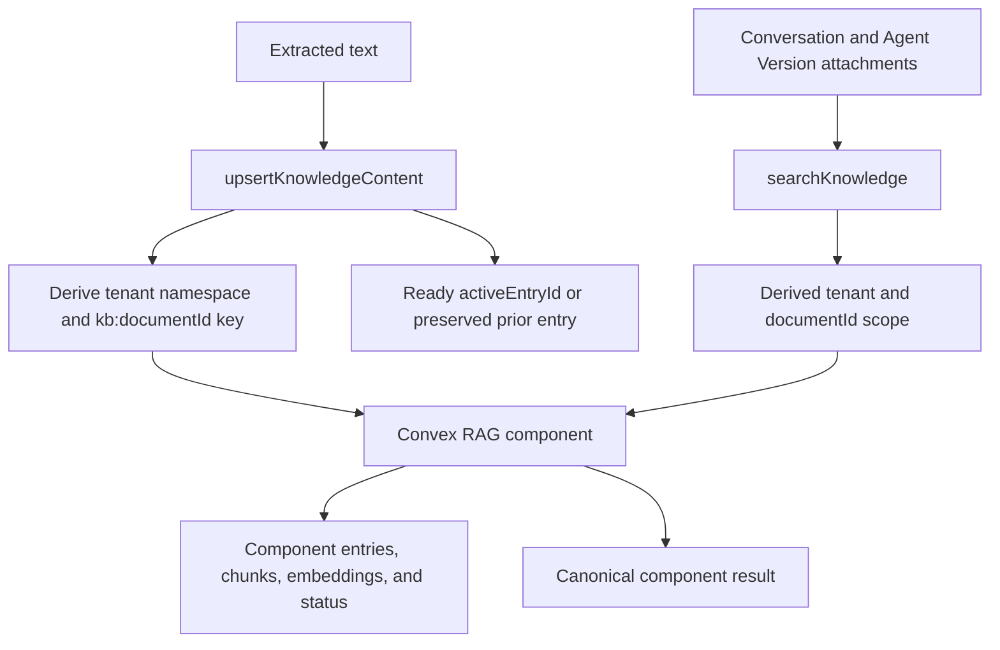
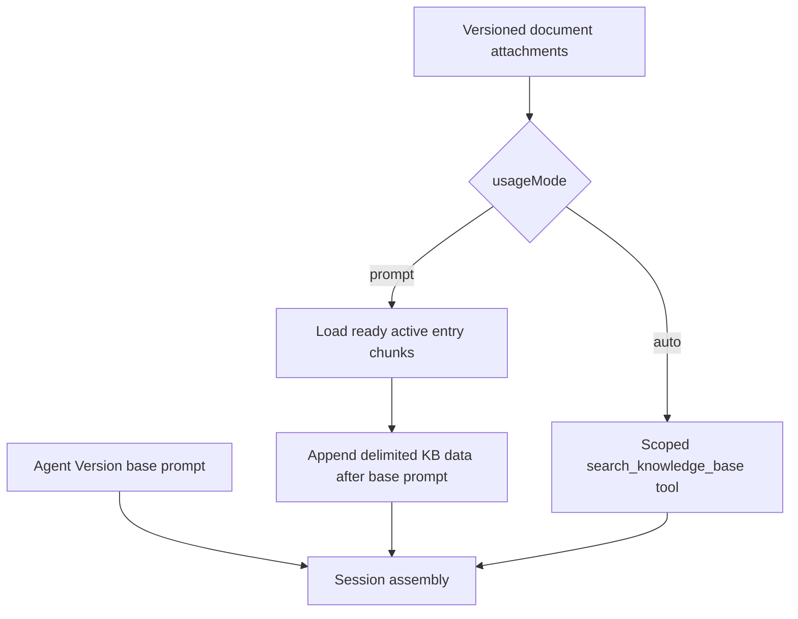
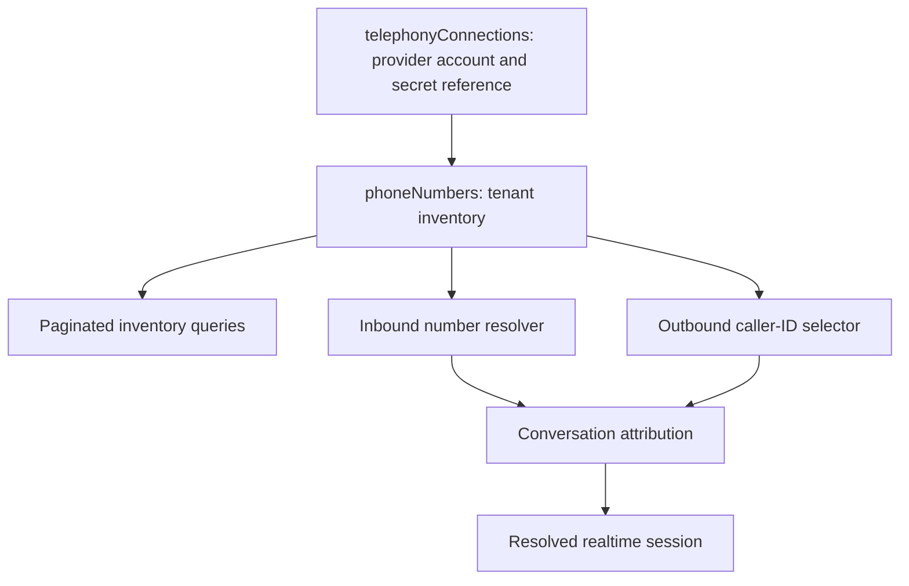
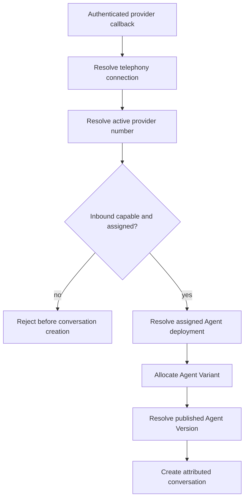
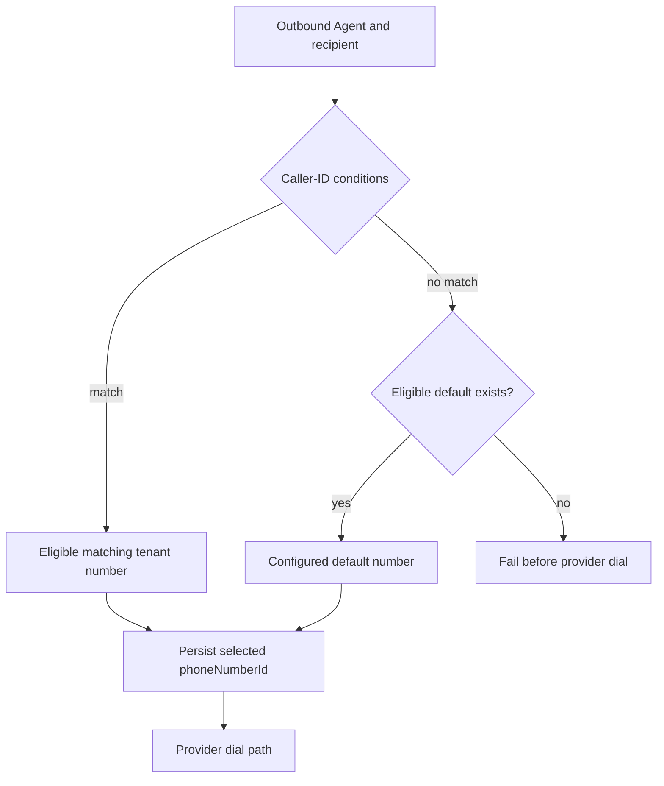

# Convex RAG and Tenant Telephony Backend Foundations

## Goal Capsule

- **Objective:** Replace the unused custom Knowledge Base retrieval scaffold
  with the Convex RAG component and make phone numbers scalable tenant resources
  with deterministic inbound/outbound routing.
- **Authority:** `CONTEXT.md`, ADR 0001, ADR 0002, ADR 0003,
  `docs/reference/phone-number-inventory.md`, and
  `docs/voice-provider-adapter.md` define the backend boundaries.
- **Execution profile:** Backend-first domain, Convex, and Agent runtime
  integration. Back-office screens and channel-provider transport wiring consume
  these APIs in later plans.
- **Stop condition:** Stop if implementation duplicates component-owned RAG
  content or vectors, accepts caller-supplied tenant/document scope, stores raw
  provider secrets on inventory rows, or assigns a Phone Number directly to an
  Agent Variant.
- **Tail ownership:** Knowledge Base UI and source extraction, provider webhook
  wiring, phone inventory UI, number purchasing, dialer transport, analytics,
  and operational dashboards remain follow-up work.

---

## Product Contract

### Summary

Agent.io will establish the two missing backend foundations required by the
voice applications. Knowledge retrieval will use `@convex-dev/rag` behind narrow
tenant-safe wrappers, retaining only a minimal `kbDocuments` identity registry.
Telephony will keep one tenant-scoped `phoneNumbers` row per voice number and
normalize provider accounts into `telephonyConnections`. The backend will expose
scoped Knowledge Base ingestion/search plus paginated phone inventory and
deterministic routing primitives.

### Problem Frame

The repository currently has two useful but incomplete scaffolds. The custom
Knowledge Base path owns `kbDocuments`, `kbChunks`, `kbEmbeddings`, chunking,
embeddings, vector search, and hybrid result formatting even though the
installed Convex RAG component already owns those concerns. The `phoneNumbers`
table only stores E.164, provider, label, optional Agent assignment, and status
behind a tenant index. It cannot efficiently support a tenant with hundreds of
numbers across countries and regions, safely normalize shared provider accounts,
or enforce the routing distinctions accepted in ADR 0003.

The ElevenLabs-style inventory is the usability reference, not the persistence
model. Agent.io needs its own tenant-owned resource boundary because numbers
derive tenant for machine calls, provider credentials must not be duplicated,
and outbound caller-ID selection is independent from inbound Agent assignment
and Agent Variant allocation.

This plan supersedes Unit 9 of
`docs/plans/2026-07-05-001-feat-domain-layer-integration-plan.md`. The older
plan remains the record for its unrelated domain and runtime work, but it is no
longer implementation authority for Knowledge Base retrieval.

### Requirements

**Knowledge Base and retrieval**

- R1. Configure one `Rag<FilterTypes>` integration whose required `documentId`
  filter and entry metadata are owned by Agent.io while chunking, embeddings,
  entry lifecycle, replacement, thresholds, context expansion, and formatted
  search output remain component-owned.
- R2. Reduce `kbDocuments` to a tenant-scoped stable identity and coordination
  registry with `activeEntryId?`, `lastError?`, and `archivedAt?`; remove custom
  `kbChunks`, `kbEmbeddings`, embedding helpers, vector indexes, and hybrid
  search from the target design.
- R3. Derive the default namespace from the WorkOS tenant id and derive the
  replacement key as `kb:${kbDocumentId}` (`ragKey`); neither value is stored as
  client-editable data or accepted from clients/models. Reserve
  `{tenant}:{agentId}` for an explicitly agent-private corpus.
- R4. Expose `upsertKnowledgeContent(documentId, text, metadata?)` and
  `searchKnowledge(conversationId, query, options)` wrappers. Search derives
  tenant and allowed auto-mode document ids from the conversation and its Agent
  Version, applies the component threshold/context options, and returns the
  component result directly.
- R5. Use synchronous `rag.add(...)` with the derived key so the component owns
  pending/replaced state and keeps the previous ready entry searchable until
  replacement completes. Update `activeEntryId` only from the ready result,
  preserve it on failure, and do not implement custom chunk-level versioning.
- R6. Keep `usageMode` on Agent Draft/Version attachments. Append ready `prompt`
  content after the base prompt with explicit delimiters and base-prompt
  precedence, bounded by a central prompt-KB context budget; expose ready `auto`
  content only through scoped search.
- R7. Allow publish with unavailable or archived attached content using a live
  health warning; session assembly skips only unavailable prompt content and
  search returns no context for unavailable auto content.
- R8. Archive Knowledge Base content by removing component entries and retaining
  the registry tombstone. Record retrieval text and component entry ids on
  conversation tool events without exposing namespace control.

**Inventory and isolation**

- R9. Store each voice number as a first-class `phoneNumbers` tenant row; never
  store number arrays in `tenantSettings`, Agent Drafts, or Agent Versions.
- R10. Store provider-account identity and credential references in
  `telephonyConnections`, allowing many numbers to share one connection without
  duplicating secrets.
- R11. Normalize numbers to E.164 and persist country, region/state, locality,
  capabilities, provider identity, routing-region configuration, lifecycle, and
  synchronization metadata.
- R12. Provide bounded tenant-scoped listing with filters for status, Agent
  assignment, country, region, provider, and provider connection.
- R13. Make provider import idempotent and reject cross-tenant connection or
  Agent references.
- R14. Restrict import, assignment, disable, refresh, and archive operations to
  tenant administrators while allowing authorized tenant roles to list
  inventory.

**Routing and attribution**

- R15. Treat optional `assignedAgentId` as the default inbound destination;
  unassigned, disabled, archived, or inbound-ineligible numbers do not start
  inbound conversations.
- R16. Derive tenant from the authenticated provider connection and resolved
  Phone Number; machine callers never provide tenant as input.
- R17. Select outbound caller ID independently for each concrete call from
  active, outbound-capable tenant numbers using workflow conditions and an
  explicit eligible default; assignment does not grant exclusive outbound
  ownership.
- R18. Persist the selected `phoneNumberId`, Agent Variant, and Agent Version on
  each conversation so later inventory changes do not alter historical
  attribution.
- R19. Keep raw provider credentials and unrestricted caller-ID choice out of
  the realtime model and agent tool context.

### Acceptance Examples

- AE1. Given two tenants with documents in their default namespaces, when Tenant
  A searches from its conversation, then component results can include only
  document ids attached to that conversation's Agent Version and never Tenant B
  content.
- AE2. Given an active Knowledge Base entry, when synchronous replacement with
  the same derived `ragKey` is running or fails, then component searches
  continue serving the previous ready entry; after `rag.add` returns ready, the
  registry points to the replacement.
- AE3. Given an Agent Version with prompt-mode and auto-mode attachments, when
  its session is assembled, then the base prompt appears first, ready prompt
  content is appended as delimited data, and only auto-mode document ids are
  available to `searchKnowledge`.
- AE4. Given an unavailable or archived attached document, when the Agent is
  published or a session starts, then publish succeeds with a live warning and
  only that document is skipped.

- AE5. Given a tenant with 200 active numbers across the US and Dominican
  Republic, when an operator requests the US/New York page, then the backend
  returns a bounded page from tenant-leading indexes without collecting all 200
  rows.
- AE6. Given a verified Twilio callback for an active number assigned to Agent
  A, when the inbound worker resolves the call, then tenant is derived from the
  number and the conversation records the allocated Agent Variant and Agent
  Version for Agent A.
- AE7. Given an active but unassigned number, when an inbound call arrives, then
  routing fails before conversation creation with an unassigned-number error.
- AE8. Given an outbound workflow whose country/region condition has no eligible
  match, when its configured default number is active and outbound-capable, then
  that number is selected and persisted on the conversation.
- AE9. Given an archived or provider-disabled default number, when no outbound
  condition matches, then dialing fails before contacting the provider rather
  than selecting an arbitrary tenant number.
- AE10. Given the same provider number imported twice through the same
  connection, when the second import runs, then it updates the existing row or
  returns it without creating a duplicate.
- AE11. Given two concurrent imports for the same provider identity, when both
  complete, then exactly one inventory row exists and both outcomes resolve that
  identity.
- AE12. Given a non-administrator tenant member, when they attempt to import,
  assign, disable, refresh, or archive a number, then authorization fails before
  provider or inventory mutation.

### Scope Boundaries

In scope:

- Convex RAG component configuration, minimal Knowledge Base registry,
  component-backed ingestion/replacement/search wrappers, prompt-mode expansion,
  retrieval audit attribution, and removal of the unused custom chunk/vector
  substrate.
- Domain schemas, Convex indexes, provider-account normalization, inventory
  APIs, explicit provider import/refresh, inbound resolution, outbound
  selection, and conversation attribution.
- Twilio and SIP-trunk discriminators already present in the domain model.

Deferred to follow-up work:

- Back-office inventory table and import dialog.
- Knowledge Base management UI and URL/file text extraction; this slice accepts
  already extracted text.
- Buying, porting, or releasing phone numbers.
- Webhook-driven provider reconciliation; v1 uses explicit import and refresh
  operations.
- Exclusive outbound number pools, reservation/lease systems, and utilization
  analytics.
- SMS application behavior beyond storing provider capability and
  `inboundSmsEnabled`.

Outside this plan:

- Agent Variant percentages, workflow authoring, dialer execution, call
  statistics, and charts.
- General Agent CRUD, procedures, MCP integration, transcript ingestion, and
  other unrelated units retained in the older domain-layer plan.

---

## Planning Contract

### Key Technical Decisions

- KTD1. **Dedicated tenant inventory** (session-settled: user-directed - chosen
  over storing numbers in company configuration because tenants may own hundreds
  of numbers across countries and regions). Keep one `phoneNumbers` row per
  number and preserve `tenantSettings` as singleton product defaults.
- KTD2. **Optional Agent assignment is an inbound default.** Outbound
  eligibility is determined by caller-ID policy, not ownership inferred from
  `assignedAgentId`. This is the recommended planning assumption because ADR
  0003 already separates inbound assignment from outbound selection.
- KTD3. **Normalize provider accounts.** Add `telephonyConnections` so account
  identity, routing defaults, status, and secret references are shared without
  copying credentials to every number.
- KTD4. **Persist provider geography and capabilities.** Country, region,
  locality, and capability fields are provider snapshots used for filtering and
  routing; explicit refresh can update them without changing the Phone Number
  `_id`.
- KTD5. **Resolve machine calls from owning resources.** Provider authentication
  identifies a connection, the connection plus provider number identity resolves
  the Phone Number, and the row supplies tenant and inbound assignment.
- KTD6. **Archive rather than hard-delete.** Archived numbers are excluded from
  future routing while historical conversations continue to resolve their
  `phoneNumberId`.
- KTD7. **Keep number selection out of the model.** Inbound and outbound routing
  run before the realtime session; the LLM receives neither credentials nor an
  arbitrary caller-ID selection tool.
- KTD8. **Derive routing eligibility.** Number lifecycle, channel capability,
  Telephony Connection health, and callable Agent deployment combine at lookup
  time; no duplicated `isEligible` field can drift.
- KTD9. **Use the Convex RAG component as the retrieval engine.** This is a
  direct integration into an empty product flow, not a migration: remove the
  unused custom chunk/vector implementation without backfill, dual-write, or
  compatibility code.
- KTD10. **Keep only stable product identity in `kbDocuments`.** Component
  entries own content, metadata, chunks, embeddings, filters, status, and
  revision identity; the registry coordinates active/pending replacement and
  archive state.
- KTD11. **Derive namespace and `ragKey`.** The default namespace is the trusted
  tenant id and the replacement key is always `kb:${kbDocumentId}`.
  Agent-private namespaces require an explicit corpus policy rather than an
  arbitrary input.
- KTD12. **Version attachments, not component chunks.** Agent Versions snapshot
  `{documentId, usageMode}` attachments. Successful content replacement becomes
  visible without republishing, and component `entryId` values identify the
  served content revision.
- KTD13. **Base prompt precedes Knowledge Base content.** Prompt-mode chunks are
  appended as delimited untrusted data after the Agent Version instructions and
  cannot override identity, safety, or tool authorization.
- KTD14. **Return one component result.** `searchKnowledge` passes through the
  component's formatted result and threshold semantics instead of maintaining a
  second normalized search contract.
- KTD15. **Degrade per document.** Pending, failed, unavailable, or archived
  documents produce health warnings and are skipped independently; they do not
  prevent publishing or fail the whole voice session.
- KTD16. **Bound prompt-mode context.** Apply one central prompt-KB
  character/token budget in attachment order. Include only complete documents
  that fit and emit a live warning for each skipped overflow document; never
  silently truncate a document into partial instructions.

### High-Level Technical Design

### Assumptions

- The installed `@convex-dev/rag` package is the only chunking, embedding,
  vector retrieval, replacement, and threshold implementation in the target
  backend.
- V1 Knowledge Base ingestion receives extracted text. URL fetching, file
  parsing, OCR, and upload UX are separate source-adapter work.
- Component entry metadata carries title and source display information that is
  not stable attachment identity.
- Agent assignment controls inbound routing only. If product policy later
  requires exclusive outbound pools, add an explicit outbound-pool relation
  rather than overloading `assignedAgentId`.
- Initial provider synchronization is explicit import/refresh. Provider webhooks
  may be added later without changing stable inventory identity.
- Provider credentials are available through a secret-reference mechanism before
  tenant-owned provider connections are activated. The schema and APIs never
  persist raw tokens.
- Secret references in this slice are externally provisioned through a trusted
  administrative path; creating a tenant secret-management UI is deferred.

### Sequencing

First replace the custom Knowledge Base substrate with the component-backed
registry and wrappers, then integrate prompt/search behavior into session
assembly. In parallel after the shared schema gate, establish phone schemas and
indexes, then inventory/import APIs, inbound resolution, outbound selection, and
cross-package attribution contracts. Neither runtime path may bypass its Convex
wrapper or duplicate tenant/scope/eligibility rules in channel applications.

---

## Implementation Units

### U1. Replace the custom Knowledge Base substrate with the RAG component

- **Goal:** Make `@convex-dev/rag` the sole content, chunking, embedding,
  replacement, and retrieval engine while preserving stable tenant-owned
  document identity.
- **Requirements:** R1, R2, R3, R5, R8; KTD9, KTD10, KTD11, KTD12.
- **Dependencies:** None.
- **Files:** Modify `packages/convex/src/convex.config.ts`,
  `packages/convex/src/schema.ts`,
  `packages/domain/src/schemas/knowledge-base.ts`,
  `packages/domain/src/schemas/index.ts`, and
  `packages/domain/src/schemas/__tests__/tables.test.ts`; remove
  `packages/convex/src/api/internals/kbChunks.ts`,
  `packages/convex/src/api/internals/kbEmbeddings.ts`, and custom
  embedding/vector schema exports that become unused.
- **Approach:** Register the installed RAG component and define
  `Rag<FilterTypes>` with required `documentId` filtering plus component entry
  metadata for title/source display. Reduce `kbDocuments` to `activeEntryId?`,
  `lastError?`, and `archivedAt?` on the standard tenant/timestamp envelope.
  Remove `kbChunks`, `kbEmbeddings`, `EMBEDDING`, custom vector/search indexes,
  and cascade behavior that exists only for that substrate. Treat this as
  integration into an unused flow, with no migration or compatibility phase.
- **Test scenarios:** Compile component registration and typed filters; validate
  the minimal registry; prove custom chunk/vector tables and indexes are absent;
  prove Agent Draft/Version attachments still reference stable `kbDocuments`
  ids; prove component metadata is not duplicated into the registry.
- **Verification:** Convex code generation succeeds with the RAG component and
  minimal registry, and no custom vector-storage symbol remains reachable from
  the Knowledge Base API.

### U2. Add component-backed Knowledge Base lifecycle and scoped search

- **Goal:** Expose the two backend wrappers that own ingestion/replacement and
  conversation-scoped retrieval.
- **Requirements:** R3, R4, R5, R7, R8; KTD11, KTD12, KTD14, KTD15.
- **Dependencies:** U1.
- **Files:** Rewrite `packages/convex/src/api/knowledgeBase.ts` and
  `packages/convex/src/api/kbSearch.ts`; modify
  `packages/convex/src/api/internals/kbDocuments.ts`; create or rewrite
  `packages/convex/src/api/__tests__/knowledgeBase.test.ts` and
  `packages/convex/src/api/__tests__/kbSearch.test.ts`; remove custom embedding
  helpers when no longer referenced.
- **Approach:** `upsertKnowledgeContent(documentId, text, metadata?)` loads the
  tenant-owned registry row and calls synchronous `rag.add(...)` with the
  derived namespace, `kb:${documentId}` key, required `documentId` filter, text,
  and display metadata. The component owns default chunking plus
  pending/replaced state and keeps the prior keyed entry searchable during work.
  Patch `activeEntryId` only from a ready return; on failure record a sanitized
  error and preserve the old pointer.
  `searchKnowledge(conversationId, query, options)` loads the conversation and
  Agent Version, derives tenant plus auto-mode document ids, applies required
  component filters and bounded threshold/context options, and returns the
  component result directly. Archive removes component content and retains the
  registry tombstone. Record retrieval text and served component entry ids on
  the conversation tool event.
- **Test scenarios:** Add initial text with component default chunking; replace
  it gracefully; fail initial and replacement ingestion; preserve old
  searchability while replacement runs and after failure; update `activeEntryId`
  only from a ready result; isolate two tenant namespaces; exclude unattached
  same-tenant documents; enforce threshold and bounded options; reject caller
  namespace/document widening; archive content; pass through one component
  result shape; audit served entry ids.
- **Verification:** AE1 and AE2 pass against component-backed functions, and no
  client/model input can select namespace, tenant, or unrestricted document ids.

### U3. Integrate prompt-mode and auto-mode Knowledge Base behavior into sessions

- **Goal:** Assemble Knowledge Base context with correct prompt precedence and
  expose scoped retrieval only where the Agent Version allows it.
- **Requirements:** R6, R7, R8; KTD12, KTD13, KTD14, KTD15, KTD16.
- **Dependencies:** U2 and the existing Agent Version/session resolver contract.
- **Files:** Modify `packages/agent/src/agents/resolver.ts`,
  `packages/agent/src/types.ts`,
  `packages/convex/src/__tests__/agent-contract.test.ts`, and the conversation
  tool-event schema/API used by retrieval.
- **Approach:** Keep the Agent Version base instructions first. For each ready
  prompt-mode attachment, page ordered chunks from its active component entry
  and append the complete document as explicitly delimited untrusted data only
  when it fits the central prompt-KB budget. Skip overflow documents with live
  warnings rather than truncating them. Build `search_knowledge_base` only from
  auto-mode attachments and bind it to the resolved conversation id so
  `searchKnowledge` derives scope. Unavailable attachments emit live health
  warnings and are skipped independently. Do not expose component namespaces,
  keys, secret references, or arbitrary document ids to the model.
- **Test scenarios:** Assemble base prompt plus multiple prompt documents in
  stable order; prove prompt content cannot replace base identity/safety
  instructions; include only complete documents within the context budget and
  warn on overflow; expose auto documents only to search; skip pending, failed,
  and archived attachments with warnings; invoke the real search wrapper through
  the runtime tool; record retrieval text and entry ids; prove two-tenant and
  unattached-document isolation.
- **Verification:** AE3 and AE4 pass through the real Convex-to-Agent contract,
  including prompt precedence, degraded availability, scoped tool execution, and
  retrieval attribution.

### U4. Normalize phone inventory and provider connections

- **Goal:** Define the canonical tenant schemas and indexes for scalable
  inventory and provider-account reuse.
- **Requirements:** R9, R10, R11, R12, R13; KTD1, KTD3, KTD4, KTD6, KTD8.
- **Dependencies:** None.
- **Files:** Modify `packages/domain/src/schemas/phone-numbers.ts`,
  `packages/domain/src/schemas/index.ts`,
  `packages/domain/src/schemas/__tests__/tables.test.ts`, and
  `packages/convex/src/schema.ts`; create
  `packages/domain/src/schemas/telephony-connections.ts`.
- **Approach:** Extend the existing scaffold rather than create a parallel
  number entity. Add provider connection, provider number identity, geography,
  capability, routing, synchronization, and archive fields. Separate connection
  lifecycle (`pending_verification`, `active`, `disabled`, `error`, `archived`)
  from number lifecycle (`pending`, `active`, `disabled`, `provider_missing`,
  `archived`); compute routing eligibility from lifecycle and capabilities. Add
  the exact index contract from `docs/reference/phone-number-inventory.md`,
  including `by_tenant_country_region` for combined geography pages and
  `by_tenant_provider` for bounded provider pages, plus provider-identity
  routing indexes. Keep raw secrets outside both schemas and validate E.164 and
  ISO country codes at the domain boundary.
- **Patterns to follow:** `tenantTable` in
  `packages/domain/src/schemas/helper.ts`; multi-instance channel resources in
  `packages/domain/src/schemas/whatsapp-accounts.ts`; index declarations in
  `packages/convex/src/schema.ts`.
- **Test scenarios:** Validate Twilio and SIP rows with optional
  region/locality; reject malformed E.164 and country codes; cover every
  connection and number lifecycle; reject invalid capability/config
  combinations; compile every declared index; paginate combined country/region
  and provider pages through their exact leading indexes; prove `tenantSettings`
  has no phone-number array.
- **Verification:** Generated Convex schema exposes both tables and all planned
  indexes, and domain tests enforce the target contract in
  `docs/reference/phone-number-inventory.md`.

### U5. Add provider connection and inventory operations

- **Goal:** Provide trusted, paginated inventory queries, lifecycle mutations,
  and idempotent import/refresh operations for back-office and runtime
  consumers.
- **Requirements:** R10, R12, R13, R14, R19; KTD3, KTD4, KTD7, KTD8.
- **Dependencies:** U4.
- **Files:** Create `packages/convex/src/api/telephonyConnections.ts`,
  `packages/convex/src/api/phoneNumbers.ts`,
  `packages/convex/src/api/internals/telephonyConnections.ts`,
  `packages/convex/src/api/internals/phoneNumbers.ts`, and
  `packages/convex/src/api/__tests__/phoneNumbers.test.ts`; modify
  `packages/domain/src/index.ts`.
- **Approach:** Keep generated/internal CRUD behind tenant-aware business
  functions. List through bounded pagination and tenant-leading filters.
  Restrict routing-changing mutations to tenant administrators. Import through a
  server-side action that resolves externally provisioned credentials from a
  connection; a transactional mutation upserts by provider identity, validates
  same-tenant Agent assignment, and returns per-number outcomes for partial
  provider failures. A successful refresh marks missing provider numbers
  `provider_missing` instead of deleting them. Public results omit secret
  references and sanitized provider errors are the only persisted failure
  detail.
- **Execution note:** Start with contract tests for idempotent import, tenant
  isolation, and pagination before adding provider adapters.
- **Test scenarios:** Import one number; repeat and concurrently race the import
  without duplication; isolate the same E.164 across different verified tenant
  connections; import a mixed batch with partial failures without activating
  incomplete rows; reject cross-tenant Agent or connection references; reject
  routing-changing mutations from non-administrators; paginate 200 seeded rows;
  filter by country, region, status, Agent, provider, and connection; verify no
  public result contains credentials or secret references; mark a missing
  refreshed number `provider_missing`; archive and explicitly restore
  eligibility according to lifecycle rules.
- **Verification:** Inventory operations satisfy AE5 and AE10, and all returned
  records are tenant-scoped and credential-free.

### U6. Resolve inbound calls from the assigned Phone Number

- **Goal:** Make the dialed provider number the trusted tenant and Agent routing
  anchor.
- **Requirements:** R15, R16, R18, R19; KTD2, KTD5, KTD7, KTD8.
- **Dependencies:** U4, U5, plus the Agent Variant allocation contract defined
  outside this plan.
- **Files:** Create `packages/convex/src/api/phoneRouting.ts` and
  `packages/convex/src/api/__tests__/phoneRouting.test.ts`; modify
  `packages/convex/src/api/conversations.ts` and
  `packages/domain/src/schemas/conversations.ts`.
- **Approach:** Resolve provider connection and provider-native number identity
  first, then derive tenant from the Phone Number. Reject a number when its
  lifecycle, capability, connection health, assignment, or assigned Agent's
  published deployment makes it ineligible. Resolve existing Agent Variant
  allocation before creating the conversation. Remove the ability for a machine
  caller to pair a number with an arbitrary same-tenant Agent Version.
- **Test scenarios:** Resolve an assigned active number; reject unknown,
  unassigned, disabled, archived, provider-missing, capability-ineligible,
  unhealthy-connection, and no-published-deployment cases; reject a number from
  a different authenticated connection; prove tenant is derived rather than
  accepted; prove caller-supplied `agentVersionId` cannot override assignment;
  change assignment during an active call and prove the existing conversation
  retains its recorded Agent Variant and Agent Version.
- **Verification:** AE6 and AE7 pass through real Convex functions, and inbound
  callers cannot widen tenant or Agent scope.

### U7. Add deterministic outbound caller-ID selection

- **Goal:** Select one eligible tenant source number from workflow conditions
  and a required default before dialing.
- **Requirements:** R17, R18, R19; KTD2, KTD4, KTD7, KTD8.
- **Dependencies:** U4, U5.
- **Files:** Modify `packages/convex/src/api/phoneRouting.ts` and
  `packages/domain/src/schemas/batch-calls.ts`; create
  `packages/convex/src/api/__tests__/outboundPhoneRouting.test.ts`.
- **Approach:** Centralize eligibility checks for active status, outbound voice
  capability, connection health, country, region, provider, and explicit number
  conditions. Run selection per recipient call and return a concrete
  `phoneNumberId`, matched rule/fallback reason, or typed `no_eligible_number`
  failure. Use only the configured explicit default when no condition matches;
  do not pick an arbitrary candidate. Stage the result on the recipient attempt
  before dialing when needed, then copy it onto every resulting conversation at
  creation. Do not let Agent assignment or Agent Variant allocation select
  caller ID.
- **Test scenarios:** Select a matching country/region number for each
  recipient; use an eligible configured default when no condition matches;
  reject missing, archived, disabled, provider-missing, capability-ineligible,
  or unhealthy defaults with `no_eligible_number`; distinguish matched-rule and
  fallback decisions; prove same inputs produce the same selected number; stage
  the selection before dialing and copy it to the resulting conversation; prove
  assigned numbers remain eligible to another Agent unless an explicit future
  pool policy exists.
- **Verification:** AE8 and AE9 pass, and no outbound path dials before
  persisting the selected Phone Number identity.

### U8. Lock cross-package routing and attribution contracts

- **Goal:** Ensure channel workers and the Agent runtime consume one backend
  routing boundary without receiving provider secrets.
- **Requirements:** R16, R17, R18, R19; KTD5, KTD7.
- **Dependencies:** U3, U6, U7.
- **Files:** Modify `packages/convex/src/__tests__/agent-contract.test.ts`,
  `packages/agent/src/types.ts`, and `packages/agent/src/agents/resolver.ts`;
  create `packages/convex/src/api/__tests__/phoneRoutingContract.test.ts`.
- **Approach:** Keep number resolution before realtime session construction.
  Pass only resolved Phone Number identity and call configuration into the Agent
  package. Record assignment/import/archive and selection events through the
  existing conversation/audit event surface without exposing provider
  credentials.
- **Test scenarios:** Drive an inbound fixture from provider identity through
  conversation creation and session resolution; drive an outbound fixture
  through condition/default selection; assert the selected Phone Number, Agent
  Variant, and Agent Version are immutable conversation attribution; assert
  serialized runtime configuration contains no Account SID credential, auth
  token, or secret reference.
- **Verification:** The real Convex-to-Agent contract proves both call
  directions and credential exclusion without mocked routing boundaries.

---

## Verification Contract

| Gate                           | Applies to | Done signal                                                                                                                      |
| ------------------------------ | ---------- | -------------------------------------------------------------------------------------------------------------------------------- |
| Convex code generation         | U1-U8      | Component registration, generated APIs, tables, and functions compile without schema/type drift                                  |
| Focused Knowledge Base tests   | U1-U3      | Component lifecycle, namespace isolation, scoped retrieval, replacement, prompt precedence, warnings, and audit attribution pass |
| Focused domain tests           | U1, U4     | Minimal Knowledge Base registry plus Phone Number and Telephony Connection validators cover target boundaries                    |
| Focused telephony Convex tests | U5-U7      | Inventory, tenant isolation, import idempotency, inbound routing, and outbound fallback scenarios pass                           |
| Cross-package contract tests   | U3, U8     | Real RAG and phone-routing outputs satisfy Agent runtime inputs without widening scope or exposing credentials                   |
| `vp check`                     | U1-U8      | Formatting, lint, and type checks pass for changed packages without new failures                                                 |
| `vp test`                      | U1-U8      | Relevant workspace tests pass; unrelated existing failures are reported separately                                               |

---

## Definition of Done

- `@convex-dev/rag` is the only Knowledge Base chunking, embedding, vector
  retrieval, replacement, and threshold implementation.
- `kbDocuments` is a minimal tenant identity/coordination registry; custom
  `kbChunks`, `kbEmbeddings`, vector indexes, embedding helpers, and hybrid
  search are removed.
- Namespace and `ragKey` are derived server-side, and scoped search cannot cross
  tenant or Agent Version attachment boundaries.
- Synchronous keyed replacement preserves the prior ready entry until `rag.add`
  completes, and component entry ids provide content-revision attribution
  without app-owned pending state or custom chunk versioning.
- Base instructions precede complete, budget-bounded, delimited prompt-mode
  documents; auto-mode retrieval uses the component result directly and
  unavailable documents degrade independently with live warnings.
- Every Phone Number is an independently indexed tenant resource and no tenant
  settings field stores a number collection.
- Provider account identity and secret references are normalized away from Phone
  Number rows.
- A 200-row tenant inventory is paginated and filterable without full collection
  reads.
- Import is idempotent, cross-tenant references are rejected, and public
  responses expose no credentials.
- Inbound routing derives tenant and Agent from the authenticated connection and
  assigned Phone Number.
- Outbound routing applies conditions plus an explicit eligible default and
  persists the selected Phone Number before dialing.
- Conversations retain Phone Number, Agent Variant, and Agent Version
  attribution after reassignment or archive.
- ADRs, reference docs, schema, backend APIs, and tests use the same RAG,
  routing, and ownership vocabulary.
- Abandoned custom retrieval fields, experimental phone fields, duplicate search
  code, and duplicate routing helpers are removed from the final diff.
