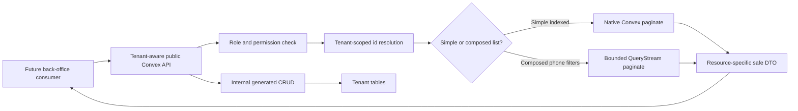
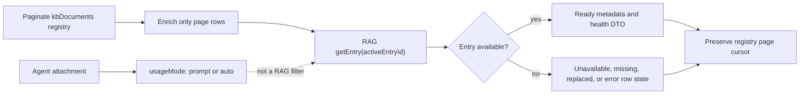
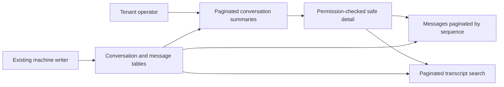

# Tenant-Safe Paginated Convex Data Services

## Goal Capsule

- **Objective:** Finish the data-only Convex service layer that the back-office
  can consume later: complete resource-appropriate CRUD/detail surfaces, replace
  growth-facing unbounded reads with cursor pagination, validate tenant-owned
  references, and return explicit safe DTOs.
- **Authority:** ADR 0001, ADR 0002, ADR 0003,
  `docs/plans/2026-07-15-001-feat-tenant-phone-number-inventory-plan.md`,
  `docs/reference/phone-number-inventory.md`, and
  `docs/reference/erd-calls-agents.md` define the existing ownership and
  isolation boundaries.
- **Execution profile:** Backend-only implementation in `packages/domain/` and
  `packages/convex/`, plus the reference-contract updates named in U6. The
  back-office is a later consumer, not part of this plan.
- **Stop condition:** Stop if implementation exposes raw database rows
  containing credentials or sensitive payloads, accepts tenant/RAG scope from
  callers, performs provider lifecycle commands, introduces Agent
  Variant/workflow/runtime behavior, or uses an unbounded public list query.
- **Tail ownership:** Back-office screens, Twilio SDK operations, number
  purchase/port/release, provider webhooks, Agent Variant allocation, workflows,
  call execution, analytics, and charts remain follow-up work.

---

## Product Contract

### Summary

The RAG and telephony foundations now exist, but the public Convex data surface
is not ready to become the back-office contract. Several public lists still use
`.collect()` or fixed `.take()` limits, some resources lack detail endpoints,
phone filtering can skip matches by filtering after pagination, MCP reads expose
secret-bearing fields, and some mutations normalize referenced ids without
proving that the referenced row belongs to the tenant.

This plan completes the data service boundary without connecting it to the Agent
runtime or building UI. Internal generated CRUD remains persistence plumbing.
Public functions remain explicit, tenant-aware business boundaries even when
their behavior is limited to data validation, persistence, and projection.

This is an integration/completion plan, not a migration. It extends the July 15
RAG/telephony plan without replacing it or re-planning component-owned retrieval
and phone routing.

Changing an existing public function from an array or fixed-limit response to a
paginated response is still an API compatibility change. Each implementation
unit must inventory its current callers and tests, change those consumers
atomically with the function signature, and avoid leaving two competing public
contracts. This is a caller rollout within the integration, not a data migration
or backfill.

### Resource Contract Matrix

| Resource              | Public read contract                                                      | Data mutation contract in this slice                                                                  | Explicitly excluded                                                  |
| --------------------- | ------------------------------------------------------------------------- | ----------------------------------------------------------------------------------------------------- | -------------------------------------------------------------------- |
| Agents                | Paginated list and safe detail                                            | Existing create/update/archive lifecycle; validate KB and MCP attachments                             | Variant allocation, workflow execution, runtime resolution           |
| Procedures            | Paginated list by validated Agent and safe detail                         | Create/update/archive; public removal becomes archive                                                 | Procedure execution and physical deletion                            |
| MCP Connections       | Paginated list and redacted detail                                        | Create/update/disable; public removal becomes disable after attachment checks                         | Tool discovery/execution, secret retrieval, and physical deletion    |
| Knowledge Base        | Paginated registry inventory, RAG-enriched health, detail, and chunk page | Existing create/content upsert/archive boundaries                                                     | Custom chunks, embeddings, `kbType` RAG filter, source extraction UI |
| Telephony Connections | Paginated redacted list and detail                                        | Create/update/status/archive of stored configuration                                                  | Twilio SDK calls, credential testing, provider provisioning          |
| Phone Numbers         | Correctly filtered paginated inventory and detail                         | Label, assignment, routing configuration, status, archive, and existing normalized import persistence | Purchase, port, release, provider API synchronization                |
| Conversations         | Paginated list, safe detail, paginated transcript search and messages     | No user-facing CRUD; machine writers remain unchanged                                                 | Call routing, transcript ingestion transport, statistics             |

### Requirements

**Shared service contract**

- R1. Standardize every growth-facing public list on a `paginationOpts` cursor
  contract with a maximum requested page size of 100 and stable
  resource-specific ordering. Native lists use `usePaginatedQuery` from
  `convex/react`; QueryStream-backed Phone Number combinations use the helper
  hook from `convex-helpers/react`.
- R2. Preserve every pagination result field and transform only `page`. Native
  pagination accepts `{ cursor, numItems }`. QueryStream pagination accepts
  `{ cursor, numItems, endCursor? }`; the server passes that complete object to
  `.paginate()`, while `convex-helpers/react` manages `endCursor` in subsequent
  requests to prevent holes or overlaps. `endCursor` is an input, not a response
  field. Cursors are opaque and valid only for the same function, filters, and
  sort. Official pagination hooks reset their loaded state when arguments
  change; reusing a cursor with different arguments is unsupported.
- R3. Remove public `.collect()` and fixed `.take()` list contracts for Agents,
  Procedures, MCP Connections, Knowledge Base inventory, Telephony Connections,
  Conversations, transcript search, and Conversation Messages. Transaction-local
  or reconciliation reads may remain bounded when pagination would break atomic
  behavior.
- R4. Use native indexed `.paginate()` for simple ordered lists. Use
  `convex-helpers` QueryStreams only for a composed ordered result that cannot
  be represented by one supported index. Start QueryStream endpoints with
  `maximumRowsRead: 2_000` and `maximumBytesRead: 4_000_000`, preserve
  `pageStatus` and `splitCursor`, and let the helper hook split and continue a
  partial page when a cap is reached.
- R5. Keep `convex-helpers/server/crud` internal. Public functions own
  authentication, authorization, tenant/reference checks, domain validation,
  lifecycle rules, and DTO projection.
- R6. Return explicit per-resource DTOs instead of spreading database documents.
  Public DTOs never contain `tenant`, `credentialSecretRef`, `secretRef`,
  literal request-header values, audio storage ids, unrestricted tool
  arguments/results, or other internal credential material.
- R7. Resolve malformed, missing, and cross-tenant ids through tenant-scoped
  reads before any dependent query or mutation. Cross-tenant and absent rows
  return the same not-found result and do not leak existence.
- R8. Authenticated tenant members may read safe configuration summaries. Agent,
  Procedure, and Knowledge Base writes require existing prompt-write authority;
  conversation reads require `conversations:read`; MCP, Telephony Connection,
  and Phone Number mutations require tenant admin/owner until dedicated settings
  permissions exist.

**Resource completion**

- R9. Add the missing safe detail endpoints and paginate existing lists for
  Agents, Procedures, and MCP Connections. Agent create/update validates every
  attached Knowledge Base and MCP id. Procedure create/update validates its
  Agent and validates each reference by `targetType`: canonical slug for
  `system_tool`, parsed `connectionId:toolName` plus tenant-owned connection for
  `mcp_tool`, tenant-owned document for `knowledge_base`, and tenant-owned
  non-self Procedure for `procedure`.
- R10. Validate MCP updates against the merged stored-plus-patch shape. Public
  MCP mutations manage non-secret connection metadata only and cannot accept
  credential values, `secretRef`, `credentialSecretRef`, or request-header
  values. A later trusted back-office server path may attach pre-provisioned
  managed secret references; secret creation, replacement, and revocation remain
  outside this slice. List/detail DTOs expose header names and configured/source
  state only, never header values, provider account identifiers, or secret
  references. Credential material must never be logged.
- R11. Paginate `kbDocuments` as the tenant identity registry and enrich only
  each returned page from `@convex-dev/rag` through `activeEntryId`. A row with
  no active pointer is unavailable. A missing, replaced, or failed pointed entry
  degrades only that row. Initial ingestion remains unavailable until ready;
  replacement continues showing the previous ready entry until `activeEntryId`
  cuts over.
- R12. Keep `documentId` as the RAG filter. Keep `prompt | auto` on each Agent
  attachment because the same document can have a different usage mode for
  different Agents. Do not duplicate component-owned title, source metadata,
  content, chunks, embeddings, filters, or status into `kbDocuments`.
- R13. Keep `kbDocuments.activeEntryId` as the bounded direct pointer for
  inventory and prompt loading because RAG 0.7.5 has no efficient direct lookup
  by key. Continue deriving `ragKey` and namespace server-side.
- R14. Paginate Telephony Connections and complete stored-configuration
  update/archive operations without invoking provider SDKs. List and detail DTOs
  are allowlisted to connection id, provider, label, status, default routing
  region, last synchronization time, sanitized last error, creation time, update
  time, and `providerAccountConfigured`. They exclude tenant internals,
  `providerAccountId`, credential references/values, and callback parameters.
- R15. Fix Phone Number pagination so all rows across a page satisfy the
  requested filters. Exact indexed paths use native pagination; combinations
  without one exact index use a bounded QueryStream rather than post-filtering
  an already paginated page.
- R16. Add Phone Number detail and keep provider-import identity/idempotency
  rules from the existing plan. Convex stores normalized outcomes; the
  back-office server owns future Twilio purchase, port, release, credential
  verification, and provider command execution.
- R17. Add paginated Conversation list/detail, transcript search, and messages
  with exact allowlists. List DTOs contain conversation id, Agent/version and
  channel-resource ids, provider, channel, direction, status,
  start/end/duration, message count, success status, and a masked external
  participant number. Detail adds accepted time, usage totals, `hasAudio`,
  termination reason, and summary, but still returns only a masked participant
  number. Message DTOs contain sequence, role, text, time-in-call, interruption
  state, tool names/call ids, result success/error state, and latency. They
  exclude raw tool arguments/results, retrieval text, audio storage ids, and the
  full participant number. Full-PII/raw payload access is deferred to an
  explicitly privileged endpoint.
- R18. Preserve machine-only Conversation writes and immutable routing
  attribution. This plan does not add inbound/outbound resolution, Agent
  Variants, or Agent runtime integration.

### Acceptance Examples

- AE1. Given 225 Agents for Tenant A, when a reader loads every page, then each
  Agent appears once in stable order, no page reads Tenant B rows, and no public
  Agent list performs `.collect()`.
- AE2. Given a Procedure create request with an Agent id owned by Tenant B, when
  Tenant A submits it, then the mutation returns the same not-found outcome as
  an unknown id and writes nothing.
- AE3. Given an MCP Connection with literal authorization headers and secret
  references, when a member lists or gets it, then the DTO contains connection
  health and header names/configuration state but no header values or secret
  identifiers.
- AE4. Given an MCP Connection changed from BYO to Composio through a partial
  patch, when the merged result lacks `composioAccountId`, then validation
  rejects the update atomically.
- AE5. Given a 25-row Knowledge Base page whose third registry row points to a
  missing RAG entry, when inventory is read, then all 25 registry rows remain in
  the page and row three reports unavailable content without failing the page.
- AE6. Given one Knowledge Base document attached as `prompt` to Agent A and
  `auto` to Agent B, when inventory and attachments are read, then only the
  attachment DTOs differ; the RAG entry and `documentId` filter are not
  duplicated.
- AE7. Given 200 Phone Numbers and filters
  `{status: active, assignedAgentId, countryCode: US}`, when every page is
  loaded, then all returned rows match all filters, no matching row is skipped,
  and execution respects the configured read cap.
- AE8. Given a caller changes Phone Number filters, when it requests the new
  result set, then it starts with a null cursor; cursors are never reused across
  argument sets.
- AE9. Given 1,000 messages in a Conversation, when an authorized reader pages
  them, then ordering is strictly by conversation sequence, page boundaries do
  not duplicate or omit messages, and another tenant's Conversation id resolves
  as not found.
- AE10. Given a safe Conversation list request, when results return, then they
  include status, timing, direction, Agent/version attribution, and message
  count but exclude transcript text, tool payloads, raw media ids, and
  secret-bearing provider data.
- AE11. Given a number purchase request, when the future back-office server
  invokes the Twilio SDK, then Convex is called only afterward to persist a
  normalized result; no Convex query, mutation, or action in this plan calls
  Twilio.
- AE12. Given an archived Agent with a published version, when a writer attempts
  to publish it again, then publication is rejected while existing Conversations
  can still resolve the previously published immutable version.

### Scope Boundaries

In scope:

- Domain validators and indexes needed by the named data contracts.
- Tenant-aware list/detail/create/update/archive functions appropriate to each
  resource lifecycle.
- Native cursor pagination, selective `convex-helpers` QueryStreams, explicit
  public DTOs, relationship validation, and bounded RAG enrichment.
- Focused scale, tenant-isolation, cursor-continuity, DTO-redaction, and
  component-degradation tests.

Deferred:

- Back-office query hooks, tables, forms, and route integration.
- Dedicated settings permission slugs beyond the existing WorkOS
  prompt/conversation permissions and admin/owner checks.
- Provider synchronization/webhook and service-token machine HTTP contracts.
- Audit-event UI and statistics.
- Privileged exact participant-number lookup and raw Conversation payload
  access.
- Conversation and Knowledge Base retention/physical-cleanup policy.
- Custom cursor fingerprints or cursor rejection across argument sets; official
  hooks own argument-change reset until a non-hook consumer requires another
  protocol.

Outside this plan:

- Agent Variants, percentage allocation, branch publishing, workflows,
  inbound/outbound routing, call execution, Agent runtime tools, number
  purchase/port/release, and any Twilio SDK call.
- A replacement Knowledge Base table, custom vector search, custom chunk
  versioning, or `prompt | auto` as a RAG filter.

---

## Planning Contract

### Key Technical Decisions

- KTD1. **Public APIs are explicit facades over internal CRUD**
  (session-settled: user-approved - chosen over exposing generated CRUD because
  the public layer must own tenancy, validation, lifecycle, and DTO contracts).
- KTD2. **Native Convex pagination is the default** (session-settled:
  user-approved - chosen over making QueryStreams the universal abstraction
  because simple indexed lists already have reactive cursor pagination).
- KTD3. **QueryStreams are selective and bounded.** Use them for composed Phone
  Number filter combinations only when no exact supported index can produce the
  ordered result. Start with `maximumRowsRead: 2_000` and
  `maximumBytesRead: 4_000_000`; preserve the complete helper result, including
  `pageStatus` and `splitCursor`; accept `endCursor` in `paginationOpts`;
  require the `convex-helpers/react` pagination hook; and test cap splitting
  plus cursor-continuity behavior.
- KTD4. **Do not filter after native pagination.** A page cursor must advance
  through the same logical result set returned to the caller; post-page
  filtering can produce short pages and permanently skip matches.
- KTD5. **DTO projection is resource-specific.** Share pagination/error helpers,
  but do not build a generic omit/sanitizer whose safety depends on remembering
  every new secret field.
- KTD6. **Tenant-scoped reads are the reference guard.** Normalize and load
  every referenced id through the RLS-wrapped `ctx.db` before calling internal
  CRUD. Missing and cross-tenant references are indistinguishable.
- KTD7. **RAG remains the content system of record.** `kbDocuments` remains a
  minimal identity/pointer/tombstone registry; bounded page enrichment uses
  `activeEntryId`, and usage mode remains on Agent attachments.
- KTD8. **Provider commands belong to the back-office server.** Convex may
  persist normalized provider results but does not import the Twilio SDK or
  perform purchase, port, release, verification, or synchronization calls in
  this slice.
- KTD9. **Conversation management is read-only for users.** Public Conversation
  queries support operations and investigation; existing machine writers remain
  the only mutation path.
- KTD10. **Public deletion is non-destructive.** Agent `remove` becomes archive,
  Procedure `remove` becomes archived status, and MCP `remove` becomes disable
  after attachment checks. KB Documents, Telephony Connections, and Phone
  Numbers retain their existing archive/status models. Physical cleanup is
  internal maintenance only.
- KTD11. **No generic create idempotency layer.** Convex mutation retry
  semantics and domain uniqueness remain authoritative; provider imports retain
  their existing provider-identity idempotency. Draft edits remain
  last-write-wins in this backend slice.
- KTD12. **Cursor scope is contractual, not custom-encoded.** Use library
  cursors and require consumers to reset on filter/sort changes. Do not add a
  second signed cursor format before a real consumer requires it.

### High-Level Technical Design

### List Strategy Matrix

| Query                 | Default order                           | Filters in this slice                                | Execution path                                                            |
| --------------------- | --------------------------------------- | ---------------------------------------------------- | ------------------------------------------------------------------------- |
| Agents                | `_creationTime` descending              | active/archived                                      | Native tenant-leading index                                               |
| Procedures            | `_creationTime` descending within Agent | Agent, status                                        | Validate Agent, then native `by_agent` path                               |
| MCP Connections       | `_creationTime` descending              | kind, status                                         | Native tenant path; add exact index only when filter is guaranteed        |
| KB Documents          | `_creationTime` descending              | active/archived                                      | Native registry page plus bounded per-row RAG enrichment                  |
| Telephony Connections | `_creationTime` descending              | provider, status                                     | Native tenant/provider path                                               |
| Phone Numbers         | `_creationTime` descending              | status, Agent, country, region, provider, connection | Native exact index for one path; bounded QueryStream for composed filters |
| Conversations         | `_creationTime` descending              | status, Agent, channel, direction                    | Native tenant/status path; add only proven compound indexes               |
| Transcript search     | Convex search-index order               | tenant and optional Agent/Conversation/role          | Convex search index pagination; no unsupported custom tie-break claim     |
| Conversation Messages | Sequence ascending                      | validated Conversation only                          | Native `by_conversation` pagination                                       |

### Assumptions

- The current RAG and phone-inventory implementation is active development in an
  otherwise empty application flow; no compatibility migration or data backfill
  is required.
- `@convex-dev/rag` 0.7.5 remains the component version during this slice. Its
  entry list and chunk list are paginated, while direct key lookup is not an
  efficient replacement for `activeEntryId`.
- Native pagination is reactive, so a requested `numItems` is a target rather
  than a promise that every live page always has exactly that length.
- The future back-office uses native `usePaginatedQuery` for ordinary lists and
  the `convex-helpers/react` hook for QueryStream-backed Phone Number
  combinations; both reset loaded pages when query arguments change, and the
  helper path supplies `endCursor` in later request arguments.
- Prompt and conversation permissions already defined in
  `packages/domain/src/work-os/` are the available fine-grained permissions.
  Integration and telephony writes stay admin/owner-only until a later
  permission expansion.
- Before Convex implementation, the implementer must read
  `packages/convex/src/_generated/ai/guidelines.md`; if the generated guidance
  is absent, install it with the repository-approved Convex AI files command
  before editing Convex code.

### Sequencing

Establish the shared pagination, permission, error, and tenant-reference
primitives first. U2 then delivers an independently releasable safety milestone:
tenant reference validation, MCP redaction and write restrictions,
archived-Agent publication protection, and retirement of destructive public
removal. U4 completes that milestone by redacting telephony DTOs and removing
Convex-owned Twilio execution. Complete the broader configuration, Knowledge
Base, telephony inventory, and Conversation reads afterward. Run Convex code
generation immediately after every schema, index, or exported API-signature
change and before that unit's endpoint tests; U6 repeats it as the final drift
gate. Do not begin back-office integration until every named list and detail
contract passes isolation, pagination, and redaction tests.

---

## Implementation Units

### U1. Establish shared public data-service contracts

- **Goal:** Define one reusable pagination/authorization/reference vocabulary
  without hiding resource-specific security decisions.
- **Requirements:** R1-R8; KTD1-KTD6, KTD11, KTD12.
- **Dependencies:** None.
- **Files:** Modify `packages/convex/src/lib.ts`,
  `packages/convex/src/utils.ts`, and `packages/convex/src/tenancy.ts`; create
  `packages/convex/src/api/__tests__/dataServiceContracts.test.ts`; modify
  `packages/convex/src/__tests__/tenancy.test.ts`.
- **Approach:** Add separate Zod-compatible request schemas: native pagination
  accepts `{cursor, numItems}` and QueryStream pagination accepts
  `{cursor, numItems, endCursor?}`. Cap `numItems` at 100, pass the complete
  request to the selected paginator, and preserve every returned pagination
  field while mapping only `page`. Add permission helpers for existing WorkOS
  permission slugs plus admin/owner checks. Add a typed tenant-scoped id
  resolver for public mutations/queries that normalizes ids, loads through
  wrapped `ctx.db`, and returns one not-found vocabulary for absent/cross-tenant
  rows. Keep DTO mappers in resource modules; share only safe mechanics.
- **Test scenarios:** Reject oversized/invalid page requests; preserve native
  cursor fields; prove QueryStream `endCursor` reaches `.paginate()` and
  `pageStatus`/`splitCursor` reach the client; reject malformed and cross-tenant
  ids identically; enforce `prompts:read/write`, `conversations:read`, and
  admin/owner gates; prove the reference helper cannot return a row from another
  tenant.
- **Verification:** Shared contracts compile through the existing
  `zCustomQuery`/`zCustomMutation` builders and do not weaken RLS or trigger
  wrapping.

### U2. Complete Agent, Procedure, and MCP data APIs

- **Goal:** Make core configuration resources safe and paginated before they
  become back-office dependencies.
- **Requirements:** R3, R6-R10; KTD1, KTD5, KTD6, KTD10.
- **Dependencies:** U1.
- **Files:** Modify `packages/convex/src/api/agents.ts`,
  `packages/convex/src/api/procedures.ts`,
  `packages/convex/src/api/mcpConnections.ts`,
  `packages/convex/src/api/__tests__/api.test.ts`, and
  `packages/convex/src/schema.ts` only if a guaranteed filter needs an
  additional tenant-leading index.
- **Approach:** Inventory and atomically update current callers as each list
  signature changes. Replace Agent, Procedure, and MCP `.collect()` lists with
  native pagination and explicit summary/detail DTOs. Add missing Procedure and
  MCP detail queries. Validate Agent KB/MCP attachments before writes. Validate
  Procedure references by target type: resolve product rows through tenant RLS,
  parse MCP composite references, and validate system-tool slugs against the
  canonical registry. For MCP updates, load the existing row, merge the patch,
  run kind-dependent validation, and only then call internal CRUD. Public MCP
  mutations reject credential fields and header values; public DTOs expose
  header names/configuration state only. Convert Agent/Procedure public remove
  operations to archive transitions and MCP removal to disable; reserve physical
  deletion for internal maintenance. Reject `agents.publish` for archived Agents
  while preserving resolution of existing immutable published versions. Run code
  generation after each schema or exported signature change and before endpoint
  tests.
- **Test scenarios:** Page more than 200 records per resource; validate no
  duplicates/skips; reject missing/cross-tenant attachments and Agent ids;
  validate every Procedure reference type, malformed MCP composite references,
  and self-references; reject invalid merged MCP patches; reject
  credential-bearing public MCP writes; prove list/detail responses contain no
  provider account id, secret reference, or header value; prove credential
  material is not logged; prove public removal archives/disables rather than
  destroys rows; reject publishing an archived Agent without breaking existing
  published-version reads; compile every updated caller against the new
  pagination signatures.
- **Verification:** AE1-AE4 pass and no growth-facing query in these three
  modules uses `.collect()`.

### U3. Add paginated RAG-backed Knowledge Base inventory

- **Goal:** Provide a scalable Knowledge Base management read model without
  duplicating component-owned data.
- **Requirements:** R3, R6, R7, R11-R13; KTD5-KTD7.
- **Dependencies:** U1.
- **Files:** Modify `packages/convex/src/api/knowledgeBase.ts`,
  `packages/convex/src/rag.ts`, and
  `packages/convex/src/api/__tests__/knowledgeBase.test.ts`; modify
  `packages/convex/src/schema.ts` only for the documented active/archive page.
- **Approach:** Inventory and atomically update current callers as the list
  signature changes. Paginate tenant `kbDocuments` by `_creationTime`
  descending. For each page row, use `activeEntryId` to call `rag.getEntry` and
  project title/source/status/entry identity into the response. Treat missing or
  unavailable component state as a row-level health state and preserve the
  registry page/cursor. Add a safe detail endpoint and keep chunk browsing on
  its existing component pagination. Do not add `kbType`, `prompt`, or `auto` to
  RAG filters. Do not move component metadata into the registry. Run code
  generation after each schema or exported signature change and before endpoint
  tests.
- **Test scenarios:** Paginate 200 registry rows; represent initial ingestion
  with no active pointer as unavailable; continue exposing the prior ready entry
  during replacement; degrade one missing/replaced/failed pointed entry without
  failing or shrinking the registry page; isolate namespaces and tenant ids;
  preserve archived visibility rules; prove `usageMode` differs only on Agent
  attachments; prove list/detail never accepts namespace, key, or unrestricted
  document filters; compile every updated caller against the paginated
  signature.
- **Verification:** AE5 and AE6 pass, the registry remains minimal, and
  component reads are bounded by the host page size.

### U4. Complete Telephony Connection and Phone Number data APIs

- **Goal:** Expose scalable inventory/configuration data without moving provider
  operations into Convex.
- **Requirements:** R3, R4, R6-R8, R14-R16; KTD2-KTD6, KTD8, KTD10.
- **Dependencies:** U1.
- **Files:** Modify `packages/convex/src/api/telephonyConnections.ts`,
  `packages/convex/src/api/phoneNumbers.ts`,
  `packages/convex/src/api/__tests__/phoneNumbers.test.ts`, and
  `packages/convex/src/schema.ts`; add a focused QueryStream test module if the
  helper cannot be cleanly isolated in the existing suite.
- **Approach:** Inventory and atomically update current callers as each list
  signature changes. Paginate Telephony Connections and add allowlisted
  detail/update/archive operations for stored configuration. Add Phone Number
  detail plus stored label, assignment, routing-configuration, status, and
  archive operations while preserving normalized import persistence. Order every
  Phone Number path by `_creationTime` descending. Branch the list by supported
  filter shape: use existing exact tenant-leading indexes where possible and a
  `convex-helpers` QueryStream with `maximumRowsRead: 2_000` and
  `maximumBytesRead: 4_000_000` for composed filters. Remove post-pagination
  filtering. Pass `{cursor, numItems, endCursor?}` into `.paginate()`, preserve
  `pageStatus` and `splitCursor`, and consume the endpoint through
  `convex-helpers/react`, not the native hook. Remove the existing
  `importFromProvider` Convex action and its Twilio HTTP/parsing helpers; retain
  only normalized internal persistence mutations for the future back-office
  server. Run code generation after each schema or exported signature change and
  before endpoint tests.
- **Test scenarios:** Prove Telephony Connection list/detail exact allowlists
  and exclusions; reject non-admin writes; paginate provider/status pages;
  validate Phone Number label, assignment, routing-configuration, status, and
  archive mutations; load 200 Phone Numbers in one `_creationTime`-descending
  order across native and composed filter paths with no skipped matches; prove
  the helper-managed `endCursor` request contract; hit row and byte caps
  deterministically and verify `SplitRequired` plus `splitCursor` continuation
  without holes; validate assigned Agent/connection tenancy; retain
  provider-import persistence idempotency; prove `importFromProvider`, Twilio
  parsing/HTTP helpers, provider SDK dependencies, and network calls are absent
  from Convex.
- **Verification:** AE7, AE8, and AE11 pass, and the old
  short-page/skipped-match behavior has a regression test.

### U5. Add bounded Conversation investigation APIs

- **Goal:** Make Conversation history usable by the later back-office without
  exposing raw storage or tool payloads.
- **Requirements:** R3, R6-R8, R17, R18; KTD5, KTD6, KTD9.
- **Dependencies:** U1.
- **Files:** Modify `packages/convex/src/api/conversations.ts`,
  `packages/convex/src/api/__tests__/api.test.ts`, and
  `packages/convex/src/schema.ts` only for confirmed list filter/index
  combinations.
- **Approach:** Inventory and atomically update current callers as each list
  signature changes. Replace the fixed 100-row Conversation list and unbounded
  messages list with native pagination. Add safe Conversation detail. Paginate
  transcript search through the existing tenant-filtered search index. Resolve
  the parent Conversation through tenant RLS before listing messages. Implement
  the R17 allowlists exactly: masked participant number in list/detail,
  transcript text only in message/search DTOs, summary only in detail,
  summarized tool execution fields only in messages, and no raw
  tool/retrieval/media payloads. Keep start/append/finish machine mutations
  behaviorally unchanged, but verify every machine writer maintains
  `messageCount`. Run code generation after each schema or exported signature
  change and before endpoint tests.
- **Test scenarios:** Page 200 Conversations and 1,000 ordered messages;
  paginate transcript search; isolate parent and message access across tenants;
  enforce `conversations:read`; assert every allowed list/detail/message field
  and every forbidden raw/PII field; compile every updated caller; confirm
  machine mutation contracts and immutable Phone Number/Agent Version
  attribution are unchanged; prove `messageCount` remains correct across start,
  append, retry/idempotency, and finish paths.
- **Verification:** AE9 and AE10 pass, and public Conversation reads contain no
  `.collect()` or fixed terminal `.take()` contract.

### U6. Lock generated contracts, references, and implementation gates

- **Goal:** Leave a stable backend contract that can be consumed by a separate
  back-office plan.
- **Requirements:** R1-R18.
- **Dependencies:** U2-U5.
- **Files:** Create `docs/reference/convex-data-services.md`; update
  `docs/reference/phone-number-inventory.md` only where pagination wording
  changes; regenerate `packages/convex/src/_generated/` through Convex code
  generation; update focused tests where generated signatures change.
- **Approach:** Document each exported list/detail/mutation, role requirement,
  exact DTO fields, pagination/filter/sort contract, lifecycle behavior, caller
  compatibility change, and explicit excluded provider/runtime operation. Record
  which queries use native pagination and which use QueryStreams; for
  QueryStreams, document that `convex-helpers/react` supplies `endCursor` in
  request `paginationOpts` and handles `SplitRequired`/`splitCursor`. Record
  that official hooks reset on argument changes and that cursors must not cross
  filter/sort sets. Run code generation again before final package validation.
  Do not add back-office imports or hooks.
- **Test scenarios:** Compile generated function references; inspect public
  return types for forbidden fields; ensure documented exports match generated
  API names; search public API modules for remaining unbounded growth-facing
  reads.
- **Verification:** The reference contract is sufficient for a later back-office
  plan without reading internal CRUD or database schemas.

---

## Risks And Dependencies

| Risk                                                    | Consequence                                      | Mitigation                                                                                                                                   |
| ------------------------------------------------------- | ------------------------------------------------ | -------------------------------------------------------------------------------------------------------------------------------------------- |
| QueryStream filtering scans rare matches                | Partial pages require splitting and continuation | Use only for composed filters, cap at 2,000 rows/4 MB, preserve `SplitRequired`/`splitCursor`, use the helper hook, and test sparse datasets |
| Native reactive pages change while loaded               | UI assumes fixed page lengths                    | Preserve Convex semantics and document `numItems` as a target                                                                                |
| RAG enrichment creates page-sized N+1 component reads   | Inventory latency grows with page size           | Enrich only the bounded registry page, cap page size, and keep component calls concurrent and failure-isolated                               |
| New fields leak through raw row returns                 | Secret or PII exposure                           | Explicit resource DTOs plus negative response-shape tests                                                                                    |
| Hard delete breaks referenced drafts/history            | Broken attachments or assignments                | Preserve lifecycle-specific archive/disable rules and reject removal while referenced                                                        |
| Permission model is incomplete for settings             | Inconsistent write authorization                 | Keep MCP/telephony/phone writes admin/owner-only until dedicated permission slugs are designed                                               |
| Provider operations are accidentally pulled into Convex | Mixed ownership and deployment constraints       | Keep Twilio SDK absent and document the BO-server command boundary in U4/U6                                                                  |

---

## Verification Contract

| Gate                          | Applies to | Done signal                                                                                                                                                                |
| ----------------------------- | ---------- | -------------------------------------------------------------------------------------------------------------------------------------------------------------------------- |
| Convex AI guidance preflight  | U1-U6      | Generated guidance is present and read before Convex edits                                                                                                                 |
| Convex code generation        | U1-U6      | Public function signatures and schema/index changes generate without drift                                                                                                 |
| Caller compatibility audit    | U2-U6      | Every existing caller/test is inventoried and updated atomically with its changed public API signature                                                                     |
| Focused tenancy/DTO tests     | U1-U5      | Cross-tenant references are not-found and forbidden fields never appear                                                                                                    |
| Pagination scale tests        | U2-U5      | 200+ rows and 1,000 messages page without unbounded reads, skips, or duplicates                                                                                            |
| RAG inventory tests           | U3         | Registry pagination represents no-pointer initial ingestion as unavailable, serves the prior ready entry through replacement, and survives missing/replaced/error pointers |
| Phone filter regression tests | U4         | Composed filters return only matching rows and do not post-filter native pages                                                                                             |
| `vp check`                    | U1-U6      | Formatting, lint, and type checks pass for changed packages                                                                                                                |
| `vp test`                     | U1-U6      | Focused and relevant workspace tests pass; unrelated existing failures are reported separately                                                                             |
| Static growth-read audit      | U2-U5      | No growth-facing public list uses `.collect()` or terminal fixed `.take()`                                                                                                 |

---

## Definition Of Done

- Every named growth-facing public list uses a bounded cursor contract and
  stable ordering.
- Simple lists use native indexed pagination; composed Phone Number filters use
  bounded QueryStreams only when necessary.
- Native and QueryStream request schemas remain distinct; QueryStream
  `endCursor` is passed as an input and cap-splitting metadata is preserved.
- Agent, Procedure, MCP, KB, Telephony Connection, Phone Number, and
  Conversation read contracts have the required list/detail coverage, and
  Conversation Messages have the required paginated read contract.
- Every caller-supplied referenced id is resolved through tenant-scoped access
  before dependent reads/writes.
- Public DTOs exclude tenant internals, secret references, header values, raw
  media ids, and unrestricted tool payloads.
- MCP partial updates validate the merged result and cannot create an invalid
  connection shape.
- Public MCP writes cannot accept credential/header values, and public
  MCP/Telephony DTOs satisfy their exact allowlists.
- Knowledge Base inventory is registry-led and page-enriched from RAG without
  duplicating component-owned fields.
- `documentId` remains the RAG filter and `prompt | auto` remains
  Agent-attachment policy.
- Phone Number filtering cannot skip matches by filtering after pagination.
- Conversation summaries/details/messages are permission-checked and bounded;
  participant numbers stay masked, summary appears only in detail, transcript
  text appears only in message/search DTOs, and raw tool/retrieval/media
  payloads never appear.
- Convex contains no Twilio SDK/provider lifecycle operation; the future
  back-office server owns purchase, port, release, verification, and
  synchronization commands.
- The previous Convex `importFromProvider` action and Twilio HTTP/parsing
  helpers are removed; only normalized persistence remains.
- Archived Agents cannot be republished, while existing immutable published
  versions remain resolvable.
- Existing machine Conversation write contracts, RAG search semantics, phone
  routing, published-version resolution, and active-Agent runtime behavior
  remain unchanged.
- Generated types, focused tests, `vp check`, and `vp test` pass for the changed
  backend scope.

---

## Research References

- Convex pagination: https://docs.convex.dev/database/pagination
- Convex indexes: https://docs.convex.dev/database/reading-data/indexes/
- Convex filters: https://docs.convex.dev/database/reading-data/filters
- `convex-helpers` CRUD, RLS, manual pagination, and QueryStreams:
  https://github.com/get-convex/convex-helpers/blob/main/packages/convex-helpers/README.md
- Convex RAG 0.7.5 entry APIs and filtered search:
  https://github.com/get-convex/rag/tree/v0.7.5
