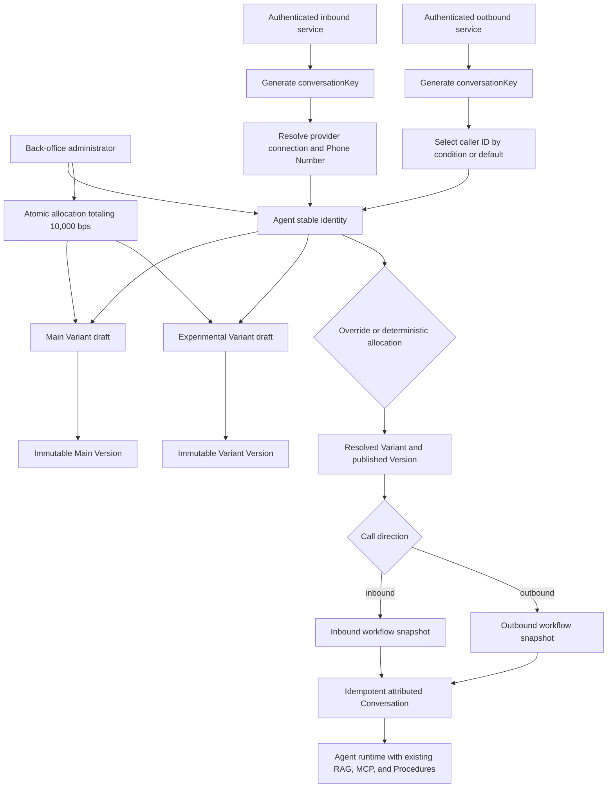

# Agent Variants, Versioned Workflows, and Call Routing

## Goal Capsule

Convert the current single-draft Agent model into a deployment model where each
Agent owns Main plus optional experimental Variants, each Variant owns an
independently publishable draft, and every call is resolved to an immutable
Variant, Agent Version, directional workflow, and phone attribution before
provider dialing or runtime startup.

This is a direct backend integration for an empty product, not a data migration.
It builds on the completed tenant-safe CRUD, Convex RAG, and phone-number
inventory layers and creates the business boundary needed before back-office
Agent, workflow, and deployment screens are implemented.

## Implementation Status (2026-07-18)

All units U1-U8 were implemented on branch `codex/convex-rag-telephony-backend`
in commits `4318f4d` (domain), `aa8cb93` (agent), `42a9ded` (convex), and
`2e8081f` (docs). Structural deviations from the unit file lists, with identical
behavior:

- U5/U6 routing was consolidated into `packages/convex/src/api/conversations.ts`
  (`startFromPhoneNumber`, `startOutboundFromRecipient`) plus
  `api/internals/agentRouting.ts` and `api/internals/machineErrors.ts`; the
  planned `internals/inboundRouting.ts` and `internals/outboundRouting.ts`
  modules were not created.
- The plan-named test files `agentVariants.test.ts`,
  `agentVariantDeployment.test.ts`, `agentRouting.test.ts`,
  `inboundRouting.test.ts`, and `outboundRouting.test.ts` were folded into
  `api/__tests__/api.test.ts`, `__tests__/tenancy.test.ts`,
  `__tests__/agent-contract.test.ts`, and `__tests__/machineHttp.test.ts`.

`docs/reference/agent-deployment-routing.md` is the living contract for the
implemented surface.

## Product Contract

### Problem Frame

The current Agent table combines stable identity, mutable draft configuration,
and one published version pointer. That shape cannot represent Main plus test
Variants, independent publishing, deterministic traffic allocation, or separate
inbound and outbound behavior.

The current inbound machine mutation also accepts an `agentVersionId` from its
caller, which bypasses number assignment and deployment allocation. The existing
outbound phone selector chooses a caller ID but does not yet create a fully
attributed Conversation through the same deployment contract.

### Actors

- **Tenant administrator:** manages Agents, Variants, drafts, publish state,
  traffic allocation, and phone assignment.
- **Campaign operator:** starts outbound work and may use an explicitly
  authorized Variant override.
- **Back-office server:** owns provider SDK calls and trusted provider-number
  import, purchase, port, release, and refresh orchestration.
- **Inbound service:** authenticates provider webhooks and asks Convex to
  resolve and start an inbound Conversation.
- **Outbound service:** asks Convex to select a caller ID, resolve a deployment,
  and start an outbound Conversation before dialing.
- **Agent runtime:** receives the resolved immutable configuration and appends
  or finishes Conversation data through authenticated machine APIs.

### Requirements

- **R1:** `agents` is the stable deployment identity and no longer owns mutable
  runtime configuration or a published-version pointer.
- **R2:** Every Agent has exactly one non-archivable Main Variant and may have
  additional tenant-scoped Variants.
- **R3:** Each Variant owns an independent mutable draft, traffic weight in
  integer basis points, archive state, and optional current published-version
  pointer.
- **R4:** Creating a Variant clones Main's current draft and starts with zero
  traffic.
- **R5:** Procedures belong to a Variant because procedure configuration may
  differ between Main and experiments.
- **R6:** Publishing snapshots only the selected Variant, including its
  procedures and inbound/outbound workflow configuration, and advances only that
  Variant's pointer.
- **R7:** Merging a winning Variant copies its draft configuration into Main and
  publishes a new immutable Main Version without mutating prior Versions or the
  source Variant.
- **R8:** A complete deployed traffic allocation totals exactly `10_000` basis
  points and is updated atomically.
- **R9:** Published Variants may remain at zero weight and are eligible only for
  authorized explicit overrides, not normal weighted traffic.
- **R10:** Normal Variant allocation is deterministic from a trusted,
  caller-generated `conversationKey`, producing the same Variant for every
  retry.
- **R11:** Call direction selects the resolved Variant's inbound or outbound
  workflow after Variant allocation; direction never selects a Variant.
- **R12:** Every Conversation persists `conversationKey`, `agentId`,
  `agentVariantId`, `agentVersionId`, direction, workflow attribution,
  allocation mode, and immutable phone attribution where applicable.
- **R13:** Inbound routing derives tenant and Agent from an authenticated
  Telephony Connection and active assigned Phone Number, then performs weighted
  Variant allocation and resolves the inbound workflow.
- **R14:** Outbound routing uses the existing caller-ID condition/default
  selector, then performs weighted allocation or an authorized same-Agent
  published Variant override and resolves the outbound workflow.
- **R15:** Inbound and outbound start operations are idempotent by
  `conversationKey`; retries return the existing Conversation and never
  reallocate or duplicate it.
- **R16:** Machine HTTP endpoints require `CONVEX_SERVICE_TOKEN`; provider
  signature verification remains in the provider-facing service boundary.
- **R17:** Public and machine DTOs expose deployment attribution but never
  expose provider credentials, MCP headers, secret references, or raw RAG
  component internals.
- **R18:** Existing Convex RAG retrieval remains the Knowledge Base runtime
  implementation; this work only preserves Variant-scoped attachment
  configuration in immutable Version snapshots.

### Core Flows

#### F1: Create, Publish, and Allocate a Variant

1. An administrator creates an Agent, which atomically creates its Main Variant.
2. Main begins with a mutable draft and no callable published Version.
3. Publishing Main snapshots its draft and Procedures into a new Agent Version.
4. If this is the first deployed Version, Main receives `10_000` basis points.
5. Creating another Variant clones Main's current draft and assigns zero weight.
6. Publishing that Variant makes it eligible for an explicit override but does
   not change production allocation.
7. An administrator atomically submits the complete allocation for all deployed
   Variants.

#### F2: Resolve an Inbound Call

1. The inbound service authenticates the provider request and generates a stable
   `conversationKey`.
2. It calls the internal Convex route with provider connection and
   provider-number identity, not tenant, Agent, Variant, or Version IDs.
3. Convex resolves an active inbound-capable Phone Number and derives its tenant
   and assigned Agent.
4. Convex deterministically allocates a published Variant with positive weight.
5. Convex resolves that Variant's current published Version and inbound
   workflow.
6. Convex atomically creates and returns a fully attributed Conversation and
   runtime-resolution DTO.
7. A retry with the same `conversationKey` returns the same Conversation.

#### F3: Resolve an Outbound Call

1. The outbound service generates one `conversationKey` for each concrete
   recipient attempt.
2. Convex validates the Agent or batch recipient and runs the existing caller-ID
   condition/default selection.
3. Convex selects a Variant through deterministic allocation unless an
   authorized override is present.
4. An override must reference a published, non-archived Variant of the same
   Agent; zero weight is allowed.
5. Convex resolves the outbound workflow and creates the fully attributed
   Conversation before provider dialing.
6. The provider service dials only with the returned normalized phone identity
   and runtime configuration.

#### F4: Merge a Winning Variant

1. An administrator selects a published or draft Variant as the merge source.
2. Convex copies its mutable configuration and Procedures into Main's draft.
3. Convex publishes a new immutable Main Version in the same operation.
4. Existing Conversations and historical Agent Versions remain unchanged.
5. Traffic allocation is changed separately so deployment ramps remain explicit
   and auditable.

### Acceptance Examples

- **AE1:** Creating an Agent creates exactly one Main Variant and a second Main
  cannot be created concurrently.
- **AE2:** Main cannot be archived, and a positive-weight Variant cannot be
  archived until allocation is changed.
- **AE3:** Creating Variant A clones Main's draft and Procedures but gives
  Variant A an independent draft and zero traffic.
- **AE4:** Publishing Variant A advances only Variant A's `publishedVersionId`;
  Main remains unchanged.
- **AE5:** A traffic update totaling `9_999` or `10_001` is rejected without
  changing any Variant.
- **AE6:** A traffic update containing a foreign-tenant, foreign-Agent,
  archived, duplicate, or unpublished positive-weight Variant is rejected
  atomically.
- **AE7:** The same `conversationKey` and allocation snapshot always select the
  same Variant.
- **AE8:** A zero-weight Variant is never selected normally but can be selected
  by an authorized outbound override.
- **AE9:** An inbound request for an unassigned, disabled, archived,
  provider-missing, or inbound-incapable number fails before creating a
  Conversation.
- **AE10:** Inbound callers cannot supply `tenant`, `agentId`, `agentVariantId`,
  or `agentVersionId`.
- **AE11:** Outbound caller-ID selection uses a matching eligible condition
  first and the explicit eligible default otherwise; no eligible result fails
  before dialing.
- **AE12:** Two retries with the same `conversationKey` return one Conversation
  with identical phone, Variant, Version, and workflow attribution.
- **AE13:** Direction selects different workflow snapshots from the same Variant
  without affecting Variant allocation.
- **AE14:** Merging Variant A creates a new Main Version and never mutates prior
  Main or Variant A Versions.
- **AE15:** Runtime resolution continues to provide prompt-mode and auto-mode
  Knowledge Base attachments through the existing Convex RAG integration.

### Scope Boundaries

#### In Scope

- Domain schemas and pure allocation/workflow validators.
- Agent Variant CRUD, publish, merge, and atomic allocation services.
- Variant-owned Procedures and immutable Agent Version snapshots.
- Directional inbound/outbound workflow configuration and resolution.
- Inbound and outbound route-and-start Convex mutations.
- Authenticated machine HTTP endpoints for start, append, and finish.
- Idempotent Conversation creation and complete attribution.
- Back-office-safe read models needed by the next UI iteration.

#### Out of Scope

- Back-office pages, charts, deployment analytics, and experiment statistics.
- A generic visual node/edge workflow engine or EL-style workflow editor.
- Provider number purchase, port, release, import orchestration, or direct
  provider SDK calls from Convex.
- Provider webhook signature verification inside Convex.
- Campaign scheduling and recipient lifecycle beyond the existing batch-call
  substrate.
- Replacing the Convex RAG component, duplicating chunks, or moving attachment
  `usageMode` into RAG filters.
- Historical data backfill or compatibility shims for the current empty schema.

### Dependencies and Sources

- `docs/adr/0003-separate-agent-variants-channel-workflows-and-phone-routing.md`
  is the accepted deployment and routing authority.
- `docs/reference/phone-number-inventory.md` defines phone ownership,
  eligibility, and provider-operation boundaries.
- `docs/reference/convex-data-services.md` defines tenant-safe DTO and
  pagination conventions.
- `docs/voice-provider-adapter.md` defines the `v-inbound`, `v-outbound`, and
  Agent runtime boundaries.
- `docs/plans/2026-07-15-001-feat-tenant-phone-number-inventory-plan.md`
  supplies the implemented inventory and caller-ID selection substrate.
- `docs/plans/2026-07-15-002-feat-tenant-safe-convex-data-services-plan.md`
  supplies the implemented CRUD, authorization, RAG, and investigation
  substrate.

## Planning Contract

This plan was bootstrapped from accepted ADR 0003, the implemented backend, and
user-approved decisions from the architecture grill. It creates a new
implementation artifact and does not replace either completed 2026-07-15 plan.

Requirements R1-R18, flows F1-F4, and acceptance examples AE1-AE15 are
authoritative for this implementation. Implementation details may change during
execution only when they preserve those contracts or when a genuine
contradiction is surfaced.

## Key Technical Decisions

### KTD1: Direct Schema Integration

Replace the current draft ownership directly because the application has no
production data to migrate. Do not add dual-read, dual-write, backfill, or
legacy compatibility paths.

### KTD2: Variant Is the Mutable Deployment Boundary

`agents` retains stable identity and archive state. `agentVariants` owns draft
configuration, `publishedVersionId`, `trafficWeightBps`, Main identity, and
archive state. `agentVersions` records both `agentId` and `agentVariantId` and
uses a per-Variant version sequence.

This is session-settled: user-approved, chosen over keeping mutable draft state
on Agent.

### KTD3: Procedures Move to Variant Ownership

Procedure rows reference `agentVariantId`, and publish snapshots only the
selected Variant's Procedures. Variant creation clones Main's Procedure drafts
transactionally.

This is session-settled: user-approved, chosen because Variants may change tools
and behavior independently.

### KTD4: Directional Workflow Config, Not a Generic Graph Engine

The Variant draft contains validated `inboundWorkflow` and `outboundWorkflow`
configuration, and Agent Versions snapshot both. The initial schemas represent
runtime options and outbound caller-ID policy required by the current backend;
Procedure condition branches continue to own conversational branching. A generic
node/edge workflow execution model is deferred until its node semantics, state
model, and failure behavior are specified.

This preserves ADR 0003's direction boundary without inventing an unapproved
editor runtime.

### KTD5: Basis-Point Allocation Is Atomic

Store integer weights from `0` through `10_000`. `setTrafficAllocation` accepts
the complete allocation for an Agent, validates every row, and patches all
Variants in one Convex transaction. After first deployment, active allocation
must total exactly `10_000`; first Main publish initializes Main to `10_000`,
while newly published Variants remain at zero.

This is session-settled: user-approved, chosen over floating-point percentages
and piecemeal updates.

### KTD6: `conversationKey` Is the Allocation and Idempotency Identity

Trusted inbound/outbound services generate a `conversationKey` before routing.
The key is a high-entropy random UUID (it doubles as ownership proof for
append/finish, so it must never be derivable), persisted on the caller's durable
attempt record and re-sent verbatim on retry. Convex additionally dedupes
redeliveries server-side by tenant + provider + `providerSessionId`, so a
stateless caller that crashed before persisting its key cannot create a
duplicate Conversation. (Revised 2026-07-18 by the hardening plan — this
supersedes the earlier deterministic-derivation wording.) A shared pure domain
hash maps the key into bucket `0..9_999`, and cumulative basis-point ranges
select the Variant in a stable order. Stable ordering uses the immutable
per-Variant `allocationOrdinal` assigned at Variant creation, and the Agent's
`allocationRevision` records the allocation epoch (see
`docs/reference/agent-deployment-routing.md`). The Conversation stores the key,
bucket, allocation mode, selected Variant, and Version. Convex `_id` remains the
storage identifier.

This refines ADR 0003's conversation-id wording so allocation can happen before
insertion and retries cannot create a different result.

### KTD7: Phone Selection and Variant Selection Remain Independent

Reuse and adapt `packages/convex/src/api/phoneRouting.ts` for outbound caller-ID
selection. Caller-ID rules choose the source Phone Number; allocation chooses
the Agent Variant. Neither concern may mutate or implicitly override the other.

This is session-settled: user-approved, chosen over using Variants to separate
inbound and outbound traffic.

### KTD8: Route and Start Is One Transactional Business Operation

Inbound and outbound machine mutations validate eligibility, resolve deployment,
and create the attributed Conversation in one transaction. They do not expose an
intermediate client-selected Version ID. An existing Conversation found by
`conversationKey` is returned only when its direction, provider identity, and
resolved owner fields match the current request; any mismatch returns an
idempotency conflict.

The implemented surface also exposes trusted non-voice start channels beyond
this plan's original voice scope: `POST /api/machine/conversations/whatsapp` and
`POST /api/machine/conversations/direct` (see
`docs/reference/agent-deployment-routing.md`). The direct channel accepts a
caller-supplied `agentVersionId` by design — it pins an immutable published
Version for trusted non-voice callers and is not subject to AE10, whose
prohibition applies to inbound telephony callers only. Non-voice channels
resolve no directional workflow.

### KTD9: Convex Persists; Provider Services Operate SDKs

The back-office server and voice services own Twilio or other provider network
calls, signature verification, number purchase, port, release, and refresh
orchestration. Convex may use trusted internal mutations to store normalized
results but does not become the provider control plane.

### KTD10: RAG Remains Component-Owned

Agent Version snapshots retain Knowledge Base attachment IDs and `usageMode`.
The existing Agent resolver continues to load prompt-mode content and expose
auto-mode retrieval through the Convex RAG component. No RAG filter or duplicate
embedding is introduced for attachment `usageMode`.

## High-Level Design



### Target Ownership Model

| Resource        | Owns                                                                                                                  | Does not own                                    |
| --------------- | --------------------------------------------------------------------------------------------------------------------- | ----------------------------------------------- |
| `agents`        | Stable tenant deployment identity, display name, archive state, Main reference, `allocationRevision`                  | Draft configuration, traffic, published pointer |
| `agentVariants` | Independent draft, Main marker, traffic basis points, immutable `allocationOrdinal`, published pointer, archive state | Immutable history                               |
| `agentVersions` | Immutable Variant snapshot, per-Variant sequence, publisher, directional workflows                                    | Mutable draft state                             |
| `procedures`    | Variant-owned mutable procedure definitions                                                                           | Agent-global behavior                           |
| `phoneNumbers`  | Provider number identity, capabilities, default inbound Agent assignment                                              | Variant assignment                              |
| `conversations` | Immutable Agent, Variant, Version, workflow, allocation, and phone attribution                                        | Mutable deployment selection                    |

## Sequencing

1. Establish domain schemas and pure invariants before changing Convex services.
2. Implement Variant lifecycle and publishing before call routing can consume
   it.
3. Implement directional workflow resolution and allocation as shared internal
   services.
4. Replace inbound start and compose outbound start around the resolved
   deployment contract.
5. Expose authenticated machine HTTP endpoints and update the Agent runtime
   client.
6. Finish with safe read models, references, generated types, and focused
   validation.

## Implementation Units

### U1: Domain Model and Pure Routing Invariants

**Goal:** Define the portable Agent Variant, workflow, allocation, and
Conversation attribution contracts.

**Requirements:** R1-R12, R17-R18; AE1-AE8, AE13-AE15.

**Dependencies:** None.

**Files:**

- `packages/domain/src/schemas/agents.ts`
- `packages/domain/src/schemas/procedures.ts`
- `packages/domain/src/schemas/conversations.ts`
- `packages/domain/src/schemas/batch-calls.ts`
- `packages/domain/src/schemas/index.ts`
- `packages/domain/src/index.ts`
- `packages/domain/src/routing/variant-allocation.ts` (new)
- `packages/domain/src/routing/__tests__/variant-allocation.test.ts` (new)
- `packages/domain/src/schemas/__tests__/tables.test.ts`

**Approach:**

- Split stable Agent identity from a reusable `agentVariantDraftConfig`
  containing the current model, voice, tool, MCP, Knowledge Base, dynamic
  variable, and directional workflow fields.
- Add `agentVariants` and make `agentVersions` reference both Agent and Variant.
- Move Procedure ownership to `agentVariantId` and keep inline Procedure
  snapshots in immutable Version configuration.
- Add Conversation allocation and workflow-attribution fields, including a
  unique/idempotent `conversationKey` contract.
- Define a deterministic hash and cumulative weighted-selection helper with
  explicit stable Variant ordering.
- Keep shared schemas provider-neutral and free of Convex runtime dependencies.

**Patterns:** Follow `tenantTable` schema composition in
`packages/domain/src/schemas/agents.ts` and Zod-first exports in
`packages/domain/src/schemas/index.ts`.

**Test Scenarios:**

1. Domain schemas accept Main and zero-weight published Variants but reject
   invalid basis points and incomplete workflow shapes.
2. Allocation returns the same bucket and Variant for the same key and ordered
   allocation.
3. Boundary buckets select the correct cumulative range, including bucket `0`
   and `9_999`.
4. Zero-weight Variants are never selected.
5. Allocation rejects totals other than `10_000`, duplicate Variant IDs, and an
   empty deployed allocation.
6. Conversation schemas require Variant, Version, allocation, and workflow
   attribution.

**Verification:** Run focused domain tests and typecheck before generating
Convex bindings.

### U2: Agent and Variant Lifecycle Services

**Goal:** Make Agent creation, Variant CRUD, cloning, and archive invariants
tenant-safe and transactional.

**Requirements:** R1-R5, R8-R9, R17; AE1-AE3, AE6.

**Dependencies:** U1.

**Files:**

- `packages/convex/src/schema.ts`
- `packages/convex/src/api/agents.ts`
- `packages/convex/src/api/agentVariants.ts` (new)
- `packages/convex/src/api/internals/agentVariants.ts` (new)
- `packages/convex/src/api/procedures.ts`
- `packages/convex/src/api/internals/procedures.ts`
- `packages/convex/src/api/__tests__/agentVariants.test.ts` (new)
- `packages/convex/src/__tests__/tenancy.test.ts`

**Approach:**

- Define tenant-leading indexes for Agent Variants, Main lookup, Agent/version
  lookup, and per-Variant version sequencing.
- Create Agent and Main Variant atomically; enforce Main uniqueness
  transactionally because Convex indexes are not uniqueness constraints.
- Clone Main's current draft and Procedure drafts when creating a Variant.
- Expose paginated Variant list/detail DTOs without tenant or secret-bearing
  attachment internals.
- Prevent Main archive and prevent archive while traffic is positive.
- Validate every Agent, Variant, Procedure, KB, and MCP relationship through
  same-tenant lookups.

**Patterns:** Follow tenant resolution and DTO boundaries in
`packages/convex/src/api/agents.ts` and pagination rules in
`docs/reference/convex-data-services.md`.

**Test Scenarios:**

1. Agent creation produces one Main Variant under concurrent attempts.
2. Variant creation clones Main draft and Procedures while preserving
   independent IDs.
3. Foreign-tenant Agent and attachment IDs are indistinguishable from missing
   IDs.
4. Main archive is rejected.
5. Positive-weight Variant archive is rejected; zero-weight non-Main archive
   succeeds without deleting history.
6. Variant list pagination is bounded and does not return draft secrets or
   tenant fields.

**Verification:** Run Variant API and tenancy tests, then regenerate Convex
types.

### U3: Publish, Merge, and Atomic Traffic Allocation

**Goal:** Implement immutable per-Variant publishing, Main merge, and exact
allocation invariants.

**Requirements:** R6-R10; AE4-AE8, AE14.

**Dependencies:** U1-U2.

**Files:**

- `packages/convex/src/api/agents.ts`
- `packages/convex/src/api/agentVariants.ts`
- `packages/convex/src/api/internals/agentVariants.ts`
- `packages/convex/src/api/__tests__/agentVariantDeployment.test.ts` (new)
- `packages/convex/src/__tests__/agent-contract.test.ts`

**Approach:**

- Publish from one Variant draft, expand only its Procedures, validate
  attachments, allocate the next per-Variant version number, insert an immutable
  Version, and patch only that Variant pointer.
- Initialize first published Main to `10_000` basis points only when no deployed
  allocation exists; publish additional Variants at zero.
- Accept complete allocation arrays, validate uniqueness and ownership, require
  positive-weight Variants to be published and active, require exactly `10_000`,
  and patch atomically.
- Merge by copying the source Variant draft and Procedure drafts into Main, then
  publishing a new Main Version in one mutation.

**Patterns:** Preserve immutable narrowing used by `agentVersions` in
`packages/domain/src/schemas/agents.ts` and transactional write style in
existing Convex APIs.

**Test Scenarios:**

1. Publishing one Variant does not change another Variant's pointer or draft.
2. Per-Variant version numbers increment independently.
3. First Main publish establishes full allocation; later Variant publish remains
   zero.
4. Invalid totals, duplicates, foreign Variants, archived Variants, and
   unpublished positive weights reject without partial patches.
5. Zero-weight published Variant remains override-eligible.
6. Merge creates a new Main Version with cloned configuration and leaves all
   prior Versions unchanged.

**Verification:** Run deployment contract tests and inspect generated table/API
types for Variant ownership.

### U4: Workflow and Deployment Resolution

**Goal:** Centralize deterministic Variant allocation and directional workflow
resolution for all call channels.

**Requirements:** R8-R12, R18; AE7-AE8, AE13, AE15.

**Dependencies:** U1-U3.

**Files:**

- `packages/convex/src/api/internals/agentRouting.ts` (new)
- `packages/convex/src/api/__tests__/agentRouting.test.ts` (new)
- `packages/agent/src/agents/resolver.ts`
- `packages/agent/src/types.ts`
- `packages/agent/src/__tests__/agent.test.ts`

**Approach:**

- Add one internal resolver that accepts a validated Agent, `conversationKey`,
  direction, and optional authorized override.
- For normal allocation, load active published Variants through a bounded Agent
  index, validate the stored total, order deterministically, and call the pure
  domain allocator.
- For overrides, validate same tenant, same Agent, published pointer, and
  non-archived state while allowing zero weight.
- Return a provider-neutral runtime DTO containing Agent, Variant, Version,
  workflow, allocation mode/bucket, and immutable config identifiers.
- Update the Agent resolver to consume the selected Version and retain the
  existing RAG prompt/auto, Procedure, and MCP expansion behavior.

**Patterns:** Reuse current Version resolution and RAG behavior in
`packages/agent/src/agents/resolver.ts`; do not issue unbounded `.collect()`
calls on growth-facing tables.

**Test Scenarios:**

1. Weighted resolution is stable for retries and independent of call direction.
2. Inbound and outbound resolve different workflow snapshots from the same
   Version.
3. A valid zero-weight override succeeds while normal allocation never selects
   it.
4. Foreign-Agent, unpublished, or archived overrides fail.
5. A malformed stored allocation fails closed before a Conversation is created.
6. Prompt and auto Knowledge Base modes still resolve through the current RAG
   component paths.

**Verification:** Run routing and Agent resolver tests with deterministic
fixtures.

### U5: Inbound Route and Start

**Goal:** Replace caller-selected Version startup with number-derived,
idempotent inbound routing.

**Requirements:** R10-R16; AE7, AE9-AE10, AE12-AE13.

**Dependencies:** U4 and the phone inventory substrate.

**Files:**

- `packages/convex/src/api/conversations.ts`
- `packages/convex/src/api/internals/inboundRouting.ts` (new)
- `packages/convex/src/api/__tests__/inboundRouting.test.ts` (new)
- `packages/domain/src/schemas/conversations.ts`

**Approach:**

- Replace `startFromPhoneNumber` arguments so callers provide `conversationKey`,
  provider session metadata, and authenticated provider connection/number
  identity only.
- Resolve the connection and number, derive tenant, validate connection/number
  status and inbound capability, and require an assigned active Agent.
- Call the shared deployment resolver with direction `inbound` and no override.
- Insert all immutable attribution fields in the same transaction.
- Use a Conversation index by `conversationKey` to return the existing row
  before any repeat allocation; reject a key reused with conflicting provider
  identity.

**Patterns:** Follow owner-derived tenancy in
`packages/convex/src/api/conversations.ts` and eligibility rules in
`docs/reference/phone-number-inventory.md`.

**Test Scenarios:**

1. Active assigned number creates a fully attributed inbound Conversation.
2. Unassigned, inactive, archived, provider-missing, incapable, or
   unhealthy-connection numbers fail before insertion.
3. Caller-supplied tenant, Agent, Variant, and Version IDs are absent from the
   accepted schema.
4. Same-key retry returns the same Conversation and attribution.
5. Same key with conflicting provider identity fails as an idempotency conflict.
6. Cross-tenant provider-number collisions resolve only within the authenticated
   connection.

**Verification:** Run inbound routing and tenancy tests, including concurrent
same-key attempts.

### U6: Outbound Route and Start

**Goal:** Compose caller-ID selection and Variant resolution into one pre-dial
Conversation operation.

**Requirements:** R10-R15, R17; AE7-AE8, AE11-AE13.

**Dependencies:** U4 and the existing outbound caller-ID selector.

**Files:**

- `packages/convex/src/api/phoneRouting.ts`
- `packages/convex/src/api/conversations.ts`
- `packages/convex/src/api/internals/outboundRouting.ts` (new)
- `packages/convex/src/api/__tests__/outboundPhoneRouting.test.ts`
- `packages/convex/src/api/__tests__/outboundRouting.test.ts` (new)
- `packages/domain/src/schemas/batch-calls.ts`

**Approach:**

- Extract or adapt the existing `selectOutboundForRecipient` logic so
  route-and-start can reuse it without duplicating caller-ID conditions.
- Resolve the tenant and Agent from the batch recipient or trusted Agent owner,
  persist selected Phone Number and reason, then resolve the Variant and
  outbound workflow.
- Accept an optional override only through an authorization-bearing internal
  path; persist `allocationMode: override` and the override reason.
- Create the Conversation before provider dialing and return the selected number
  plus runtime-resolution DTO.
- Keep retries idempotent by `conversationKey`, including caller-ID selection.

**Patterns:** Preserve the condition/default and staged-selection behavior
already tested in
`packages/convex/src/api/__tests__/outboundPhoneRouting.test.ts`.

**Test Scenarios:**

1. Matching geographic/provider condition chooses an eligible number and
   persists its reason.
2. No match uses the explicit eligible default.
3. Missing or ineligible default fails before Conversation creation and dialing.
4. Normal calls use deterministic weighted allocation.
5. Authorized published zero-weight override succeeds; unauthorized or
   foreign-Agent override fails.
6. Same-key retry returns the original phone, reason, Variant, Version, and
   workflow even if routing configuration later changes.

**Verification:** Run existing caller-ID tests plus outbound composition and
idempotency tests.

### U7: Authenticated Machine HTTP Surface

**Goal:** Expose the routing and Conversation lifecycle operations to trusted
voice services without exposing public mutations.

**Requirements:** R15-R17; AE10, AE12.

**Dependencies:** U5-U6.

**Files:**

- `packages/convex/src/http.ts`
- `packages/convex/src/convex.config.ts`
- `packages/convex/src/api/internals/machineAuth.ts` (new)
- `packages/convex/src/__tests__/machineHttp.test.ts` (new)
- `packages/agent/src/types.ts`
- `packages/agent/src/index.ts`

**Approach:**

- Add shared Bearer-token validation for `CONVEX_SERVICE_TOKEN` with
  constant-time comparison where the runtime permits it.
- Declare `CONVEX_SERVICE_TOKEN` in the typed Convex environment map before
  regenerating bindings.
- Add internal HTTP endpoints for inbound route/start, outbound route/start,
  append message, and finish Conversation.
- Validate request bodies with shared schemas, map domain errors to stable
  machine error codes, and never return secret-bearing rows.
- Keep provider signature validation in `v-inbound` and provider SDK operations
  in `v-inbound`, `v-outbound`, or the back-office server.
- Update the Agent runtime ingest interface to use `conversationKey` and
  resolved Conversation ownership instead of caller-supplied Version IDs.

**Patterns:** Follow the Hono/Convex HTTP composition already present in
`packages/convex/src/http.ts` and machine-only mutations in
`packages/convex/src/api/conversations.ts`.

**Test Scenarios:**

1. Missing, malformed, and incorrect service tokens return unauthorized without
   invoking a mutation.
2. Valid token and valid body route to the expected internal function.
3. Invalid body returns a bounded validation error without leaking internals.
4. Append rejects completed Conversations and preserves monotonic sequence
   behavior.
5. Finish is idempotent or returns a stable terminal-state result for retries.
6. Responses omit tenant, credentials, secret references, and provider account
   identifiers.

**Verification:** Run HTTP contract tests and typecheck the Agent ingest client
against generated Convex APIs.

### U8: Back-Office Read Models, References, and Integration Proof

**Goal:** Leave a stable backend contract for the next back-office iteration
without implementing UI.

**Requirements:** R12, R17 (read-model delivery); documents the R13-R16 machine
contracts. Remaining requirements and acceptance examples are end-to-end
verification scope, not new deliverables.

**Dependencies:** U1-U7.

**Files:**

- `packages/convex/src/api/agents.ts`
- `packages/convex/src/api/agentVariants.ts`
- `packages/convex/src/api/conversations.ts`
- `docs/reference/convex-data-services.md`
- `docs/reference/phone-number-inventory.md`
- `docs/reference/agent-deployment-routing.md` (new)
- `docs/voice-provider-adapter.md`
- `packages/convex/src/_generated/api.d.ts` (generated)
- `packages/convex/src/api/__tests__/dataServiceContracts.test.ts`

**Approach:**

- Provide paginated Agent/Variant summaries with Main identity, publish state,
  allocation, workflow readiness, and non-secret configuration health.
- Extend Conversation summaries/details with Variant, Version, allocation,
  workflow, and caller-ID attribution suitable for investigation screens.
- Document the exact machine request/response DTOs, error codes, lifecycle
  rules, and provider-operation boundary.
- Update cross-references so the prior phone and data-service plans point to the
  implemented deployment contract without rewriting their history.
- Regenerate Convex bindings only after the schema and API surface stabilize.

**Patterns:** Preserve explicit DTO mapping and pagination metadata from
`docs/reference/convex-data-services.md`.

**Test Scenarios:**

1. Agent list/detail exposes Main and Variant deployment state without full
   unbounded child collection.
2. Conversation detail exposes immutable routing attribution and masked
   participant data.
3. Public DTO snapshots contain no secret-bearing fields.
4. Generated API types compile for domain, Convex, and Agent packages.
5. Reference examples match actual exported function names and accepted schemas.

**Verification:** Run data-service contract tests, code generation, focused
typechecks, and documentation path validation.

## Risks and Dependencies

| Risk                                                                  | Impact                                                    | Mitigation                                                                                                                  |
| --------------------------------------------------------------------- | --------------------------------------------------------- | --------------------------------------------------------------------------------------------------------------------------- |
| Workflow requirements expand into an unspecified visual graph runtime | Incorrect abstraction and stalled backend                 | Keep this plan to validated directional runtime configuration; plan the graph engine separately after semantics are grilled |
| Allocation order changes and remaps future keys                       | Experiment distribution becomes difficult to reason about | Define one stable sort key and persist selected Variant/bucket on every Conversation                                        |
| Incomplete deployment state reaches routing                           | Calls fail after provider acceptance or before dial       | Publish and allocation validation fail closed; route/start validates the complete snapshot before insertion                 |
| Idempotency key reuse crosses operations                              | Wrong historical call is returned                         | Scope and validate `conversationKey` against direction, provider identity, and owner fields                                 |
| Variant clone exceeds Convex transaction or document limits           | Create/publish fails for large Agent configurations       | Preserve existing publish size checks and Procedure snapshot overflow strategy; add bounded size tests                      |
| Provider logic leaks into Convex                                      | Secrets and network retries become coupled to persistence | Keep SDK calls and webhook verification in server services; Convex receives normalized trusted commands                     |
| Existing full-workspace checks are noisy                              | Valid backend work is obscured by unrelated app failures  | Use focused package gates as required proof and report full-workspace failures separately                                   |

## Verification Contract

The implementation is complete only when these focused gates pass from the
repository root:

```bash
vp run @agent.io/convex#codegen
vp test run packages/domain/src packages/convex/src packages/agent/src
vp run typecheck --filter @agent.io/domain --filter @agent.io/convex --filter @agent.io/agent
vp check packages/domain/src packages/convex/src packages/agent/src
```

Additionally:

- Run concurrency tests for Main creation, first publish, complete allocation
  updates, and same-key Conversation startup.
- Inspect generated Convex API types to verify no machine route accepts tenant,
  Agent Variant, or Agent Version selection from inbound callers.
- Run the broader workspace test/check commands as advisory evidence and
  distinguish pre-existing application failures from failures introduced by this
  work.
- Validate all plan and reference links as repo-relative paths.

## Definition of Done

- Agents are stable identities with exactly one Main Variant.
- Mutable configuration, Procedures, traffic, and published pointers are
  Variant-owned.
- Agent Versions are immutable, Variant-attributed, and independently sequenced.
- Traffic allocation is deterministic, atomic, exact to `10_000` basis points,
  and supports published zero-weight Variants.
- Inbound route/start derives its deployment from authenticated connection and
  Phone Number identity and accepts no caller-selected Version.
- Outbound route/start composes the existing caller-ID policy with weighted
  allocation or an authorized override before dialing.
- Every Conversation has immutable, idempotent Agent, Variant, Version,
  workflow, allocation, and phone attribution where applicable.
- Machine start, append, and finish operations are protected by
  `CONVEX_SERVICE_TOKEN` and expose safe DTOs.
- Existing Convex RAG prompt/auto behavior remains covered and does not
  duplicate component data.
- Provider SDK operations remain outside Convex.
- Focused codegen, tests, typechecks, and checks pass, and reference
  documentation matches the implemented contracts.

## Deferred / Open Questions

> **Resolved 2026-07-18:** every item below was addressed by
> `docs/plans/2026-07-18-001-fix-routing-review-hardening-plan.md` (implemented
> same day). Per-item resolutions: per-service `CONVEX_SERVICE_TOKENS` with
> rotation overlap; canonical durable-identity fingerprints with conflict
> recovery and provider-session dedupe; tenant-admin-persisted overrides with
> audit fields; retention purge cron + erasure primitive;
> `conversationKey`-bound append/finish; per-call allocation accepted and
> documented; per-Variant outcome counters; `republishVersion` rollback;
> `dial_failed`/`never_dialed` lifecycle; caller-ID single ownership documented;
> R12 workflow attribution scoped to voice. See
> `docs/reference/agent-deployment-routing.md` for the updated contract.

### From 2026-07-18 review

- **[P1] Service token lifecycle (security):** `CONVEX_SERVICE_TOKEN` is a
  single flat token shared by every machine caller, with no rotation cadence,
  per-service scoping, revocation path, or dual-token overlap window. Decide
  whether to support two concurrently valid tokens for zero-downtime rotation
  and per-service issuance before real telephony traffic.
- **[P1] Idempotency fingerprint uses mutable resolved fields (adversarial):**
  KTD8 conflicts a retry when re-resolved owner fields changed between attempts
  (for example a number reassignment mid-retry), leaving a Conversation the
  caller can never re-fetch. Consider fingerprinting only caller-supplied
  request identity (direction, provider identity, provider).
- **[P2] Variant-override authorization actor (security):** who authorizes an
  outbound override, where the authorization is persisted, and its audit trail
  are undefined; today any token holder could pin any published Variant.
  Consider honoring only overrides already stored server-side on the
  batch/recipient record by a tenant-administrator mutation.
- **[P2] PII lifecycle (security):** no retention/deletion policy for
  transcripts and participant phone numbers, no log-redaction rule for machine
  request bodies, no GDPR/CCPA deletion mechanism.
- **[P2] Append/finish caller binding (security):** append and finish are bound
  only to the shared service token, not to the conversation; consider requiring
  the `conversationKey` (or a per-conversation secret from the start response)
  on mutating lifecycle calls.
- **[P2] Caller stickiness (adversarial):** allocation units are individual
  calls, not callers — a repeat caller can flip Variants between calls. Decide
  whether that trade-off is accepted or inbound should hash a caller-stable
  identity during experiments.
- **[P2] Merge decision signal (adversarial):** experiment analytics are out of
  scope, so merges currently have no quantitative basis. Consider a minimal
  per-Variant aggregate (conversation count and terminal-status breakdown by
  Version) in the read models.
- **[P2] Main publish rollback (adversarial):** publish (including inside merge)
  is an instant full-weight cutover with no ramp or rollback; consider a
  "republish prior Version" pointer-rollback operation as the emergency path.
- **[P2] Failed-dial Conversation lifecycle (adversarial):** a Conversation
  created before a dial that never happens is indistinguishable from a real
  exposure. Define a never-dialed/failed-dial terminal status and whether a
  re-dial reuses the original `conversationKey`.
- **[P2] Outbound caller-ID policy ownership (scope):** KTD4 says workflow
  config carries "outbound caller-ID policy" while KTD7 gives ownership to the
  phoneRouting selector; clarify whether the workflow config is the selector's
  input or should drop caller-ID fields.
- **[P2] Non-voice workflow attribution (adversarial, FYI):** R12 requires
  workflow attribution on every Conversation, but non-voice channels resolve no
  directional workflow; scope R12's requirement to voice directions explicitly.
