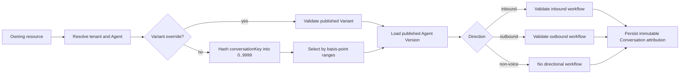

# Agent Deployment and Routing Reference

This document defines the implemented Convex contract for Agent identity,
Variants, immutable Versions, directional workflow selection, and Conversation
attribution. Provider SDK calls and webhook signature verification remain in the
back-office, `v-inbound`, and `v-outbound` servers.

## Deployment Model

- An `agents` row is stable tenant-owned identity. It stores the Agent name,
  `mainVariantId`, `allocationRevision`, and archive state.
- An `agentVariants` row owns mutable draft configuration, Procedures, publish
  state, immutable `allocationOrdinal`, and traffic weight in basis points.
- An `agentVersions` row is an immutable published snapshot of one Variant.
- Main is a real Variant. Creating an Agent atomically creates Main with zero
  traffic. Its first publish initializes Main to 10,000 basis points.
- Every active published Variant must appear exactly once when traffic is
  changed, and all weights must total exactly 10,000.

Agent reads are paginated. `agents.list` returns each bounded Agent page with a
Main summary. `agentVariants.listByAgent` returns the full Variant inventory as
a separate paginated collection. Variant summaries expose whether a published
Version exists, workflow readiness, traffic allocation, and attachment counts,
but no secrets.

## Routing Flow

Weighted selection is deterministic for the same `conversationKey` and
allocation. Allocation uses immutable Variant ordinals, so renaming or query
order cannot change the result. Overrides are allowed only for an active,
published Variant belonging to the resolved Agent; a zero-weight Variant is
valid when explicitly overridden.

## Machine HTTP API

All routes require `Authorization: Bearer <CONVEX_SERVICE_TOKEN>`. The token is
compared without early exit. Invalid JSON or schema-invalid input returns
`400 { "error": "invalid_request" }`; missing or invalid credentials return
`401 { "error": "unauthorized" }`. Known routing and conflict codes are returned
with `409` or `422`. Unexpected internal errors are reduced to
`machine_request_failed`; stack traces and database details are never returned.

| Route                                          | Required body                                                                     | Derived by Convex                                                                       |
| ---------------------------------------------- | --------------------------------------------------------------------------------- | --------------------------------------------------------------------------------------- |
| `POST /api/machine/conversations/inbound`      | `telephonyConnectionId`, `providerNumberId`, `conversationKey`, `provider`        | Phone Number, tenant, assigned Agent, weighted Variant, Version, inbound workflow       |
| `POST /api/machine/conversations/outbound`     | `batchCallRecipientId`, `conversationKey`, `provider`                             | tenant, Agent, authorized batch Variant override, caller ID, Version, outbound workflow |
| `POST /api/machine/conversations/whatsapp`     | `whatsappAccountId`, `conversationKey`, `provider`, `direction`                   | tenant, assigned Agent, weighted Variant, Version                                       |
| `POST /api/machine/conversations/direct`       | `agentVersionId`, `conversationKey`, `provider`, non-voice `channel`, `direction` | tenant, Agent, Variant from the immutable Version                                       |
| `POST /api/machine/conversations/:id/messages` | role plus transcript/tool fields                                                  | tenant and Agent attribution from the Conversation                                      |
| `POST /api/machine/conversations/:id/finish`   | terminal status and optional usage                                                | tenant from the Conversation                                                            |

Start routes return the Conversation ID, immutable Agent/Variant/Version
attribution, selected directional workflow configuration, safe Version config,
and normalized Phone Number routing result when applicable. They omit tenant,
credentials, provider account identifiers, and secret references. Append returns
the message id and monotonic sequence. Finish returns `finished` on the first
write and `already_finished` for an identical retry; a retry with a different
terminal status fails with `terminal_state_conflict`.

`conversationKey` is the idempotency key. Repeating the same start payload
returns the existing Conversation. Reusing the key with a different routing
fingerprint fails with `idempotency_conflict`.

## Immutable Attribution

Each Conversation stores `agentId`, `agentVariantId`, `agentVersionId`,
`allocationMode`, optional allocation bucket and revision, selected workflow,
channel owner, and selected Phone Number. Outbound Conversations also copy the
caller-ID selection reason from the recipient attempt. Participant numbers are
masked in public DTOs.

Inventory reassignment, draft edits, publishing, and later traffic changes do
not rewrite an existing Conversation. This attribution is the basis for future
comparison and charting; aggregate experiment statistics are intentionally not
part of this backend integration.

## Provider Boundary

Convex stores normalized provider inventory and routing decisions. It does not
purchase, port, release, dial, or answer numbers and does not verify Twilio or
other provider signatures. Provider-facing servers authenticate the webhook,
call this machine API to create the attributed Conversation, then use the
provider SDK. This ordering creates the durable idempotency record before an
external dial side effect.
