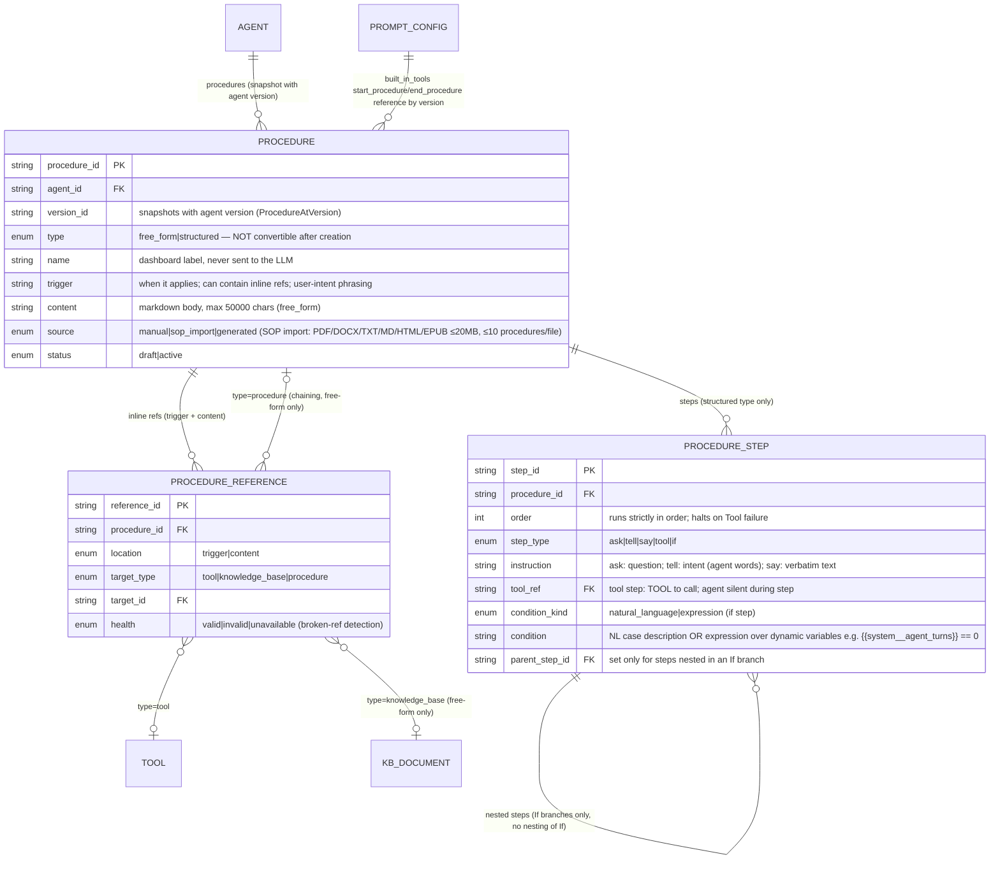
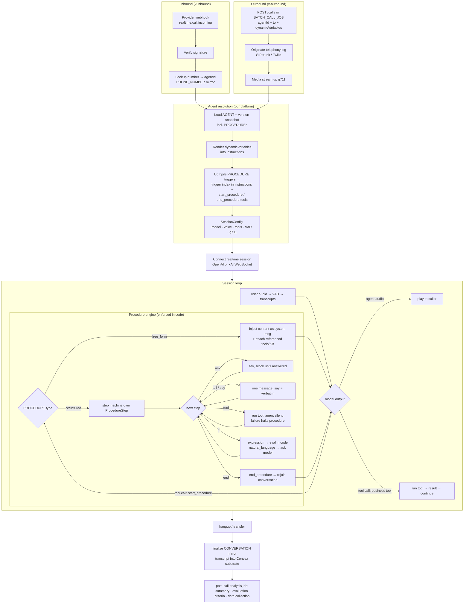
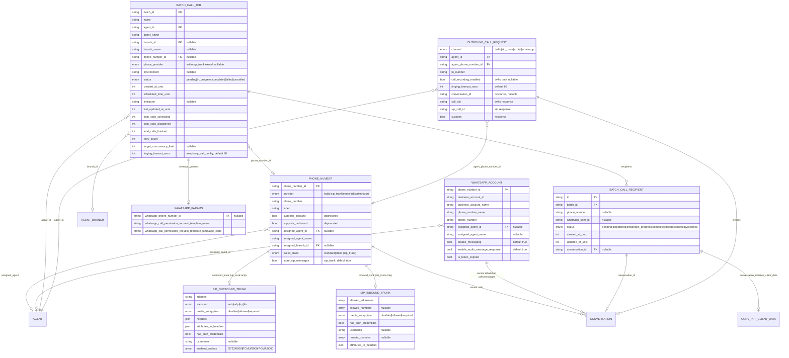

# ERD — ElevenLabs Agents & Calls (Detailed)

> **Scope.** This is a reference model of the **ElevenLabs API surface**, not
> agent.io's storage schema. agent.io is a calling/AI-agents platform that uses
> ElevenLabs as its first voice provider: ElevenLabs remains the system of
> record for everything below. The platform persists only the mirror subset
> defined in the "App ownership & persistence" section — everything else is
> fetched from the API at runtime or referenced by ID.
>
> **Provenance.** Snapshot of the ElevenLabs docs fetched **2026-07-05** into
> `docs/.references/api-reference/`. Volatile enum lists (LLM model ids,
> initiation sources, PII entity types, widget strings) are transcribed
> abbreviated — treat the fetched `.md` files as authoritative and re-fetch when
> integrating a new API area. For request/response typing, prefer generating
> types from the OpenAPI blocks in those files over hand-copying from this ERD.

Source of truth: the API response schemas in this folder
(`api-reference/agents/get.md`, `conversations/get.md`, `batch-calling/get.md`,
`phone-numbers/get.md`, `tools/get.md`, `knowledge-base/*`, `tests/*`,
`mcp/get.md`, `whats-app/*`, `workspace/secrets/list.md`,
`conversations/tags/get.md`).

Mermaid ERDs cannot nest object attributes, so every JSON sub-object from the
API (e.g. `conversation_config.tts`, `metadata.charging`) is flattened into its
own entity with a 1–1 relationship to its parent. **Only entities with a
`PK`-marked ID are real, independently addressable API resources; every other
entity is embedded JSON on its parent — a diagram artifact, not a storage
table.** Enum values and defaults are kept as attribute comments. The model is
split into four domain diagrams that share entities by name.

---

## 0. App ownership & persistence matrix

How this model maps onto the four apps in `apps/` and the Convex substrate
(`packages/convex`). Legend: **W** = writes/initiates via ElevenLabs API, **R**
= reads, **M** = mirrored into Convex (subset of fields), **–** = not touched.
ElevenLabs is the system of record for every entity; "mirror" means a local
projection keyed by the vendor ID.

| Entity cluster                          | messages         | v-inbound         | v-outbound            | back-office        | Local persistence (Convex)                                                                                                            |
| --------------------------------------- | ---------------- | ----------------- | --------------------- | ------------------ | ------------------------------------------------------------------------------------------------------------------------------------- |
| AGENT + config tree (diag. 1)           | R                | R                 | R                     | W                  | M: agent_id, name, tags, version/branch ids for listing; config fetched live                                                          |
| PROCEDURE / STEP / REFERENCE (diag. 1b) | R                | R                 | R                     | W                  | **Fully platform-owned** (no vendor API yet): authored in back-office, stored in Convex, compiled into session config by the resolver |
| CONVERSATION + transcript (diag. 2)     | W (WhatsApp/SMS) | W (inbound calls) | W (outbound calls)    | R (analysis, tags) | M: single `conversations` table — see single-writer rule below                                                                        |
| PHONE_NUMBER + SIP trunks               | –                | R                 | R                     | W                  | M: phone_number_id, number, provider, assigned agent                                                                                  |
| WHATSAPP_ACCOUNT                        | W                | –                 | –                     | R                  | M: phone_number_id, business account, assigned agent                                                                                  |
| BATCH_CALL_JOB / RECIPIENT              | –                | –                 | W                     | R                  | M: batch_id, status, counters for dashboards                                                                                          |
| OUTBOUND_CALL_REQUEST                   | W (WhatsApp)     | –                 | W (twilio/sip/exotel) | –                  | not persisted; resulting conversation_id is                                                                                           |
| TOOL / MCP_SERVER / SECRET              | –                | –                 | –                     | W                  | M: ids + names for pickers; config fetched live                                                                                       |
| KB_DOCUMENT / RAG_INDEX                 | –                | –                 | –                     | W                  | M: ids + names; content stays vendor-side                                                                                             |
| TEST / TEST_INVOCATION / TEST_RUN       | –                | –                 | –                     | W                  | R via API; persist only invocation ids if dashboards need history                                                                     |
| WORKSPACE / ENVIRONMENT_VARIABLE        | –                | –                 | –                     | W                  | see tenancy note below                                                                                                                |

**CONVERSATION single-writer rule.** All four apps touch conversations, so the
local mirror must be single: one Convex `conversations` table keyed by
`conversation_id`, written by post-call webhook ingestion (the conversation
substrate — see `docs/plans/`), never by the Hono services directly. The
services initiate calls/messages and receive the `conversation_id`; state
transitions (`initiated → done`) flow in through webhooks/polling only.

**Tenancy note.** Current assumption: **one ElevenLabs workspace per
deployment**, credentials in env — WORKSPACE is then an implicit singleton and
no `workspace_id` FK needs threading through local tables. If the platform goes
multi-tenant (customers bring their own ElevenLabs workspace), every mirrored
table gains a `workspace_id` column and the ERD's WORKSPACE relationships become
real FKs. Decide before authoring the first Convex tables.

**Do not create local tables for non-PK entities.** The flattened 1–1 config
entities in diagram 1 (TTS_CONFIG, TURN_CONFIG, GUARDRAILS, WIDGET_CONFIG, …)
are JSON sub-objects of a single `GET /agents/{id}` response. If back-office
ever needs config snapshots for audit, store the whole `conversation_config` /
`platform_settings` blob as opaque JSON on the mirrored agent version.

---

## 1. Agent & Configuration

```mermaid
erDiagram
    AGENT ||--|| CONVERSATION_CONFIG : "conversation_config"
    AGENT ||--|| PLATFORM_SETTINGS : "platform_settings"
    AGENT ||--o| AGENT_WORKFLOW : "workflow"
    AGENT ||--o{ AGENT_BRANCH : "branches"
    AGENT ||--o{ AGENT_VERSION : "versions"
    AGENT_BRANCH ||--o| AGENT_DRAFT : "draft"
    AGENT_BRANCH ||--o{ DEPLOYMENT : "deployments"
    AGENT }o--o{ PHONE_NUMBER : "phone_numbers[]"
    AGENT }o--o{ WHATSAPP_ACCOUNT : "whatsapp_accounts[]"

    CONVERSATION_CONFIG ||--|| ASR_CONFIG : asr
    CONVERSATION_CONFIG ||--|| TURN_CONFIG : turn
    CONVERSATION_CONFIG ||--|| TTS_CONFIG : tts
    CONVERSATION_CONFIG ||--|| CONVERSATION_SETTINGS : conversation
    CONVERSATION_CONFIG ||--|| AGENT_BEHAVIOR : agent
    CONVERSATION_CONFIG ||--o{ LANGUAGE_PRESET : "language_presets{}"
    TURN_CONFIG ||--o| SOFT_TIMEOUT_CONFIG : soft_timeout_config
    TTS_CONFIG ||--o{ SUPPORTED_VOICE : supported_voices
    TTS_CONFIG ||--o{ PRONUNCIATION_DICT_LOCATOR : pronunciation_dictionary_locators
    CONVERSATION_SETTINGS ||--o| BACKGROUND_SOUND : background_sound

    AGENT_BEHAVIOR ||--|| PROMPT_CONFIG : prompt
    PROMPT_CONFIG ||--o| RAG_CONFIG : rag
    PROMPT_CONFIG ||--o| CUSTOM_LLM : custom_llm
    PROMPT_CONFIG ||--o{ BUILT_IN_TOOL_CONFIG : built_in_tools
    PROMPT_CONFIG }o--o{ TOOL : "tool_ids[]"
    PROMPT_CONFIG }o--o{ MCP_SERVER : "mcp_server_ids[] / native_mcp_server_ids[]"
    PROMPT_CONFIG ||--o{ KB_LOCATOR : "knowledge_base[]"
    KB_LOCATOR }o--|| KB_DOCUMENT : references

    PLATFORM_SETTINGS ||--o{ EVALUATION_CRITERIA : "evaluation.criteria"
    PLATFORM_SETTINGS ||--o{ DATA_COLLECTION_ITEM : "data_collection{}"
    PLATFORM_SETTINGS ||--|| WIDGET_CONFIG : widget
    PLATFORM_SETTINGS ||--|| OVERRIDES_CONFIG : overrides
    PLATFORM_SETTINGS ||--|| WORKSPACE_OVERRIDES : workspace_overrides
    PLATFORM_SETTINGS ||--|| AUTH_SETTINGS : auth
    PLATFORM_SETTINGS ||--|| CALL_LIMITS : call_limits
    PLATFORM_SETTINGS ||--|| PRIVACY_SETTINGS : privacy
    PLATFORM_SETTINGS ||--|| GUARDRAILS : guardrails
    PLATFORM_SETTINGS ||--|| SAFETY_SETTINGS : safety
    PLATFORM_SETTINGS ||--o{ ATTACHED_TEST : "testing.attached_tests"
    ATTACHED_TEST }o--|| TEST : references
    WORKSPACE_OVERRIDES ||--o| POST_CALL_WEBHOOK : webhooks

    AGENT_WORKFLOW ||--o{ WORKFLOW_NODE : "nodes{}"
    AGENT_WORKFLOW ||--o{ WORKFLOW_EDGE : "edges{}"

    AGENT {
        string agent_id PK
        string name
        string version_id FK
        string branch_id FK
        string main_branch_id FK
        array tags
        int created_at_unix_secs "metadata"
        int updated_at_unix_secs "metadata"
        json access_info "is_creator, creator_name, creator_email, role: admin|editor|commenter|viewer, access_source"
    }
    AGENT_BRANCH {
        string branch_id PK
        string agent_id FK
        string name
    }
    AGENT_VERSION {
        string version_id PK
        string agent_id FK
        string created_from_branch_id FK
    }
    AGENT_DRAFT {
        string draft_id PK
        string branch_id FK
    }
    DEPLOYMENT {
        string deployment_id PK
        string branch_id FK
        string environment
    }
    CONVERSATION_CONFIG {
        string agent_id FK "1-1 with AGENT"
        json vad "empty schema"
    }
    ASR_CONFIG {
        enum quality "high"
        enum provider "elevenlabs|scribe_realtime (default scribe_realtime)"
        enum user_input_audio_format "pcm_8000..pcm_48000|ulaw_8000 (default pcm_16000)"
        array keywords "string[]"
    }
    TURN_CONFIG {
        number turn_timeout "default 7"
        number initial_wait_time "nullable"
        number silence_end_call_timeout "default -1"
        enum turn_eagerness "patient|normal|eager"
        enum spelling_patience "auto|off"
        bool speculative_turn
        bool retranscribe_on_turn_timeout
        enum turn_model "turn_v2|turn_v3"
        array interruption_ignore_terms
        bool transcribe_on_disabled_interruptions
    }
    SOFT_TIMEOUT_CONFIG {
        number timeout_seconds "default -1"
        string message
        array additional_soft_timeout_messages
        bool use_llm_generated_message
        bool randomize_fillers
        int max_soft_timeouts_per_generation "default 1"
        string llm_generated_message_prompt_override "nullable"
    }
    TTS_CONFIG {
        enum model_id "eleven_turbo_v2|_v2_5|eleven_flash_v2|_v2_5|eleven_multilingual_v2|eleven_v3_conversational"
        string voice_id FK "TTS voice"
        bool expressive_mode "default true"
        array suggested_audio_tags "tag, description"
        enum agent_output_audio_format "pcm_*|ulaw_8000"
        enum optimize_streaming_latency "0..4"
        number stability "default 0.5"
        number speed "default 1"
        number similarity_boost "default 0.8"
        enum text_normalisation_type "system_prompt|elevenlabs"
        bool enable_phoneme_tags
    }
    SUPPORTED_VOICE {
        string voice_id FK "external: ElevenLabs voice catalog, not modeled here"
        string label
        string description "nullable"
        string language "nullable"
        enum model_family "turbo|flash|multilingual|v3_conversational"
        number stability "nullable"
        number speed "nullable"
        number similarity_boost "nullable"
    }
    PRONUNCIATION_DICT_LOCATOR {
        string pronunciation_dictionary_id FK "external: ElevenLabs pronunciation-dictionary API, not modeled here"
        string version_id "nullable"
    }
    CONVERSATION_SETTINGS {
        bool text_only
        int max_duration_seconds "default 600"
        array client_events "audio|interruption|user_transcript|agent_response|... (24 event types)"
        bool file_input_enabled "default true"
        int max_files_per_conversation "default 10"
        bool monitoring_enabled
        array monitoring_events
        bool source_attribution
    }
    BACKGROUND_SOUND {
        enum source_type "preset"
        enum source_id "office1|office2|restaurant|city|typing|elevator1-4"
        number volume "default 0.6"
        bool crossfade_loop
    }
    LANGUAGE_PRESET {
        string language_code PK "map key"
        json overrides "asr/turn/tts/conversation/agent partial overrides"
        json first_message_translation "source_hash, text"
        json soft_timeout_translation "source_hash, text"
    }
    AGENT_BEHAVIOR {
        string first_message
        string language "default en"
        bool hinglish_mode
        json dynamic_variables
        bool disable_first_message_interruptions
        string max_conversation_duration_message
        json text_behavior_overrides "verbosity: auto|concise|thorough; output_format; interaction_budget"
    }
    PROMPT_CONFIG {
        string prompt
        enum llm "~90 model ids, default gemini-2.5-flash"
        enum reasoning_effort "none|minimal|low|medium|high|xhigh"
        int thinking_budget "nullable"
        bool enable_reasoning_summary
        number temperature "default 0"
        int max_tokens "default -1"
        array tool_ids FK "TOOL[]"
        array mcp_server_ids FK "MCP_SERVER[]"
        array native_mcp_server_ids FK
        bool ignore_default_personality
        string timezone "nullable"
        json backup_llm_config "preference: default|disabled|override{order[]}"
        number cascade_timeout_seconds "default 8"
    }
    RAG_CONFIG {
        bool enabled
        enum embedding_model "e5_mistral_7b_instruct|multilingual_e5_large_instruct"
        number max_vector_distance "default 0.6"
        int max_documents_length "default 50000"
        int max_retrieved_rag_chunks_count "default 20"
        int num_candidates "nullable"
        string query_rewrite_prompt_override "nullable"
    }
    CUSTOM_LLM {
        string url
        string model_id "nullable"
        json api_key "secret locator"
        json auth_connection "nullable"
        json request_headers
        string api_version "nullable"
        enum api_type "chat_completions|responses"
    }
    BUILT_IN_TOOL_CONFIG {
        enum slot PK "end_call|language_detection|transfer_to_agent|transfer_to_number|skip_turn|play_keypad_touch_tone|voicemail_detection"
        string name
        string description
        int response_timeout_secs "default 20"
        enum interruption_mode "allow|disable_during_tool|disable_during_tool_and_turn"
        enum pre_tool_speech "auto|force|off"
        array assignments "DynamicVariableAssignment[]"
        enum tool_call_sound "typing|elevator1-4"
        enum tool_error_handling_mode "auto|summarized|passthrough|hide"
        json params "per system_tool_type: transfers[], voicemail_message, dtmf flags..."
    }
    KB_LOCATOR {
        string id FK "KB_DOCUMENT"
        enum type "file|url|text|folder"
        string name
        enum usage_mode "prompt|auto"
    }
    EVALUATION_CRITERIA {
        string id PK
        string name
        enum type "prompt"
        string conversation_goal_prompt
        bool use_knowledge_base
        enum scope "conversation|agent"
        enum llm "nullable model id"
        enum scoring_mode "binary|numeric_uniform"
        int max_score "default 100"
        string score_instructions "nullable"
    }
    DATA_COLLECTION_ITEM {
        string key PK "map key"
        enum type "boolean|string|integer|number"
        string description
        array enum_values "nullable"
        string dynamic_variable
        json constant_value
        enum llm "nullable"
        enum scope "conversation|agent (data_collection_scopes)"
    }
    WIDGET_CONFIG {
        enum variant "tiny|compact|full|expandable"
        enum placement "top-left|top|top-right|bottom-left|bottom|bottom-right"
        enum expandable "never|mobile|desktop|always"
        json avatar "orb|url|image"
        enum feedback_mode "none|during|end"
        string bg_color
        string text_color
        string btn_color
        string border_color
        string focus_color
        bool mic_muting_enabled
        bool transcript_enabled
        bool text_input_enabled
        bool language_selector
        bool supports_text_only "default true"
        json text_contents "~43 nullable UI strings"
        json styles "radius/color tokens"
        json language_presets "per-language text overrides"
    }
    OVERRIDES_CONFIG {
        bool conversation_config_override "per-field bool flags: tts.voice_id, agent.prompt.prompt, ..."
        bool custom_llm_extra_body
        bool enable_conversation_initiation_client_data_from_webhook
        bool enable_starting_workflow_node_id_from_client
    }
    WORKSPACE_OVERRIDES {
        json conversation_initiation_client_data_webhook "url, request_headers"
    }
    POST_CALL_WEBHOOK {
        string post_call_webhook_id FK "nullable"
        array events "transcript|audio|call_initiation_failure|unredacted_*"
        enum transcript_format "json|opentelemetry"
        bool send_audio "nullable"
    }
    AUTH_SETTINGS {
        bool enable_auth
        array allowlist "hostname[]"
        bool require_origin_header
        string shareable_token "nullable"
    }
    CALL_LIMITS {
        int agent_concurrency_limit "default -1"
        int daily_limit "default 100000"
        bool bursting_enabled "default true"
    }
    PRIVACY_SETTINGS {
        bool record_voice "default true"
        int retention_days "default -1"
        bool delete_transcript_and_pii
        bool delete_audio
        bool apply_to_existing_conversations
        bool zero_retention_mode
        json conversation_history_redaction "enabled, entities: ~60 PII types"
    }
    GUARDRAILS {
        enum version "1"
        bool focus_enabled
        bool prompt_injection_enabled
        json content "per-category: sexual|violence|harassment|self_harm|profanity|religion_or_politics|medical_and_legal {is_enabled, threshold 0.3}, execution_mode streaming|blocking"
        json custom "configs[]: name, prompt, model, history_message_count, trigger_action"
    }
    SAFETY_SETTINGS {
        bool is_blocked_ivc
        bool is_blocked_non_ivc
        bool ignore_safety_evaluation
    }
    ATTACHED_TEST {
        string test_id FK
        string workflow_node_id FK "nullable"
    }
    AGENT_WORKFLOW {
        string agent_id FK
        bool prevent_subagent_loops
    }
    WORKFLOW_NODE {
        string node_id PK "map key"
        enum type "start|end|standalone_agent|override_agent|phone_number|tool"
        json position "x, y"
        array edge_order
        json override_config "override_agent nodes embed partial conversation_config"
    }
    WORKFLOW_EDGE {
        string edge_id PK "map key"
        string source FK "WORKFLOW_NODE"
        string target FK "WORKFLOW_NODE"
        json forward_condition "nullable"
        json backward_condition "nullable"
    }
```



---

## 1b. Procedures (Alpha — not yet in the public API)

Source: `eleven-agents/customization/procedures*.md` (prose docs only; the
Agents API has no procedures endpoints yet — the only API traces are the
`start_procedure` / `end_procedure` system tools whose params carry
`procedures: map<string, ProcedureAtVersion>`). Because our platform runs on raw
model providers, **procedures are a platform-owned entity from day one**: we
author and store them ourselves (Convex) and compile them into session
instructions/tools at connect time. The vendor's shape below is the reference
contract, marked alpha — expect breaking changes.



**Structural rules (structured procedures):** a procedure cannot start with an
If step; If steps cannot nest inside If steps; two If steps cannot be adjacent;
Ask steps block until answered; Tool steps cannot speak or branch — put Tell/If
around them. Free-form ↔ structured composition: free-form may reference
structured (delegate identity verification, escalation), not the reverse.

**Selection model:** trigger matching is LLM-driven (agent compares user intent
to all triggers) — no priority field exists; disambiguation comes from writing
distinct triggers. This matters for our resolver: all procedure triggers must be
compiled into the session instructions (or a router tool) at expand time.

### Proposed platform schema (documentation only — no code yet)

Target shape for the future `procedures` table (Convex, via the domain
`zodTable` helper) and its step/reference value objects. Derived 1:1 from the
vendor definitions above.

```
procedures (table)
├── agentId        : Id<'agents'>                      # owner agent
├── versionId      : string?                           # set when the agent version is published; drafts have none
├── name           : string (1..120)                   # dashboard label — never sent to the LLM
├── type           : 'free_form' | 'structured'        # NOT convertible after creation
├── trigger        : string                            # user-intent phrasing; may contain inline refs
├── content        : string? (max 50_000 chars)        # free_form body (markdown); empty for structured
├── steps          : ProcedureStep[]?                  # structured body; empty for free_form
├── references     : ProcedureReference[]              # inline refs extracted from trigger + content
├── source         : 'manual' | 'sop_import' | 'generated'   # SOP import: PDF/DOCX/TXT/MD/HTML/EPUB ≤20MB, ≤10 procedures/file
└── status         : 'draft' | 'active' | 'archived'

ProcedureStep (discriminated union on `type`)
├── ask  { instruction: string }                       # blocks until an appropriate answer is received
├── tell { instruction: string }                       # agent composes ONE message in its own words
├── say  { text: string }                              # agent speaks ONE message verbatim
├── tool { toolId: string, instruction?: string }      # agent silent during step; failure halts the procedure
└── if   { condition: IfCondition, steps: BasicStep[] }  # nested steps rejoin main flow; BasicStep excludes `if` (no nesting)

IfCondition (discriminated union on `kind`)
├── natural_language { description: string }           # agent decides at runtime ("user has more than one workspace")
└── expression       { expression: string }            # exact comparison over dynamic variables ("{{system__agent_turns}} == 0")

ProcedureReference
├── location   : 'trigger' | 'content'
├── targetType : 'system_tool' | 'mcp_tool' | 'knowledge_base' | 'procedure'
│                # system_tool: slug from the fixed built-in set
│                # mcp_tool: mcpConnections id + tool name (Composio or BYO MCP)
├── targetId   : string
└── health     : 'valid' | 'invalid' | 'unavailable'   # broken-ref detection (deleted vs no access)
```

Validation rules to enforce (as schema refinements when implemented):

1. `steps[0].type !== 'if'` — a procedure cannot start with an If step.
2. No two adjacent `if` steps.
3. If-inside-If impossible structurally (`if.steps` only accepts basic steps).
4. `type = free_form` ⇒ `content` required; `type = structured` ⇒ `steps`
   required.
5. Structured procedures may only hold tool references (`system_tool` /
   `mcp_tool`) — `knowledge_base` and `procedure` targets are free-form-only
   (vendor rule).
6. Free-form may reference structured procedures; never the reverse.
7. Trigger uniqueness is soft (LLM-selected): warn in the editor on similar
   triggers within one agent rather than reject.

### Runtime flow — how our model works, inbound & outbound

Both directions converge on one session loop; the difference is who originates
the call leg and how the agent is selected.



Differentiator vs ElevenLabs: their structured procedures depend on the LLM
honoring step order; our engine enforces it in code — Ask completion is gated,
the agent stays silent during Tool steps, and `expression` conditions evaluate
without the model.

---

## 1c. MCP connections & Knowledge Base (platform-owned schema specs)

Documentation only — no code yet. Both tables via `tenantTable`.

### mcpConnections

Modeled on the EL MCP server resource (`api-reference/mcp/get.md`,
`MCPServerConfig`), reduced to what our platform needs: Composio is the managed
path (customer connects toolkits themselves), BYO covers any other MCP server.
Maps 1:1 onto the SDK's `HostedMCPToolDefinition` at session expand time.

```
mcpConnections (tenantTable)
├── kind             : 'composio' | 'byo'
├── name             : string                              # display name, shown in agent config pickers
├── description      : string?
│   # -- byo connection --------------------------------------------------
├── url              : string?                             # MCP server URL (byo; required when kind=byo)
├── transport        : 'sse' | 'streamable_http'           # EL: SSE | STREAMABLE_HTTP (default sse)
├── secretRef        : string?                             # workspace secret id for bearer token — never the raw value
├── requestHeaders   : Record<string, string | {secretRef}>?  # per-header literal or secret pointer
│   # -- composio connection ---------------------------------------------
├── composioAccountId: string?                             # Composio connected-account id (auth lives in Composio)
├── toolkitSlugs     : string[]?                           # enabled toolkits (gmail, slack, notion, …)
│   # -- tool governance (both kinds; EL approval model) ------------------
├── approvalPolicy   : 'auto_approve_all' | 'require_approval_all' | 'require_approval_per_tool'
├── toolApprovals    : { toolName, toolHash, policy: 'auto_approved' | 'requires_approval' }[]
│                      # toolHash pins the approved tool schema — re-approval required if the tool definition changes
├── allowedTools     : string[]?                           # allowlist filter; null = all exposed tools
├── responseTimeoutSecs : int (5–300, default 30)
├── toolConfigOverrides : { toolName, inputOverrides?: Record<param,
│                          {source:'constant',value} | {source:'dynamic_variable',name} |
│                          {source:'llm',prompt} | {source:'omit'}> }[]
│                      # per-tool param pinning — e.g. force account_id, hide internal params from the LLM
└── status           : 'active' | 'disabled' | 'error'     # error = last health check / list-tools failed
```

Expansion rule: `kind=composio` → Composio's MCP endpoint for the connected
account becomes `server_url`; `kind=byo` → `url` directly. Both become
`{ type:'mcp', server_label: name, server_url, require_approval }` on the
session; `require_approval` derives from `approvalPolicy` + `toolApprovals`.

### Knowledge Base (native RAG on Convex vector search)

Three tables, following Convex's separate-vector-table pattern
(`docs/.references/convex/vector-search.md`): metadata reads never load
embeddings, and the vector index carries `tenant` as a filterField — tenant
isolation enforced inside the index, not in post-filtering.

```
kbDocuments (tenantTable)                                  # what the agent knows — user-facing unit
├── name             : string
├── type             : 'text' | 'url' | 'file'
├── sourceUrl        : string?                             # url type; refreshable
├── storageId        : Id<'_storage'>?                     # file type; original upload
├── content          : string?                             # text type / extracted text (may spill to storage if large)
├── usageMode        : 'auto' | 'prompt'                   # auto = RAG retrieval; prompt = always injected verbatim (EL usage_mode)
├── status           : 'processing' | 'indexed' | 'failed'
├── sizeBytes        : int
└── chunkCount       : int

kbChunks (tenantTable)                                     # retrieval unit — text WITHOUT embedding
├── documentId       : Id<'kbDocuments'>
├── order            : int                                 # position within the document
├── text             : string                              # the chunk content returned to the session
├── embeddingId      : Id<'kbEmbeddings'>?                 # set once embedded
└── index: by_document [documentId], by_embedding [embeddingId]

kbEmbeddings (tenantTable)                                 # vectors only — loaded ONLY by vectorSearch
├── embedding        : float64[]                           # dimensions fixed per model (e.g. 1536 text-embedding-3-small / 3072 -large)
├── documentId       : Id<'kbDocuments'>                   # filterField: scope search to specific docs (agent's attached KB)
└── vectorIndex: by_embedding {
      vectorField: 'embedding',
      dimensions: <embedding model dims — one model per deployment; changing models = reindex>,
      filterFields: ['tenant', 'documentId']               # tenant REQUIRED: isolation inside the index (≤16 filter fields)
    }
```

Retrieval flow (Convex constraint: `ctx.vectorSearch` only in **actions**):
session tool `search_knowledge_base(query)` → action embeds the query →
`vectorSearch('kbEmbeddings','by_embedding',{vector, limit, filter: tenant AND documentId ∈ agent's attached docs})`
→ returned `_id/_score` pairs → load matching `kbChunks.text` via `by_embedding`
index → chunks with `_score` above threshold go back to the model.
`usageMode='prompt'` documents skip retrieval entirely — their content is
appended to instructions at expand time. Agent↔document attachment lives in
agent config (array of `kbDocuments` ids), snapshotting with the Agent Version
like everything else.

Limits to respect (from the Convex doc): dimensions 2–4096, ≤16 filter fields,
≤4 vector indexes/table, ≤256 results/query, search returns only `_id` +
`_score` (never the document), millions of vectors supported.

### Full-text search indexes (Convex Tantivy search)

Source: `docs/.references/convex/text-search.md`. Unlike vector search,
full-text search runs in **plain reactive queries** (no action needed), supports
pagination, and the final term is prefix-matched — built for as-you-type UIs.
This is how we replicate EL's conversation Text/Smart search endpoints natively:

```
conversationMessages
└── searchIndex: search_text {
      searchField: 'text',                                 # the transcript turn
      filterFields: ['tenant', 'conversationId', 'agentId', 'role']
    }
    # powers: back-office transcript search across calls (tenant-wide),
    # within-one-conversation search, filter by agent or speaker

kbChunks
└── searchIndex: search_text {
      searchField: 'text',
      filterFields: ['tenant', 'documentId']
    }
    # powers: (a) back-office KB content search (reactive, as-you-type);
    # (b) hybrid retrieval — keyword hits merged with kbEmbeddings vector
    # hits before handing chunks to the model (better recall on exact
    # terms: order numbers, SKUs, names that embeddings miss)

kbDocuments
└── searchIndex: search_name { searchField: 'name', filterFields: ['tenant'] }
    # document picker / library search in back-office
```

Rules from the doc worth encoding: always push filters into `withSearchIndex`
(tenant ALWAYS in the filter expression — same isolation rule as the vector
index); results come in relevance order only; `take(n)` / pagination over
`collect()` (1024-doc throw); one `search` expression per query, max 16 terms.

---

## 2. Conversations (Calls)

```mermaid
erDiagram
    AGENT ||--o{ CONVERSATION : "agent_id"
    CONVERSATION ||--o{ TRANSCRIPT_MESSAGE : transcript
    CONVERSATION ||--|| CONV_METADATA : metadata
    CONVERSATION ||--o| CONV_ANALYSIS : analysis
    CONVERSATION ||--o| CONV_INIT_CLIENT_DATA : conversation_initiation_client_data
    CONVERSATION }o--o{ CONVERSATION_TAG : "tag_ids[]"
    CONVERSATION ||--o{ VISITED_AGENT : visited_agents
    CONVERSATION ||--o{ SIP_MESSAGE : "sip messages (telephony)"
    CONVERSATION ||--o{ CONVERSATION_FILE : "uploaded files"

    TRANSCRIPT_MESSAGE ||--o{ TOOL_CALL : tool_calls
    TRANSCRIPT_MESSAGE ||--o{ TOOL_RESULT : tool_results
    TRANSCRIPT_MESSAGE ||--o| MESSAGE_FEEDBACK : feedback
    TRANSCRIPT_MESSAGE ||--o| RAG_RETRIEVAL_INFO : rag_retrieval_info
    TRANSCRIPT_MESSAGE ||--o| LLM_USAGE : llm_usage
    TRANSCRIPT_MESSAGE ||--o| TURN_METRICS : conversation_turn_metrics
    RAG_RETRIEVAL_INFO }o--o{ RAG_CHUNK : "chunks[]"
    TOOL_CALL }o--o| TOOL : "by tool_name/type"
    TOOL_RESULT ||--o{ DYNAMIC_VAR_UPDATE : dynamic_variable_updates

    CONV_METADATA ||--|| CHARGING_INFO : charging
    CONV_METADATA ||--o| PHONE_CALL_INFO : phone_call
    CONV_METADATA ||--o| BATCH_CALL_REF : batch_call
    CONV_METADATA ||--o| WHATSAPP_INFO : whatsapp
    CONV_METADATA ||--o| SMS_INFO : sms
    CONV_METADATA ||--|| DELETION_SETTINGS : deletion_settings
    CONV_METADATA ||--|| FEATURES_USAGE : features_usage
    CONV_METADATA ||--o| ASYNC_DELIVERY : async_metadata
    BATCH_CALL_REF }o--|| BATCH_CALL_JOB : batch_call_id
    PHONE_CALL_INFO }o--|| PHONE_NUMBER : phone_number_id

    CONV_ANALYSIS ||--o{ EVALUATION_RESULT : evaluation_criteria_results
    CONV_ANALYSIS ||--o{ DATA_COLLECTION_RESULT : data_collection_results
    EVALUATION_RESULT }o--|| EVALUATION_CRITERIA : criteria_id

    CONVERSATION {
        string conversation_id PK
        string agent_id FK
        string agent_name "nullable"
        string branch_id FK "nullable"
        string version_id FK "nullable"
        string user_id "nullable"
        string conversation_product "default agent"
        enum status "initiated|in-progress|processing|done|failed"
        string environment "default production"
        bool has_audio
        bool has_user_audio
        bool has_response_audio
        enum direction "inbound|outbound (list view)"
        int message_count "list view"
        number rating "nullable, list view"
        json sentiment_analysis "overall_label positive|neutral|negative, sentiment/frustration scores"
    }
    TRANSCRIPT_MESSAGE {
        enum role "user|agent"
        string message "nullable"
        json multivoice_message "parts: text, voice_label, time_in_call_secs"
        json agent_metadata "agent_id, branch_id, workflow_node_id, version_id"
        int time_in_call_secs
        bool interrupted
        string original_message "nullable"
        array reasoning "summary, provider_redact"
        enum source_medium "audio|text|image|file"
        int source_event_id "nullable"
        array used_static_kb_document_ids FK
        string user_identifier "nullable"
        json file_input "file_id, original_filename, mime_type, file_url"
        json contextual_update_info "context_id, is_superseded"
        string llm_override "nullable"
        bool reasoned
    }
    TOOL_CALL {
        string request_id PK
        enum type "system|webhook|client|mcp|workflow|api_integration_webhook|api_integration_mcp|smb"
        string tool_name
        string params_as_json
        bool tool_has_been_called
        json tool_details "webhook: method/url/headers/body; mcp: mcp_server_id, approval_policy, mcp_tool_name; integration: integration_id, credential_id"
    }
    TOOL_RESULT {
        string request_id FK
        enum type "client|webhook|mcp|code|system|api_integration_webhook|workflow"
        string tool_name
        string result_value
        bool is_error
        bool is_blocked
        bool tool_has_been_called
        number tool_latency_secs
        string error_type
        string raw_error_message
        json system_result "end_call|knowledge_base_rag|language_detection|transfer_to_agent|transfer_to_number|voicemail_detection|play_dtmf|skip_turn outcomes"
        json workflow_result "steps: edge|max_iterations_exceeded|nested_tools"
    }
    DYNAMIC_VAR_UPDATE {
        string variable_name
        string old_value "nullable"
        string new_value
        number updated_at
        string tool_name
        string tool_request_id FK
    }
    MESSAGE_FEEDBACK {
        enum score "like|dislike"
        int time_in_call_secs
    }
    RAG_RETRIEVAL_INFO {
        enum embedding_model "e5_mistral_7b_instruct|multilingual_e5_large_instruct"
        string retrieval_query
        number rag_latency_secs
        array used_chunk_ids
    }
    RAG_CHUNK {
        string document_id FK
        string chunk_id PK
        number vector_distance
    }
    LLM_USAGE {
        json model_usage "per model: input/input_cache_read/input_cache_write/output_total {tokens, price}"
    }
    TURN_METRICS {
        json metrics "per metric: elapsed_time"
        string convai_asr_provider "nullable"
        string convai_tts_model "nullable"
        string convai_tts_cascade "nullable"
    }
    CONV_METADATA {
        int start_time_unix_secs
        int accepted_time_unix_secs "nullable"
        int call_duration_secs
        int cost "credits, nullable"
        number cost_fiat "USD: LLM + platform"
        enum authorization_method "invalid|public|authorization_header|signed_url|shareable_link|livekit_token|genesys_api_key|whatsapp|sms"
        string termination_reason
        json error "code, reason"
        array warnings
        string main_language "nullable"
        json rag_usage "usage_count, embedding_model"
        bool text_only
        string initiator_id "nullable"
        enum conversation_initiation_source "widget|twilio|sip_trunk|whatsapp|js_sdk|python_sdk|... (24 sources)"
        string conversation_initiation_source_version "nullable"
        string timezone "nullable"
        json feedback "type thumbs|rating, overall_score, likes, dislikes, rating, comment"
        enum agent_created_from "cli|ui|api|template|unknown"
        enum agent_last_updated_from "cli|ui|api|template|unknown"
        array voice_rewards "voice_id, reward_usd_cents"
    }
    CHARGING_INFO {
        bool dev_discount
        bool is_burst
        string tier "nullable"
        number llm_price
        int llm_charge
        int call_charge
        int platform_charge
        number platform_price
        json platform_usage "per category: credits, price, quantity"
        json llm_usage "irreversible_generation, initiated_generation"
        number free_minutes_consumed
        number free_llm_dollars_consumed
        json tts_usage "primary_tts_model, total_audio_output_seconds, total_characters, per_voice_usage[]"
        json asr_usage "asr_model, total_transcription_calls, total_audio_input_seconds"
    }
    PHONE_CALL_INFO {
        enum type "twilio|sip_trunking|exotel — vendor quirk: this enum says sip_trunking while PHONE_NUMBER.provider says sip_trunk"
        enum direction "inbound|outbound"
        string phone_number_id FK
        string agent_number
        string external_number
        string call_sid
        string stream_sid "twilio/exotel"
        string call_id "sip_trunking, nullable"
        json sip_header_dynamic_variables "sip_trunking"
    }
    BATCH_CALL_REF {
        string batch_call_id FK "references BATCH_CALL_JOB.batch_id — the vendor API uses both names for the same id"
        string batch_call_recipient_id FK
    }
    WHATSAPP_INFO {
        enum direction "inbound|outbound|unknown"
        string whatsapp_phone_number_id FK "nullable"
        string whatsapp_user_id
        bool awaiting_first_user_message "nullable"
    }
    SMS_INFO {
        enum direction "inbound|outbound"
        string phone_number_id FK "nullable"
        string sms_user_phone_number
        string agent_phone_number "nullable"
    }
    DELETION_SETTINGS {
        int deletion_time_unix_secs "nullable"
        int deleted_logs_at_time_unix_secs "nullable"
        int deleted_audio_at_time_unix_secs "nullable"
        int deleted_transcript_at_time_unix_secs "nullable"
        bool delete_transcript_and_pii
        bool delete_audio
    }
    FEATURES_USAGE {
        json language_detection "enabled, used"
        json transfer_to_agent "enabled, used"
        json transfer_to_number "enabled, used"
        json multivoice "enabled, used"
        json dtmf_tones "enabled, used"
        json external_mcp_servers "enabled, used"
        json voicemail_detection "enabled, used"
        json file_input "enabled, used"
        json workflow "enabled + per node type"
        json agent_testing "tests_ran flags"
        bool pii_zrm_workspace
        bool pii_zrm_agent
        bool is_livekit
    }
    ASYNC_DELIVERY {
        enum delivery_status "pending|success|failed"
        int delivery_timestamp
        string delivery_error "nullable"
        string external_system
        string external_id
        string external_link "nullable"
        int retry_count
        int last_retry_timestamp "nullable"
        string last_processed_external_message_id "nullable"
    }
    CONV_ANALYSIS {
        enum call_successful "success|failure|unknown"
        number call_success_score "nullable"
        string transcript_summary
        string call_summary_title "nullable"
        array scoped "per source agent: criteria + data collection results"
    }
    EVALUATION_RESULT {
        string criteria_id FK
        enum result "success|failure|unknown"
        string rationale
        enum scoring_mode "binary|numeric_uniform"
        int score "nullable"
        int max_score "nullable"
    }
    DATA_COLLECTION_RESULT {
        string data_collection_id FK
        json value
        json json_schema "type, description, enum"
        string rationale
    }
    CONV_INIT_CLIENT_DATA {
        json conversation_config_override "asr.keywords, tts.voice_id/stability/speed, agent.first_message/language/prompt overrides"
        json custom_llm_extra_body
        string user_id "nullable"
        json source_info "source, version"
        string branch_id FK "nullable"
        string environment "nullable"
        string starting_workflow_node_id FK "nullable"
        json dynamic_variables
    }
    VISITED_AGENT {
        string agent_id FK
        string branch_id FK "nullable"
    }
    CONVERSATION_TAG {
        string tag_id PK
        string workspace_id FK
        string owner_user_id FK
        string title
        string description "nullable"
        int created_at_unix_secs
    }
    SIP_MESSAGE {
        string conversation_id FK
        string phone_number_id FK
        json payload "SIP signaling messages"
    }
    CONVERSATION_FILE {
        string file_id PK
        string conversation_id FK
        string original_filename
        string mime_type
        string file_url
    }
```



---

## 3. Telephony, WhatsApp & Batch Calling

> **Agent.io target model.** The diagram below remains an ElevenLabs API
> reference. Agent.io's normalized tenant-owned schema and routing rules are
> defined in `docs/reference/phone-number-inventory.md`. In particular,
> `assigned_agent_id` is the optional inbound default, provider accounts are
> separate `telephonyConnections` rows, and Agent Variants are never assigned
> directly to phone numbers.



---

## 4. Tools, Knowledge Base, Tests, MCP & Workspace

```mermaid
erDiagram
    WORKSPACE ||--o{ SECRET : secrets
    WORKSPACE ||--o{ ENVIRONMENT_VARIABLE : env_vars
    WORKSPACE ||--o{ CONVERSATION_TAG : tags
    WORKSPACE ||--o{ MCP_SERVER : mcp_servers
    WORKSPACE ||--o{ TOOL : tools
    WORKSPACE ||--o{ KB_DOCUMENT : knowledge_base
    WORKSPACE ||--o{ TEST : tests

    TOOL ||--o| WEBHOOK_API_SCHEMA : "api_schema (webhook type)"
    TOOL ||--o{ TOOL_RESPONSE_MOCK : response_mocks
    TOOL }o--o| SECRET : "auth via secret_id"
    TOOL }o--o{ AGENT : "dependent agents"
    WEBHOOK_API_SCHEMA }o--o| SECRET : "request_headers secret locators"

    KB_FOLDER ||--o{ KB_DOCUMENT : "folder_parent_id"
    KB_DOCUMENT ||--o{ RAG_INDEX : "rag indexes (per embedding model)"
    KB_DOCUMENT }o--o{ AGENT : "dependent agents"

    TEST_FOLDER ||--o{ TEST : folder_id
    TEST ||--o{ TEST_RUN : "runs"
    TEST_INVOCATION ||--o{ TEST_RUN : test_runs
    TEST_INVOCATION }o--o| AGENT : agent_id
    TEST_RUN }o--|| AGENT : agent_id
    TEST_RUN ||--o| CONDITION_RESULT : condition_result
    TEST }o--o| CONVERSATION : "from_conversation_metadata"

    MCP_SERVER ||--|| MCP_SERVER_CONFIG : config
    MCP_SERVER_CONFIG ||--o{ MCP_TOOL_APPROVAL : tool_approval_hashes
    MCP_SERVER_CONFIG ||--o{ MCP_TOOL_CONFIG_OVERRIDE : tool_config_overrides
    MCP_SERVER_CONFIG }o--o| SECRET : "url / secret_token / headers"
    MCP_SERVER }o--o{ AGENT : dependent_agents

    SECRET ||--o{ PHONE_NUMBER : "used_by.phone_numbers"

    TOOL {
        string id PK
        enum type "webhook|client|system|mcp (discriminator)"
        string name
        string description
        int response_timeout_secs "default 20"
        enum interruption_mode "allow|disable_during_tool|disable_during_tool_and_turn"
        enum pre_tool_speech "auto|force|off"
        array assignments "DynamicVariableAssignment: dynamic_variable, value_path, sanitize"
        enum tool_call_sound "typing|elevator1-4, nullable"
        enum tool_call_sound_behavior "auto|always"
        enum tool_error_handling_mode "auto|summarized|passthrough|hide"
        enum execution_mode "immediate|post_tool_speech|async (webhook/client)"
        json dynamic_variables "placeholders (webhook/client)"
        json client_parameters "ObjectJsonSchema (client type)"
        bool expects_response "client type"
        json system_params "end_call|transfer_to_agent{transfers}|transfer_to_number|voicemail_detection|... (system type)"
        json access_info "creator, role"
        int total_calls "usage_stats"
        number avg_latency_secs "usage_stats"
    }
    WEBHOOK_API_SCHEMA {
        string url
        enum method "GET|POST|PUT|PATCH|DELETE"
        json request_headers "string | secret_id | dynamic_variable | env_var per header"
        json path_params_schema "map of LiteralJsonSchemaProperty"
        json query_params_schema "properties + required[]"
        json request_body_schema "ObjectJsonSchemaProperty"
        json response_body_schema "ObjectJsonSchemaProperty"
        json response_filter "mode all|allow|hide_all, filters[]"
        enum content_type "application/json|x-www-form-urlencoded"
        json auth_connection "auth_connection_id | env_var_label"
    }
    TOOL_RESPONSE_MOCK {
        string mock_result
        array parameter_conditions "path + eval: anything|exact|llm|regex"
    }
    KB_FOLDER {
        string id PK
        string name
        int children_count
        string folder_parent_id FK "nullable, nested folders"
        json auto_sync_info "nullable"
        json external_sync_info "google_drive: source_entity_id, sync_cursor, last_sync_at"
        bool is_frozen
    }
    KB_DOCUMENT {
        string id PK
        enum type "url|file|text|folder (discriminator)"
        string name
        string folder_parent_id FK "nullable"
        array folder_path "id, name breadcrumbs"
        int created_at_unix_secs
        int last_updated_at_unix_secs
        int size_bytes
        array supported_usages "prompt|auto"
        string url "url type"
        string filename "file type"
        string extracted_inner_html
        json auto_sync_info "minimum_frequency_days 7, auto_remove, consec_failures, next_refresh_by"
        json external_sync_info "google_drive: source_entity_id, integration_connection_id, source_mime_type"
        bool is_frozen "file/folder"
        json access_info
    }
    RAG_INDEX {
        string id PK
        string document_id FK
        enum model "e5_mistral_7b_instruct|multilingual_e5_large_instruct"
        enum status "new|created|processing|failed|succeeded|rag_limit_exceeded|document_too_small|cannot_index_folder"
        number progress_percentage
        int used_bytes
    }
    TEST_FOLDER {
        string folder_id PK
        string name
    }
    TEST {
        string id PK
        enum type "llm|tool|simulation (discriminator)"
        string name
        string folder_id FK "nullable"
        json from_conversation_metadata "conversation_id, agent_id, branch_id, original_agent_reply"
        json dynamic_variables
        array chat_history "ChatMessage[]"
        enum conversation_initiation_source "24 sources, nullable"
        string success_condition "llm/simulation"
        array success_examples "llm"
        array failure_examples "llm"
        json tool_call_parameters "tool: parameters[path, eval anything|exact|llm|regex], referenced_tool, verify_absence"
        bool check_any_tool_matches "tool, nullable"
        array success_conditions "simulation"
        string simulation_scenario "simulation"
        int simulation_max_turns "default 5"
        json tool_mock_config "mocking_strategy all|selected|none, fallback_strategy"
        enum evaluation_model "LLM id, nullable"
        enum simulated_user_model "LLM id, nullable"
    }
    TEST_INVOCATION {
        string id PK
        string agent_id FK "nullable"
        string branch_id FK "nullable"
        string folder_id FK "nullable"
        int created_at
        int repeat_count "default 1"
        enum bucketing_status "pending|completed|failed, nullable"
        array result_groups "per test: buckets{test_run_ids, title, reason, status}"
    }
    TEST_RUN {
        string test_run_id PK
        string test_invocation_id FK
        string test_id FK
        string test_name
        string agent_id FK
        string branch_id FK "nullable"
        string workflow_node_id FK "nullable"
        enum status "pending|passed|failed"
        array agent_responses "ChatMessage[], nullable"
        int last_updated_at_unix
        json metadata "workspace_id, ran_by_user_email, test_type llm|tool_call|simulation"
        string environment "nullable"
    }
    CONDITION_RESULT {
        enum result "success|failure|unknown"
        json rationale "messages[], summary"
    }
    MCP_SERVER {
        string id PK
        json access_info "nullable"
        array dependent_agents "available{id,name,access_level} | unknown{id}"
        int created_at
        string owner_user_id FK "nullable"
    }
    MCP_SERVER_CONFIG {
        string name
        string description
        string url "or secret locator"
        enum transport "SSE|STREAMABLE_HTTP"
        enum approval_policy "auto_approve_all|require_approval_all|require_approval_per_tool"
        json secret_token "secret locator, nullable"
        json request_headers "string | secret | dynamic_variable | env_var"
        json auth_connection "auth_connection_id | env_var_label, nullable"
        enum pre_tool_speech "auto|force|off"
        enum interruption_mode "allow|disable_during_tool|disable_during_tool_and_turn"
        enum execution_mode "immediate|post_tool_speech|async"
        int response_timeout_secs "default 30, 5-300"
        enum tool_call_sound "nullable"
        bool disable_compression
    }
    MCP_TOOL_APPROVAL {
        string tool_name PK
        string tool_hash
        enum approval_policy "auto_approved|requires_approval"
    }
    MCP_TOOL_CONFIG_OVERRIDE {
        string tool_name PK
        enum pre_tool_speech "nullable override"
        enum interruption_mode "nullable override"
        enum execution_mode "nullable override"
        int response_timeout_secs "nullable override"
        array assignments "DynamicVariableAssignment[]"
        json input_overrides "per param: constant|dynamic_variable|llm{prompt}|omit"
        array response_mocks "nullable"
    }
    SECRET {
        string secret_id PK
        enum type "stored"
        string name
        json used_by "tools[], agents[], phone_numbers[], mcp_servers[], others[]"
    }
    ENVIRONMENT_VARIABLE {
        string name PK
        string value
    }
    WORKSPACE {
        string workspace_id PK
    }
```



---

## Reading notes

- **CONVERSATION is the call entity.** Every voice call, chat, WhatsApp
  interaction, SMS thread, batch-call leg, and test simulation produces one.
  Channel-specific data lives in the mutually exclusive metadata sub-objects
  `PHONE_CALL_INFO`, `WHATSAPP_INFO`, `SMS_INFO`, `BATCH_CALL_REF`.
- **1–1 entities are flattened JSON objects**, not separate API resources — e.g.
  `TTS_CONFIG` is `agent.conversation_config.tts`. Only entities with a `PK`
  marked ID are independently addressable via the API.
- **Discriminated unions** (TOOL.type, PHONE_NUMBER.provider, TEST.type,
  KB_DOCUMENT.type, PHONE_CALL_INFO.type) are modeled as one entity with the
  discriminator enum plus the variant-specific fields; variant-only fields are
  noted in comments.
- **Agent ↔ tool / KB / MCP links** are ID arrays inside `PROMPT_CONFIG`
  (`tool_ids`, `mcp_server_ids`, `knowledge_base[]`); the reverse direction is
  exposed by the `get-dependent-agents` endpoints and `SECRET.used_by`.
- `SIP_MESSAGE` fields are not schema-documented beyond raw SIP payloads
  (`conversations/get-sip-messages.md`); it is kept minimal.
