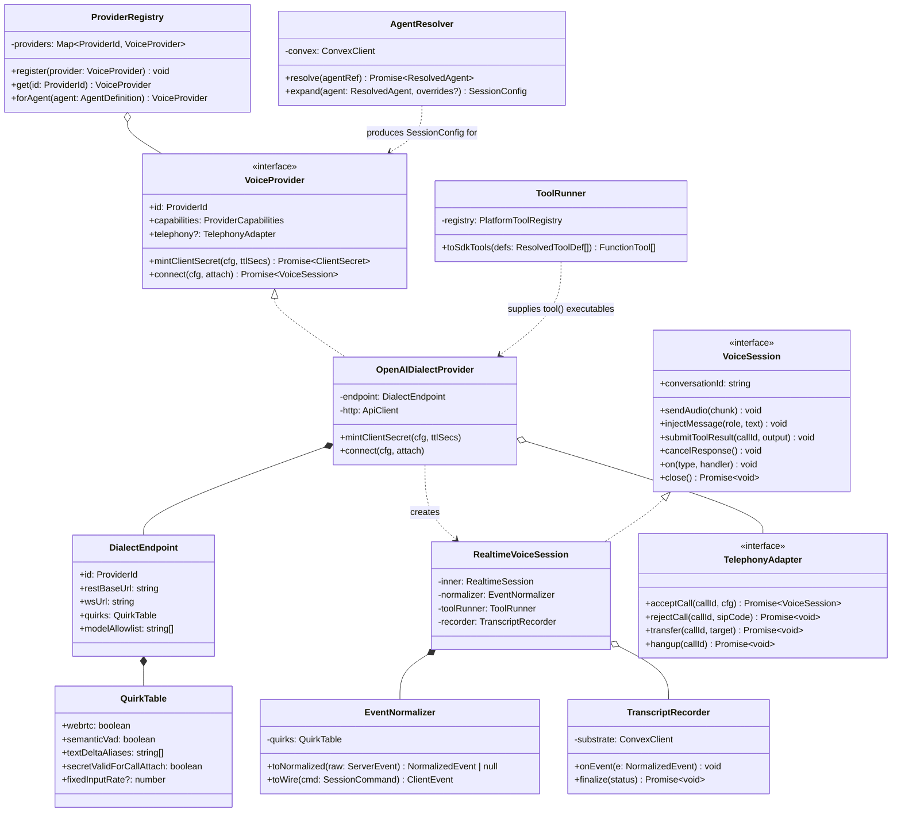
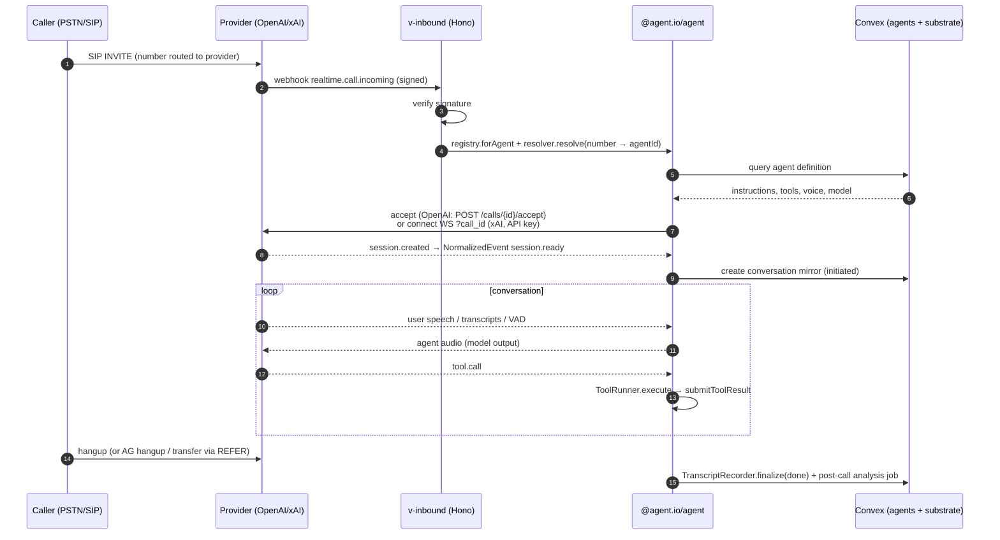
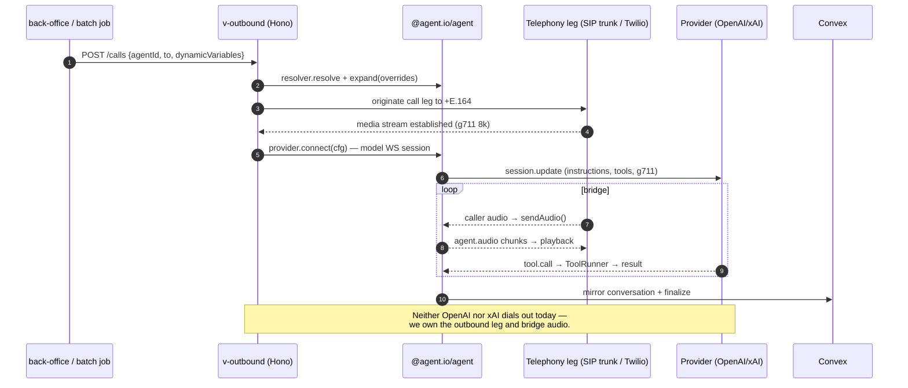
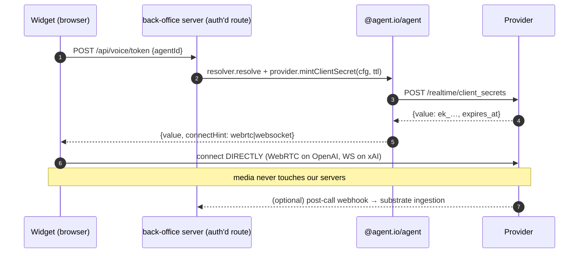

# Voice Provider Adapter Model

Design for a provider-agnostic realtime-voice layer. **The platform is built on
raw realtime model providers — OpenAI Realtime and xAI Grok Voice first, others
later.** ElevenLabs is NOT a runtime provider: its Agents platform serves only
as the *flow reference* — the feature checklist for what our own agent layer
must provide on top of raw models (agent config, tools, KB/RAG, post-call
analysis, batch calling). Consumed by `v-inbound`, `v-outbound`, and `messages`.

## Strategy: the OpenAI Realtime protocol IS the adapter core

xAI's Grok Voice Agent API is officially **OpenAI Realtime-compatible** — xAI's
own docs say most OpenAI client libraries work by pointing the base URL at
`wss://api.x.ai/v1/realtime`. So the canonical wire format is the OpenAI
Realtime event protocol, and "another realtime model provider" onboards as a
new endpoint + quirk table, not a new driver — as long as it speaks the same
dialect (the industry is converging on it).

### SDK situation (verified 2026-07)

| Provider | Official TS SDK | Recommendation |
|---|---|---|
| OpenAI | **`@openai/agents-realtime`** (Agents SDK): `RealtimeAgent`/`RealtimeSession`, transports for WebRTC, WebSocket, **SIP**, or custom; built-in interruption handling, tools, handoffs, history | Use it as the session engine |
| xAI | **No dedicated TS SDK** — official SDK is Python; TS path is OpenAI-compatibility (OpenAI SDK + base URL swap), LiveKit Agents has an xAI plugin, and Grok voice models are on Vercel AI Gateway (`xai/grok-voice-think-fast-1.0`) | Reuse the OpenAI stack with `wss://api.x.ai/v1/realtime` + quirk table |

**The SDK is now installed**: `@openai/agents-realtime@0.12.0` in
`packages/agent`. Verified against its actual `.d.ts` files:

- `OpenAIRealtimeWebSocket` accepts `{ url, useInsecureApiKey }` — the xAI
  swap (`wss://api.x.ai/v1/realtime`) works through the stock transport, no
  custom transport needed. `useInsecureApiKey: true` is required for
  server-side raw-API-key connections (our Hono services); ephemeral client
  secrets don't need it.
- Transports shipped: `OpenAIRealtimeWebSocket`, `OpenAIRealtimeWebRTC`, and
  **`OpenAIRealtimeSIP`** — the SIP call-attach path is first-class.
- `RealtimeAgent({ name, instructions, voice, tools, handoffs })` +
  `RealtimeSession(agent, { transport, model, config, toolExecution })` —
  and the SDK **executes local function tools itself** (`tool({ name,
  parameters, execute })` from `@openai/agents-core`): the
  function-call → execute → `function_call_output` → `response.create` round
  trip is handled for us. Our "ToolRunner" reduces to building `tool()`
  executables from the platform tool registry.
- `RealtimeSessionConfig` (GA shape): `outputModalities`, `audio.{input,output}`
  (format, transcription, turnDetection, noiseReduction, speed), `voice`;
  tools as `FunctionToolDefinition | HostedMCPToolDefinition`
  (`server_label`, `server_url`, `require_approval`) — MCP config maps 1:1.
- Session runtime API: `connect({ apiKey })`, `sendAudio(ArrayBuffer)`,
  `sendMessage()`, `interrupt()`, `mute()`, `close()`, plus output
  guardrails (`outputGuardrails`) and tracing options.

The `VoiceSession` interface below stays as OUR seam — apps code against it,
and the SDK remains an implementation detail we can swap (e.g. LiveKit
transport for telephony scale-out) without touching `v-inbound`/`v-outbound`.

Sources: `docs/.references/openai-realtime.md`, `docs/.references/xai-voice.md`,
`docs/.references/eleven-agents/api-reference/eleven-agents/websocket.md`
(snapshot 2026-07-05).

## The core asymmetry

| | ElevenLabs | OpenAI Realtime | xAI Voice |
|---|---|---|---|
| Abstraction level | **Agent platform** (prompt, tools, KB, tests, analysis live server-side on the agent) | **Raw model session** (we send full config per session) | **Raw model session** (OpenAI-compatible dialect) |
| Event protocol | Proprietary (conversation_initiation, audio, agent_response, client_tool_call…) | `session.*`, `input_audio_buffer.*`, `conversation.item.*`, `response.*` | Same event names as OpenAI (~95% overlap) |
| Transport | WS + WebRTC (widget/SDK) | WS + WebRTC | WS only |
| Ephemeral browser auth | signed URL / conversation token | `POST /v1/realtime/client_secrets` → `ek_…` (10s–7200s) | `POST /v1/realtime/client_secrets` (max 3600s) |
| Telephony | Phone numbers (Twilio/SIP/Exotel) + outbound-call endpoints + batch calling | SIP connector: `calls/{id}/accept·reject·refer·hangup`, DTMF events | SIP: `POST /v2/phone-numbers`, `calls/{id}/refer·hangup`, incoming-call webhook |
| VAD / turn-taking | agent-configured (turn_v2/v3, eagerness) | `server_vad` \| `semantic_vad` | `server_vad` only |
| Audio formats | pcm 8k–48k, ulaw | pcm **24k only**, g711 µ-law/A-law | pcm/mulaw/alaw 8k–48k |
| Voices | voice_id catalog + PVC/IVC cloning | 10 fixed + `voice_…` ids | 5 built-ins + custom voices API |
| Tools | server-side tool registry + MCP + client tools | per-session function tools + MCP | per-session function tools + MCP |

Two consequences:

1. **OpenAI and xAI share one driver.** xAI is an OpenAI-Realtime dialect —
   the driver is parameterized by base URL, model names, and a small quirk
   table (xAI: no WebRTC, no semantic_vad, `response.text.delta` alias,
   client secrets not valid for SIP `call_id` sessions).
2. **The ElevenLabs column is the feature checklist, not a driver.** Since we
   build on raw models, everything ElevenLabs does server-side is OUR backlog:
   agent config storage (Convex), tool registry, KB/RAG, turn-taking tuning,
   post-call analysis/evaluation, batch calling orchestration. The flow to
   replicate: configure agent → mint session credential → stream audio both
   ways with VAD/barge-in → run tools mid-call → webhook/ingest transcript +
   analysis post-call.

## Layered model

```
┌─────────────────────────────────────────────────────────┐
│ apps: v-inbound · v-outbound · messages · back-office   │
├─────────────────────────────────────────────────────────┤
│ packages/agent                                     │
│  VoiceProvider ── mintClientSecret / connect / telephony│
│  VoiceSession ─── normalized commands + events          │
│  (wraps @openai/agents-realtime transports)             │
├───────────────────────────┬─────────────────────────────┤
│ OpenAI endpoint           │ xAI endpoint                │
│ api.openai.com/v1/realtime│ wss://api.x.ai/v1/realtime  │
│ (WebRTC·WS·SIP)           │ (WS only + quirk table)     │
├───────────────────────────┴─────────────────────────────┤
│ our agent layer (Convex): agent config · tool registry  │
│ KB/RAG · post-call analysis  ← ElevenLabs = flow ref    │
└─────────────────────────────────────────────────────────┘
```

## Interfaces (TypeScript, target: `packages/agent`)

```ts
export type ProviderId = 'openai' | 'xai' // extensible: any OpenAI-Realtime-dialect endpoint

export interface ProviderCapabilities {
  webrtc: boolean                 // EL ✓, OpenAI ✓, xAI ✗
  semanticVad: boolean            // OpenAI only
  serverSideAgentConfig: boolean  // EL only — config lives on the agent
  outboundTelephony: boolean      // EL ✓ (twilio/sip/exotel), xAI ✗ (inbound+refer only), OpenAI: webhook-accept model
  batchCalling: boolean           // EL only
  customVoices: boolean
  inputSampleRates: number[]
  outputFormats: string[]         // normalized: 'pcm16' | 'g711_ulaw' | 'g711_alaw' | 'mp3'
  maxClientSecretTtlSecs: number  // EL n/a, OpenAI 7200, xAI 3600
}

/** Provider-agnostic session request. Drivers map/ignore per capabilities. */
export interface SessionConfig {
  // WHO speaks — for EL this is just agentId (+optional overrides);
  // for OpenAI/xAI we own the whole config.
  agentRef?: { agentId: string; branchId?: string }        // EL
  model?: string                                           // OpenAI/xAI
  instructions?: string
  voice?: string
  tools?: FunctionToolDef[]                                // JSON-Schema function tools
  mcpServers?: McpServerRef[]
  audio: {
    input:  { format: AudioFormat; transcription?: boolean }
    output: { format: AudioFormat; speed?: number }
  }
  turnDetection:
    | { mode: 'server_vad'; silenceMs?: number; idleTimeoutMs?: number }
    | { mode: 'semantic_vad'; eagerness?: 'low' | 'medium' | 'high' }  // downgraded to server_vad on xAI/EL
    | { mode: 'manual' }                                   // push-to-talk; commitAudio() required
  dynamicVariables?: Record<string, string>                // EL; templated into instructions elsewhere
  maxDurationSecs?: number
}

export interface VoiceProvider {
  readonly id: ProviderId
  readonly capabilities: ProviderCapabilities

  /** Browser/widget path: mint a short-lived credential, never expose API keys. */
  mintClientSecret(cfg: SessionConfig, ttlSecs?: number): Promise<{
    value: string            // EL: signed URL or conversation token; OpenAI/xAI: ek_/client-secret value
    expiresAt: number
    connectHint: { transport: 'websocket' | 'webrtc'; url?: string }
  }>

  /** Server-side path (v-inbound / v-outbound own the socket). */
  connect(cfg: SessionConfig, attach?: { callId?: string }): Promise<VoiceSession>

  telephony?: TelephonyAdapter
}

export interface VoiceSession {
  readonly conversationId: string        // EL conversation_id · OpenAI/xAI session id or call_id
  sendAudio(chunk: Uint8Array): void     // -> input_audio_buffer.append / EL user_audio_chunk
  commitAudio(): void                    // manual mode only
  clearAudio(): void
  injectMessage(role: 'user' | 'system', text: string): void   // conversation.item.create / EL contextual update
  submitToolResult(callId: string, output: string): void
  createResponse(): void                 // no-op on EL (agent decides) and under VAD
  cancelResponse(): void                 // barge-in
  truncatePlayback(itemId: string, atMs: number): void
  updateSession(patch: Partial<SessionConfig>): void
  on<E extends NormalizedEvent['type']>(type: E, fn: (e: Extract<NormalizedEvent, { type: E }>) => void): void
  close(): Promise<void>
}

/** The normalized event stream every app consumes. */
export type NormalizedEvent =
  | { type: 'session.ready'; effectiveConfig: unknown }
  | { type: 'user.speech_started' }                        // barge-in signal → stop playback
  | { type: 'user.speech_stopped' }
  | { type: 'user.transcript'; text: string; final: boolean }
  | { type: 'agent.audio'; chunk: Uint8Array; itemId: string }
  | { type: 'agent.transcript'; text: string; final: boolean; itemId: string }
  | { type: 'agent.response_started'; responseId: string }
  | { type: 'agent.response_done'; responseId: string; usage?: TokenUsage; status: 'completed' | 'cancelled' | 'failed' | 'incomplete' }
  | { type: 'tool.call'; callId: string; name: string; argsJson: string }
  | { type: 'dtmf'; digits: string }
  | { type: 'idle_timeout' }
  | { type: 'rate_limits'; limits: RateLimit[] }           // OpenAI only today
  | { type: 'error'; code: string; message: string; fatal: boolean }
  | { type: 'closed'; reason: string }

export interface TelephonyAdapter {
  // inbound: called from the provider webhook handler in v-inbound
  acceptCall(callId: string, cfg: SessionConfig): Promise<VoiceSession>   // OpenAI: POST accept + attach; xAI: connect(?call_id); EL: agent assigned to number, nothing to do
  rejectCall(callId: string, sipCode?: number): Promise<void>
  // outbound: called from v-outbound
  dial?(opts: { phoneNumberId: string; to: string; cfg: SessionConfig }): Promise<{ conversationId: string; callId?: string }>  // EL only today
  transfer(callId: string, target: string): Promise<void>  // tel:+E.164 | sip:uri → refer on all three
  hangup(callId: string): Promise<void>
}
```

## Event mapping table

| Normalized | ElevenLabs WS | OpenAI / xAI |
|---|---|---|
| `session.ready` | `conversation_initiation_metadata` | `session.created` (+ `conversation.created`) |
| `user.speech_started` | interruption/VAD event | `input_audio_buffer.speech_started` |
| `user.transcript` | `user_transcript` (+tentative) | `conversation.item.input_audio_transcription.delta/.completed` |
| `agent.audio` | `audio` event (base64) | `response.output_audio.delta` |
| `agent.transcript` | `agent_response` / correction | `response.output_audio_transcript.delta/.done` |
| `agent.response_done` | `agent_response` end + metadata | `response.done` (usage inside) |
| `tool.call` | `client_tool_call` | `response.function_call_arguments.done` |
| tool result (cmd) | `client_tool_result` | `conversation.item.create(function_call_output)` + `response.create` |
| `dtmf` | SIP-only conversation events | `input_audio_buffer.dtmf_event_received` |
| `idle_timeout` | soft timeout config on agent | `input_audio_buffer.timeout_triggered` |
| barge-in (cmd) | automatic + `interruption` | auto under VAD; manual `response.cancel` + `conversation.item.truncate` |

Driver rules of thumb:
- **openai-dialect driver**: one codebase, constructor takes `{ baseUrl, modelAllowlist, quirks }`. xAI quirks: WS-only, handle both `response.text.delta` and `response.output_text.delta`, no `semantic_vad`, secrets rejected on `call_id` attach (use API key), `sec-websocket-protocol: xai-client-secret.…` alternative header.
- **No ElevenLabs driver.** The EL column in the mapping table documents the reference flow only. `agentRef` in `SessionConfig` resolves against OUR agent store (Convex): `@agent.io/agent` loads the agent's instructions/tools/voice and expands them into the per-session OpenAI/xAI config — that expansion step is our equivalent of what ElevenLabs does server-side.
- **Audio normalization**: negotiate to pcm16@24k for OpenAI always; prefer pcm16@16k or 24k on EL/xAI; telephony legs use g711 8k end-to-end on all three — no transcoding needed in the SIP path.

## Where it lives — and the widget question

**No new app.** The adapter is a *library* (`packages/agent`), not a
service: it has no state of its own, no port, no independent scaling profile.
The existing apps stay the process boundaries:

- `v-inbound` — provider webhooks for incoming calls (`realtime.call.incoming`
  for xAI/OpenAI SIP; EL numbers route server-side) + `acceptCall` sessions.
- `v-outbound` — `dial` / batch calling (EL today; other providers when they
  ship outbound).
- `messages` — WhatsApp/SMS (EL-only surface today).
- **Widget: also no new service.** The EL widget (and an OpenAI/xAI WebRTC
  browser client) runs entirely client-side and talks directly to the
  provider. Its only backend need is `mintClientSecret` — a single
  authenticated endpoint that returns a signed URL / conversation token (EL)
  or `ek_…` client secret (OpenAI/xAI). Host that route on `back-office`'s
  server (it already has auth via WorkOS/Convex) and it serves every embed.
  If embeds later need public, high-volume token minting with per-origin
  rate limiting, split it out then — not before.

## Capability gaps to design around (not bugs, facts)

- Outbound dialing: only ElevenLabs today. `v-outbound` should treat
  `telephony.dial` as capability-gated.
- OpenAI audio input is fixed at 24 kHz pcm (or g711) — resample at the edge
  if a source produces 16 kHz.
- Semantic VAD exists only on OpenAI; the adapter downgrades to `server_vad`
  elsewhere (log it, don't fail).
- ElevenLabs analysis/evaluation/data-collection happens server-side post-call
  (webhook). For OpenAI/xAI, if we want parity (transcript summary, success
  criteria), we must build it ourselves on `response.done` + transcripts —
  that is an ingestion-pipeline concern (conversation substrate), not an
  adapter concern.

## Definitive design — `@agent.io/agent` (packages/agent)

### Class model



One concrete provider class serves both endpoints:

```ts
// packages/agent/src/providers/endpoints.ts
export const OPENAI: DialectEndpoint = {
  id: 'openai',
  restBaseUrl: 'https://api.openai.com/v1',
  wsUrl: 'wss://api.openai.com/v1/realtime',
  modelAllowlist: ['gpt-realtime', 'gpt-realtime-1.5'],
  quirks: {
    webrtc: true, semanticVad: true,
    textDeltaAliases: ['response.output_text.delta'],
    secretValidForCallAttach: true,
    fixedInputRate: 24_000,          // pcm accepted at 24k only
  },
}

export const XAI: DialectEndpoint = {
  id: 'xai',
  restBaseUrl: 'https://api.x.ai/v1',
  wsUrl: 'wss://api.x.ai/v1/realtime',
  modelAllowlist: ['grok-voice-latest', 'grok-voice-think-fast-1.0', 'grok-voice-fast-1.0'],
  quirks: {
    webrtc: false, semanticVad: false,
    textDeltaAliases: ['response.text.delta', 'response.output_text.delta'],
    secretValidForCallAttach: false, // SIP call_id attach requires API key
  },
}
```

```ts
// packages/agent/src/providers/openai-dialect.ts
import {
  OpenAIRealtimeWebSocket,
  RealtimeAgent,
  RealtimeSession,
  type RealtimeSessionConfig,
} from '@openai/agents-realtime'

export class OpenAIDialectProvider implements VoiceProvider {
  constructor(
    private readonly endpoint: DialectEndpoint,
    private readonly apiKey: string,
  ) {}

  get id() { return this.endpoint.id }

  get capabilities(): ProviderCapabilities {
    const q = this.endpoint.quirks
    return {
      webrtc: q.webrtc,
      semanticVad: q.semanticVad,
      outboundTelephony: false,           // neither ships outbound dial today
      inputSampleRates: q.fixedInputRate ? [q.fixedInputRate] : [8000, 16000, 24000, 44100, 48000],
      outputFormats: ['pcm16', 'g711_ulaw', 'g711_alaw'],
      maxClientSecretTtlSecs: this.endpoint.id === 'openai' ? 7200 : 3600,
    }
  }

  /** Browser/widget path — plain REST, SDK not involved server-side. */
  async mintClientSecret(cfg: SessionConfig, ttlSecs = 600): Promise<ClientSecret> {
    const res = await fetch(`${this.endpoint.restBaseUrl}/realtime/client_secrets`, {
      method: 'POST',
      headers: { authorization: `Bearer ${this.apiKey}`, 'content-type': 'application/json' },
      body: JSON.stringify({
        expires_after: { anchor: 'created_at', seconds: ttlSecs },
        session: this.toWireSession(cfg),
      }),
    })
    const body = await res.json()
    return {
      value: body.value,
      expiresAt: body.expires_at,
      connectHint: { transport: this.endpoint.quirks.webrtc ? 'webrtc' : 'websocket', url: this.endpoint.wsUrl },
    }
  }

  /** Server-side path (v-inbound / v-outbound). Real SDK types throughout. */
  async connect(cfg: SessionConfig, attach?: { callId?: string }): Promise<VoiceSession> {
    // xAI rejects client secrets on ?call_id attach — raw API key over WS.
    const url = attach?.callId
      ? `${this.endpoint.wsUrl}?call_id=${attach.callId}`
      : this.endpoint.wsUrl

    const transport = new OpenAIRealtimeWebSocket({
      url,                       // stock transport accepts custom URLs → xAI works as-is
      useInsecureApiKey: true,   // required for raw API keys (server-side only)
    })

    // RealtimeAgent carries instructions/voice/tools; tools are SDK `tool()`
    // executables, so the function-call round trip runs inside the SDK.
    const agent = new RealtimeAgent({
      name: cfg.agentRef?.agentId ?? 'agent',
      instructions: cfg.instructions,
      voice: cfg.voice,
      tools: cfg.tools,          // built by ToolRunner.toSdkTools() — see below
    })

    const inner = new RealtimeSession(agent, {
      transport,
      model: cfg.model,
      config: this.toSessionConfig(cfg),   // Partial<RealtimeSessionConfig>
    })
    await inner.connect({ apiKey: this.apiKey })
    return new RealtimeVoiceSession(inner, new EventNormalizer(this.endpoint.quirks), cfg)
  }

  /** Map our SessionConfig → SDK GA config shape; downgrade, don't fail. */
  private toSessionConfig(cfg: SessionConfig): Partial<RealtimeSessionConfig> {
    const turnDetection =
      cfg.turnDetection.mode === 'semantic_vad' && !this.endpoint.quirks.semanticVad
        ? { type: 'server_vad' as const }            // xAI downgrade + log
        : wireVad(cfg.turnDetection)
    return {
      outputModalities: ['audio'],
      voice: cfg.voice,
      audio: {
        input: {
          format: wireFormat(cfg.audio.input.format, this.endpoint.quirks),
          transcription: cfg.audio.input.transcription ? { model: 'whisper-1' } : undefined,
          turnDetection,
        },
        output: { format: wireFormat(cfg.audio.output.format, this.endpoint.quirks), speed: cfg.audio.output.speed },
      },
    }
  }
}
```

```ts
// packages/agent/src/session/realtime-voice-session.ts
import type { RealtimeSession, TransportEvent } from '@openai/agents-realtime'

export class RealtimeVoiceSession implements VoiceSession {
  private readonly emitter = new EventEmitter<NormalizedEvent>()

  constructor(
    private readonly inner: RealtimeSession,        // @openai/agents-realtime
    private readonly normalizer: EventNormalizer,
    private readonly cfg: SessionConfig,
    private readonly recorder?: TranscriptRecorder, // conversation substrate feed
  ) {
    // Raw wire events for recording + normalization (quirk-aware: handles
    // xAI's response.text.delta alias etc.)
    inner.transport.on('*', (raw: TransportEvent) => {
      const e = this.normalizer.toNormalized(raw)
      if (!e) return
      this.recorder?.onEvent(e)
      this.emitter.emit(e.type, e)
    })
    // NOTE: no manual function-call plumbing — SDK `tool()` executables run
    // inside RealtimeSession (toolExecution config controls concurrency).
    // History with transcripts is also maintained by the SDK (inner.history).
  }

  sendAudio(chunk: Uint8Array) {
    this.inner.sendAudio(chunk.buffer as ArrayBuffer)   // SDK API takes ArrayBuffer
  }
  injectMessage(_role: 'user' | 'system', text: string) {
    this.inner.sendMessage(text)
  }
  cancelResponse() { this.inner.interrupt() }           // SDK truncates playback itself on WS
  mute(m: boolean) { this.inner.mute(m) }
  on(type, handler) { this.emitter.on(type, handler) }
  async close() { this.inner.close() }
}
```

```ts
// packages/agent/src/agents/tool-runner.ts
// The SDK executes tools; our job is only to turn platform tool definitions
// (Convex registry / procedures) into SDK executables.
import { tool } from '@openai/agents-realtime'   // re-exported from @openai/agents-core

export class ToolRunner {
  constructor(private readonly registry: PlatformToolRegistry, private readonly ctx: CallContext) {}

  toSdkTools(defs: ResolvedToolDef[]) {
    return defs.map((def) =>
      tool({
        name: def.name,
        description: def.description,
        parameters: def.parameters,               // zod schema from the tool registry
        execute: async (args) => this.registry.invoke(def, args, this.ctx), // webhook/Convex action
      }),
    )
  }
}
// MCP servers need no runner at all: pass HostedMCPToolDefinition
// ({ type: 'mcp', server_label, server_url, require_approval }) in tools.
```

```ts
// packages/agent/src/agents/resolver.ts — our replacement for ElevenLabs' server-side agent
export class AgentResolver {
  constructor(private readonly convex: ConvexClient) {}

  async resolve(ref: { agentId: string; versionId?: string }): Promise<ResolvedAgent> {
    return this.convex.query(api.agents.get, ref)   // instructions, tools, voice, provider, model
  }

  /** ElevenLabs does this server-side; we do it here.
   *  Expansion compiles the full EL-shaped agent definition into raw-model config:
   *  - dynamicVariables → template slots in instructions ({{user_name}}, {{system__*}})
   *  - agentRef.versionId/branchId → which agent snapshot to load (procedures snapshot with it)
   *  - procedures → trigger index appended to instructions + start_procedure/end_procedure
   *    tools; structured-procedure steps become a constrained sub-loop the session enforces
   */
  expand(agent: ResolvedAgent, overrides?: Partial<SessionConfig>): SessionConfig {
    return {
      model: agent.model,
      instructions: renderTemplate(agent.instructions, overrides?.dynamicVariables)
        + compileProcedureTriggers(agent.procedures),
      voice: agent.voice,
      tools: agent.tools.map(toFunctionToolDef),
      audio: overrides?.audio ?? DEFAULT_AUDIO,
      turnDetection: agent.turnDetection ?? { mode: 'server_vad', silenceMs: 500 },
      ...overrides,
    }
  }
}
```

### Flow 1 — inbound phone call (v-inbound)



### Flow 2 — outbound call (v-outbound)



### Flow 3 — browser widget (no dedicated service)



### Package layout

```
packages/agent/
├── src/
│   ├── index.ts                  # public API: registry, types
│   ├── types.ts                  # SessionConfig, NormalizedEvent, capabilities
│   ├── providers/
│   │   ├── endpoints.ts          # OPENAI, XAI DialectEndpoint tables
│   │   └── openai-dialect.ts     # OpenAIDialectProvider (+ telephony)
│   ├── session/
│   │   ├── realtime-voice-session.ts
│   │   └── event-normalizer.ts   # wire ↔ NormalizedEvent, quirk-aware
│   ├── agents/
│   │   ├── resolver.ts           # Convex agent → SessionConfig
│   │   └── tool-runner.ts        # server-side tool execution registry
│   └── substrate/
│       └── transcript-recorder.ts # NormalizedEvent → Convex conversation mirror
```

Dependency direction stays clean: `apps/*` → `@agent.io/agent` → (`@agent.io/domain`, `@openai/agents-realtime`, Convex client). Nothing in `packages/agent` imports from an app.

## Docs still needed (you offered — these would firm up the drivers)

1. **OpenAI**: Realtime *WebSocket/WebRTC connection* guide (URLs, headers,
   SDP exchange) and the **incoming-call webhook** (`realtime.call.incoming`)
   reference — the downloaded file covers resources/events but not the
   connect handshake or webhook payload.
2. **xAI**: the WS JSON schemas referenced by their docs —
   `/voice-realtime.ws.json` (full `session.update` field schema, tool
   definition format) and, if available, outbound SIP call initiation docs.
3. **ElevenLabs**: nothing more needed — the fetched
   `eleven-agents/api-reference` set is sufficient as the flow reference.
4. ~~OpenAI Agents SDK transport docs~~ — resolved: verified directly against
   the installed `@openai/agents-realtime@0.12.0` type declarations
   (`OpenAIRealtimeWebSocket` supports `url` + `useInsecureApiKey`).
